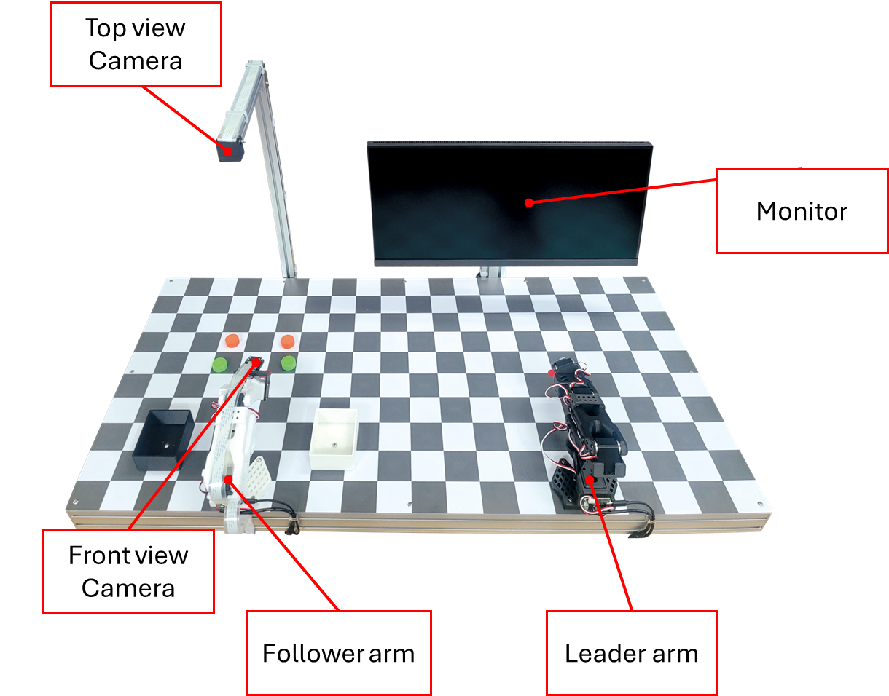

# PhysicAI Arm

**PhysicAI Arm** 은 인공지능 로봇 매니퓰레이션(로봇팔) 실습 장치입니다. 카메라 활용부터 데이터 수집, 학습, 모델 실행의 파이프라인이 구축되어져 있으며, 인공지능 로보틱스의 기초 개념을 직접 실습해볼 수 있는 장비입니다.

## 플랫폼 구성

PhysicAI Arm 은 아래와 같은 플랫폼을 구성하고 있습니다.

각 로봇 매니퓰레이션은 서보모터가 총 6개가 장착된 6축 매니퓰레이션입니다. 또한, 체스판 모양의 아크릴 판 밑에 인공지능 컴퓨팅 장비(이하 End device)가 장착되어져 있습니다.

장비 오른쪽 벽면을 살펴보시면 전원 플러그 및 스위치, USB 허브가 존재합니다. 플러그에 전원을 연결하신 후 스위치를 조작하시면 전원이 공급됩니다.

## 사양

PhysicAI Arm은 아래와 같은 하드웨어 사양을 가지고 있습니다.

**End device**

| 종류 | 명칭 | 사양 |
| --- | ---- | --- |
| CPU | 6-core Arm Cortex-A78AE v8.2 64-bit | 1.5MB L2 + 4MB L3 / 2GHz |
| GPU | NVIDIA Ampere architecture with 1024 NVIDIA CUDA cores and 32 tensor cores | 70 TOPS (INT8) / 8GB |
| Memory | 128-bit LPDDR5 | 102.4 GB/s 8GB |
| SSD | Samsung PM9B1 (2280) M.2 NVMe | 256GB |
| Power | - | 10-20W |

PhysicAI Arm은 아래와 같은 소프트웨어 사양을 가지고 있습니다.

| 명칭 | 버전 | 
| --- | --- |
| Soda OS | 6.0 |
| Nvidia driver | 540.3.0 |
| CUDA | 12.2 |
| cuDNN | 8.9.4.25 |
| OpenCV | 4.10.0 with CUDA |
| lerobot | ver HBE |

Soda OS란 한백전자에서 커스터마이징한 운영체제입니다. Debian 계열이며, Ubuntu 22.04 버전 기반으로 동작되고 있습니다. 자동으로 로그온되며, 계정 정보는 다음과 같습니다.

- id : soda
- pw : soda

상술한 소프트웨어 버전은 출고 시 자동으로 설정되어 출고되며, **기재된 버전과 다른 소프트웨어를 설치할 시 지원이 어렵다는 점을 고지드립니다.** 소프트웨어 업그레이드는 신중히 진행해주시길 바랍니다.