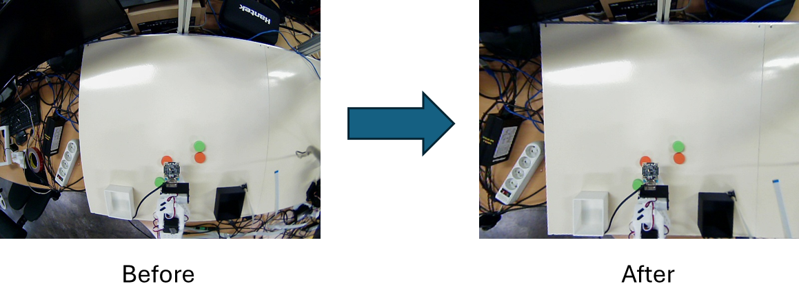

# Camera calibration

카메라 캘리브레이션(Camera Calibration)은 3차원 공간상의 물리적 세계와 카메라를 통해 얻어지는 2차원 이미지 평면 간의 복잡한 기하학적 관계를 정량적으로 모델링하고 분석하는 일련의 과정입니다. 이런 분석된 결과물은 수학적 변환 모델로 나타내며, 카메라의 렌즈 왜곡, 초점 거리, 광학적 중심 위치 등을 포괄합니다. 결국 이 모델을 활용하여 2D 이미지 좌표를 3D 세계 좌표로 정확하게 매핑하거나, 그 역의 과정을 수행하는 데 근본적인 정보를 제공합니다.

궁극적으로, 카메라 캘리브레이션의 가장 큰 의의는 3차원 현실과 2차원 영상 사이의 기하학적 차이를 좁혀주어, 컴퓨터 비전 시스템이 현실 세계를 올바르게 *이해* 하도록 돕는 필수적인 기초 작업이라고 볼 수 있겠습니다.

## 렌즈 왜곡

일반적으로 카메라 캘리브레이션을 진행하는 가장 대표적인 이유를 꼽자면 **카메라 렌즈 왜곡** 입니다. 현대에서 사용하는 카메라는 더 넓은 빛을 모으기 위해 '렌즈' 를 사용하는데, 렌즈의 물리적 특성으로 인해 빛의 투영 과정에서 다양한 형태의 기하학적 왜곡이 필연적으로 발생합니다. 이는 곧 3차원 공간의 직선이 2차원 이미지에선 곡선으로 휘어져 보이게 됩니다. 

PhysicAI Arm 장비의 Follower arm 위에서 관측하는 카메라를 살펴봅시다. 이 카메라는 수평 화각이 98도, 수직 화각이 75도인 광각 렌즈입니다. 광각 렌즈의 경우 아래 사진과 같이 표준 렌즈보다 더 넓은 화각의 빛을 모을 수 있습니다. 다만 이런 화각이 넓은 광각 렌즈의 경우 구면-평면 간 변환 오차가 커지면서 중심은 정상이지만 주변부로 갈수록 직선이 바깥쪽으로 벌어져 휘어지는 **배럴 왜곡 (Barrel Distortion)** 현상이 발생합니다. 이를 보정해주지 않으면 실제 3차원 공간과 차이가 생겨 데이터셋 수집 과정에서 품질 좋은 데이터를 수집하기가 어려워집니다.
  


이 외에도 다양한 렌즈 왜곡 및 왜곡 종류가 존재하지만, 본 매뉴얼에서는 생략합니다.

## Calibration

이제 PhysicAI Arm Camera를 사용해서 실제 Calibration 작업을 진행해봅니다. 카메라 캘리브레이션은 [Python](https://www.python.org/) [OpenCV](https://opencv.org/)를 활용해서 진행합니다.

### 최종적으로 구하고자 하는 계수

- **카메라 행렬 (intrinsic matrix, K)** : 화소 단위의 초점거리 $f_{x},f_{y}$, 주점(또는 광축과 센서 중심) ($c_{x},c_{y}$), (필요한 경우) skew 항.
    -  (일반적으로 skew 항은 0으로 가정)
$$K=\begin{bmatrix}f_{x} & s & c_{x} \\ 0 & f_{y} & c_{y} \\ 0 & 0 & 1\end{bmatrix}$$

- **왜곡 계수 (distortion coefficients)** : 방사왜곡 ($k_{1}, k_{2}, k_{3}$) 및 접선왜곡 ($p_{1}, p_{2}$).
- **외적 파라미터(각 뷰 별)** : 각 캘리브레이션 이미지에 대한 회전벡터(rvec)와 이동벡터(tvec) -- 월드 -> 카메라 좌표 변환
    - 단, 본 매뉴얼에서는 이 활용을 제대로 다루지 않음.

### 수학적 모델
- **정규화 이미지 좌표** : 3D 점 $P_{c}=(X,Y,Z)$ 를 카메라 좌표에서 정규화 : $x=X/Z, y=Y/Z$ 
- **방사왜곡 (radial)** :
$$x_{r}=x(1+k_{1}r^{2}+k_{2}r^{4}+k_{3}r^{6}+\cdots)$$
$$y_{r}=y(1+k_{1}r^{2}+k_{2}r^{4}+k_{3}r^{6}+\cdots)$$

여기서 $r^{2}=x^{2}+y^{2}$
- **접선왜곡 (tangential)**
$$x_{d}=x_{r}+2p_{1}xy+p_{2}(r^{2}+2x^{2})$$
$$y_{d}=y_{r}+p_{1}(r^{2}+2y^{2})+2p_{2}xy$$
이 후 카메라 행렬 $K$ 를 사용해 픽셀 좌표로 변환.

### CheckerBoard

OpenCV를 활용하게 될 경우 실제 카메라가 이상이 없다는 전제 하에 이미지 프로세싱을 원활하게 진행할 수 있습니다. 이 경우에는 여러 관점에서 잘 알려진 차원 패턴의 여러 이미지를 캡쳐하는 게 가장 좋은 캘리브레이션 방법입니다.

캘리브레이션에 사용되는 패턴 중 가장 유명한 것은 바로 체커보드(Checkerboard; chessboard 라고 불리기도 함) 패턴입니다. 체커보드 패턴은 1998년에 발표된 [Zhang의 논문](https://www.microsoft.com/en-us/research/wp-content/uploads/2016/02/tr98-71.pdf) 에 수록되어 있으며, 해당 이미지 패턴은 뚜렷하고 쉽게 감지할 수 있고 각 사각형 코너들은 서로 다른 방향으로 급격한 기울기를 가지므로 위치 파악에 이상적입니다. 이에 현재까지도 많이 사용되고 있는 기법입니다.

캘리브레이션 작업을 위해 아래 (9*7) 형태의 체커보드 이미지를 다운받은 뒤, 프린트를 사용해 이미지를 출력합니다.


### 이미지 촬영

카메라 캘리브레이션 작업을 진행하기 앞서 체커보드가 찍힌 이미지가 필요합니다. 최소 렌즈와 30cm 멀어진 구간에서 체커보드 이미지를 촬영합니다. 아래의 파이썬 코드를 실행해 사용하시거나 다른 툴 등을 사용하여 이미지를 촬영한 후 저장합니다.

```python
import cv2

cam = cv2.VideoCapture(2)

count = 0

try:
    while True:
        ret, img = cam.read()

        cv2.imshow("img", img)
        if ord('s') == cv2.waitKey(1):
            cv2.imwrite(f"calibration_img/cali_{count}.jpg", img)
            count += 1
except KeyboardInterrupt:
    pass
finally:
    cv2.destroyAllWindows()
```

- 체커보드를 다양한 위치 및 각도로 움직여가며 최소 10장 이상의 사진을 찍습니다.
- 표시되는 GUI에 's' 버튼을 누르면 이미지가 저장됩니다.
- `cv2.imwrite` 명령어는 이미지를 캡쳐 후 디스크에 저장시키는 명령어 입니다. 사진이 담길 주소는 임의로 변경하셔도 무관합니다. 

지정된 경로에 아래와 같이 사진들이 수집됩니다.


### 좌표 수집

이 후, 촬영된 사진을 불러와 다음 두 좌표들을 수집합니다.

- **objpoints** : 각 이미지에서 동일한 패턴 점의 3D 좌표
- **imgpoints** : 각 이미지에서 검출된 2D 코너 좌표 

```python
import cv2
import numpy as np
import glob

CHECKERBOARD=(8,6)

criteria = (cv2.TERM_CRITERIA_EPS + cv2.TERM_CRITERIA_MAX_ITER, 30, 0.001)

objp = np.zeros((CHECKERBOARD[0]*CHECKERBOARD[1],3), np.float32)
objp[:,:2] = np.mgrid[0:CHECKERBOARD[0], 0:CHECKERBOARD[1]].T.reshape(-1,2)

objpoints = []
imgpoints = []

images = glob.glob('calibration_img/*.jpg')

for frame in images:
    img = cv2.imread(frame)
    gray = cv2.cvtColor(img, cv2.COLOR_BGR2GRAY)

    ret, corners = cv2.findChessboardCorners(gray, CHECKERBOARD, None)

    if ret:
        objpoints.append(objp)

        corners2 = cv2.cornerSubPix(gray, corners, (11,11), (-1,-1), criteria)
        imgpoints.append(corners2)

        cv2.drawChessboardCorners(img, CHECKERBOARD, corners2, ret)
        cv2.imshow('Corners', img)
        cv2.waitKey(500)

cv2.destroyAllWindows()     
```

- objpoints는 3차원 세계(world) 좌표의 기준점입니다.
- imgpoints는 `cv2.findChessboardCorners` 함수에서 추출된 코너들을 `cv2.cornerSubPix` 를 통해 보정시킨 후 저장합니다. 참고로 `criteria`에 들어가는 조건의 뜻은 '*최대 30번 반복 및 변화량이 0.001 픽셀 이하 시 중단*' 의 뜻을 담고 있습니다.

프로그램 실행 시 다음과 같이 결과가 출력됩니다.


### 카메라 행렬 및 왜곡 계수 추출

`cv2.calibrateCamera` 및 `cv2.getOptimalNewCameraMatrix` 함수를 사용하여 위 수학 모델을 통해 연산된 값을 반환받을 수 있습니다. 

```python
ret, mtx, dist, rvecs, tvecs = cv2.calibrateCamera(
        objpoints, imgpoints, gray.shape[::-1], None, None
        )

h, w = (480, 640)
newcameramtx, roi = cv2.getOptimalNewCameraMatrix(mtx, dist, (w,h), 0, (w,h))
print("Camera Matrix:\n", mtx)
print("Distortion Coefficients:\n", dist)
print("New camera Matrix:\n", newcameramtx)
```

- `rvecs` 및 `tvecs` 는 각각 3차원 공간상의 회전 행렬, 이동 행렬을 뜻합니다.
- `newcameramtx` 의 경우 calibration을 통해 변환된 카메라 행렬을 `alpha` 매개변수를 통해 검정 여백(virtual pixels)을 조절합니다. 본 예제의 경우에는 가장 깔끔한 시각적 결과를 위해 alpha를 `0` 으로 설정하였습니다.
- mtx와 newcameramtx의 결과값이 동일하게 나오는데, 이 이유는 검정 영역 처리 없이 이미지 crop만을 진행했기 때문입니다. 만약 모든 원본을 보존하고 싶다면 alpha 값을 최대 1.0까지 조절할 수 있습니다.

아래는 출력 결과입니다.

```
Camera Matrix:
 [[327.74988718   0.         351.49143079]
 [  0.         329.78347221 254.08667151]
 [  0.           0.           1.        ]]
Distortion Coefficients:
 [[-0.32546722  0.11891167 -0.0008122  -0.00142355 -0.02071167]]
New camera Matrix:
 [[327.74988718   0.         351.49143079]
 [  0.         329.78347221 254.08667151]
 [  0.           0.           1.        ]]
 ```

### 이미지 비교

이제 캘리브레이션한 이미지와 안 한 이미지를 비교해가며 차이를 확인해봅니다. 

```py
cam = cv2.VideoCapture(2)

ret, img = cam.read()

dst = img.copy()
dst = cv2.undistort(dst, mtx, dist, None, newcameramtx)

cv2.imshow("before_cali.jpg", img)
cv2.imshow("after_cali.jpg", dst)
cv2.waitKey(0)
cv2.destroyAllWindows()

cam.release()
```

- `cv2.undistort` 함수를 통해 카메라 행렬(`mtx`)과 왜곡 계수(`dist`), 검정 여백이 조절된 카메라 행렬(`newcameramtx`)을 기반으로 원본 이미지를 보정해줍니다.

아래 사진과 같이 캘리브레이션 전 보다 왜곡이 많이 덜해진 것을 확인할 수 있습니다. 



### 정보 저장

다음 챕터 '3.AI Robotics' 에서 사용할 수 있도록, 캘리브레이션 관련 정보를 아래 코드를 추가하여 저장합니다.

```python
calibration_data = {
        "camera_matrix": mtx.tolist(),
        "dist_coeff": dist.tolist(),
        "new_camera_matrix": newcameramtx.tolist(),
}

with open("calibration.json", "w") as f:
    json.dump(calibration_data, f, indent=4)
```

### 전체 코드

```python
import cv2
import numpy as np
import glob

CHECKERBOARD=(8,6)

criteria = (cv2.TERM_CRITERIA_EPS + cv2.TERM_CRITERIA_MAX_ITER, 30, 0.001)

objp = np.zeros((CHECKERBOARD[0]*CHECKERBOARD[1],3), np.float32)
objp[:,:2] = np.mgrid[0:CHECKERBOARD[0], 0:CHECKERBOARD[1]].T.reshape(-1,2)
objpoints = []
imgpoints = []

images = glob.glob('calibration_img/*.jpg')

for frame in images:
    img = cv2.imread(frame)
    gray = cv2.cvtColor(img, cv2.COLOR_BGR2GRAY)

    ret, corners = cv2.findChessboardCorners(gray, CHECKERBOARD, None)

    if ret:
        objpoints.append(objp)

        corners2 = cv2.cornerSubPix(gray, corners, (11,11), (-1,-1), criteria)
        imgpoints.append(corners2)

        cv2.drawChessboardCorners(img, CHECKERBOARD, corners2, ret)
        cv2.imshow('Corners', img)
        cv2.waitKey(500)

cv2.destroyAllWindows()

ret, mtx, dist, rvecs, tvecs = cv2.calibrateCamera(
        objpoints, imgpoints, gray.shape[::-1], None, None
        )

h, w = (480, 640)
newcameramtx, roi = cv2.getOptimalNewCameraMatrix(mtx, dist, (w,h), 0, (w,h))
print("Camera Matrix:\n", mtx)
print("Distortion Coefficients:\n", dist)
print("New camera Matrix:\n", newcameramtx)

cam = cv2.VideoCapture(0)

ret, img = cam.read()
cv2.imwrite("before_cali.jpg", img)


dst = img.copy()
dst = cv2.undistort(dst, mtx, dist, None, newcameramtx)
cv2.imwrite("after_cali.jpg", dst)
cam.release()
calibration_data = {
        "camera_matrix": mtx.tolist(),
        "dist_coeff": dist.tolist(),
        "new_camera_matrix": newcameramtx.tolist(),
}

with open("calibration.json", "w") as f:
    json.dump(calibration_data, f, indent=4)
```