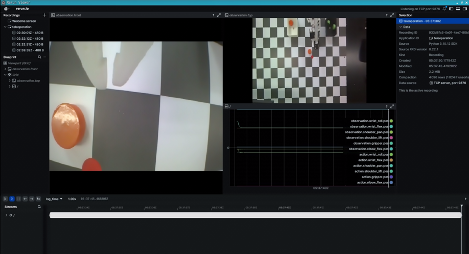

# AI Robotics

인공지능 로보틱스 제어의 기본 형태는 다음과 같습니다.


- **Recognition (인식)** : 상황을 인식합니다. 이는 카메라(이미지 센서), 라이다 등 각종 센서들이 이에 해당됩니다.
- **Process (처리)** : 인식된 상황을 해결하기 위해 매니퓰레이션이 움직여야 하는 위치 및 방향을 연산합니다. 연산장치 및 제어기가 이에 해당됩니다.
- **Work (행동)** : 처리 단계에서 연산된 결과를 실제 매니퓰레이션 동작으로 수행합니다. 장착된 각 모터의 특정 각도로 제어시켜 최종 행동을 수행합니다.

일반 Robotics 관점에서는 상황을 인지하는 과정이 없습니다. Robotics는 오로지 로봇이 이동해야 할 위치 및 방향을 계산하고(Process) 실제 행동을 수행하는(Work) 동작만을 담당하고 있습니다. 관련 학문으론 역기구학과 동역학 등이 있습니다.

하지만 컴퓨터 비전 및 센서 공학의 발전과 인공지능의 도입 등으로 인하여 로봇이 문제 상황을 **인식** 하는 것이 가능해지면서 로봇의 활용도가 매우 높아지기 시작했습니다.    
단적인 예로, 물체를 분류하는 산업용 로봇의 경우는 현재 자신이 분류해야 할 물체의 위치와 종류를 명확히 인식할 수 있게 됨으로써, 로봇이 움직일 수 있는 범위 내에서 물건이 어느 위치에 있든 어떤 종류이든 (학습된 물체 한정) 알아서 물건을 짚은 뒤 알맞게 분류할 수 있는 절차를 수행하기에 일렀습니다.

이처럼 인공지능 로보틱스는 활용도가 매우 넓으며, 현재에도 꾸준히 관련 기술에 대한 연구와 산업 현장의 도입률이 증가하고 있는 추세인만큼 그 가치가 점점 증가하고 있습니다.

## LeRobot

[LeRobot](https://huggingface.co/lerobot)이란 Huggingface에서 개발한 로봇팔 인공지능 제어 소프트웨어 패키지입니다. Python 패키지로 제공되며, [ACT](https://arxiv.org/abs/2304.13705) 모방 학습을 기반으로 데이터셋 수집 및 정책을 학습시키고 이를 직접 실행할 수 있는 인공지능 도구입니다. 여기서 정책은 인공지능 모델의 일종이며, 짚어야 할 대상, 이동해야할 위치 등 로봇이 목표를 세우고 실행하는 데 기준점을 잡아주는 역할을 담당하고 있습니다.

LeRobot은 상술하였던 인공지능 로보틱스에서 인식, 처리 부분을 담당하고 있습니다. 6축 매니퓰레이션의 역할은 대개 특정 물체를 짚고 특정 위치로 이동하는 것인데, lerobot에서는 물체를 인식하는 것과 더불어 로봇이 이동해야 할 위치를 계산해줍니다.  

PhysicAI Arm의 Jetson Orin NX는 이미 lerobot이 설치되어 있습니다. 다만, 한백전자에서 제공하는 lerobot은 기존 라이브러리에서 일부 수정된 내용 (카메라 캘리브레이션 기능 추가) 이 담긴 라이브러리를 추가로 제공하고 있습니다. 한백전자의 라이브러리를 받아 사용하고 싶다면 아래 명령어로 다운로드 받으시면 됩니다.

```sh
git clone -b hbe/camera_calibration https://github.com/hanback-lab/lerobot
```

### Huggingface Login

실습을 진행하기에 앞서, 데이터셋 및 모델 업로드를 위한 huggingface 계정 로그인 절차를 진행해야 합니다. 

1. 아래 사이트에 접속하여 huggingface 계정 로그인을 진행하여 주십시오. 만약 계정이 없다면, 새로 계정을 만들어주시길 바랍니다.
    - https://huggingface.co/ 
2. 아래 사진들을 참고하여 Access token을 제작합니다.


3. 표시된 Access token을 복사 및 저장해 주십시오. 해당 토큰은 장비에서 로그인 시 필요하며 해당 키는 귀하의 계정 저장소에 접근 가능할 정도의 권한을 가지고 있으며, 한번 분실 시 기존 키는 소멸되고 새로운 키가 재발급됩니다. 이에 이 키를 반드시 적절한 곳에 잘 저장해 주십시오.


4. PhysicAI Arm의 Orin NX로 돌아옵니다. Terminal을 실행하여 아래 명령어를 입력들을 입력해주세요. 아래 사진과 같이 token을 묻는 창이 뜨면 아까 저장해뒀던 token 값을 입력해주세요.

```sh
git config --global credential.helper store
hf auth login
```


5. 다음 명령어를 통해 로그인 유무를 파악합니다. 만약 아무것도 출력이 되지 않는다면 4번 절차를 다시 진행해주세요.

```sh
hf auth whoami
```


### Teleoperation

Teleoperation란 로봇 공학에서 로봇과 사람 사이의 거리를 어느 정도 둔 위치에서 로봇을 원격으로 제어하는 것을 의미합니다. 많은 robotics 산업 분야에서 활발하게 도입되어 왔으며, 모방 학습을 위한 데이터셋 수집의 핵심적인 기능이기도 합니다.

터미널에서 다음 명령어를 통해 Teleoperation을 진행할 수 있습니다.

```sh
lerobot-teleoperate \
    --robot.type=so101_follower \
    --robot.port=/dev/ttyACM0 \
    --robot.id=my_awesome_follower_arm \
    --teleop.type=so101_leader \
    --teleop.port=/dev/ttyACM1 \
    --teleop.id=my_awesome_leader_arm
```

명령어를 기다린 후 잠시 기다리게되면, 터미널에 각 joint의 각도 값을 표시함과 함께 Leader Arm을 움직일 경우 Follower Arm도 같이 따라 움직이는 것을 볼 수 있습니다.

### With camera

PhysicAI Arm 장비에 장착된 카메라의 영상 데이터를 받아와 봅시다. 터미널에 다음 명령어를 입력하면 카메라 영상 출력 및 teleoperation이 실행됩니다. \<calibration path> 에는 반드시 이전 과정에서 캘리브레이션 작업 후 저장된 설정파일을 지정시켜 주어야 합니다. 

```sh
DISPLAY=:0 lerobot-teleoperate \
    --robot.type=so101_follower \
    --robot.port=/dev/ttyACM0 \
    --robot.id=my_awesome_follower_arm \
    --robot.cameras="{ front: {type: opencv, index_or_path: 0, width: 640, height: 480, fps: 15}, top: {type: opencv, index_or_path: 2, width: 640, height: 480, fps: 15, calibration_config: <calibration path>}}" \
    --teleop.type=so101_leader \
    --teleop.port=/dev/ttyACM1 \
    --teleop.id=my_awesome_leader_arm \
    --display_data=true
```

실행 시 아래 사진과 같이 rerun sdk가 실행되면서 카메라 영상 및 모터 각도에 대한 그래프를 출력시켜줍니다.



### Record

이 과정에서는 정책을 학습하기 위한 데이터셋을 수집하여 봅시다. 데이터셋을 수집하기 전 문제 상황을 정의해야 합니다. 다음은 PhysicAI Arm이 해결해야 할 문제입니다.

- 환경 : 주황색, 초록색 원기둥이 각각 2개씩 임의의 위치에 존재합니다. (단, 로봇이 이동할 수 있는 범위 내에서)
- 목표 : 주황색, 초록색 원기둥을 서로 다른 위치에 분류 시킵니다.
- 조건 : 주황색 원기둥은 흰색 바구니에, 초록색 원기둥은 검은색 바구니에 옮깁니다. 모든 과정은 30초 이내에 완료해야 합니다.

로봇은 주어진 환경에서 목표를 수행하기 위한 일련의 과정을 거치고, 목표를 모두 완수하면 활동을 종료합니다. 이런 순환(cycle)을 **에피소드(episode)** 라고 부릅니다. 이 과정에서는 직접 문제 환경을 조성하고 teleoperation으로 목표를 수행해가며 데이터셋을 수집해가며 에피소드들을 쌓아가는 것이 최종 목표입니다.

다음 명령어를 통해 데이터셋 수집을 진행합니다.

```sh
export HF_USER=$(hf auth whoami | head -n 1)

DISPLAY=:0 lerobot-record \ 
    --robot.type=so101_follower \
    --robot.port=/dev/ttyACM0 \
    --robot.id=my_awesome_follower_arm \
    --robot.cameras="{ front: {type: opencv, index_or_path: 0, width: 320, height: 240, fps: 15}, top: {type: opencv, index_or_path: 2, width: 640, height: 480, fps: 15, calibration_config: /home/soda/calibration.json}}" \
    --teleop.type=so101_leader \
    --teleop.port=/dev/ttyACM1 \
    --teleop.id=my_awesome_leader_arm \
    --display_data=true \
    --dataset.repo_id=${HF_USER}/<dataset addr> \
    --dataset.num_episodes=50 \
    --dataset.single_task="Grab the cylinders" \
    --dataset.reset_time_s=10
```

기호에 따라 다음 옵션을 변경 및 추가할 수 있습니다.

변경 가능
- `dataset.repo_id=$(HF_USER)/<dataset addr>` : huggingface에 저장할 dataset 이름입니다. `$(HF_USER)/` 뒤의 이름은 아무렇게나 지어도 무관합니다. (e.g. $(HF_USER)/arm_test ) 
- `dataset.num_episodes=50` : 총 수집할 에피소드들의 개수입니다. 50개 이상의 에피소드 수집을 권장합니다만, 임의로 변경하여 권장 수치보다 더하거나, 덜하게 수집할 수 있습니다.
- `dataset.single_task="Grab the cylinders"` : PhysicAI Arm이 수행할 작업의 이름입니다. 임의로 지정하여도 무관합니다.
- `dataset.reset_time_s=10` : 에피소드 수집 시간 이후 환경을 재조정하는 구간의 시간입니다. 기본값은 60초 입니다.

추가 가능
- `dataset.episode_time_s=60` : 에피소드를 수집하는 구간의 설정 시간입니다. 기본은 60초입니다.
- `resume=true` : 이미 수집한 데이터셋에서 더 데이터를 수집하고 싶을 때 추가하는 옵션입니다. 만약 이 옵션을 추가하지 않고 추가 데이터셋을 수집한다면 프로그램을 오류를 발생시킵니다.

### Training

정책 학습을 실시합니다. 정책 학습은 고성능 PC 및 Colab Pro 이상 요금제가 필요하며, Colab의 A100 GPU를 사용할 경우 기본적으로 3시간 이상 소요됩니다.

<details>
<summary><b>Colab에서 실행하는 경우</b></summary>

```python
# condacolab install
!pip install -q condacolab
import condacolab
condacolab.install()
!conda install ffmpeg=7.1.1 -c conda-forge
```

이 코드를 실행한 후 아래 코드들을 수행해주세요.
</details>
<br>

아래 명령어들을 입력해 lerobot을 설치 및 이전 과정을 참고하여 huggingface에 로그인합니다. 이미 진행이 된 PC라면 건너뜁니다.

```sh
sudo apt update
sudo apt install ffmpeg

git clone https://github.com/huggingface/lerobot.git
cd lerobot && pip install -e .

!git config --global credential.helper store
!hf auth login
```

아래 파이썬 코드를 실행합니다. 이 때, \<path>는 `<user id>/<dataset id>` 양식에 맞춰 이전 과정에서 업로드하였던 dataset 주소를 입력합니다. (e.g. hbelab/physicai-test)

```python
from huggingface_hub import HfApi

hub_api = HfApi()
hub_api.create_tag("<path>", tag="v2.1", repo_type="dataset")
```

아래 명령어를 입력하여 정책 학습을 진행합니다. 여기서 \<dataset addr>는 전과정에서 입력했던 데이터셋 주소를, \<policy addr> 는 `<user id>/<policy name>` 형태로 정책을 올릴 주소를 작성해서 입력합니다. (e.g. hbelab/physicai-test0)

```sh
lerobot-train \
  --dataset.repo_id=<dataset addr> \
  --policy.type=act \
  --output_dir=outputs/train/act_physicai_test \
  --job_name=act_physicai_test \
  --policy.device=cuda \
  --wandb.enable=false \
  --policy.repo_id=<policy addr>
```

### Eval

학습이 완료되었다면 다시 Jetson Orin NX로 돌아와 모델을 평가합니다. 다음 명령어로 정책을 실행하여 의도한 작업을 제대로 진행하는 지 확인해봅니다.

```sh
lerobot-record  \
  --robot.type=so100_follower \
  --robot.port=/dev/ttyACM0 \
  --robot.cameras="{ front: {type: opencv, index_or_path: 0, width: 320, height: 240, fps: 15}, top: {type: opencv, index_or_path: 2, width: 640, height: 480, fps: 15, calibration_config: /home/soda/calibration.json}}" \
  --robot.id=my_awesome_follower_arm \
  --display_data=false \
  --dataset.repo_id=${HF_USER}/<eval addr> \
  --dataset.single_task="Grab the cylinders" \
  --policy.path=${HF_USER}/<policy addr>
```

- `dataset.repo_id=${HF_USER}/<eval addr>` : huggingface에 저장할 모델 평가 관련 dataset 이름입니다. `$(HF_USER)/` 뒤의 이름은 아무렇게나 지어도 무관합니다. (e.g. $(HF_USER)/eval_arm )
- `policy.path=$(HF_USER)/<policy addr>` : 이전 과정에서 정책 학습 후 업로드 된 정책의 이름을 입력합니다. 이는 이전 과정과 동일한 이름을 작성해야 하며, 상이할 경우 오동작이 발생할 수 있습니다.

정책을 실행시켜 확인해봅니다. 만약 의도되지 않은대로 동작한다면, 데이터셋을 추가로 수집하여 가중학습을 진행해봅니다.
