# PhysicAI Arm

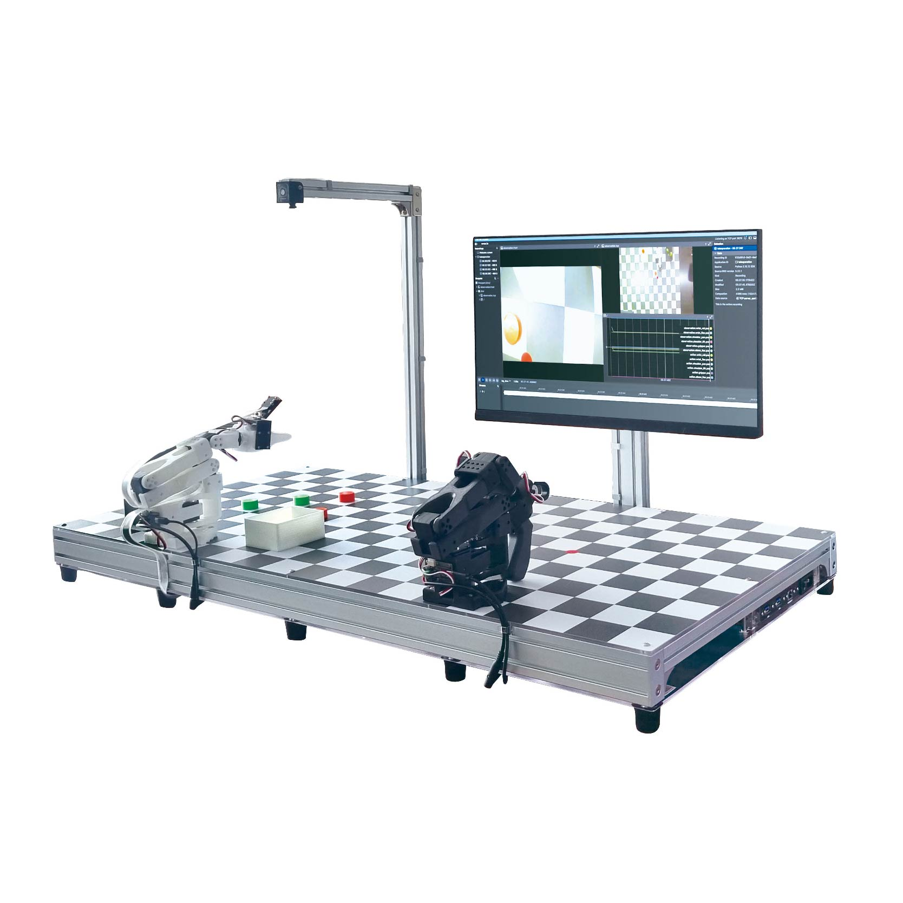

작성일 기준(2026년) 로봇 개발은 기구학과 제어 중심의 전통적 접근에서 벗어나, AI 모델·시뮬레이션·합성 데이터·엣지 컴퓨팅·안전 규격이 결합된 통합 시스템 개발로 빠르게 전환되고 있습니다. 특히 비전-언어-행동(VLA) 계열 모델과 체화 추론(embodied reasoning) 기술은 로봇이 자연어 지시를 이해하고, 환경을 해석하며, 여러 단계로 이루어진 작업을 스스로 계획하는 방향으로 발전하고 있습니다. 동시에 시뮬레이션은 단순 검증 도구를 넘어 디지털 트윈과 합성 데이터 생성을 위한 핵심 인프라가 되었고, 휴머노이드 로봇은 연구 데모에서 산업 현장 파일럿으로 이동하고 있습니다. 이러한 변화 속에서 로봇 개발자는 하드웨어 제어뿐 아니라 데이터 파이프라인, AI 추론, 소프트웨어 플랫폼, 안전·보안의 이해도 필수 역량으로 요구됩니다.

PhysicAI Arm은 현대 로봇공학과 Physical AI의 흐름을 반영하여 설계된 교육용 로보틱스 플랫폼입니다. 학습자는 이 장비를 통해 기초 로봇공학의 핵심 개념을 이해하고, 시뮬레이션 기반 검증과 VLA 기초 활용까지 연결된 실습을 수행합니다. 본 교재는 개별 공학 요소를 깊이 있게 다루는 것보다, 로봇 시스템을 구성하는 기술들이 어떻게 맞물려 동작하는지를 이해하고 경험하는 데 중점을 둡니다. 따라서 PhysicAI Arm은 기초 이론, 시스템 통합, 그리고 최신 지능형 로봇 기술의 흐름을 하나의 학습 경로로 이어 주는 출발점이 됩니다. 

## 개발 환경 소개

장비 각 모듈의 명칭은 아래와 같습니다.

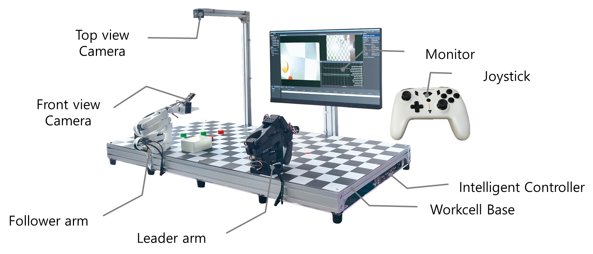

### Intelligent Controller

본 제품에 탑재된 지능형 로봇 제어기는 **Jetson Orin NX**입니다. 이 제어기는 아래와 같은 하드웨어 성능을 갖추고 있습니다.

| Type | Spec |
| ---- | ---- |
| GPU | NVIDIA Ampere GPU (1024 CUDA Cores + 32 Tensor Cores) |
| CPU | Arm Cortex v8 64-bit |
| Memory | 16GB LPDDR5 |
| Storage (external SSD) | 256GB |

지능형 로봇 제어기에 탑재된 OS는 *Jetson Linux 36.3.0* 이며, 당사의 추가 설정으로 아래 모듈 및 소프트웨어가 탑재되어 있습니다.

| Name | Version |
| ---- | ------- | 
| Linux Kernel | 5.15.136-tegra |
| ROS2 | Humble (Source build) |
| Python | 3.10.12 |
| OpenCV | 4.10.0 (cuda, gstreamer) |
| Gazebo | Fortress |
| xpad | 0.4 |
| numpy | 1.26.1 |
| torch | 2.4.0a0+3bcc3cddb5.nv24.07 |

6장, 7장을 제외한 모든 실습 및 예제는 위 환경에서 동작합니다. 상단에 기재된 소프트웨어 버전을 **임의로 업그레이드하거나 다운그레이드**할 경우 실습이 **원활히 진행되지 않을 수 있습니다.** 반드시 이 점 숙지해 주시기 바랍니다.

## 개발 환경

PhysicAI Arm 개발은 local 환경과 remote PC 환경 두 가지로 진행할 수 있습니다. Remote PC를 통한 개발을 하고 싶을 경우 [아래 Remote PC 환경 시작하기](/Chapter01.%20Overview/1-1.%20Overview.md#Remote-PC-환경-시작하기)부분을 읽으시면 됩니다. 바로 밑은 local 환경 개발에 대한 설명을 진행하겠습니다.

## local 환경 시작하기

PhysicAI Arm을 시작하기 위해선 전원 케이블을 연결한 후, 전원을 켜야 합니다. 본 제품의 측면을 보시면 포트들과 전원 버튼이 있는 것을 확인할 수 있습니다. 사진에 표시된 것과 같이 3번 포트에 전원 선을 연결합니다. 그 후, 2번의 전원 버튼을 0에서 1로 바꿔 전원을 켭니다. 키보드와 마우스는 1번 USB 포트에 각각 꽂습니다.

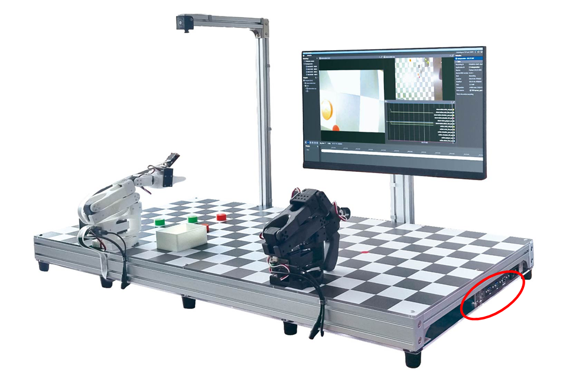
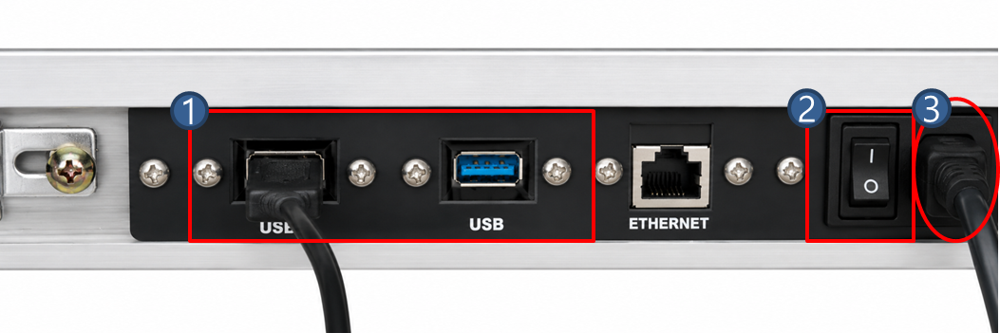

### Visual Studio Code

Visual Studio Code(이하 VSCode)는 Microsoft가 Electron 프레임워크를 기반으로 개발한 무료 프로그램입니다. 추가로 필요한 확장 기능을 설치하면 IDE로 활용할 수 있습니다. 윈도우를 비롯해 리눅스, macOS를 모두 지원하며 파이썬 같은 다양한 프로그래밍 언어와 개발 기능을 확장 기능을 통해 지원합니다.

장비에 탑재된 지능형 로봇 제어기에는 이미 VSCode가 설치되어 있습니다. 아래 사진과 같이 바탕화면 또는 애플리케이션 메뉴의 VSCode 실행 아이콘을 클릭하거나, 새 터미널을 연 뒤 'code'라는 명령어를 입력하여 VSCode를 실행합니다.

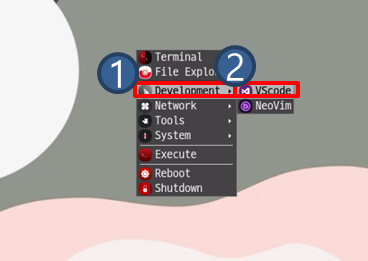

<br>

VSCode를 실행하면 아래와 같이 프로그램 화면이 표시됩니다.

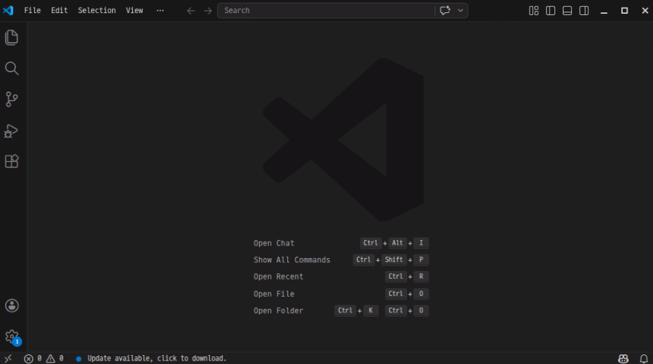

<br>

## Remote PC 환경 시작하기

### VSCode

우선 Remote PC에 'VSCode'를 설치합니다.

- https://code.visualstudio.com/

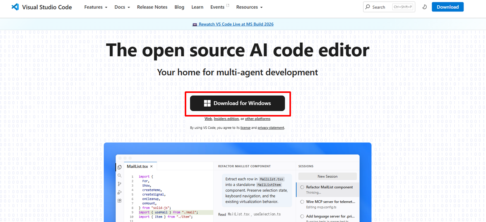

### SSH를 통한 원격접속

SSH를 이용하여 원격접속을 할 수 있습니다. Visual Studio Code의 Extension을 활용하겠습니다. 'Remote-SSH'를 검색하고 install 버튼을 누릅니다. 

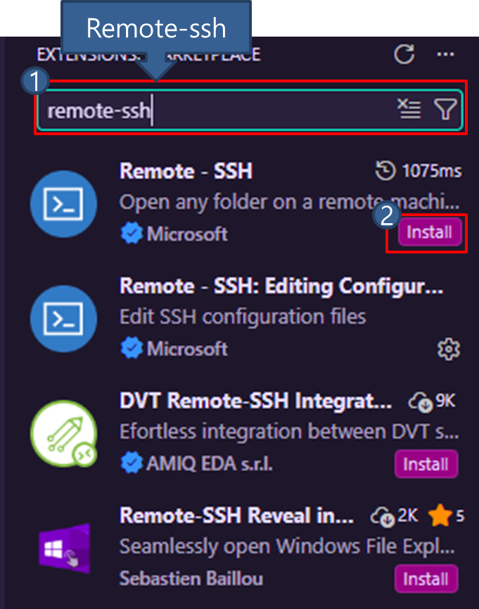

설치한 뒤, 원격 접속 정보를 지속적으로 사용할 수 있도록 실습 장비를 등록합니다.

메뉴 > View > Command Palette 또는 `Ctrl+Shift+p`

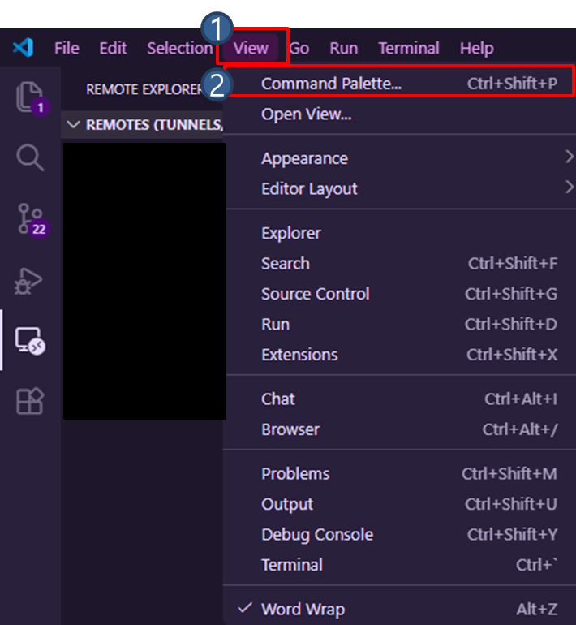

'remote ssh'를 검색하여 'Remote-SSH: Add New SSH Host...'를 실행합니다.

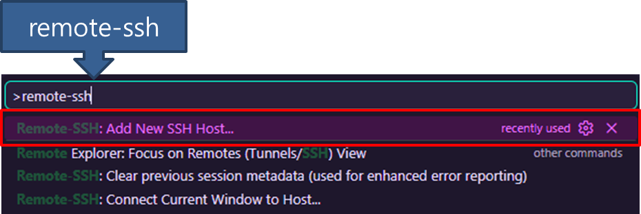

실습 장비의 ID와 IP를 \<ID>@\<IP> 형태로 입력한 뒤, 엔터를 누릅니다.

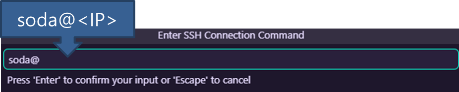

`C:\Users\<user.name>\.ssh\config` 을 클릭해줍니다.

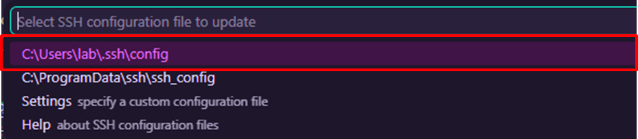

그림에서 표시된 버튼과 같은 모양을 눌러줍니다. 왼쪽 버튼은 현재 창에서 열기, 오른쪽 버튼은 새 창으로 열기 입니다.

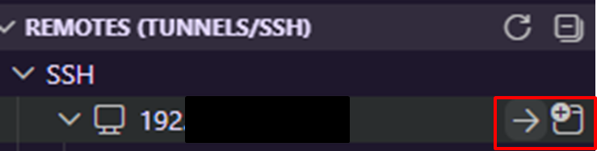

SSH 환경에서 GUI 시각화 도구를 로컬 Windows 화면에 표시하려면 X server와 DISPLAY 설정이 필요합니다.

### x11 Forwarding

X11 Forwarding은 리눅스 원격 서버에서 실행되는 그래픽을 로컬에 표시할 수 있도록 해주는 프로그램입니다. 위에서 설명하였듯이 SSH를 통해 원격접속을 할 때에는 디스플레이 출력 프로그램을 이용해야 시각화 툴을 활용할 수 있습니다. 

아래 사이트에서 X11 Forwarding 프로그램인 VcXsrv를 다운로드합니다.

- https://sourceforge.net/projects/vcxsrv/

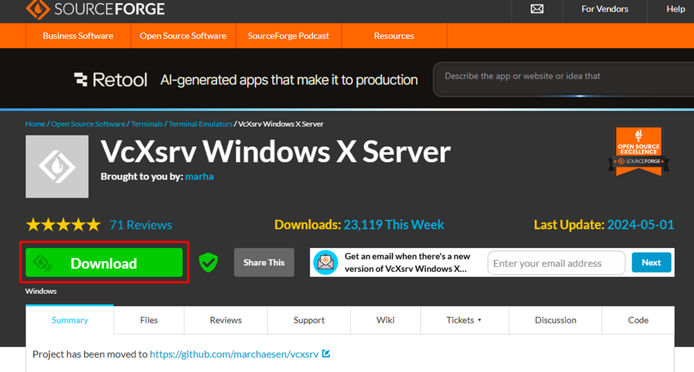

다운로드 한 후, 완료된 파일을 열어 설치를 시작합니다.

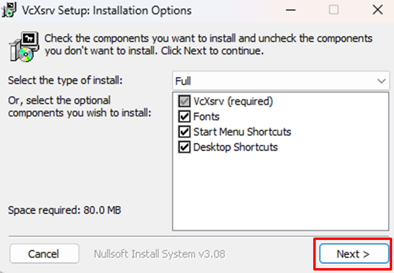

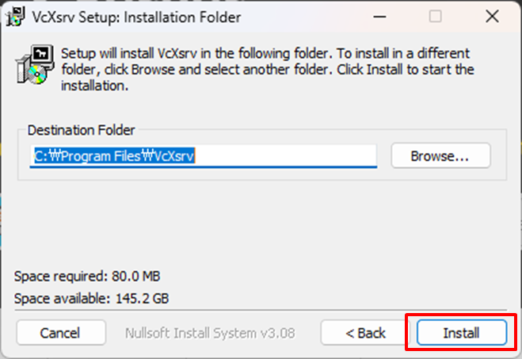

설치가 완료되면 바탕화면에 `XLaunch`라는 바로가기가 생성됩니다. 해당 바로가기가 VcXsrv 프로그램입니다.

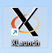

바로가기를 연 후, Display number를 0으로 바꾸고 다음으로 넘어갑니다.

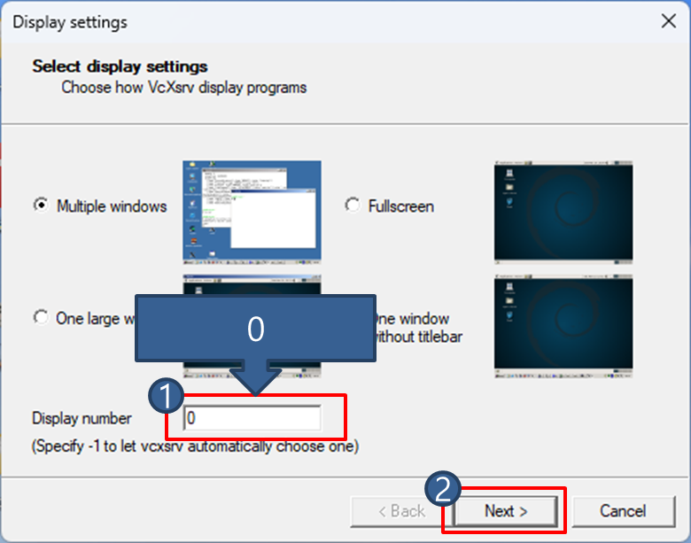

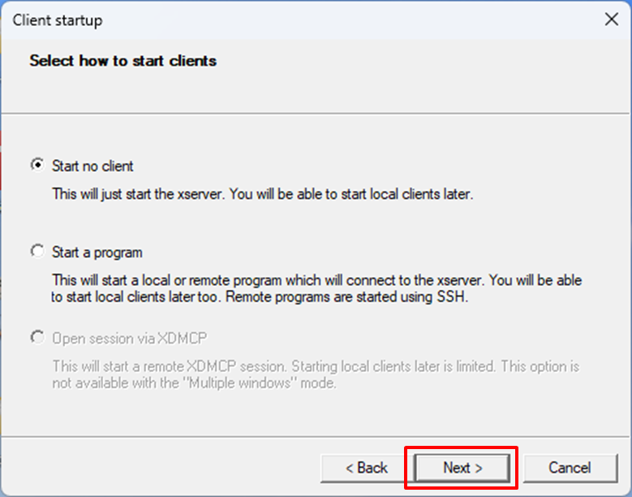

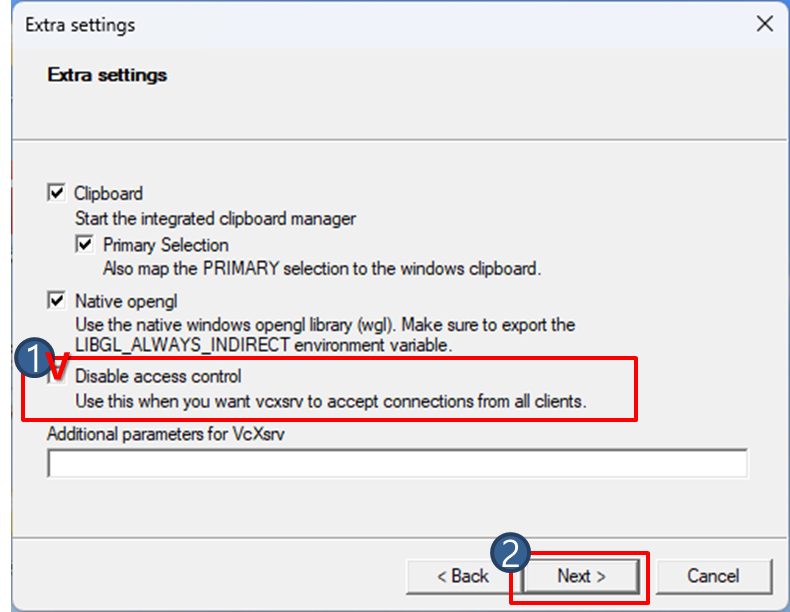

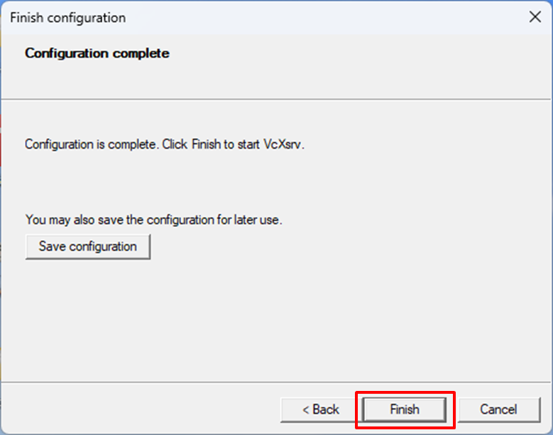

설정을 완료한 후 VSCode에서도 환경변수를 설정해야 합니다. Windows PC에서 cmd를 켜고, 'ipconfig'를 입력해 ip를 확인합니다.

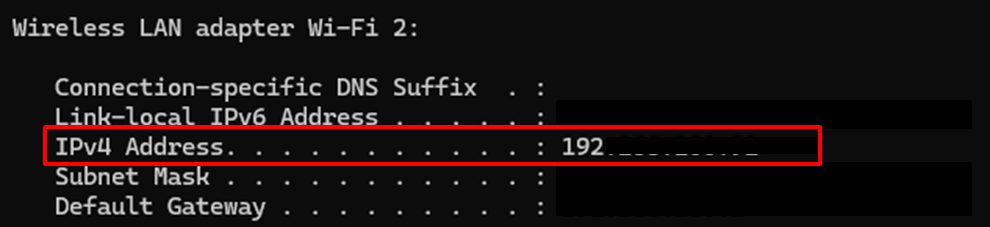

원격접속한 VSCode에서 아래 명령어 중 \<IP> 란에 확인한 ip주소를 입력합니다.

```sh
export DISPLAY=<IP>:0
```


### Domain

도메인은 같은 네트워크 안에서 ROS2 시스템을 구분하는 번호입니다. 현재 도메인을 확인하는 방법은 아래와 같습니다.

```sh
echo $ROS_DOMAIN_ID
```

도메인은 터미널에서 `export`를 통해 변경할 수 있습니다. 도메인 ID가 다르면 DDS discovery 범위가 분리되어 서로의 노드/토픽을 발견하지 못합니다. 같은 실험실에 여러 대의 PC나 로봇이 있을 때 도메인을 다르게 하여 구분합니다. 아래 명령어를 통해 도메인을 원하는 번호로 변경할 수 있습니다.

```sh
export ROS_DOMAIN_ID=<원하는 번호>
```


## Node Discovery

Node Discovery란 네트워크에 있는 노드들이 서로를 자동으로 찾아내는 기능입니다. 예를 들어 PC A에서 `camera_node`를 통해 이미지 토픽을 발행한다면, PC B에서 `camera_node`의 IP나 포트를 모르더라도 토픽의 존재를 확인할 수 있습니다. 다만, 네트워크와 도메인 ID가 동일해야 합니다.

노드에 대한 자세한 설명은 2장에서 이어가도록 하겠습니다.

Windows에서 PhysicAI Arm과 통신을 하고 싶다면 아래의 과정을 따라야합니다.

1. Windows에도 동일한 버전의 ROS2 설치
2. 두 PC의 DOMAIN 맞추기
3. 같은 DDS로 맞추기
4. 동일한 네트워크 접속
5. 통신이 되지 않는 경우 Windows 방화벽에서 ROS2/DDS 통신을 허용


### Python Extension 설치

VSCode에서는 확장 기능(Extensions)을 제공합니다. 이 기능은 VSCode의 기능을 확장하여 **개인만의 개발 환경**을 만들 수 있는 플러그인입니다. 언어 지원, 디버깅, 코드 자동 완성, 협업 도구 등 다양한 기능을 추가할 수 있으며, 필요한 기능만을 선택적으로 설치해 효율적인 개발 환경을 구성합니다.

본 챕터에서는 파이썬 코드 자동 완성, 디버깅 등의 파이썬 개발에 편리한 기능을 제공하는 Extension을 설치해 보겠습니다. 아래 사진과 같이 VSCode 좌측의 Extension 아이콘 버튼을 누른 뒤, 검색 창에 'python'이라고 입력해 주시기 바랍니다. 그 후 Python 확장 기능 항목의 'Install' 버튼을 클릭합니다.

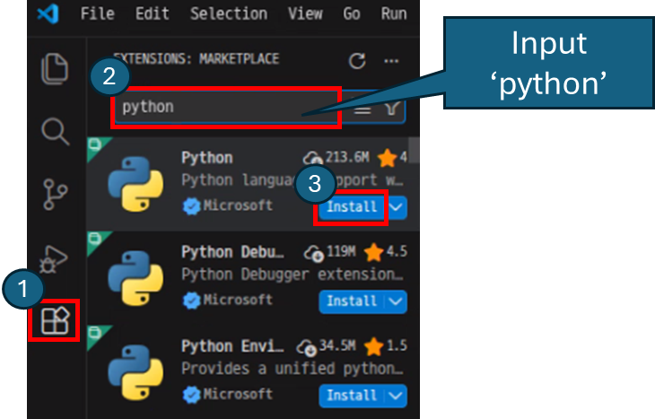

### Hello World!

VSCode의 간단한 사용법과 파이썬 프로그램을 실행하는 방법을 설명합니다. 먼저 작업할 폴더를 엽니다. 아래 사진과 같이 File > Open Folder를 클릭합니다. 이후 띄워진 창에서 작업할 폴더를 선택합니다.

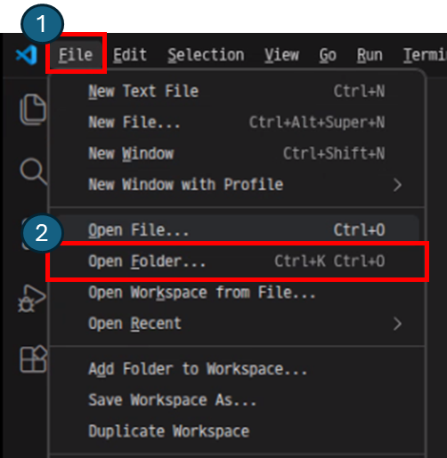

<br>

폴더를 연 뒤, 새 파일을 생성합니다. 아래 사진에 표시된 버튼을 누른 뒤 예제 파일명인 'hello.py'를 입력합니다. 여기서 파일 이름은 임의로 설정할 수 있습니다.

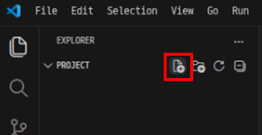

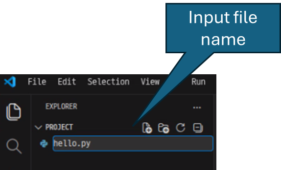

<br>

파일을 만든 뒤, 문자열 'Hello World'를 출력하는 파이썬 코드를 작성합니다.

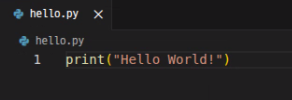

<br>

이후 우측 상단의 `Play` 버튼을 클릭하여 실행 결과를 확인합니다.

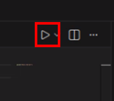

실행 결과는 아래와 같습니다.

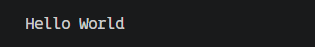

### 제어 패키지 다운로드

실습의 편리함을 위해 미리 제작해둔 패키지를 내려받아 사용하도록 하겠습니다. 

```sh
source ~/ros2_base/install/local_setup.bash
mkdir -p ~/physicai_arm_ws/src
cd ~/physicai_arm_ws/src
git clone https://github.com/hanback-lab/PhysicAI-Arm-ROS physicai_arm
cd physicai_arm
chmod +x launch/*.launch.py
cd ../..
colcon build --symlink-install --packages-select physicai_arm
```

다음 명령어로 빌드된 워크스페이스 환경을 현재 터미널에 적용합니다. 실질적인 제어 방법은 추후에 이어집니다. 터미널을 새로 열 때마다 아래 명령어로 ROS 2 환경 설정을 해주어야 합니다.

```
source ./install/setup.bash
```

### Follower Arm

본 제품에는 Follower Arm(하얀색)과 Leader Arm(검은색)으로 매니퓰레이터가 두 개로 구성되어 있습니다. 아래 명령어를 통해 Follower Arm 제어를 활성화할 수 있습니다. 제어를 활성화하기 전, `bringup.launch.py` 런치 파일을 먼저 실행시켜주어야 합니다. Follower Arm은 Leader Arm으로 제어할 수 있으며, teleoperation 노드를 실행시켜야 합니다.

제어를 하기 위해서는 터미널을 2개 열고 각 터미널에서 환경 설정 파일을 source한 뒤, 아래 명령어를 입력하여 파일을 실행시켜줍니다. launch 파일, 노드 등에 대한 설명은 추후 자세히 이어집니다.

실행한 파일을 종료하기 위해선 `Ctrl+C`를 눌러주면 종료할 수 있습니다.

```sh
# Terminal 1

ros2 launch physicai_arm bringup.launch.py
```

```sh
# Terminal 2

ros2 run physicai_arm teleoperation
```

## Joystick

Leader Arm 뿐만 아니라 조이스틱을 이용하여 Follower Arm을 제어할 수 있습니다.

조이스틱으로 제어를 하기 위해서는 터미널을 2개 열고 각 터미널에서 환경 설정 파일을 source한 뒤, 아래 명령어를 입력하여 파일을 실행시켜줍니다. launch 파일, 노드 등에 대한 설명은 추후 자세히 이어집니다.

실행한 파일을 종료하기 위해선 `Ctrl+C`를 눌러주면 종료할 수 있습니다.

```sh
# Terminal 1

ros2 launch physicai_arm bringup.launch.py
```

```sh
# Terminal 2

ros2 launch physicai_arm joystick.launch.py
```

- 평면 이동 제어 스틱
- 2축 아날로그 입력을 기반으로 하는 조이스틱
- 수평 평면이동(X축, Y축) 제어 담당

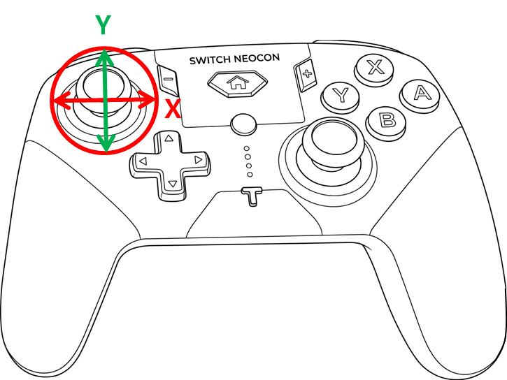<br>


<br>

- 수직 이동 제어 버튼
- 디지털 입력 기반의 상/하 버튼 구조
- 그리퍼의 상승 및 하강 제어 수행

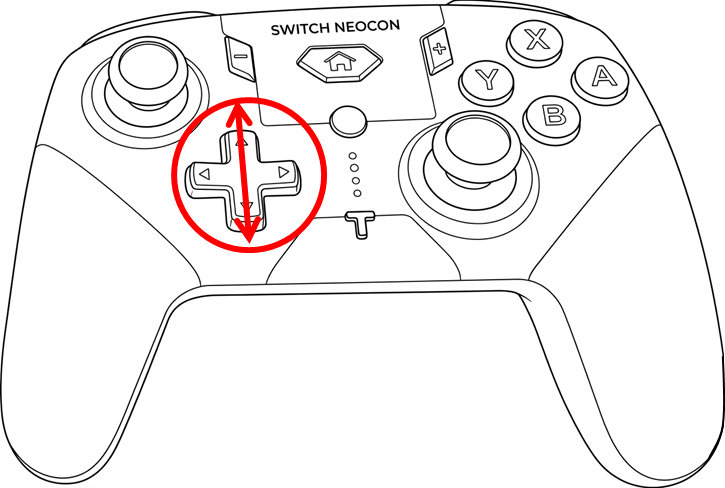<br>

<br>

- 그리퍼(집게) 제어 버튼
- 그리퍼의 개폐를 제어하는 디지털 버튼
- 물체 파지(grasping) 및 해제 동작 수행

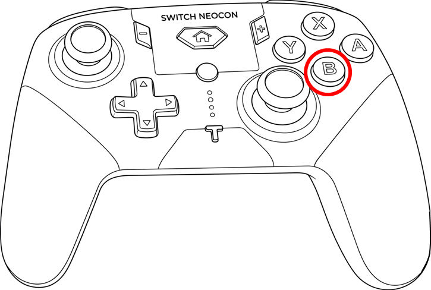<br>


<br>

- 손목 피치 제어 스틱
- 1축 아날로그 입력(좌우 기울기)을 활용한 제어 스틱
- 그리퍼의 상하 기울기 조절 제어 담당

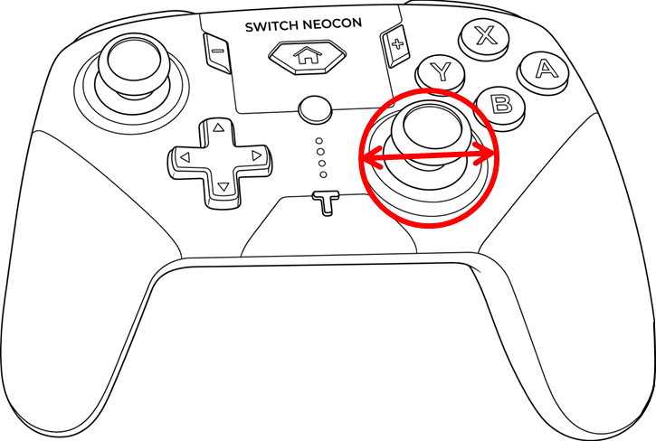<br>

> [!Note]
> 조이스틱을 이용할 땐 teleoperation 노드를 종료하고 진행해야 합니다. teleoperation과 joystick 런치가 동시에 실행되면 제어가 되지 않으므로 반드시 둘 중 하나만 실행시키기 바랍니다.


## OpenCV

OpenCV(Open Source Computer Vision Library)는 **영상 처리 및 이미지 분석을 위한 오픈소스 라이브러리**입니다. 실시간 영상 처리, 객체 인식, 이미지 필터링, 카메라 캘리브레이션, 특징점 추출, 딥러닝 기반 객체 검출 등 다양한 기능을 제공합니다.

OpenCV는 산업 현장, 자율 주행, 로봇공학, 의료 영상 분석, 인공지능 연구 등 다양한 분야에서 활용되고 있습니다. 특히 카메라로부터 영상을 입력받아 물체를 인식하거나 추적하는 작업에 많이 이용됩니다. 주요 기능은 아래와 같습니다.

- 이미지 읽기 및 저장
- 영상 스트리밍 처리
- 색상 공간 변환(RGB, HSV, Grayscale 등)
- 이미지 필터링 및 노이즈 제거
- 객체 검출 및 추적
- 특징점 추출(SIFT, ORB 등)
- 카메라 캘리브레이션
- 딥러닝 모델 연동
- 영상 기하학 변환(회전, 이동, 크기 조절)

예를 들어 로봇 비전 시스템에서는 OpenCV를 이용하여 카메라 영상을 수집하고 객체의 위치를 인식한 뒤, 로봇 팔이 해당 위치로 이동하도록 제어할 수 있습니다.

>[!Warning]
> 본 실습 환경은 **소스 빌드 방식**으로 구성된 개발 환경을 사용합니다. OpenCV를 포함한 주요 라이브러리들은 이미 사전에 빌드 및 설치되어 있습니다. pip를 이용한 명령어를 사용하여 OpenCV 또는 관련 패키지를 추가하거나 업데이트할 필요가 없습니다.
> 
> 임의로 라이브러리 버전을 변경할 경우 ROS2, LeRobot, CUDA, GStreamer 등의 의존성이 충돌하여 개발 환경이 손상될 수 있습니다. 실습 중에는 **기존에 제공된 환경을 그대로** 사용해야 합니다.


**실습 : 도형 그리기**

OpenCV는 이미지 위에 다양한 기하학적 **도형을 직접 그릴 수 있는 함수**를 제공합니다. 이를 활용하여 도형을 그려보겠습니다. 선, 화살표, 사각형, 원, 타원, 다각형, 텍스트 등을 응용하여 출력합니다. 

800*600 픽셀의 어두운 캔버스를 생성하고 총 8종류의 도형/텍스트 함수를 순서대로 그립니다. 마지막에는 삼각함수를 활용해 원형으로 배치된 색상 점들을 그려 수학적 응용까지 마무리합니다.

```py
import cv2
import numpy as np
import math

canvas = np.ones((600, 800, 3), dtype=np.uint8) * 30

cv2.line(canvas, (50, 50), (750, 50), (100, 100, 100), 1)
cv2.line(canvas, (50, 550), (750, 550), (100, 100, 100), 1)
cv2.line(canvas, (50, 50), (50, 550), (100, 100, 100), 1)
cv2.line(canvas, (750, 50), (750, 550), (100, 100, 100), 1)

cv2.line(canvas, (100, 100), (300, 250), (0, 255, 255), 3)
cv2.arrowedLine(canvas, (350, 100), (550, 100), (0, 200, 255), 3, tipLength=0.3)

cv2.rectangle(canvas, (100, 300), (260, 430), (50, 150, 255), 2)
cv2.rectangle(canvas, (300, 300), (460, 430), (50, 150, 255), -1)

cv2.circle(canvas, (580, 200), 70, (0, 255, 100), 2)
cv2.circle(canvas, (690, 200), 40, (0, 255, 100), -1)

cv2.ellipse(canvas, (580, 400), (90, 50), 30, 0, 360, (255, 100, 50), 2)
cv2.ellipse(canvas, (200, 500), (80, 30), 0, 0, 270, (255, 200, 0), 3)

pts = np.array([[650, 310], [720, 430], [580, 430]], np.int32)
cv2.polylines(canvas, [pts], True, (255, 50, 200), 2)

pts_fill = np.array([[100, 480], [150, 540], [200, 480], [250, 540], [300, 480]], np.int32)
cv2.fillPoly(canvas, [pts_fill], (180, 80, 255))

cv2.putText(canvas, "OpenCV Drawing", (230, 580),
            cv2.FONT_HERSHEY_DUPLEX, 1.2, (255, 255, 255), 2)

for angle in range(0, 360, 30):
    rad = math.radians(angle)
    cx, cy, r = 690, 420, 50
    x = int(cx + r * math.cos(rad))
    y = int(cy + r * math.sin(rad))
    color = (
        int(127 + 127 * math.sin(rad)),
        int(127 + 127 * math.cos(rad)),
        200
    )
    cv2.circle(canvas, (x, y), 6, color, -1)

cv2.imshow("Drawing Examples", canvas)
cv2.waitKey(0)
cv2.destroyAllWindows()
```

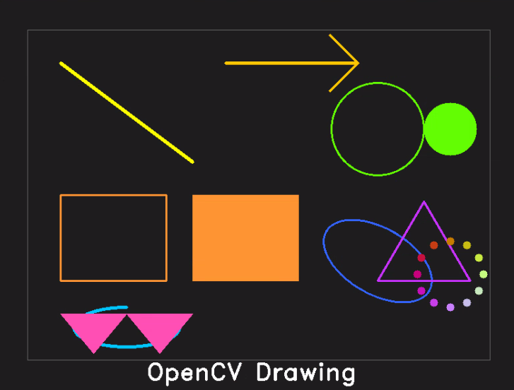

> cv2.line(이미지, 시작점, 끝점, 색상, 두께)
> 직선 그리기

> cv.arrowedLine(이미지, 시작점, 끝점, 색상, 두께, 화살촉 길이 비율)
> 끝점에 화살촉이 달린 선 그리기

> cv2.rectangle(이미지, 좌상단, 우하단, 색상, 두께)
> 좌상단, 우하단 꼭짓점을 기준으로 사각형 그리기 (두께 -1은 모두 채우기)

> cv2.circle(이미지, 중심점, 반지름, 색상, 두께)
> 중심과 반지름으로 원 그리기

> cv2.ellipse(이미지, 중심점, 장축/단축 반지름, 회전각, 시작각도, 끝각도, 색상, 두께)
> 타원 또는 타원의 일부(호) 그리기

> pts = np.array(\[[x1, y1], [x2, y2], [x3, y3]], np.int32)
> cv2.polylines(img, [pts], isClosed, 색상, 두께)
> 다각형 외곽선 그리기

> cv2.fillPoly(이미지, [pts], 색상)
> 다각형 채우기

> cv2.putText(이미지, 텍스트, 시작점, 폰트, 크기 비율, 색상, 두께)
> 텍스트 그리기

> [!Warning]
> OpenCV는 일반적인 RGB가 아닌 BGR 순서를 사용합니다. 빨간색은 (0, 0, 255), 초록색은 (0, 255, 0), 파란색은 (255, 0, 0)입니다.

> [!Note]
> 삼각함수를 이용하여 눈금의 시작점과 끝점을 계산하고, 시계 눈금판을 그려보세요. 12개의 시 눈금과 60개의 분 눈금을 그리고 각 위치에 숫자(1~12)를 배치하세요.

**실습 : 이미지 색상 변환하기**

OpenCV는 다양한 색상 공간으로 표현하며, 이미지 처리 목적에 따라 **여러 색상 공간 간의 변환**을 지원합니다. BGR 이미지를 그레이스케일, 반전, 세피아, 색조 변경, 밝기 조절, 대비 조절 효과로 반환합니다. 적용된 색상 필터는 총 6가지이며, `n`/`p`키를 이용하여 다음/이전 효과, `r`키로 새 이미지 생성, `q`키로 종료를 할 수 있습니다.

|공간 개념|설명|
|------|---|
|BGR|기본 색상 공간|
|Grayscale|색상 정보를 제거하고 밝기 정보만 남김|
|HSV|색조, 채도, 명도를 분리한 색상 공간|
|L\*a*b|인간 시각에 기반한 지각적으로 균일한 색상 공간|
|YUV|방송/영상에서 사용되는 색상 공간|


```py
import cv2
import numpy as np

import math

def make_image(seed=42):
    np.random.seed(seed)
    img = np.zeros((480, 640, 3), dtype=np.uint8)
    for _ in range(6):
        x1, y1 = np.random.randint(0,500), np.random.randint(0,380)
        x2, y2 = x1+np.random.randint(60,200), y1+np.random.randint(60,180)
        cv2.rectangle(img,(x1,y1),(min(x2,639),min(y2,479)),[int(v) for v in np.random.randint(40,220,3)],-1)
    for _ in range(8):
        cx,cy = np.random.randint(50,590), np.random.randint(50,430)
        cv2.circle(img,(cx,cy),np.random.randint(25,80),[int(v) for v in np.random.randint(40,220,3)],-1)
    return cv2.GaussianBlur(img,(3,3),0)

img = make_image()

def apply(img, mode):
    if mode == "gray":
        return cv2.cvtColor(cv2.cvtColor(img, cv2.COLOR_BGR2GRAY), cv2.COLOR_GRAY2BGR)
    if mode == "invert":
        return cv2.bitwise_not(img)
    if mode == "sepia":
        k = np.array([[0.272,0.534,0.131],[0.349,0.686,0.168],[0.393,0.769,0.189]])
        return np.clip(cv2.transform(img, k), 0, 255).astype(np.uint8)
    if mode == "hue":
        hsv = cv2.cvtColor(img, cv2.COLOR_BGR2HSV).astype(np.int32)
        hsv[:,:,0] = (hsv[:,:,0] + 90) % 180
        return cv2.cvtColor(hsv.astype(np.uint8), cv2.COLOR_HSV2BGR)
    if mode == "bright":
        return cv2.convertScaleAbs(img, alpha=1.0, beta=80)
    if mode == "contrast":
        return cv2.convertScaleAbs(img, alpha=2.5, beta=0)
    return img

MODES = ["gray", "invert", "sepia", "hue", "bright", "contrast"]
idx = 0
seed = 42

while True:
    result = apply(img, MODES[idx])
    divider = np.full((img.shape[0], 6, 3), 60, dtype=np.uint8)
    view = np.hstack([img, divider, result])
    cv2.putText(view, MODES[idx], (img.shape[1] + 15, 30),
                cv2.FONT_HERSHEY_SIMPLEX, 0.9, (0, 220, 180), 2)
    cv2.imshow("Color Effects", view)

    key = cv2.waitKey(0) & 0xFF
    if key == ord('q'): break
    elif key == ord('n'): idx = (idx + 1) % len(MODES)
    elif key == ord('p'): idx = (idx - 1) % len(MODES)
    elif key == ord('r'):
        seed += 1
        img = make_image(seed)

cv2.destroyAllWindows()
```

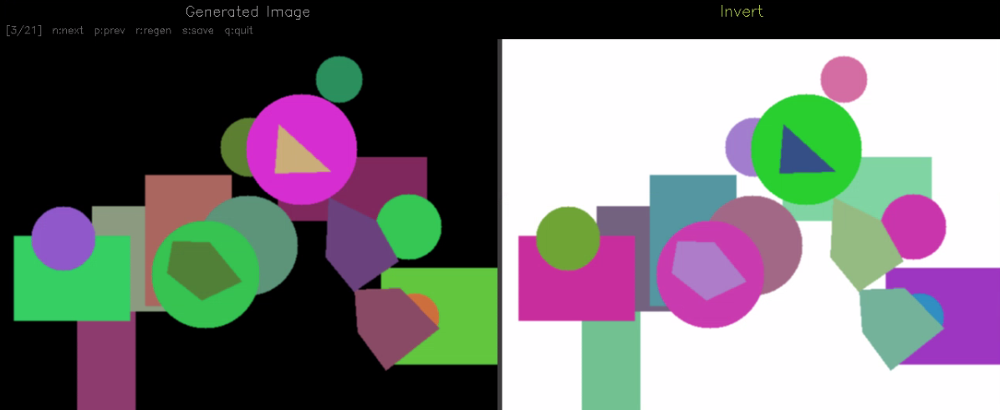

> [!Note]
> `cv2.calcHist()` 함수를 이용하여 각 채널 히스토그램을 계산하고, 이를 그래프로 그리세요.


**실습 : 이미지 필터링**

이미지 필터링은 이미지의 **각 픽셀 주변값들을 수학적으로 연산하여 새로운 픽셀값을 만드는 기법**입니다. 블러, 샤프닝, 엠보싱 등의 필터가 있습니다. 임의의 이미지를 생성해서 필터링을 적용하겠습니다. 좌측에는 필터링 이전 이미지, 우측에는 필터링 적용 이미지가 표시되도록 구성되어 한눈에 비교할 수 있습니다. `n`/`p`를 누르면 각각 다음 필터/이전 필터를 확인할 수 있습니다. `q`를 누르면 종료됩니다.

대부분의 필터에는 '커널(Kernel)'이라고 불리는 작은 행렬을 이미지 위에 슬라이딩하여 적용합니다. 커널의 각 값과 대응하는 픽셀값을 곱한 뒤 합산하여 새 픽셀값을 만드는 연산을 컨볼루션이라고 합니다.


|필터링|설명|
|-----|---|
|Gaussian Blur|부드러운 블러|
|Median Blur|극단적인 이상값(노이즈 픽셀) 제거|
|Bilateral Filter|경계선은 유지하며 노이즈만 제거|
|Sharpen|이미지를 선명하게 만드는 커널|
|Emboss|빛이 한 방향에서 비추는 것처럼 이미지에 입체감 부여|
|Laplacian Edge|방향에 무관하게 모든 엣지 검출|

```py
import cv2
import numpy as np

def make_image():
    img = np.zeros((480, 640, 3), dtype=np.uint8)
    img[100:380, 80:560] = (40, 40, 60)
    cv2.circle(img, (200, 240), 80, (50, 120, 200), -1)
    cv2.circle(img, (420, 200), 60, (200, 80, 50), -1)
    cv2.rectangle(img, (300, 280), (500, 400), (60, 180, 100), -1)
    img = cv2.add(img, np.random.randint(0, 40, img.shape, dtype=np.uint8))
    return img

img = make_image()

filters = [
    ("Gaussian Blur",  lambda i: cv2.GaussianBlur(i, (15, 15), 0)),
    ("Median Blur",    lambda i: cv2.medianBlur(i, 7)),
    ("Bilateral",      lambda i: cv2.bilateralFilter(i, 9, 75, 75)),
    ("Sharpen",        lambda i: cv2.filter2D(i, -1, np.array([[-1,-1,-1],[-1,9,-1],[-1,-1,-1]]))),
    ("Emboss",         lambda i: cv2.filter2D(i, -1, np.array([[-2,-1,0],[-1,1,1],[0,1,2]]))),
    ("Laplacian Edge", lambda i: cv2.cvtColor(cv2.convertScaleAbs(
                           cv2.Laplacian(cv2.cvtColor(i, cv2.COLOR_BGR2GRAY), cv2.CV_64F)),
                           cv2.COLOR_GRAY2BGR)),
]

idx = 0
while True:
    label, fn = filters[idx]
    result = fn(img)
    divider = np.full((img.shape[0], 8, 3), 40, dtype=np.uint8)
    view = np.hstack([img, divider, result])
    cv2.putText(view, label, (img.shape[1] + 18, 32),
                cv2.FONT_HERSHEY_SIMPLEX, 0.9, (0, 220, 180), 2)
    cv2.imshow("Filtering", view)

    key = cv2.waitKey(0) & 0xFF
    if key == ord('q'): break
    elif key == ord('n'): idx = (idx + 1) % len(filters)
    elif key == ord('p'): idx = (idx - 1) % len(filters)

cv2.destroyAllWindows()
```

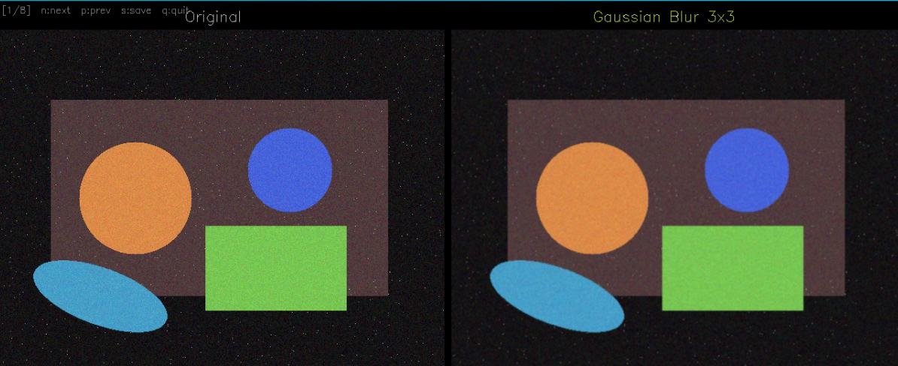
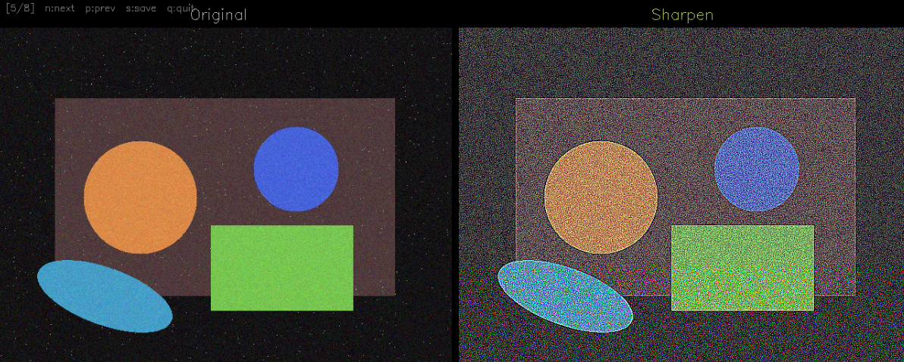

> [!Note]
> 컬러 이미지를 연필 스케치처럼 보이게 변환해보세요. 그레이스케일 변환 → 반전 → GaussianBlur → Dodge 블렌딩 공식 적용 순서로 구현해보세요.

**실습 : 템플릿 매칭**

템플릿 매칭은 **큰 이미지 안에서 작은 이미지와 가장 유사한 위치를 찾는 기법**입니다. 템플릿을 씬 위에 슬라이딩하여 유사도를 계산하고 유사도가 가장 높은 위치를 결과로 반환합니다. 임의의 이미지를 생성하여 해당 이미지 안에서 특정 패턴의 위치를 찾습니다. `q`키는 종료입니다.

다음 예제는 파란색 사각형 패턴이 3곳에 배치된 씬 이미지에서 템플릿(패턴 하나)을 찾습니다. 3가지 매칭 방식과 단일/멀티 매칭 모드를 전환하며 유사도 히트맵을 확인할 수 있습니다.

`CCOEFF`는 정규화된 상관 계수로 조명 변화와 밝기 차이에 가장 강건하여 안정적인 매칭입니다. `CCORR`은 정규화된 교차상관으로 빠르게 매칭됩니다. `SQDIFF`는 정규화된 제곱차로 오류에 민감합니다.

단일 매칭은 가장 유사한 위치 하나만 찾지만, 멀티 위치는 임계값을 설정해 기준 이상의 모든 위치를 찾을 수 있습니다. 멀티 매칭 시에 같은 객체에 대해 겹치는 사각형이 여러 개 생성될 수 있습니다. 이는 NMS를 통해 겹치는 박스 중 점수가 가장 높은 것만 남기고 나머지를 제거합니다.

임계값이 높으면 정밀 매칭이 되지만 미탐지 위험이 있고 환경 변화가 없는 명확한 패턴에서 주로 사용됩니다. 임계값이 보통(0.7~0.85)이면 균형 잡힌 매칭으로 일반적으로 사용이 권장됩니다. 임계값이 낮으면 과탐지 위험이 있어, 대략적인 위치를 파악할 때 주로 사용됩니다.

```py
import cv2
import numpy as np

def make_scene():
    scene = np.ones((500, 700, 3), dtype=np.uint8) * 245
    for _ in range(12):
        x, y = np.random.randint(20, 680), np.random.randint(20, 480)
        cv2.circle(scene, (x, y), np.random.randint(10, 35),
                   [int(v) for v in np.random.randint(80, 200, 3)], -1)
    for x1, y1, x2, y2 in [(150,130,210,190),(380,260,440,320),(510,80,570,140)]:
        cv2.rectangle(scene, (x1,y1), (x2,y2), (50,80,200), -1)
        mx, my = (x1+x2)//2, (y1+y2)//2
        cv2.line(scene, (mx-10,my), (mx+10,my), (220,220,255), 2)
        cv2.line(scene, (mx,my-10), (mx,my+10), (220,220,255), 2)
    return scene

scene = make_scene()
tmpl  = scene[130:190, 150:210].copy()
th, tw = tmpl.shape[:2]

METHODS = [
    (cv2.TM_CCOEFF_NORMED, "TM_CCOEFF_NORMED"),
    (cv2.TM_CCORR_NORMED,  "TM_CCORR_NORMED"),
    (cv2.TM_SQDIFF_NORMED, "TM_SQDIFF_NORMED"),
]
idx = 0

while True:
    method, label = METHODS[idx]
    res = cv2.matchTemplate(scene, tmpl, method)
    _, _, min_loc, max_loc = cv2.minMaxLoc(res)
    loc = min_loc if method == cv2.TM_SQDIFF_NORMED else max_loc

    vis = scene.copy()
    cv2.rectangle(vis, loc, (loc[0]+tw, loc[1]+th), (0, 220, 80), 2)

    divider = np.full((scene.shape[0], 8, 3), 40, dtype=np.uint8)
    score_map = cv2.applyColorMap(
        cv2.resize(cv2.normalize(res, None, 0, 255, cv2.NORM_MINMAX, cv2.CV_8U),
                   (scene.shape[1], scene.shape[0])), cv2.COLORMAP_JET)
    view = np.hstack([vis, divider, score_map])
    cv2.putText(view, label, (scene.shape[1] + 18, 32),
                cv2.FONT_HERSHEY_SIMPLEX, 0.8, (0, 220, 180), 2)
    cv2.imshow("Template Matching", view)

    key = cv2.waitKey(0) & 0xFF
    if key == ord('q'): break
    elif key == ord('n'): idx = (idx + 1) % len(METHODS)
    elif key == ord('p'): idx = (idx - 1) % len(METHODS)

cv2.destroyAllWindows()
```

> [!Note]
> 서로 다른 색상의 원, 사각형, 삼각형을 씬에 배치한 후, 도형을 별도 템플릿으로 만들어 동시에 탐지하고 종류별로 다른 색상 박스로 표시해보세요.

**자주 사용하는 공통 함수**

이미지 입출력
|함수/파라미터|설명|주요 값/범위|
|----------|--|----------|
|cv2.imread(path, flag)|이미지 파일 읽기|flag: IMREAD_COLOR, IMREAD_GRAYSCALE|
|cv2.imwrite(path, img)|이미지 파일 저장|jpg, png, bmp 등 지원|
|cv2.imshow(title, img)|윈도우에 이미지 표시|imshow 후 waitKey 필수|
|cv2.waitKey(delay)|키 입력 대기|0=무한대기, n=n밀리초 대기|

함수 변환
|함수/파라미터|설명|주요 값/범위|
|----------|--|----------|
|cv2.resize(img, dsize)|이미지 크기 변경|dsize=(너비, 높이) 튜플|
|cv2.flip(img, flipCode)|이미지 반전|0=상하, 1=좌우, -1=둘 다|
|cv2.rotate(img, code)|이미지 회전|ROTATE_90_CLOCKWISE 등|
|cv2.cvtColor(img, code)|색상 공간 변환|COLOR_BGR2GRAY 등|

----

## 복습 퀴즈

1. VLA는 무엇의 약자이며, 어떤 역할을 하는지 쓰시오.

<br>

2. OpenCV는 어떤 분야에 사용되는 라이브러리인지 설명하시오.

<br>

3. `cv2.rectangle()`에서 두께 값을 -1로 지정하면 어떤 결과가 나오는지 설명하시오.

<br>

4. cv2.imshow()로 이미지를 표시한 뒤 cv2.waitKey()를 함께 사용하는 이유를 설명하시오.

<br>

5. 이미지 필터링에서 커널과 컨볼루션이 무엇인지 설명하시오.
