# ROS2

## ROS2란?


ROS2 (The Robot Operating System 2)는 **로봇 애플리케이션 개발을 위한 소프트웨어 라이브러리 및 도구 모음**입니다. ROS2는 특정 운영체제 위에서만 종속되지 않고 Linux, Windows, macOS 등에서 사용할 수 있습니다. 적절한 시스템 구성과 QoS 설정을 통해 실시간 제어에 가까운 동작을 지원할 수 있습니다. 이 외에도 ROS2는 아래와 같은 특징을 가지고 있습니다.

- **다양한 플랫폼** : ROS2는 Linux를 중심으로 Windows, macOS도 지원합니다. 따라서 다양한 개발 환경에서 로보틱스 개발을 진행할 수 있습니다.
- **데이터 분산 시스템 (DDS)** : DDS(Data Distribution Service)란 비영리 단체 OMG에 의해 표준화된 통신 프로토콜로, 데이터 중심 publish/subscribe 통신을 위한 표준 미들웨어 기술입니다. 이는 ROS2에서는 DDS를 통해 노드들이 네트워크상에서 데이터를 발견하고 주고 받습니다.
- **실시간 프로그래밍** : DDS/RTPS 기반 통신과 QoS 설정을 통해 지연 시간, 신뢰성, 데이터 전달 방식을 조절할 수 있습니다.
- **다양한 프로그래밍 언어 지원** : ROS2에서는 주로 C++과 Python을 사용합니다. 본 교재에서는 Python을 사용합니다.

본 교재는 원활한 6축 매니퓰레이터 제어 학습을 위한 기초적인 ROS2 내용만 담았습니다. ROS2에 대한 더 자세한 내용은 아래 홈페이지를 참고하시기 바랍니다.

- https://ros.org/
- https://www.omg.org/omg-dds-portal/
- https://docs.ros.org/en/humble/index.html

### ROS2 배포판

ROS2는 다양한 버전의 배포판이 존재합니다. 출시 시기 및 종류에 따라 배포판은 유지되는 기간이 다르며 지원이 중단된 버전도 있습니다. 배포판마다 지원 여부 및 유지 보수 기간은 출시될 때 공표됩니다. 작성일 기준 유지중인 주요 ROS2 배포판은 Humble, Jazzy, Kilted, Lyrical이며, Rolling Ridley는 rolling 개발 배포판입니다. Humble과 Jazzy는 LTS 배포판이며, kilted는 non-LTS 배포판입니다.

지능형 로봇 제어기 및 교재에서는 ROS2 Humble 배포판을 사용합니다. 해당 배포판을 사용하는 이유는 장비에 설치된 JetPack 6이 Ubuntu 22.04 버전 기반이며, JetPack 6이 Ubuntu 22.04 기반이며, ROS2 Humble이 Ubuntu 22.04를 공식 지원하기 때문입니다.


배포판에 대한 자세한 정보는 아래 링크를 참고하시기 바랍니다.

- https://docs.ros.org/en/humble/Releases.html

### 유의사항

본 장비의 ROS2는 소스에서 빌드되어 있으며, install 공간에는 심볼릭 링크가 포함되어 있습니다. 이에 워크스페이스 경로나 install 디렉터리의 심볼릭 링크를 임의로 변경하면 설치된 ROS2가 제대로 동작하지 않을 수 있습니다. 아래 경로에 위치한 ROS2 소스들은 **반드시 이동시키지 마시기** 바랍니다.

- /home/soda/ros2_base : ROS2 Humble 소스 빌드 workspace

## 실습 : Hello, ROS2!

본 챕터에서는 ROS2를 사용하여 프로그래밍을 시작하고 실행하는 방법에 대해서 알아보겠습니다.

ROS2는 로봇 소프트웨어 개발을 위한 라이브러리 모음으로서, 셸에서 이를 사용하려면 먼저 관련 환경을 불러오는 명령을 실행해야 합니다. 아래 명령어를 실행하여 주시기 바랍니다.

```sh
source ~/ros2_base/install/setup.bash
```

위 명령어를 실행한 뒤 ros2 명령을 사용할 수 있습니다.

### Package

ROS2에서 패키지란 **ROS2 코드의 기본 구성 단위**입니다. ROS2 패키지는 소스 코드뿐만 아니라 빌드 정보도 함께 포함되어 있습니다. 이런 기본 구성 단위는 다른 사람에게 코드를 공유하거나 워크스페이스 내 기능 단위를 명확하게 구분하는 데 도움이 됩니다.

먼저 작업할 ROS2 워크스페이스를 생성한 뒤, `ros2 pkg` 명령어를 통해 패키지를 생성합니다. `--build-type`은 패키지 빌드 옵션을 의미하며, 파이썬 코드를 작성할 경우 `ament_python` 옵션을 사용합니다.

아래 명령어로 워크스페이스 및 패키지를 생성합니다.

```sh
mkdir -p ~/ros_ws/src
cd ~/ros_ws/src
ros2 pkg create --build-type ament_python hello_ros
```

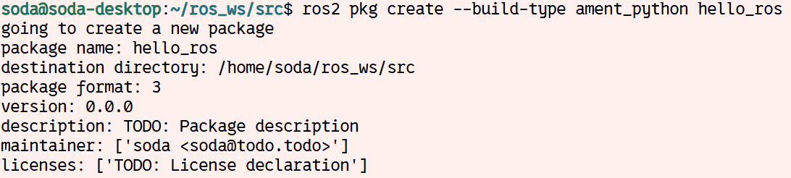
<br><br>

패키지 디렉터리 내용을 확인하면 아래 사진과 같이 표시됩니다. 각 파일 및 경로에 대한 설명은 아래와 같습니다.

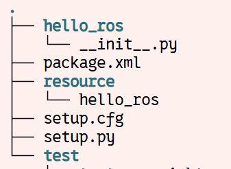

- `package.xml` : 패키지에 대한 메타 정보가 담긴 파일
- `resource/<package_name>` : ament resource index에 패키지를 등록하기 위한 마커 파일
- `setup.cfg` : Python 패키지 설치 옵션과 스크립트 설치 경로를 설정하는 파일
- `setup.py` : 패키지 설치 내용에 대한 정보가 담긴 파일
- `<package_name>/` : 실제 소스코드가 들어갈 경로. `__init__.py`가 반드시 들어가 있음.

### Node

Node는 ROS2에서 기능을 수행하고 통신에 참여하는 **기본 실행 단위**입니다. 파이썬으로 노드를 만드는 최소 코드는 아래와 같습니다.

```python
import rclpy
from rclpy.node import Node

class Testnode(Node):
    def __init__(self):
        super().__init__('test_node')
    
def main(args=None):
    rclpy.init(args=args)

    node = Testnode()

    rclpy.spin(node)
    
    node.destroy_node()
    rclpy.shutdown()

if __name__ == "__main__":
    main()
```

`rclpy`는 Python에서 ROS2 노드를 작성하기 위한 클라이언트 라이브러리입니다. 노드를 생성하거나 다른 노드들과 통신, 혹은 ROS2에 동작 중인 노드 생성, 토픽/서비스/액션 통신, 타이머, 파라미터 등을 사용할 수 있게 합니다.

`main` 함수 안에서 `rclpy.init()` 메서드를 통해 ROS 통신을 초기화하고 Node 클래스 객체를 생성합니다. 생성된 객체는 ROS 노드로 별도의 종료 명령이 있기 전까지 계속 실행됩니다. 정상 종료 시에는 destroy_node()로 노드를 정리하고 rclpy.shutdown()으로 ROS2 통신을 종료합니다.

### Communication

ROS2에서 노드 간의 통신은 여러 가지 방식으로 할 수 있습니다. 
 
| 종류        | 용도           | 통신 방식                            | 예시                          |
| --------- | ------------ | -------------------------------- | --------------------------- |
| Topic     | 계속 흐르는 데이터   | 비동기, publish/subscribe           | 카메라 이미지, joint_states, 센서값  |
| Service   | 요청하면 한 번 응답  | 동기적 request/response             | 로봇 초기화, 그리퍼 열기/닫기, 상태 확인    |
| Action    | 오래 걸리는 작업 명령 | 목표 전송 + 진행률 + 결과                 | 경로 이동, pick-and-place, 팔 이동 |
| Parameter | 노드 설정값 관리    | 노드 내부 설정 변경                      | 속도, 토픽 이름, threshold        |
| TF        | 좌표계 관계 관리    | frame transform broadcast/listen | base_link → camera_link     |
| Bag       | 토픽 데이터 저장/재생 | 기록/리플레이                          | 실험 데이터 저장, 학습 데이터 수집        |

**Topic**

토픽의 핵심은 계속 흘러가는 데이터 스트림입니다. 예를 들어 로봇 관절값은 계속 바뀌므로 토픽이 적절합니다. 토픽에 대한 자세한 설명은 아래에서 이어가도록 하겠습니다.

**Service**

Service는 요청을 보내면 응답을 받는 구조입니다. 토픽처럼 계속 흐르는 데이터가 아니라 필요할 때 한번 호출합니다. 서비스는 짧고 즉시 끝나는 작업에 적합합니다.

**Action**

Action은 service와 비슷하지만 오래 걸리는 작업에 쓰입니다. Service는 요청 후 응답이 올 때까지 기다리는 느낌이라서 오래 걸리는 작업에 사용하기 애매합니다. 하지만 action은 오래 걸리고 진행률이 필요한 명령에 적합합니다.

**Parameter**

Parameter는 노드 안에서 사용하는 설정값입니다. 코드에 하드코딩을 하면 매번 파일을 수정해야 합니다. 하지만 parameter로 분리하면 실행 시 값을 바꿀 수 있습니다. 코드에서 바뀔 가능성이 있는 값은 parameter로 빼면 좋은 구조가 됩니다.

**TF**

TF는 ROS2에서 좌표계 간 변환 관계를 정리하는 중요한 시스템입니다. 좌표계 관계를 관리하는 시스템으로 [4-1. Robot Modeling](/Chapter04.%20Robot%20Modeling/4-1.%20Robot%20Modeling.md#TF)에서 자세히 설명하겠습니다.

**Rosbag**

Rosbag은 ROS2 데이터를 저장하고 다시 재생하는 기능입니다. 

### Topic

토픽은 **ROS에서 노드 간 통신**에 널리 쓰이는 방식입니다. 토픽은 노드 간의 publish/subscribe 기반의 비동기 통신 방식입니다. 토픽을 게시하는 노드는 발행자라 칭하며, 게시되어 있는 토픽을 수신하는 노드는 구독자라고 합니다. 게시된 토픽은 여러 개의 노드에서 수신이 가능하며 한 개의 노드에서 여러 개의 토픽을 게시할 수도 있습니다. 노드끼리 1:N, N:1, N:N 통신이 가능하다는 것입니다. 또한 연속적으로 여러 개의 토픽을 송신할 수도 있습니다. 따라서 토픽은 주기적으로 데이터를 확인해야 하는 센서 데이터를 확인하는 경우에 적합합니다.

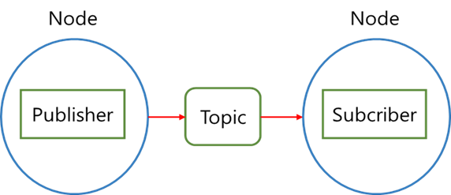

<br>


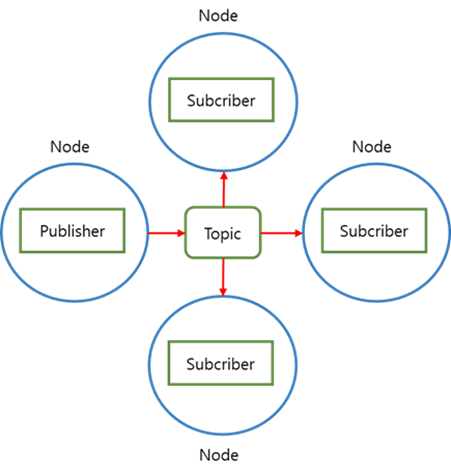

<br>

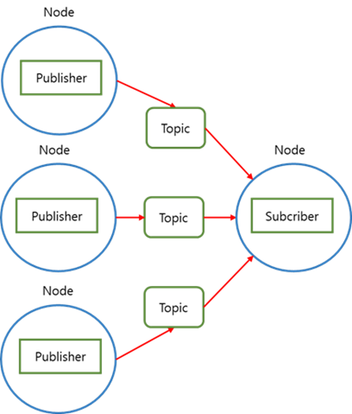

<br>

토픽을 발행만 하는 노드를 작성해 보겠습니다. 패키지 내 `hello_ros/` 경로 아래에 `talker.py` 파일을 생성해서 아래 코드를 작성합니다.

```python
# hello_ros/talker.py

import rclpy
from rclpy.node import Node

from std_msgs.msg import String


class Talker(Node):

    def __init__(self):
        super().__init__('talker')
        self.publisher = self.create_publisher(String, 'hello', 10)
        timer_period = 0.5  
        self.timer = self.create_timer(timer_period, self.timer_callback)
        self.i = 0

    def timer_callback(self):
        msg = String()
        msg.data = 'Hello World: %d' % self.i
        self.publisher.publish(msg)
        self.get_logger().info('Publishing: "%s"' % msg.data)
        self.i += 1


def main(args=None):
    rclpy.init(args=args)

    talker = Talker()

    rclpy.spin(talker)

    talker.destroy_node()
    rclpy.shutdown()


if __name__ == '__main__':
    main()
```

`rclpy` 모듈의 노드 클래스는 토픽 publisher를 생성하는 create_publisher() 메서드를 제공합니다. 이 함수는 토픽 메시지 타입, 토픽 명, QoS를 매개변수로 입력합니다.

또한, `create_timer()` 함수를 통해 특정 주기마다 자동으로 콜백 함수를 실행하는 타이머 함수를 생성할 수 있습니다. 이 함수는 함수 실행 주기, 콜백 함수를 매개변수로 받습니다.

토픽 통신에서는 주고받을 **메시지** 타입을 지정해야 합니다. 현재 작성된 코드와 같이 메시지 타입을 `String`으로 지정할 경우 문자열 데이터를 보내고, `Float32`와 같은 메시지 타입을 지정할 경우 실수형 데이터를 보냅니다. 메시지에 관한 자세한 내용은 후술합니다. `String` 메시지에 아래와 같이 데이터를 넣을 수 있습니다.

```python
msg = String()
msg.data = "hi"
```

이렇게 보낼 메시지를 지정한 뒤, publisher의 `publish()` 함수를 통해 토픽에 발행합니다.

종합적으로, 이 노드는 'hello'라는 이름의 토픽에 0.5초 주기로 메시지를 발행합니다.

<br><br>

다음으로 토픽을 구독하는 노드를 작성해 보겠습니다. 패키지 내 `hello_ros/` 경로 아래에 `listener.py` 파일을 생성해서 아래 코드를 작성합니다.

```python
# hello_ros/listener.py

import rclpy
from rclpy.node import Node

from std_msgs.msg import String


class Listener(Node):
    def __init__(self):
        super().__init__('listener')
        self.subscription = self.create_subscription(
            String,
            'hello',
            self.listener_callback,
            10)

    def listener_callback(self, msg):
        self.get_logger().info('I heard: "%s"' % msg.data)


def main(args=None):
    rclpy.init(args=args)

    listener = Listener()

    rclpy.spin(listener)

    listener.destroy_node()
    rclpy.shutdown()


if __name__ == '__main__':
    main()
```

`rclpy` 모듈의 노드 클래스는 토픽 subscriber를 생성하는 create_subscription() 메서드를 제공합니다. 이 함수는 토픽 메시지 타입, 토픽 명, 콜백 함수, QoS를 매개변수로 입력합니다.

콜백 함수에선 토픽을 통해 메시지를 받고 지정된 동작을 실행합니다. 콜백 함수의 이름은 임의로 지정할 수 있으며, 메시지를 받을 매개변수만 선언해두면 됩니다.

종합적으로, 이 노드는 'hello'라는 이름의 토픽을 구독하고 메시지를 받는 즉시 로그를 출력하는 로그 출력 노드입니다.

### Run

**패키지 프로그램을 실행하기 전, 빌드를 진행**해야 합니다. 앞서 설명했듯이 패키지 안에는 빌드를 위한 정보를 담은 파일이 있습니다. 그중, 실행 파일의 진입 경로를 지정해 주기 위해 `setup.py` 파일을 아래와 같이 수정합니다.

```python
...
    license='TODO: License declaration',
    extras_require={
        'test': [
            'pytest',
        ],
    },
    entry_points={
        'console_scripts': [
            "listener = hello_ros.listener:main",
            "talker = hello_ros.talker:main"
        ],
    },
...
```

패키지를 빌드할 모든 준비가 끝났습니다. 아래 명령어를 입력하여 상위 디렉터리로 돌아간 뒤, 빌드를 진행해 주시기 바랍니다.

```sh
cd ~/ros_ws
colcon build --symlink-install --packages-select hello_ros
source ./install/setup.bash
```

실행 명령어 뒤에 두 터미널에서 각각 노드를 실행하면 두 노드가 서로 통신하는 모습을 확인할 수 있습니다. 만약 여기서 talker 노드를 종료할 경우 터미널에 값이 출력되지 않습니다.

```sh
# Terminal 1
ros2 run hello_ros talker
```

```sh
# Terminal 2
ros2 run hello_ros listener
```

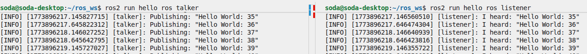


## Launch

ROS2에서 하나의 노드를 실행할 때에는 `ros2 run` 명령어를 사용합니다. 하지만 ROS2를 활용하다 보면 하나의 노드보다는 복수의 노드를 함께 사용하는 경우가 많이 발생합니다. 각각의 노드를 하나씩 실행하여 실험을 할 수도 있지만 여러 개의 노드를 매번 실행해야 하는 번거로움이 있습니다. 

이러한 상황에서 ROS2에서 제공하는 launch 명령을 활용하면 좀 더 쉽게 **다수의 노드를 실행**할 수 있습니다. launch 명령은 미리 작성되어 있는 파일의 정보를 통해 여러 개의 노드를 한 번에 실행해 줍니다. launch 파일은 파이썬, XML, YAML 방식으로 작성이 가능합니다. 언급한 방식으로만 작성해야 하는 것은 아니며, 사용자가 원하는 방식을 선택하여 작성하면 됩니다. 여기서는 파이썬 방식으로 launch 파일을 작성하는 방법에 대해 실습해 보도록 하겠습니다. 

파이썬 방식의 launch는 명령을 통해 실행될 때 가장 먼저 `generate_launch_description()` 함수를 호출합니다. 이 함수는 미리 정의되어 있는 메서드는 아니며 사용자가 직접 정의합니다. 이 함수를 작성할 때 유의해야 하는 점이 있는데 이는 함수가 반환하는 내용이 `LaunchDescription` 객체를 반환해야 합니다. `LaunchDescription` 클래스의 인자로는 실행할 노드의 정보를 입력합니다. 입력하는 노드의 정보를 정리해 보면 다음과 같습니다.

- package : 실행할 패키지의 이름
- executable : 실행할 노드의 이름
- name : executable을 통해 실행한 노드가 사용할 이름
- parameters : 노드를 실행할 때 전달할 매개 변수 
- remappings : 토픽의 이름 변경

launch 파일의 기본 형태는 다음과 같습니다. 아래 예시는 노드가 한 개인 형태입니다. 여러 개의 노드를 더 실행하고 싶다면 Node() 부분을 추가로 작성하면 됩니다.

```python
from launch import LaunchDescription
from launch_ros.actions import Node

def generate_launch_description():
   return LaunchDescription([
        Node(
	        package='turtlesim',
            executable='turtlesim_node',
            name='sim'
        )
   ])
```

### 실습 : launch를 사용해 turtlesim 노드 실행

turtlesim이란 ROS2에서 기본으로 제공하는 튜토리얼 패키지입니다. 터미널을 연 다음, 아래 명령어를 입력하여 turtlesim 기본 화면을 출력합니다.

```sh
source ~/ros2_base/install/setup.bash
ros2 run turtlesim turtlesim_node
```

해당 노드를 계속 실행한 상태에서 다른 터미널을 실행한 다음, 아래 명령어를 입력해 키보드 입력 프로그램을 실행합니다.

```sh
source ~/ros2_base/install/setup.bash
ros2 run turtlesim turtle_teleop_key
```

해당 노드를 실행한 터미널에 화살표 방향 키를 입력하여 첫 번째 터미널에서 실행하였던 Turtlesim 프로그램 안의 거북이가 움직이는 것을 확인합니다.

이렇게 하나의 목적을 달성하기 위해 두 개의 노드를 각각 다른 터미널에서 실행해 보았습니다. 하지만 이 경우에는 노드마다 별도의 터미널을 열어 실행해야 하므로, 실행시켜야 할 노드의 개수가 많아질수록 실행시켜야 할 터미널의 개수가 더 많아질 것입니다. 또한, 동시에 실행하기에 매우 번거로울 것입니다.

이 실행 방식을 개선하기 위해 launch를 도입합니다. `~/physicai_arm_ws/src/` 폴더 아래에 `turtlesim_ex_launch.py` 파일을 생성한 뒤, 아래 내용을 기입합니다.

```python
from launch_ros.actions import Node
from launch import LaunchDescription

def generate_launch_description():
    return LaunchDescription([
        Node(
            package='turtlesim',
            executable='turtlesim_node',
            name='sim'
        ),
        Node(
            package='turtlesim',
            executable='turtle_teleop_key',
            name='teleop',
            prefix="xterm -e"
        )
    ])
```

이후, 터미널을 연 뒤 아래 명령어를 실행합니다.

```sh
cd ~/physicai_arm_ws/src
ros2 launch turtlesim_ex_launch.py
```

두 노드가 동시에 실행되는 것을 확인합니다.

## Message

Message란 ROS2 인터페이스의 종류 중 하나이며, **토픽에서 주고받는 데이터 형식**입니다. Message는 프로그래밍에서 자료형과 변수 선언과 비슷한 내용이 포함되어 있으며, ROS2에서 기본으로 제공하는 자료형을 기반으로 사용 용도 및 작성자에 따라 다양한 형태를 가지게 됩니다.

앞서 실습하였던 `hello_ros` 프로그램을 다시 살펴봅니다. 노드를 작성했던 파이썬 프로그램 중 메시지 선언 및 데이터를 담는 구문은 다음과 같았습니다. `std_msgs`는 ROS2에서 기본적으로 제공하는 메시지를 담는 파이썬 모듈입니다. 

```python
from std_msgs.msg import String
...
msg = String()
msg.data = "Hello World!"
```

`hello_ros` 패키지에서 발행하였던 노드는 `String` 메시지를 사용하여 통신한다고 정의되어 있었습니다. 여기서 만약, 같은 토픽 이름을 사용하더라도 메시지 타입이 다르면 publish와 subscriber가 연결되지 않거나, 코드에서 잘못된 데이터 타입을 publish할 때 오류가 발생할 수 있습니다.

**실습 : 카메라 토픽 시각화**

이전 장에서 배운 OpenCV의 개념과 이번 장에서 배운 토픽, 노드 개념을 활용하여 실습을 진행하겠습니다. 시각화 노드를 작성하고, 카메라 노드에서 발행된 토픽을 구독하는 예제입니다.

```sh
cd ~/physicai_arm_ws/src
ros2 pkg create --build-type ament_python physicai_arm_v2
```

`~/physicai_arm_ws/src/physicai_arm_v2/physicai_arm_v2` 경로 안에 `image_viewer_node.py`라는 이름의 파일을 생성합니다. 이 파일에는 카메라 노드가 발행하는 Image 메시지를 구독하고, cv_bridge로 OpenCV 이미지 형식을 변환합니다. 이 코드는 front 카메라를 기준으로 작성되었습니다. 파일 경로는 아래와 같습니다.

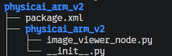


<br>

```python
import rclpy
from rclpy.node import Node
from sensor_msgs.msg import Image
from cv_bridge import CvBridge
import cv2
import os

class ImageViewerNode(Node):
    def __init__(self):
        super().__init__("image_viewer_node")

        self.declare_parameter("camera_name", "front")
        self.camera_name = self.get_parameter("camera_name").value
        self.topic_name = f"/arm/{self.camera_name}_cam"

        self.bridge = CvBridge()

        self.subscription = self.create_subscription(
            Image,
            self.topic_name,
            self.image_callback,
            10
        )

        self.get_logger().info(f"Subscribed to: {self.topic_name}")

    def image_callback(self, msg):
        try:
            img = self.bridge.imgmsg_to_cv2(msg, desired_encoding="bgr8")
            cv2.imshow(f"{self.camera_name}_cam_view", img)
            cv2.waitKey(1)
        except Exception as e:
            self.get_logger().error(f"Failed to display image: {e}")

    def destroy_node(self):
        cv2.destroyAllWindows()
        return super().destroy_node()


def main(args=None):
    rclpy.init(args=args)
    node = ImageViewerNode()

    try:
        rclpy.spin(node)
    except KeyboardInterrupt:
        pass

    node.destroy_node()
    rclpy.shutdown()


if __name__ == "__main__":
    main()
```

작성한 노드 파일을 저장한 뒤 `setup.py` 파일을 수정합니다. 새로운 노드를 추가할 때마다 `setup.py` 파일에 추가한 노드를 등록해야 합니다. `entry_points`의 `console_scripts` 안에 노드명과 파일명을 아래와 같이 적으면 됩니다.

```python
...
    entry_points={
        'console_scripts': [
            'image_viewer_node=physicai_arm_v2.image_viewer_node:main'
        ],
    },
...
```

파일 수정이 끝나면 패키지 빌드를 진행합니다.

```sh
cd ~/physicai_arm_ws
colcon build --symlink-install --packages-select physicai_arm_v2
```

노드 파일을 실행하기 전, 앞서 실행했던 bringup 런치 파일은 다른 터미널에서 계속 실행 중이어야 합니다. 새로운 패키지를 빌드한 후, 새 터미널에서 워크스페이스 환경을 source한 뒤 아래 명령어를 실행합니다.

```sh
ros2 run physicai_arm_v2 image_viewer_node
```

두 노드를 실행하면 화면에 카메라 이미지가 실시간으로 출력되는 것을 확인할 수 있습니다.

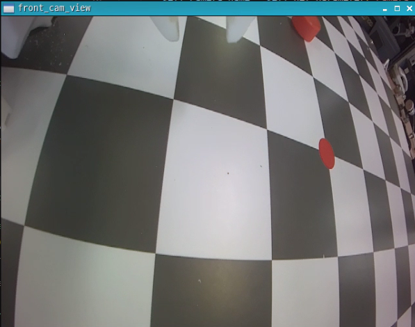

## 실습 : 토픽 overlay 예제

이번에는 camera 토픽과 `/ee_pose` 토픽을 구독해 해당 정보를 이미지에 표시하는 예제를 실습합니다.


```py
import rclpy
from rclpy.node import Node
from sensor_msgs.msg import Image
from geometry_msgs.msg import PoseStamped
from cv_bridge import CvBridge

import cv2
import numpy as np


class CameraOverlayNode(Node):
    def __init__(self):
        super().__init__("camera2_node")

        self.declare_parameter("camera_name", "top")
        self.camera_name = self.get_parameter("camera_name").value

        self.bridge = CvBridge()
        self.latest_ee_pose = None

        self.create_subscription(Image, f"/arm/{self.camera_name}_cam", self.image_callback, 10)
        self.create_subscription(PoseStamped, "/ee_pose", self.ee_pose_callback, 10)

        self.publisher = self.create_publisher(Image, f"/{self.camera_name}_cam_overlay", 10)

        self.get_logger().info(f"Node started: {self.get_name()}")

    def ee_pose_callback(self, msg: PoseStamped):
        self.latest_ee_pose = msg

    def overlay_ee_pose(self, frame):
        if self.latest_ee_pose is None:
            p_vals = [0.0, 0.0, 0.0]
            q_vals = [0.0, 0.0, 0.0, 1.0]
        else:
            p = self.latest_ee_pose.pose.position
            q = self.latest_ee_pose.pose.orientation
            p_vals = [p.x, p.y, p.z]
            q_vals = [q.x, q.y, q.z, q.w]

        lines = [
            "EE Position",
            f"  x: {p_vals[0]:.4f}",
            f"  y: {p_vals[1]:.4f}",
            f"  z: {p_vals[2]:.4f}",
            "EE Orientation",
            f"  qx: {q_vals[0]:.4f}",
            f"  qy: {q_vals[1]:.4f}",
            f"  qz: {q_vals[2]:.4f}",
            f"  qw: {q_vals[3]:.4f}",
        ]

        font = cv2.FONT_HERSHEY_SIMPLEX
        font_scale = 0.3
        thickness = 1
        x0, y0 = 10, 24
        line_height = 11
        color = (0, 255, 0)
        shadow = (0, 0, 0)

        result = frame.copy()
        for i, line in enumerate(lines):
            y = y0 + i * line_height
            cv2.putText(result, line, (x0 + 1, y + 1), font, font_scale, shadow, thickness + 2)
            cv2.putText(result, line, (x0, y), font, font_scale, color, thickness)

        return result

    def image_callback(self, msg: Image):
        frame = self.bridge.imgmsg_to_cv2(msg, "bgr8")
        overlaid = self.overlay_ee_pose(frame)
        display = cv2.resize(overlaid, (1280, 960))
        cv2.imshow("Overlay View", display)
        cv2.waitKey(1)
        self.publisher.publish(self.bridge.cv2_to_imgmsg(overlaid, "bgr8"))

    def destroy_node(self):
        cv2.destroyAllWindows()
        return super().destroy_node()

def main(args=None):
    rclpy.init(args=args)
    node = CameraOverlayNode()

    try:
        rclpy.spin(node)
    except KeyboardInterrupt:
        pass
    finally:
        node.destroy_node()
        rclpy.shutdown()


if __name__ == "__main__":
    main()
```

해당 노드는 원래 있던 camera 노드에서 발행된 카메라 이미지를 구독해서 가져옵니다. 그리고 /ee_pose 토픽을 구독하여 이미지에 ee_pose값을 오버레이합니다. 오버레이된 이미지를 새 토픽으로 발행하고, OpenCV 창에도 표시합니다.

ee_pose는 순기구학에서 연산되므로 fk_calc노드도 실행시켜야 값이 정상적으로 발행됩니다.

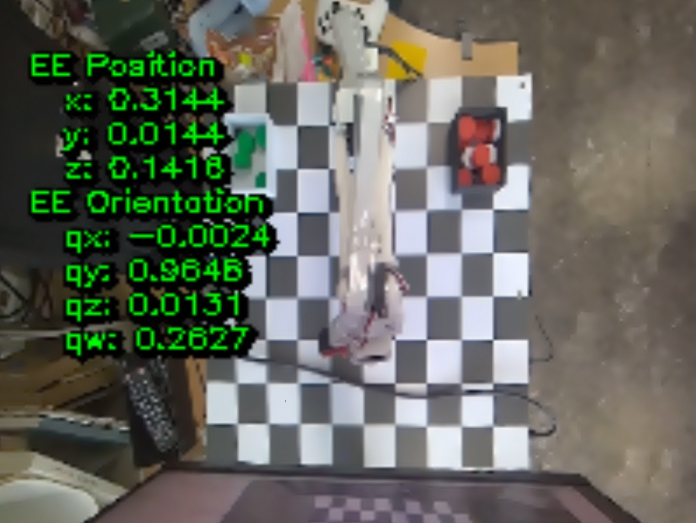


## 토픽과 노드 확인

명령어를 통해 현재 발행되고 있는 토픽 및 실행중인 노드 리스트를 확인할 수 있습니다. 또한 해당 토픽을 어떤 노드가 발행하고 구독중인지와 노드가 발행하거나 구독중인 토픽을 확인할 수 있습니다.

1. 토픽 리스트

해당 명령어는 현재 발행되고 있는 토픽 목록을 출력합니다.

```sh
ros2 topic list
```

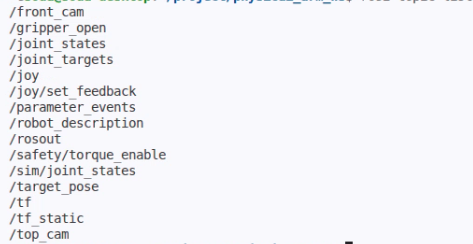

2. 노드 리스트

해당 명령어는 현재 실행되고 있는 노드 목록을 출력합니다.

```sh
ros2 node list
```

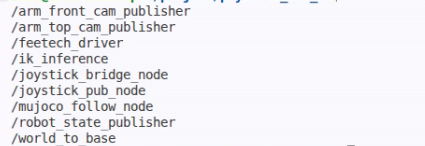

3. 토픽 정보

해당 명령어는 특정 토픽의 정보를 확인할 수 있습니다. 토픽을 발행중인 노드와 구독중인 노드를 출력해줍니다. 뒤에 '-v'를 빼고 입력하면 더 간단하게 출력합니다. 출력 이미지의 하단은 생략되었습니다.

```sh
ros2 topic info <topic> -v
```

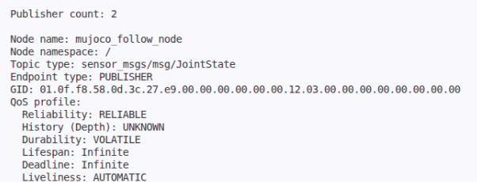

4. 노드 정보

해당 명령어는 특정 노드의 정보를 확인할 수 있습니다. 노드가 발행중인 토픽과 구독하고 있는 토픽을 출력해줍니다. 위와 마찬가지로 출력 이미지 하단은 생략되었습니다.

```sh
ros2 node info <node>
```

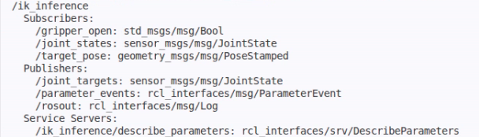


---

## 복습 퀴즈

1. ROS2는 어떤 목적을 가진 소프트웨어 도구 모음인가?

<br>

2. DDS는 ROS2에서 어떤 역할을 하는가?

<br>

3. ROS2에서 노드와 package는 무엇인가?

<br>

4. 아래 함수들의 역할을 작성하시오.<br>
a. rclpy.init()<br>
b. rclpy.spin()<br>
c. rclpy.shutdown()

<br>

5. 토픽 통신은 어떤 방식의 통신인가?

<br>

6. publisher와 subscriber의 차이는 무엇인가?

<br>

7. listener 노드에서 callback 함수는 언제 실행되는가?

<br>

8. setup.py의 console_scripts에 노드를 등록해야 하는 이유는 무엇인가?

<br>

9. colcon build --symlink-install --packages-select hello_ros 명령의 역할은 무엇인가?

<br>

10. ros2 run과 ros2 launch의 차이는 무엇인가?

<br>

11. ROS2 Message는 무엇이며, 토픽에서 왜 메시지 타입이 맞아야 하는가? 맞지 않으면 무슨 문제가 생기는가?
