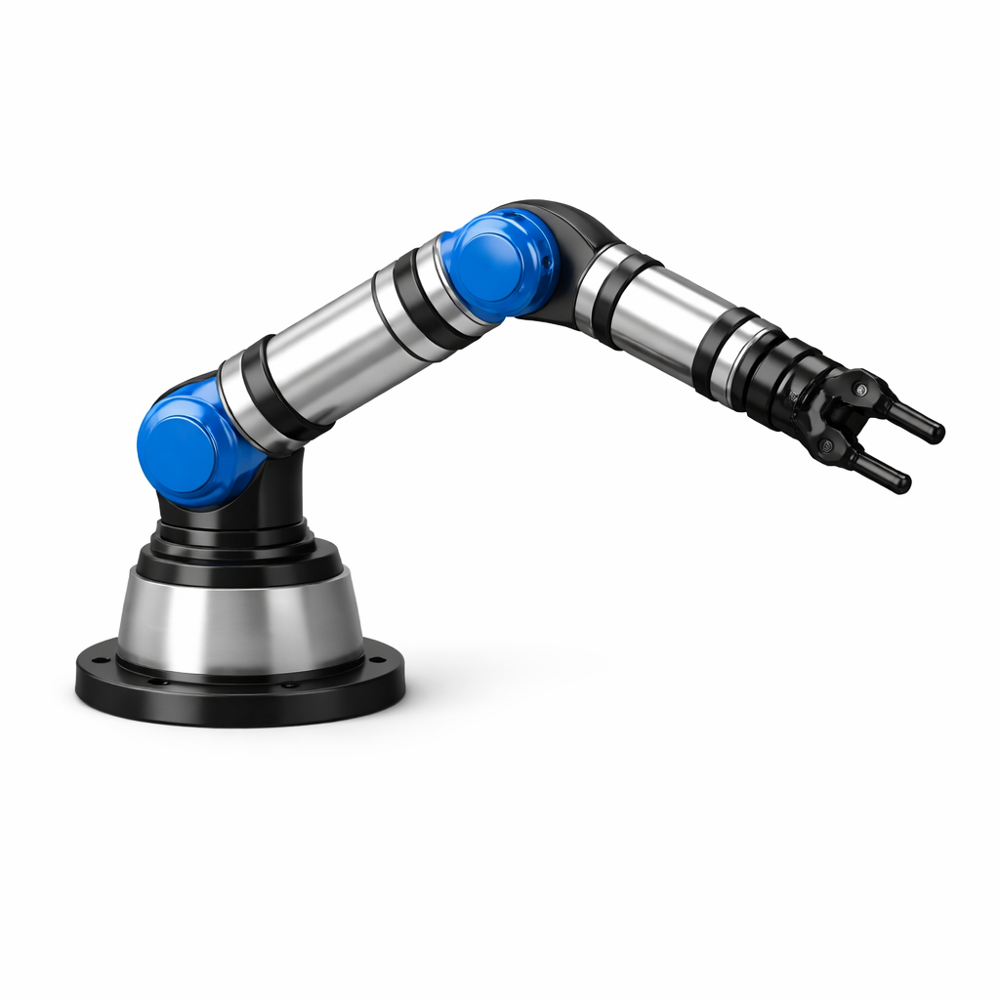
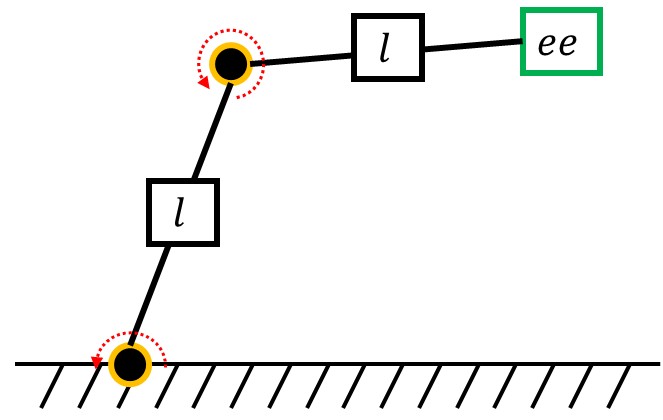
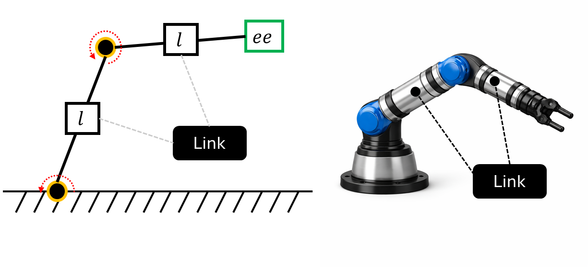
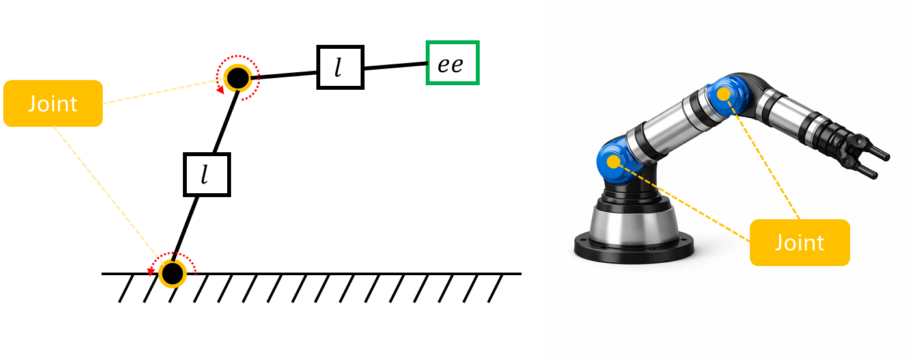
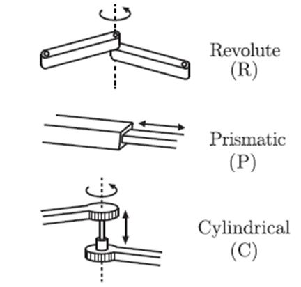
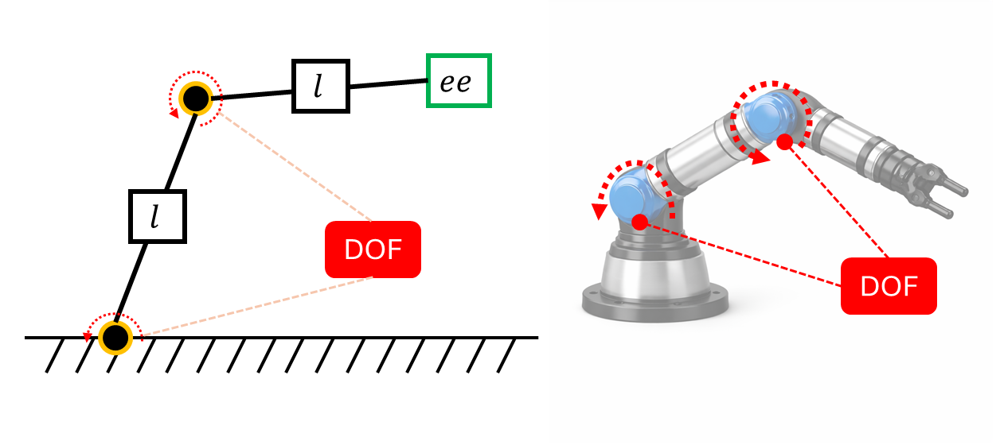
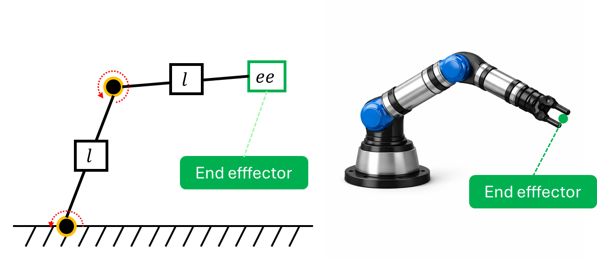

# 로봇공학과 용어들

대부분의 사람들은 물체를 옮기는 상황에서 물체의 위치, 필요한 힘의 크기, 손의 이동 경로 등을 별도로 계산하지 않고 직관적으로 행동합니다. 그러나 로봇은 이러한 직관을 가지지 않습니다. 예를 들어 로봇에게 “탁자 위에 있는 물통을 집어라”라는 명령을 내린다고 가정해 봅시다.

이때 로봇은 다음과 같은 정보를 모두 수치적으로 알아야 합니다.

- 탁자와 물통의 정확한 위치

- 물통을 잡기 위한 손(혹은 집게)의 목표 위치

- 해당 위치에 도달하기 위한 각 관절 변수(회전각 또는 직선 변위)

- 물체를 잡은 이후 이동해야 할 위치

로봇을 제어하려면 행동에 필요한 위치, 자세, 관절값 등을 수치적으로 표현하고 계산해야 합니다.

이 문제를 해결하기 위해 필요한 핵심 개념이 바로 **좌표계(Coordinate System)** 와 **기구학(Kinematics)** 입니다.

좌표계는 로봇과 주변 환경에 존재하는 물체들의 **위치와 자세를 수치적**으로 표현하는 기준을 제공합니다.
기구학은 관절 변수와 로봇의 위치 및 자세 사이의 관계를 **수학적**으로 다루며, 정기구학과 역기구학을 포함합니다.

이 두 개념은 로봇을 제어하는 데 있어 가장 기본이 되는 요소입니다. 또한 PhysicAI Arm을 직접 제어하는 과정뿐만 아니라, 추후 시뮬레이션 및 인공지능 기반 제어에서도 핵심적으로 사용됩니다.

이 장에서는 원활한 실습을 위해 로봇공학의 기초적인 개념만 다룹니다.
이미 관련 내용을 숙지하고 있다면 다음 장으로 넘어가도 무방합니다.

본 장을 이해하기 위해 필요한 선수 지식은 다음과 같습니다.

- 삼각함수
- 선형대수
    - 행렬의 정의 및 연산
    - 역행렬
    - 벡터 및 공간 개념
- Python
  - 기초 문법
  - numpy
  - matplotlib

## 로봇공학 기초 용어

아래 이미지는 매우 간단한 구조의 로봇 매니퓰레이터입니다. 이 이미지를 사용하여 주요 로봇공학 용어를 쉽게 설명합니다.



또한, 이 매니퓰레이터를 도식 형태로 간략하게 표현하면 다음과 같이 나타냅니다.



<br><br>

### 링크(link) 

링크란 로봇을 구성하는 강체(rigid body)를 말하며, 이는 곧 형태가 고정되어 **변하지 않는 몸체** 역할을 합니다. 보통 여러 조인트 사이를 이어 주는 몸체 역할을 합니다. 우리 몸에 비유하자면 팔의 뼈를 생각할 수 있습니다.

링크는 아래 그림과 같이 위치해 있습니다.



### 조인트(joint)

조인트란 두 강체인 링크를 연결하고 그 사이에 **제한된 상대운동이 가능하도록 하는** 기계 요소입니다. 즉, 두 링크 사이의 상대운동을 특정 방식으로 허용하거나 제한하는 역할을 합니다. 우리 몸에 비유하자면 팔의 관절, 혹은 손목을 생각할 수 있습니다.

조인트는 아래 그림과 같이 위치해 있습니다.



조인트에는 여러 종류가 있습니다. 회전 운동을 하는 Revolute Joint, 직선 운동을 하는 Prismatic Joint, 같은 축을 따라 회전 운동과 직선 운동을 모두 허용하는 Cylindrical Joint 등이 있습니다. 그리퍼를 제외한 PhysicAI Arm의 팔 관절은 Revolute Joint로 구성됩니다.



> [!Note]
> 문 경첩, 주사기, 드릴 비트, PhysicAI Arm의 관절 움직임을 각각 관찰하고 해당하는 조인트 종류를 생각해 보세요.


### 자유도(DOF, degree of freedom)

자유도란 기계 시스템의 기구학적 구성(kinematic configuration)을 완전히 정하는 데 필요한 독립적인 운동 변수의 수를 의미합니다. 즉, **로봇의 구성을 결정하는 독립 변수의 개수**입니다.

Revolute Joint의 관절 변수는 회전각 $\theta$이며, 보통 라디안 단위로 표현합니다. 조인트가 얼마나 회전했는지는 라디안으로 표현하는데, 이 각도는 로봇이 회전할 수 있는 범위 안에서는 자유롭게 지정합니다. 단, 조인트의 종류마다 자유도 변수가 다르다는 것을 유의해야 합니다.

자유도는 링크나 조인트처럼 눈에 보이는 부품이 아니라, 로봇이 독립적으로 움직일 수 있는 운동의 수를 나타내는 개념입니다. 위 그림에 화살표로 표현하여 그린다면 아래와 같습니다.



> [!Note]
> 각 관절을 움직여서 관찰하고, 만약 이 관절이 없다면 어떤 움직임을 할 수 없게 될지 생각하며 표를 채워보세요.

|-| 움직임 | 없을 때의 상황|
|-|----|------|
|shoulder_pan|||
|shoulder_lift|||
|elbow_flex|||
|wrist_flex|||
|wrist_roll|||


### End-Effector

End-Effector(EE)란 로봇이 **실질적으로 작업을 수행할 수 있게 하는 장치**입니다. EE에는 작업 목적에 맞는 장치를 부착할 수 있습니다. 예를 들어 pick-and-place 작업을 수행하는 로봇팔을 설계할 때 물건을 집을 수 있는 집게를 부착합니다. 또한, 자동 주유용 로봇 팔을 설계할 경우 주유 펌프를 EE에 부착할 수 있습니다. 하지만, EE 자체의 내부 구동은 매니퓰레이터 관절 기구학과 별도로 다루는 경우가 많으며, EE의 기준점이나 TCP 위치는 로봇팔의 위치 계산에 포함됩니다. (ISO 8373)

EE 위치는 아래 그림과 같습니다.



### Base

Base란 매니퓰레이터가 설치되거나 지지되는 **기준 구조물**입니다. 이는 곧 로봇팔 전체를 지지하는 기준 구조물이자 기준 좌표계가 설정되는 위치입니다. 매니퓰레이터의 운동 기준점(Reference Point) 역할을 하며, 모든 관절과 링크의 위치 및 자세는 **Base 좌표계를 기준**으로 표현됩니다. Base는 일반적으로 바닥, 천장, 벽면, 이동 플랫폼 등 다양한 위치에 고정되거나 장착될 수 있으며, 설치 방식에 따라 매니퓰레이터의 작업 공간(Workspace)과 도달 범위가 달라질 수 있습니다.

또한, Base의 물리적 안정성은 매니퓰레이터 전체의 성능과 정밀도에 직접적인 영향을 미칩니다. 예를 들어 Base가 외부 진동이나 충격에 의해 흔들리면, 이는 EE의 위치 오차로 이어집니다. 따라서 산업용 로봇에서는 Base를 볼트 등으로 지면에 단단히 고정하는 것이 일반적입니다.

이동형 로봇(Mobile Robot)의 경우 Base 자체가 이동 플랫폼 위에 탑재되기도 합니다. 이때는 Base 좌표계가 플랫폼의 이동에 따라 함께 변하므로 전역 좌표계(World Frame)와의 변환 관계를 별도로 관리해야 합니다. 좌표계에 대한 자세한 내용은 후술합니다.

> [!Note]
> 공장에서는 왜 천장형 로봇을 사용하는 경우가 있는지 생각해 보세요.

----

## 복습 퀴즈

1. 다음 로봇은 Revolute Joint만 사용한다. 자유도는 몇 개인가?
```
Base
 └─ Joint1
      └─ Link1
           └─ Joint2
                └─ Link2
```

<br>

2. 평면 2DOF 로봇이 있다. 목표는 EE의 평면 위치(x, y)와 방향 $\theta$를 동시에 제어하는 것이다. 이 제어가 가능한가? 이유는 무엇인가?

<br>

3. PhysicAI Arm는 현재 아래와 같은 구성을 하고 있다. 그리퍼를 제외한 자유도는 몇 개인가?
```
shoulder_pan
shoulder_lift
elbow_flex
wrist_flex
wrist_roll
gripper
```
<br>

4. PhysicAI Arm을 이용하여 평면 위의 토큰을 집는 작업을 수행하려 한다. 이때 필요한 정보는 무엇이 있고, 그리퍼 개폐를 제외하면 최소 몇 DOF가 필요한가? 단, 그리퍼 방향 제어가 필요한 경우와 필요하지 않은 경우를 나누어 생각해 보시오.

<br>

5. 다음 로봇의 자유도를 구하시오.

```
Base
 └─ Revolute
      └─ Link
           └─ Revolute
                └─ Link
                     └─ Prismatic
                          └─ EE
```

