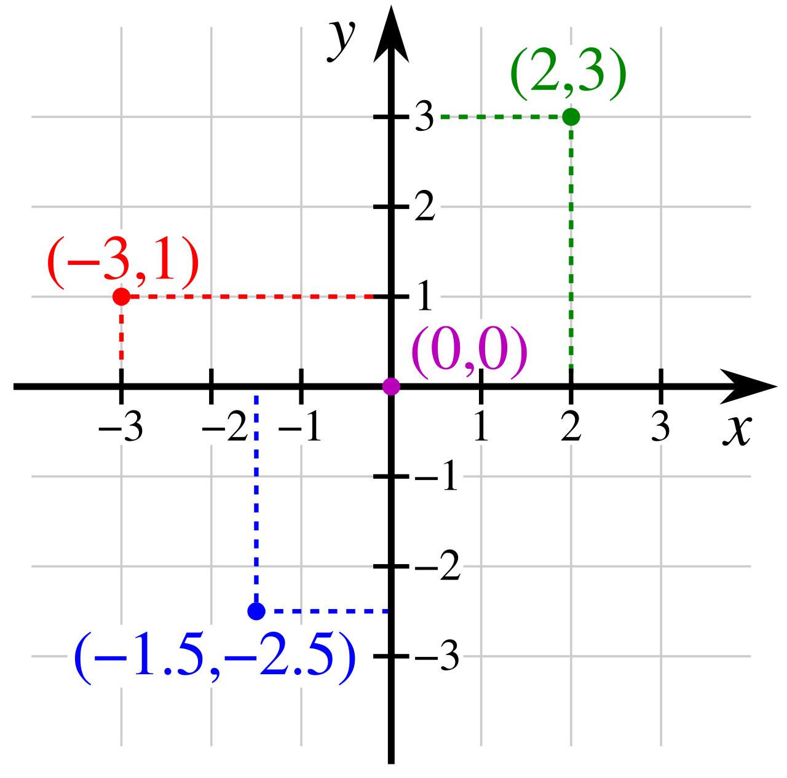
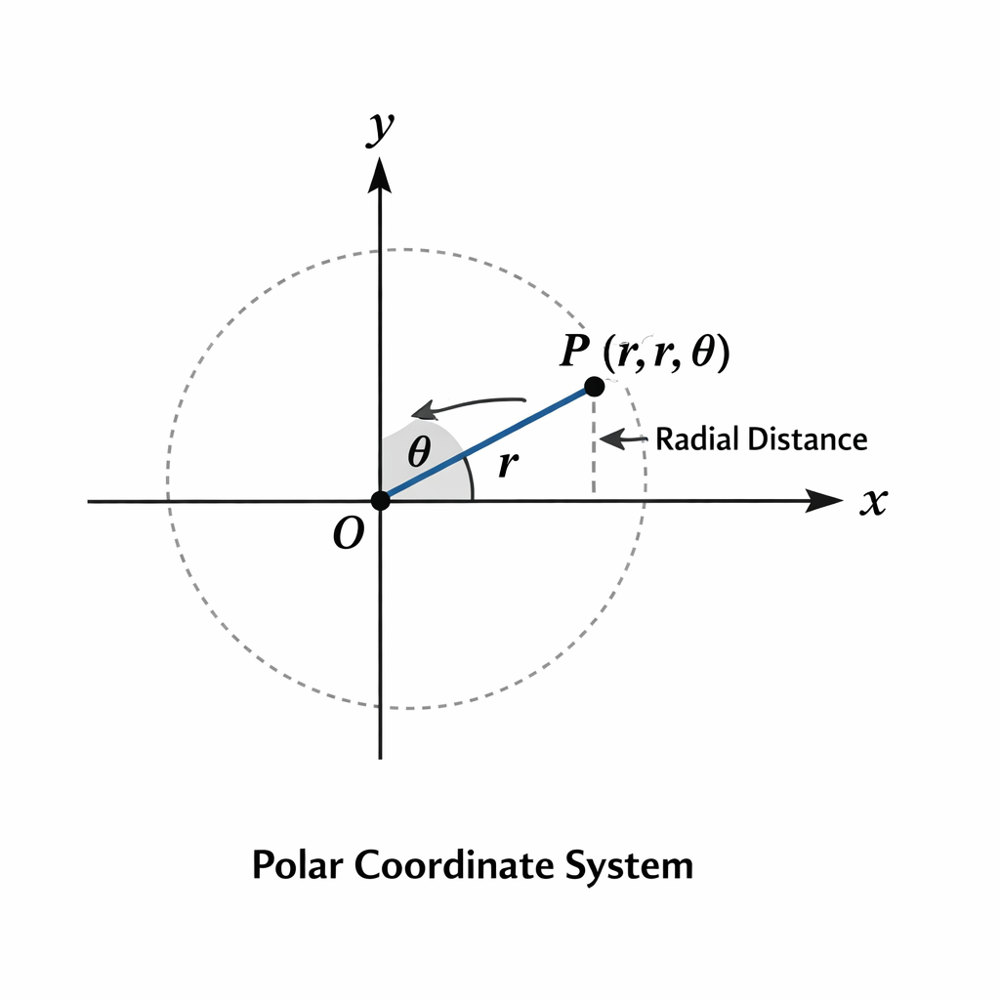
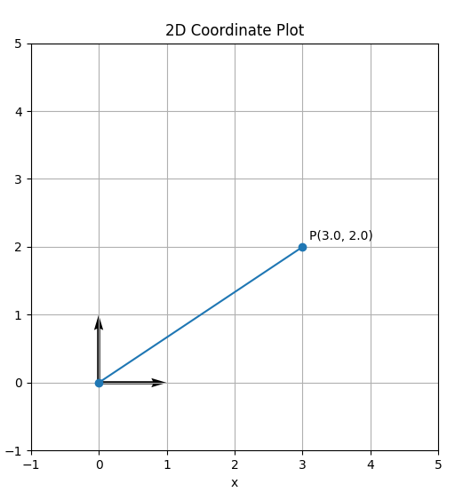
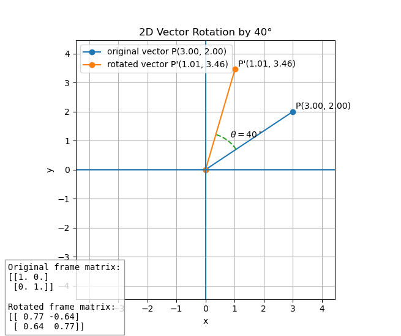
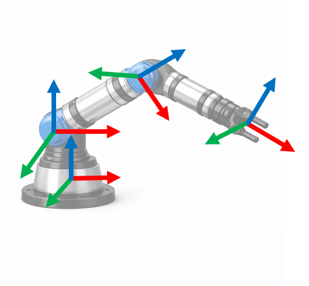
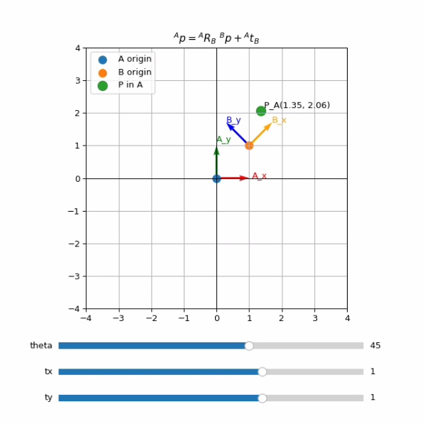

# 좌표계

## 좌표계란?

좌표계는 **공간의 점, 벡터, 물체의 위치와 자세를 숫자로 표현**하기 위한 기준을 의미합니다. 좌표계는 축의 방향과 순서를 정하고, 점은 그 순서에 따라 표기합니다. 점을 표현하는 기준을 정의하면 이후 선과 면도 같은 방식으로 표현할 수 있습니다.

좌표계는 점을 어떤 변수로 표현하느냐에 따라 여러 방식으로 나뉘며, 대표적인 분류로 **직교 좌표계(Cartesian coordinate system)와 극 좌표계(Polar coordinate system)** 로 구분합니다.

직교좌표계란 유클리드 공간에서 **서로 직교하는 직선 축으로 점의 위치를 표현**하는 2차원 또는 3차원 좌표계를 의미합니다. 2차원 좌표계는 점의 위치를 ($x$, $y$)로 표현합니다. 이는 원점에서 $x$ 축 방향으로 얼마나 이동했고, $y$ 축 방향으로 얼마나 이동했는지 나타냅니다. 3차원 좌표계는 ($x$, $y$, $z$)로 표현합니다.



<br>

이에 반해 극 좌표계는 유클리드 평면에서 **한 점의 위치를 원점으로부터 거리와 기준 방향으로부터의 각도**로 나타내는 2차원 좌표계입니다. 점 $P(r, \theta)$ 으로 표현되며, $r$ 는 원점에서 점까지의 거리이고, $\theta$ 는 기준 축으로부터 점을 향하는 방향각입니다.



<br>

조금 더 직관적으로 둘을 비교하자면, 직교 좌표계가 '오른쪽으로 얼마, 위로 얼마'로 점을 표시한다면 극 좌표계는 '얼마나 멀리, 어느 방향에 있는가'로 말합니다. 이 둘은 사용하는 곳에 따라 장단점이 뚜렷하게 갈립니다.

본 교재에서는 로봇공학에서 널리 쓰이는 오른손 직교 좌표계 관례를 사용합니다. 이는 ISO 9787의 좌표계 명명 관례와도 연결됩니다.

**실습 : Matplotlib로 직교좌표계와 위치 벡터 표현하기**

아래 코드는 matplotlib로 직교좌표계를 표시하고, x/y축 단위 벡터와 원점에서 점까지의 위치 벡터를 그리는 코드입니다. 표현하고자 하는 점의 좌표를 직교 좌표계 방식으로 지정하고 (변수 `point`), 원점에서 이 점까지의 벡터를 표시하는 코드입니다.

```python
import numpy as np
import matplotlib.pyplot as plt

point = np.array([3.0, 2.0])

plt.figure(figsize=(6, 6))
plt.quiver(0, 0, 1, 0, angles='xy', scale_units='xy', scale=1)
plt.quiver(0, 0, 0, 1, angles='xy', scale_units='xy', scale=1)
plt.plot([0, point[0]], [0, point[1]], marker='o')
plt.text(point[0] + 0.1, point[1] + 0.1, f'P({point[0]:.1f}, {point[1]:.1f})')
plt.xlim(-1, 5)
plt.ylim(-1, 5)
plt.gca().set_aspect('equal')
plt.grid(True)
plt.xlabel('x')
plt.ylabel('y')
plt.title('2D Coordinate Plot')
plt.show()
```



> [!Note]
> `point` 변수의 좌표 값을 변경해서 값에 따라 그래프가 달라지는 것을 확인해 보세요.

**실습 : 직교좌표와 극좌표 변환**
직교 좌표와 극 좌표를 변환하며 같은 점도 기준에 따라 다른 방식으로 표현된다는 것을 확인해 보겠습니다.

```python
import numpy as np

points = [
    (3, 4),
    (2, 2),
    (-3, 4),
    (-2, -2)
]

print("Cartesian -> Polar")
for x, y in points:
    r = np.sqrt(x**2 + y**2)
    theta = np.rad2deg(np.arctan2(y, x))

    print(f"({x}, {y}) -> r={r:.2f}, theta={theta:.2f}°")


print("\nPolar -> Cartesian")

polar_points = [
    (5, 53.13),
    (2.83, 45),
    (5, 126.87),
    (2.83, -135)
]

for r, theta_deg in polar_points:
    theta = np.deg2rad(theta_deg)

    x = r * np.cos(theta)
    y = r * np.sin(theta)

    print(f"r={r}, theta={theta_deg}° -> x={x:.2f}, y={y:.2f}")
```


## 기준 좌표계와 로컬 좌표계

로봇에서 좌표계를 표현할 때는 하나의 좌표계만 사용하는 것이 아니라, 여러 개의 좌표계를 구분하여 사용합니다. 하나의 좌표계에서 여러 개의 점을 표현할 수 있듯이, 하나의 공간 안에도 여러 개의 좌표계가 함께 존재할 수 있습니다. 이러한 구분이 왜 필요한지는 뒤에서 다시 설명하겠습니다. 먼저 좌표계가 어떻게 나뉘는지부터 살펴보겠습니다.

국제 표준에서는 좌표계를 그 기능에 따라 더 세분하여 구분하기도 합니다. 하지만 이 교재에서는 이해를 돕기 위해 **기준 좌표계(reference coordinate system, 예: world 또는 base 좌표계)와 로컬 좌표계(local coordinate system)** 두 가지로만 나누어 설명하겠습니다.

기준 좌표계는 공간 전체를 설명하기 위한 기준이 되는 좌표계입니다. 다른 좌표계나 물체의 위치와 방향을 나타낼 때 기준이 되는 좌표계입니다.

로컬 좌표계는 로봇의 특정 링크, 조인트, 또는 공간 안의 물체에 부착되어 함께 움직이는 좌표계입니다. 따라서 링크나 물체의 위치와 방향이 변하면, 그에 따라 해당 로컬 좌표계의 위치와 방향도 함께 변합니다.

## 왜 한 공간에 여러 개의 좌표계가 필요한가

위에서 설명하였듯 한 공간에는 기준 좌표계가 있고, 여러 물체나 로봇에는 각각 로컬 좌표계가 붙습니다. 그렇다면 왜 기준 좌표계 외의 다른 좌표계들이 필요한 것일까요?

여러 좌표계가 필요한 가장 큰 이유는 하나의 좌표계가 모든 문제를 가장 잘 설명해 주지 않기 때문입니다. 예를 들어 방 전체에서 로봇이 어디에 있는지를 알고 싶을 땐 기준 좌표계로 표시하는 것이 가장 편할 것입니다. 하지만 로봇이 집으려는 물체를 표시할 때는 어떨까요? 기준 좌표계로도 표현할 수 있지만 결국 물체를 집는 건 로봇의 EE, 혹은 gripper입니다. 따라서 카메라에서 본 물체 위치를 그대로 쓰기보다, 로봇의 base나 EE 기준 좌표로 변환해야 실제 집기 동작을 계산할 수 있습니다.

또 다른 이유는 센서와 구동기가 본질적으로 각자의 좌표계에서 세계를 인식하기 때문입니다. 장비에 부착된 카메라는 자신의 위치에서 물체를 관찰하고, 로봇의 관절, 카메라, 그리퍼 등은 각자 기준이 되는 좌표계에서 값이 정의됩니다. 이들을 전부 기준 좌표계로만 표시한다면 덜 직관적이고 계산하기 매우 복잡할 것입니다.

따라서 여러 좌표계를 도입하는 것이 문제를 작고 단순한 단위로 나누어 줍니다. 공간은 하나로 정의되더라도, 그 공간을 이해하고 사용해야 하는 관점은 하나가 아니기 때문입니다. 결국 이런 좌표계들은 서로 다른 목적과 장치를 하나의 일관된 계산 체계로 묶기 위해 반드시 필요합니다.


## 좌표계의 평행이동과 회전

한 공간에 좌표계 $A$, $B$ 가 존재한다고 가정하겠습니다. 이 둘 사이의 관계를 표현하려면 어떻게 해야 할까요? 만약 좌표계 $A$ 에서 표시된 점 $P$ 를 좌표계 $B$ 에서 표현하려면, 어떤 연산을 적용해야 정확하게 표시할 수 있을까요?

이 관계는 **평행이동(translation)과 회전(rotation)** 으로 표현합니다. 평행이동이란 $B$ 의 원점이 $A$ 에서 보았을 때 어디에 있는가를 표현하며, 회전은 좌표계 $B$ 의 축이 $A$ 에서 보았을 때 어느 방향을 향하는가를 표현합니다. 3차원에서는 이를 표현하는 도구가 각각 3x1 평행이동 벡터와 3x3 회전 행렬입니다.

### 평행이동 벡터

평행이동 벡터 $^{A}t_{B}$ 는 좌표계 $A$ 의 원점에서 좌표계 $B$ 의 원점으로 가는 벡터를, 좌표계 $A$ 기준 성분으로 적은 것입니다.

예를 들어 $^{A}t_{B} = \begin{bmatrix} 2 & 1 & 0 \end{bmatrix}^{T}$ 라면, 이는 ' $B$ 의 원점이 $A$ 에서 볼 때 $x$ 방향으로 2, $y$ 방향으로 1만큼 떨어져 있다'라는 뜻입니다. 축 방향은 결정짓지 않았기 때문에 좌표계의 위치 벡터만 담아냅니다.

### 회전 행렬

회전 행렬(Rotation Matrix)이란 **한 좌표계의 축이 다른 좌표계에서 어느 방향을 향하는지** 나타내는 행렬을 말합니다. 각 열벡터는 자식 좌표계의 x, y, z축 방향을 부모 좌표계의 성분으로 나타낸 것입니다.

<br>

**2D 회전 행렬**

우선 2차원의 경우를 생각해 봅시다.

임의의 2차원 좌표계에서 (1, 0) 벡터 $\vec{v}$ 가 존재한다고 가정합니다. 이 벡터를 $\theta$ 만큼 반시계 방향 회전시키면 회전 결과는 ($\cos \theta$, $\sin \theta$)가 되고, 아래 행렬처럼 표시합니다.

```math
R(\theta)=\begin{bmatrix} \cos \theta & - \sin \theta \\\\ \sin \theta & \cos \theta \end{bmatrix}
```

이 행렬은 임의의 직교정규 기저에서도 같은 형태를 지니는, 회전이라는 변환의 기본 형태입니다. 이 식의 대각 성분 $\cos \theta$ 는 원래 축 성분이 같은 축 방향에 얼마나 남아있는지를 나타냅니다. 반면 비대각 성분인 $\sin \theta$ 는 원래 한 축 성분이 다른 축 방향으로 얼마나 옮겨 가는지를 의미합니다. 쉽게 풀어내자면 회전 후의 $x$, $y$ 성분은 기존 $x$, $y$ 성분의 선형결합으로 계산됩니다. 이 '축 성분의 섞임'을 숫자로 나타내는 것이 바로 $\sin \theta$ 와 $\cos \theta$ 입니다.

또 하나 중요한 점은 상술한 행렬의 열입니다. 첫 번째 열은 $x$ 축 단위 벡터가 회전 후 어디를 향하는지를 뜻하고, 두 번째 열은 $y$ 축 단위 벡터가 회전 후 어디를 향하는지를 뜻합니다. 예를 들어 $\theta = 90^\circ$ 라면 첫 번째 열은 $(0, 1)^T$ 가 되어, 원래의 $x$ 축이 회전 후 $y$ 축 방향을 가리킨다는 뜻이 됩니다. 

<br>

**회전 행렬이 가져야 할 성질**

일반적으로 어떠한 물체를 회전한다고 가정하겠습니다. 순수한 회전 변환은 물체의 형태를 임의로 변형하지 않습니다.

여기서의 회전 또한 마찬가지입니다. 회전은 벡터의 길이와 벡터 사이의 각도를 보존하는 선형변환입니다. 따라서 회전 행렬의 열벡터는 모두 길이가 1이고 서로 수직이어야 합니다. 이런 행렬을 orthogonal matrix라고 합니다.

이 성질로 인해 회전 행렬 $R$ 에 대해

```math
R^{T}R=I
```

가 성립합니다. 따라서 회전 행렬의 역행렬은 전치 행렬과 같으며, $R^{-1}=R^T$ 입니다.

**실습 : 회전 행렬을 통한 연산 시각화**

다음은 점/벡터를 회전 연산하였을 때 어떻게 바뀌는지 시각화한 코드입니다. 

```python
import numpy as np
import matplotlib.pyplot as plt

point = np.array([3.0, 2.0])
theta_deg = 40
theta = np.deg2rad(theta_deg)

frame_0 = np.eye(2)

R = np.array([
    [np.cos(theta), -np.sin(theta)],
    [np.sin(theta),  np.cos(theta)]
])

frame_rot = R
rotated_point = R @ point

alpha = np.arctan2(point[1], point[0])
beta = np.arctan2(rotated_point[1], rotated_point[0])

arc_angles = np.linspace(alpha, beta, 100)
arc_radius = np.linalg.norm(point) * 0.35
arc_x = arc_radius * np.cos(arc_angles)
arc_y = arc_radius * np.sin(arc_angles)

mid_angle = (alpha + beta) / 2

plt.figure(figsize=(8, 8))

plt.plot([0, point[0]], [0, point[1]], marker='o',
         label=f'original vector P({point[0]:.2f}, {point[1]:.2f})')

plt.plot([0, rotated_point[0]], [0, rotated_point[1]], marker='o',
         label=f'rotated vector P\'({rotated_point[0]:.2f}, {rotated_point[1]:.2f})')

plt.plot(arc_x, arc_y, linestyle='--')
plt.text(
    arc_radius * np.cos(mid_angle) + 0.1,
    arc_radius * np.sin(mid_angle) + 0.1,
    rf'$\theta={theta_deg}^\circ$'
)

plt.text(point[0] + 0.1, point[1] + 0.1,
         f'P({point[0]:.2f}, {point[1]:.2f})')

plt.text(rotated_point[0] + 0.1, rotated_point[1] + 0.1,
         f'P\'({rotated_point[0]:.2f}, {rotated_point[1]:.2f})')

matrix_text = (
    "Original frame matrix:\n"
    f"{np.array2string(frame_0, precision=2, suppress_small=True)}\n\n"
    "Rotated frame matrix:\n"
    f"{np.array2string(frame_rot, precision=2, suppress_small=True)}"
)

plt.gcf().text(
    0.02, 0.02, matrix_text,
    fontsize=10,
    family='monospace',
    bbox=dict(facecolor='white', alpha=0.8, edgecolor='gray')
)

max_val = max(np.abs(point).max(), np.abs(rotated_point).max()) + 1
plt.xlim(-max_val, max_val)
plt.ylim(-max_val, max_val)
plt.gca().set_aspect('equal')
plt.grid(True)
plt.axhline(0)
plt.axvline(0)
plt.xlabel('x')
plt.ylabel('y')
plt.title(f'2D Vector Rotation by {theta_deg}°')
plt.legend()
plt.show()

print("Original frame matrix:")
print(frame_0)
print()
print("Rotated frame matrix:")
print(frame_rot)
```

`point` 변수는 2차원 기준 좌표계에 찍히는 점의 위치를 표현한 것이며, `theta_deg`, `theta` 변수는 점에 적용하는 회전 각도를 나타냅니다. 지정한 `theta` 값을 활용하여 회전 행렬을 구한 뒤, 기준 좌표계에 찍힌 `point` 변수에 행렬곱을 적용합니다. 그 이후의 코드는 이를 그래프로 시각화하는 구체적인 matplotlib 코드입니다.

실행 결과는 아래와 같습니다.



출력값

```
Original frame matrix:
[[1. 0.]
 [0. 1.]]

Rotated frame matrix:
[[ 0.76604444 -0.64278761]
 [ 0.64278761  0.76604444]]
```

**실습 : 회전 행렬 성질 확인**

`R.T @ R = I` 이면 회전행렬의 축들이 서로 수직이고 길이가 1이라는 뜻입니다. `R.T @ R = I`이고 `det(R) = 1`이면 반사 성분이 없는 순수 회전 행렬임을 의미합니다. 회전 후에도 벡터의 길이는 변하지 않습니다. 이를 유의하며 회전 행렬의 성질을 실습을 통해 직접 확인해 보겠습니다.

```py
import numpy as np

theta_deg = 45
theta = np.deg2rad(theta_deg)

R = np.array([
    [np.cos(theta), -np.sin(theta)],
    [np.sin(theta),  np.cos(theta)]
])

print("Rotation Matrix R")
print(R)

print("\nR.T @ R")
print(R.T @ R)

print("\nIdentity Matrix")
print(np.eye(2))

det_R = np.linalg.det(R)
print(f"\ndet(R) = {det_R:.6f}")

v = np.array([3, 2])
rotated_v = R @ v

original_length = np.linalg.norm(v)
rotated_length = np.linalg.norm(rotated_v)

print("\nVector Length Check")
print(f"Original length = {original_length:.6f}")
print(f"Rotated length  = {rotated_length:.6f}")
```

> [!Note]
> 회전 각도에 따른 점의 변화를 확인해 보세요.

| θ    | 결과 좌표 |
| ---- | ----- |
| 0°   |       |
| 45°  |       |
| 90°  |       |
| 180° |       |


> [!Note]
> `point` 및 `theta_deg` 변수의 값을 변경해서 값에 따라 그래프가 달라지는 것을 확인해 보세요. 

**단위벡터로 표현하는 회전 행렬**

결국 회전 행렬 $^{A}R_{B}$ 는 좌표계 $B$ 의 각 축이 좌표계 $A$ 에서 어떻게 보이는지를 적은 것입니다. 3차원 좌표계 $A$, $B$ 가 있을 때, 이 행렬의 열벡터는 단위벡터 $^{A}\hat{x}_{B}$, $^{A}\hat{y}_{B}$, $^{A}\hat{z}_{B}$ 로 표현하며, 각각이 좌표계 $B$ 의 $X$, $Y$, $Z$ 축을 좌표계 $A$ 에서 본 3x1 단위 벡터라고 볼 수 있습니다.

다음과 같이 표현합니다.

```math
^{A}R_{B}=\begin{bmatrix} ^{A}\hat x_{B} & ^{A}\hat y_{B} & ^{A}\hat z_{B}\end{bmatrix}
```

따라서 회전 행렬은 단순한 계산용 표가 아닌 자식 좌표계 축의 방향을 담은 행렬이라고 이해하는 것이 가장 직관적입니다. 활용 방법은 뒤에서 다시 설명하겠습니다.

### 점 좌표가 회전과 평행이동을 함께 받는 이유

어떤 점 $p$ 가 좌표계 $B$ 에서 $^{B}p$ 로 주어졌다고 했을 때, 이 점을 좌표계 $A$ 에서 표현하려면 먼저 $^{B}p$ 를 $A$ 좌표계에서의 방향 성분으로 바꾸기 위해 $^{A}R_B$ 를 곱하고, 그다음 $B$ 원점의 위치 $^{A}t_B$ 를 더해야 합니다.

식으로 쓰면 다음과 같습니다.

```math
^{A}p = ^{A}R_{B} \ ^{B}p + ^{A}t_{B}
```

**2차원 예시**

2차원 좌표계 $B$ 가 $A$ 에 대해 원점은 $(2,1)$ 에 위치해 있고, 반시계 방향으로 $90 ^\circ$ 회전해 있다고 하겠습니다. 이를 식으로 나타내면 아래와 같이 표시됩니다.


```math
^{A}R_{B} = \begin{bmatrix} 0 & -1 \\\\ 1 & 0 \end{bmatrix} ,\quad \ ^{A}t_{B} = \begin{bmatrix} 2 \\\\ 1 \end{bmatrix} 
```

가 됩니다. 만약 $B$ 좌표계에서 점이 
```math
^{B}p = \begin{bmatrix} 1, 0 \end{bmatrix}^T
``` 
라면,

```math
^{A}p = ^{A}R_{B} \ ^{B}p + ^{A}t_{B} = \begin{bmatrix} 0 & -1 \\\\ 1 & 0 \end{bmatrix} \begin{bmatrix} 1 \\\\ 0 \end{bmatrix} + \begin{bmatrix} 2 \\\\ 1 \end{bmatrix} = \begin{bmatrix} 2 \\\\ 2 \end{bmatrix}
```

가 됩니다.

### 평행이동만 있는 경우와 회전만 있는 경우

평행이동만 있는 경우에는 $^{A}R_{B} = I$ 이고 $^{A}t_{B} \neq 0$ 입니다. 이때 두 좌표계의 축은 서로 평행하고 원점만 다릅니다. 다시 말하자면, 위치는 다르지만 방향은 같은 좌표계입니다.

반대로 회전만 있는 경우에는 $^{A}R_{B} \neq I$ 이고 $^{A}t_{B} = 0$ 입니다. 이때 두 좌표계는 같은 원점에 있지만 축 방향만 다릅니다. 다시 말하자면, 원점은 같지만 서로 기울어진 좌표계입니다.

**실습 : 회전 + 평행이동의 시각화**

좌표계 A/B 변환을 직접 실습하며 아래 식이 실제로 무슨 뜻인지 눈으로 확인하겠습니다.

```math
^{A}p = ^{A}R_{B} \ ^{B}p + ^{A}t_{B}
```


```python
import numpy as np
import matplotlib.pyplot as plt

p_B = np.array([1, 0])

theta_deg = 90
theta = np.deg2rad(theta_deg)

R_AB = np.array([
    [np.cos(theta), -np.sin(theta)],
    [np.sin(theta),  np.cos(theta)]
])

t_AB = np.array([2, 1])

p_A = R_AB @ p_B + t_AB

print("p_B =", p_B)
print("R_AB =")
print(R_AB)
print("t_AB =", t_AB)
print("p_A = R_AB @ p_B + t_AB =", p_A)

origin_A = np.array([0, 0])
origin_B = t_AB

x_axis_B = origin_B + R_AB @ np.array([1, 0])
y_axis_B = origin_B + R_AB @ np.array([0, 1])

plt.figure(figsize=(7, 7))

plt.quiver(0, 0, 1, 0, angles="xy", scale_units="xy", scale=1, label="A x-axis")
plt.quiver(0, 0, 0, 1, angles="xy", scale_units="xy", scale=1, label="A y-axis")

plt.quiver(origin_B[0], origin_B[1], x_axis_B[0] - origin_B[0], x_axis_B[1] - origin_B[1],
           angles="xy", scale_units="xy", scale=1)
plt.quiver(origin_B[0], origin_B[1], y_axis_B[0] - origin_B[0], y_axis_B[1] - origin_B[1],
           angles="xy", scale_units="xy", scale=1)

plt.scatter(origin_A[0], origin_A[1], s=80)
plt.text(origin_A[0] + 0.1, origin_A[1] + 0.1, "A origin")

plt.scatter(origin_B[0], origin_B[1], s=80)
plt.text(origin_B[0] + 0.1, origin_B[1] + 0.1, "B origin")

plt.scatter(p_A[0], p_A[1], s=100)
plt.text(p_A[0] + 0.1, p_A[1] + 0.1, f"P in A ({p_A[0]:.1f}, {p_A[1]:.1f})")

plt.xlim(-1, 5)
plt.ylim(-1, 5)
plt.grid(True)
plt.gca().set_aspect("equal")
plt.xlabel("x")
plt.ylabel("y")
plt.title("Rotation + Translation")
plt.show()
```

## 동차 변환 행렬

회전과 평행이동을 따로 쓰면 개념은 선명해지지만 여러 링크, 여러 좌표계를 연결할 땐 계산이 번거로워집니다. 그래서 로봇공학에서는 둘을 하나의 4x4 행렬, **동차 변환 행렬(homogeneous transform)** 로 묶어 사용합니다. 점은 마지막 좌표에 1을 붙여 평행이동을 포함하고, 방향 벡터는 0을 붙여 평행이동의 영향을 받지 않게 합니다.

예를 들어, 3차원 공간 상에 어떠한 점 $p$ 를 동차좌표로 쓰면 다음과 같습니다.

```math
\tilde {p} = \begin{bmatrix} p \\\\ 1 \end{bmatrix}
```

또한 두 좌표계 사이 변환을 동차 변환 행렬로 표현하면 다음과 같습니다.

```math
^{A}T_{B}=\begin{bmatrix}^{A}R_{B} & ^{A}t_{B} \\\\ 0\;0\;0 & 1\end{bmatrix}
```

그러면 점의 좌표 변환을 다음과 같이 표현합니다.

```
\begin{bmatrix}^{A}p \\\\ 1 \end{bmatrix} = \begin{bmatrix}^{A}R_{B} & ^{A}t_{B} \\\\ 0\;0\;0 & 1\end{bmatrix} \begin{bmatrix}^{B}p \\\\ 1\end{bmatrix}
```

위와 같이 한 번의 행렬곱으로 정리합니다.

**동차 변환 행렬을 사용할 경우의 장점**

동차 변환 행렬의 가장 큰 장점은 바로 연속해서 곱할 수 있다는 점입니다. 예를 들어 같은 공간에 좌표계 $A$, $B$, $C$ 가 있다고 가정하고, 좌표계 $A$ 에서 본 $C$ 의 관계를 표현하면 다음과 같이 나타냅니다.

```math
^{A}T_{C} = ^{A}T_{B}\ ^{B}T_{C}
```

이렇게 각 변환 행렬을 차례로 곱해서 최종 좌표계를 구합니다. 이런 좌표계 간의 연결은 존재하는 좌표계의 개수가 많아지더라도 연산이 유효하며, 연결된 각 좌표계를 반드시 거쳐야 할 경우에 특히 유용하게 사용합니다.

## 로봇 조인트에서 어떻게 다뤄지는가?

로봇팔에서는 Base에서 기준 좌표계 {0}를 두고, 각 링크에 로컬 좌표계 {1}, {2}, ...를 붙입니다. 이때 revolute joint는 '이번 링크 좌표계가 이전 링크 좌표계에 대해 얼마나 회전하는가'를 바꿉니다. 즉, revolute joint는 인접한 좌표계 사이의 상대 회전각을 바꾸며, 이 변화가 이후 링크를 따라 전달되어 EE의 위치와 자세를 바꿉니다. 국소적으로는 회전/평행이동이 구분되지만 전체적으로는 이 변환들이 연결되어 최종 자세를 만듭니다. 이렇게 각 좌표계의 회전은 앞에서 배운 동차 행렬 변환을 통해 연쇄적으로 연산할 수 있으며, 추후 소개할 기구학에서도 핵심이 되는 매우 중요한 개념입니다.

아래는 로봇팔에 좌표계가 붙은 예시 사진입니다.



## 3차원 회전 행렬과 고정된 축에서의 roll, pitch, yaw

앞서 회전 행렬은 각각의 축을 담당하는 열벡터로 표현할 수 있다고 설명하였습니다. 3차원 회전은 회전 행렬의 세 단위 축 벡터로 표현할 수 있으며, 독립적인 회전 자유도는 3개입니다. 그래서 RPY처럼 세 개의 각도로 매개변수화할 수 있습니다.

3차원 좌표계의 회전 행렬 $R$ 이 있을 때, 이 교재에서는 roll을 X축 회전, pitch를 Y축 회전, yaw를 Z축 회전으로 정의하고, 모두 고정된 기준축에 대한 회전으로 다룹니다. 양의 방향은 오른손 나사 법칙을 따릅니다. 이 세 개를 줄여 RPY라고도 부릅니다.

이 교재에서는 RPY를 고정된 기준 축에 대한 회전으로 정의합니다. 표현하면 아래와 같습니다.

- **roll** : 고정된 $X$ 축에 대한 회전
- **pitch** : 고정된 $Y$ 축에 대한 회전
- **yaw** : 고정된 $Z$ 축에 대한 회전

기본적인 축별 회전 행렬은 다음과 같습니다.

```math
R_{x}(\phi) = \begin{bmatrix}1 & 0 & 0 \\\\ 0 & \cos \phi & - \sin \phi \\\\ 0 & \sin \phi & \cos \phi \end{bmatrix}
```

```math
R_{y}(\theta) = \begin{bmatrix}\cos \theta & 0 & \sin \theta \\\\ 0 & 1 & 0 \\\\ -\sin \theta & 0 & \cos \theta \end{bmatrix}
```

```math
R_{z}(\psi) = \begin{bmatrix}\cos \psi & - \sin \psi & 0 \\\\ \sin \psi & \cos \psi & 0 \\\\ 0 & 0 & 1 \end{bmatrix}
```

여기서 흔히 쓰는 한 규약 중 하나인 고정된 X-Y-Z 축에 대해 roll → pitch → yaw를 적용하는 고정 프레임 RPY는 열벡터에 오른쪽부터 적용하는 관례에서 보통 아래와 같이 작성합니다.

```math
R=R_{z}(\psi)R_{y}(\theta)R_x(\phi)
```

여기서 중요한 점은 RPY 값은 회전 순서와 고정축/이동축 기준을 함께 명시해야 같은 회전을 정확히 재현할 수 있다는 것입니다. RPY는 회전 행렬의 각 축 열벡터의 값을 하나의 값으로 바꾼 것이 아닌, 같은 회전 정보를 세 개의 각도로 매개변수화한 것이기 때문에 어떤 순서/관점인지를 함께 말해야 합니다.

위 식은 열벡터 관례에서 $R_z R_y R_x$ 로 전개한 형태이며, 문헌에서는 ZYX yaw-pitch-roll 형식으로도 자주 나타납니다.

```math
R = \begin{bmatrix} c_{\psi}c_{\theta} & c_{\psi}s_{\theta}s_{\phi} - s_{\psi}c_{\phi} & c_{\psi}s_{\theta}c_{\phi} + s_{\psi}s_{\phi} \\\\ s_{\psi}c_{\theta} & s_{\psi}s_{\theta}s_{\phi} + c_{\psi}c_{\phi} & s_{\psi}s_{\theta}c_{\phi} - c_{\psi}s_{\phi}  \\\\ - s_{\theta} & c_{\theta}s_{\phi} & c_{\theta}c_{\phi} \end{bmatrix}
```

여기서 $c$ 는 $\cos$, $s$ 는 $\sin$ 을 뜻합니다. 이 전개식은 축별 회전 행렬을 곱해서 얻은 결과이며, 회전 행렬의 9개 성분은 서로 독립이 아니고 세 개의 각이 직교성과 det=1 조건을 만족하는 9개 성분을 결정한다는 것을 보여줍니다.

## 좌표계 변환 실습

로컬 좌표계 B를 움직이며 점 P가 기준 좌표계 A에서 어떻게 보이는지 확인하겠습니다. 슬라이더를 이용해 위치를 조정하며 확인해 보겠습니다.

```py
import numpy as np
import matplotlib.pyplot as plt
from matplotlib.widgets import Slider

p_B = np.array([1.0, 0.5])

fig, ax = plt.subplots(figsize=(7, 7))
plt.subplots_adjust(bottom=0.28)

def draw(theta_deg, tx, ty):
    ax.clear()

    theta = np.deg2rad(theta_deg)

    R_AB = np.array([
        [np.cos(theta), -np.sin(theta)],
        [np.sin(theta),  np.cos(theta)]
    ])

    t_AB = np.array([tx, ty])
    p_A = R_AB @ p_B + t_AB

    origin_A = np.array([0.0, 0.0])
    origin_B = t_AB

    x_B = R_AB @ np.array([1.0, 0.0])
    y_B = R_AB @ np.array([0.0, 1.0])

    ax.quiver(0, 0, 1, 0, angles="xy", scale_units="xy", scale=1, color="red")
    ax.quiver(0, 0, 0, 1, angles="xy", scale_units="xy", scale=1, color="green")
    ax.text(1.1, 0, "A_x", color="red")
    ax.text(0, 1.1, "A_y", color="green")

    ax.quiver(
        origin_B[0],
        origin_B[1],
        x_B[0],
        x_B[1],
        angles="xy",
        scale_units="xy",
        scale=1,
        color="orange"
    )
    ax.quiver(
        origin_B[0],
        origin_B[1],
        y_B[0],
        y_B[1],
        angles="xy",
        scale_units="xy",
        scale=1,
        color="blue"
    )
    ax.text(origin_B[0] + x_B[0], origin_B[1] + x_B[1], "B_x", color="orange")
    ax.text(origin_B[0] + y_B[0], origin_B[1] + y_B[1], "B_y", color="blue")

    ax.scatter(origin_A[0], origin_A[1], s=80, label="A origin")
    ax.scatter(origin_B[0], origin_B[1], s=80, label="B origin")
    ax.scatter(p_A[0], p_A[1], s=120, label="P in A")

    ax.text(p_A[0] + 0.1, p_A[1] + 0.1, f"P_A({p_A[0]:.2f}, {p_A[1]:.2f})")

    ax.set_xlim(-4, 4)
    ax.set_ylim(-4, 4)
    ax.set_aspect("equal")
    ax.grid(True)
    ax.axhline(0, color="black", linewidth=0.8)
    ax.axvline(0, color="black", linewidth=0.8)
    ax.set_title(r"$^A p = ^A R_B \ ^B p + ^A t_B$")
    ax.legend(loc="upper left")

ax_theta = plt.axes([0.15, 0.18, 0.7, 0.03])
ax_tx = plt.axes([0.15, 0.12, 0.7, 0.03])
ax_ty = plt.axes([0.15, 0.06, 0.7, 0.03])

slider_theta = Slider(ax_theta, "theta", -180, 180, valinit=45)
slider_tx = Slider(ax_tx, "tx", -3, 3, valinit=1)
slider_ty = Slider(ax_ty, "ty", -3, 3, valinit=1)

def update(val):
    draw(slider_theta.val, slider_tx.val, slider_ty.val)
    fig.canvas.draw_idle()

slider_theta.on_changed(update)
slider_tx.on_changed(update)
slider_ty.on_changed(update)

draw(slider_theta.val, slider_tx.val, slider_ty.val)
plt.show()
```



----

## 복습 퀴즈

1. 현재 TF 트리를 확인하고 작성하라.

<br>

2. 현재 EE pose를 `x=0.35 y=0.10 z=0.25`로 읽었다. 이 값은 어떤 TF frame 기준으로 읽은 것인가? 예를 들어 base_link 기준인지 world 기준인지 확인하라.

<br>

3. PhysicAI Arm에서 shoulder_pan이 +90도 회전하였다. 기존 x축 단위벡터 [1 0 0]은 어떻게 변하는가?

<br>

4. 토큰 위치가 camera_link 기준 `x=0.10 y=0.05 z=0.30`이다. 현재 base_link → camera_link는 `x=0.20 y=0.10 z=0.40`이다. 단, base_link와 camera_link의 축 방향은 같고 회전은 없다고 가정한다. <br>
토큰 위치를 base_link 기준으로 구하라.

<br>

5. 토큰을 집기 위해 좌표를 계산할 때 실행해야 할 순서에 알맞게 빈칸을 채워라.<br>
a. 카메라 이미지<br>
b. 토큰 중심 검출<br>
c. ___________ 좌표 생성<br>
d. TF 변환<br>
e. ___________ 좌표 획득<br>
f. EE 좌표 획득<br>
g. ___________ 계산<br>
h. ___________ 생성

<br>

6. PhysicAI Arm을 2D 평면 로봇으로 단순화하고, 두 링크가 x-y 평면에서 회전한다고 가정하자. 현재 링크 길이가 L1=0.20m, L2=0.15m이고, 초기 상태가 모두 0°일 때 EE의 위치는 `(x,y) = (0.35,0)`이다. 첫 번째 관절이 90°, 두 번째 관절이 0°가 되면 EE의 좌표는 어떻게 되는가?

<br>

7. ROS2에서 `lookup_transform(target_frame, source_frame, time)`은 source 좌표를 target 기준으로 변환하는 transform을 반환한다. 다음 코드에서 개발자는 base 기준 token의 좌표를 얻고자 하였다. 무엇이 잘못되었는가?
```py
tf_buffer.lookup_transform(
    "camera_link",
    "base_link",
    rclpy.time.Time()
)
```

<br>

8. 다음 회전 행렬이 있다. 몇 도, 어느 축 기준 회전인가?
```
[ 0 -1 0 ]
[ 1  0 0 ]
[ 0  0 1 ]
```


