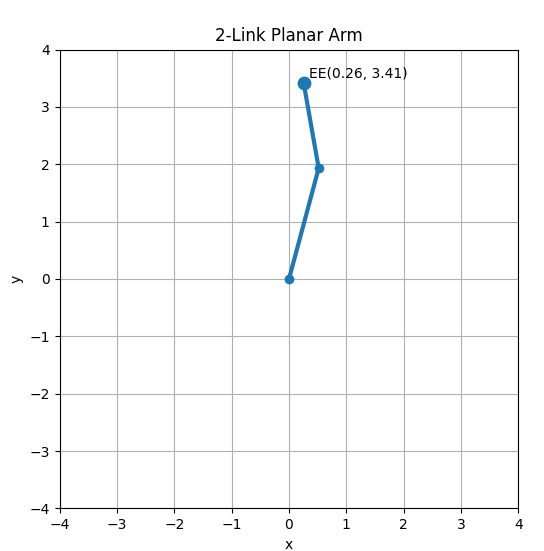
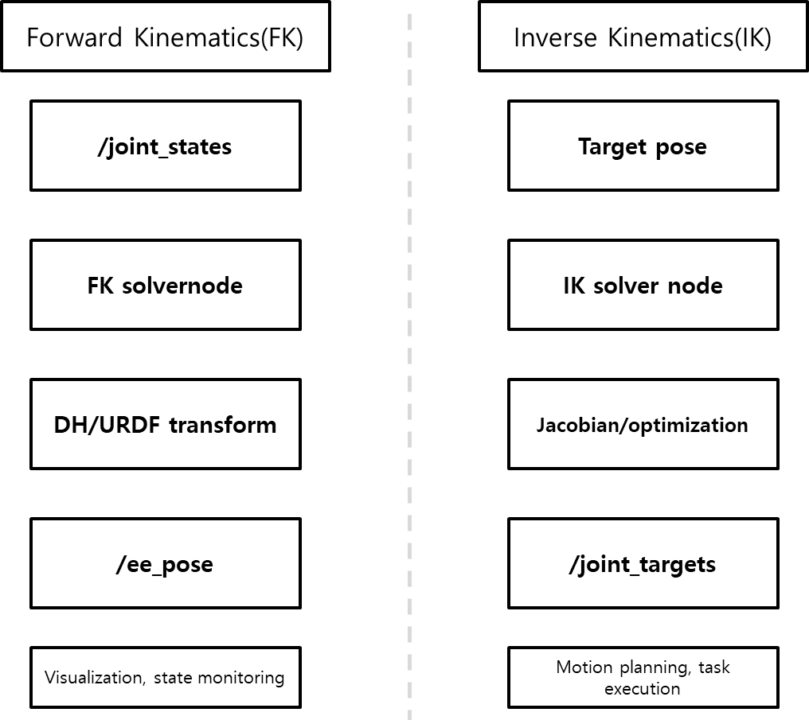
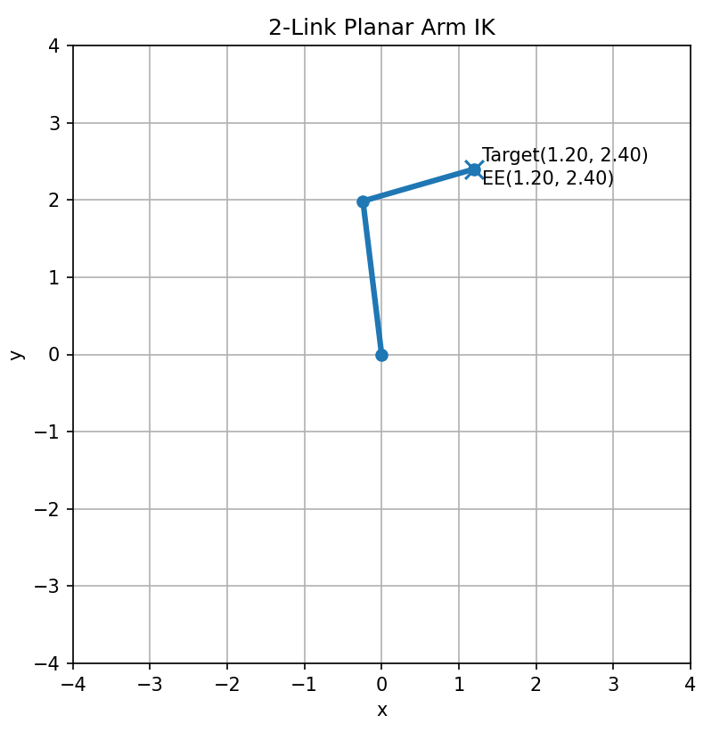
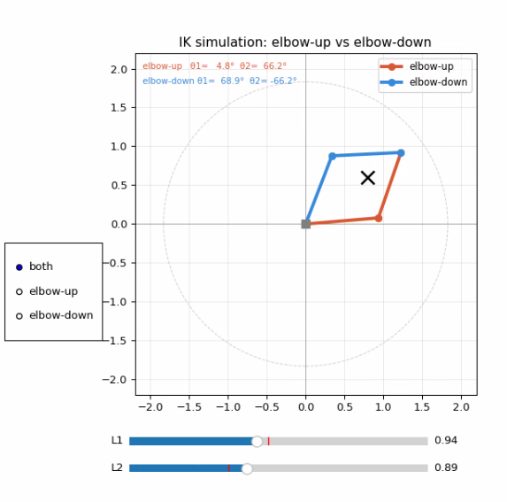

# 순기구학과 역기구학

## 순기구학

순기구학(Forward Kinematics)이란 주어진 관절 값(joint values)을 바탕으로 로봇의 각 좌표계 사이 변환, 특히 Base 좌표계에서 EE 좌표계까지의 변환을 계산하는 것을 의미합니다.

쉽게 말해 **관절 값을 알고 있을 때 EE가 어디에 있고 어느 방향을 향하는가**를 구하는 과정입니다. 여기서 입력은 로봇의 구성 상태(configuration), 즉 '어떠한 시점에서 로봇의 형상을 완전히 결정하는 모든 조인트 값의 집합'입니다. 그리고 출력은 Base 좌표계에 대한 EE 좌표계의 위치와 방향입니다.

순기구학의 원리는 각 조인트의 앞뒤 좌표계 사이에 하나의 로컬 변환(local transform)을 만드는 것입니다. 이 로컬 변환은 앞에서 배운 동차 변환 행렬로 표현합니다. 그러면 Base 좌표계에서 1번 좌표계, 1번 좌표계에서 2번 좌표계처럼 기구학 체인(kinematic chain)을 따라 좌표계 변환을 차례대로 곱해 나가면 최종적으로 EE의 자세가 계산됩니다.

수식으로 쓰면, 각 링크 사이의 변환을 $^{i-1}T_{i}(q_{i})$라고 할 때 전체 변환은 아래처럼 표현됩니다.

$$^{0}T_{n} = ^{0}T_{1}(q_{1})^{1}T_{2}(q_{2})\cdots ^{n-1}T_{n}(q_{n})$$

여기서 $q_{i}$는 각 조인트의 관절 값입니다.

위 과정을 식으로 정리하는 대표적인 방법 중 하나가 **DH 파라미터(Denavit-Hartenberg Parameter)** 입니다. DH 파라미터는 각 링크의 길이(Link Length)와 비틀림 각(Link Twist), 그리고 각 조인트의 오프셋(offset)과 조인트 각(Joint Angle), 이렇게 4가지 파라미터를 사용해 매니퓰레이터의 기구학적 구조를 체계적으로 기술하는 방법입니다. 이 4가지 파라미터로부터 인접한 두 링크 좌표계 사이의 동차 변환 행렬(Homogeneous Transformation Matrix)을 계산합니다.

순기구학은 주어진 관절 값으로부터 로봇의 손끝 자세를 구하는 문제입니다. 그리고 이 계산의 본질은 각 조인트가 만드는 좌표계 변환을 동차 변환 행렬로 나타내고, 이를 Base부터 EE까지 차례대로 곱하는 것입니다.

> [!Note]
> FK 수식이 실제 코드와 일치하는지 확인해 보세요.

### 실습 1 : 2-link 로봇의 EE 위치 계산하기

아래는 관절 값이 주어졌을 때, 각 링크의 위치와 최종 EE 위치를 계산하여 이를 시각화하는 코드입니다. 조인트는 Revolute Joint를 사용합니다.

```python
import numpy as np
import matplotlib.pyplot as plt

l1 = 2.0
l2 = 1.5
theta1 = np.deg2rad(75)
theta2 = np.deg2rad(25)

T01 = np.array([
    [np.cos(theta1), -np.sin(theta1), l1 * np.cos(theta1)],
    [np.sin(theta1),  np.cos(theta1), l1 * np.sin(theta1)],
    [0.0, 0.0, 1.0]
])

T12 = np.array([
    [np.cos(theta2), -np.sin(theta2), l2 * np.cos(theta2)],
    [np.sin(theta2),  np.cos(theta2), l2 * np.sin(theta2)],
    [0.0, 0.0, 1.0]
])

T02 = T01 @ T12

joint1 = T01[:2, 2]
ee = T02[:2, 2]

x = [0, joint1[0], ee[0]]
y = [0, joint1[1], ee[1]]

reach = l1 + l2

plt.figure(figsize=(6, 6))
plt.plot(x, y, marker='o', linewidth=3)
plt.scatter(ee[0], ee[1], s=80)
plt.text(ee[0] + 0.1, ee[1] + 0.1, f'EE({ee[0]:.2f}, {ee[1]:.2f})')
plt.xlim(-reach - 0.5, reach + 0.5)
plt.ylim(-reach - 0.5, reach + 0.5)
plt.gca().set_aspect('equal')
plt.grid(True)
plt.xlabel('x')
plt.ylabel('y')
plt.title('2-Link Planar Arm')
plt.show()
```

변수 `l1`, `l2`는 각각 링크 길이를 의미하며, `theta1`, `theta2` 변수는 각 관절의 회전 각을 의미합니다. 

`T01`은 베이스 좌표계에서 첫 번째 링크 끝 좌표계까지의 동차 변환 행렬입니다. 첫 번째 조인트 회전 `theta1`과 첫 번째 링크 길이 `l1`을 반영해서 첫 번째 링크 끝점, 즉 두 번째 관절 위치가 어디에 놓이는지 나타냅니다.

`T12`는 첫 번째 링크 좌표계에서 두 번째 링크 끝 좌표계까지의 동차 변환 행렬입니다.


이후 아래 코드를 통해 동차 변환 행렬을 연산합니다. 이를 계산하면 베이스 좌표계에서 본 최종 EE 좌표계 변환을 얻고, 마지막 열에서 EE 위치를 꺼낼 수 있습니다. 즉, FK의 핵심인 로컬 좌표계 변환을 체인으로 곱해서 최종 손끝 자세를 구합니다.

```python
T02 = T01 @ T12
```

$$T_{02}=T_{01}T_{12}$$

<br>

`joint1 = T01[:2, 2]`는 첫 번째 링크 끝점, 즉 두 번째 관절 위치의 $x, y$ 좌표를 가져오는 부분입니다. 2차원 동차 변환 행렬에서 마지막 열의 앞 두 값은 해당 좌표계 원점의 위치를 뜻합니다.

`ee = T02[:2, 2]`는 최종 EE 위치를 꺼내는 부분입니다.

`reach` 변수는 로봇팔이 이론적으로 도달할 수 있는 최대 거리를 말합니다.

---

출력 결과는 아래와 같습니다.



<br>

이 예제를 통해 관절 값이 정해지면 각 링크의 위치와 최종 EE의 위치가 결정된다는 점을 확인합니다.

**실습 : 슬라이더로 관절 값 바꾸기**

Matplotlib Slider를 통해 관절 값을 바꿔 보겠습니다.

```py
import numpy as np
import matplotlib.pyplot as plt
from matplotlib.widgets import Slider

l1 = 2.0
l2 = 1.5

fig, ax = plt.subplots(figsize=(7, 7))
plt.subplots_adjust(bottom=0.25)

ax.set_xlim(-4, 4)
ax.set_ylim(-4, 4)
ax.set_aspect("equal")
ax.grid(True)
ax.set_xlabel("x")
ax.set_ylabel("y")
ax.set_title("2-Link Forward Kinematics Slider")

line, = ax.plot([], [], marker="o", linewidth=3)
ee_text = ax.text(0, 0, "")

ax_theta1 = plt.axes([0.2, 0.12, 0.65, 0.03])
ax_theta2 = plt.axes([0.2, 0.07, 0.65, 0.03])

slider_theta1 = Slider(ax_theta1, "theta1", -180, 180, valinit=45)
slider_theta2 = Slider(ax_theta2, "theta2", -180, 180, valinit=45)


def update(val):
    theta1 = np.deg2rad(slider_theta1.val)
    theta2 = np.deg2rad(slider_theta2.val)

    joint1_x = l1 * np.cos(theta1)
    joint1_y = l1 * np.sin(theta1)

    ee_x = joint1_x + l2 * np.cos(theta1 + theta2)
    ee_y = joint1_y + l2 * np.sin(theta1 + theta2)

    x_points = [0, joint1_x, ee_x]
    y_points = [0, joint1_y, ee_y]

    line.set_data(x_points, y_points)
    ee_text.set_position((ee_x + 0.1, ee_y + 0.1))
    ee_text.set_text(f"EE({ee_x:.2f}, {ee_y:.2f})")

    fig.canvas.draw_idle()


slider_theta1.on_changed(update)
slider_theta2.on_changed(update)

update(None)
plt.show()
```


## 역기구학

앞에서 설명한 순기구학은 관절 값을 알고 있을 때 EE 자세를 구하는 과정입니다. 그리고 원하는 EE 자세로부터 관절 값을 구하는 것이 역기구학(Inverse Kinematics)입니다. 역기구학은 원하는 EE 위치와 자세를 만들기 위한 조인트 값을 수학적으로 결정하는 문제입니다. 매니퓰레이터의 경우 보통 Base 좌표계와 EE 좌표계 사이의 관계로부터 관절 값을 구하는 것입니다.

**EE를 원하는 위치와 방향으로 보내기 위해 각 관절을 어떻게 움직여야 하는가**를 구하는 과정입니다. 여기서 입력은 원하는 EE의 자세이며, 출력은 그 자세를 만들 수 있는 조인트 값의 집합입니다.

역기구학은 아래와 같이 식으로 나타냅니다.

$$\text{find } q \text{ such that } f(q) = ^{0}T_{n,des}$$

위 식을 만족하는 관절 값 $q$를 찾는 문제입니다. 여기서 중요한 점은, 역기구학이 순기구학 함수를 단순히 뒤집는다고 바로 얻어지는 문제는 아닙니다. 실제 로봇에서는 이 식을 만족하는 관절 값을 직접 유도하거나, 경우에 따라 수치적으로 탐색해야 합니다.

역기구학이 순기구학보다 어려운 점은 **정답이 하나로 정해지지 않을 수 있다는 점**입니다. 어떤 목표 자세에 대해서 서로 다른 여러 관절 구성이 같은 EE 자세를 만들 수 있습니다. 또한 조인트 수가 목표 작업에 필요한 자유도보다 많으면 해가 무한히 많아질 수도 있습니다.

원하는 자세가 항상 가능한 것도 아닙니다. 여러 해 가운데 일부가 조인트 값 범위 및 물리적 제한 때문에 실제로는 **사용할 수 없는 해**도 있습니다. 수학적으로 해가 있을 것처럼 보여도 실제 로봇에서는 고려해야 할 상황이 훨씬 많습니다. 따라서 역기구학에서는 단순히 해를 구하는 것을 넘어서 그 해가 실제 로봇에서 수행할 수 있는 해인지 확인해야 합니다.

정리하자면 아래 표와 같습니다.

|  | 순기구학 | 역기구학 |
| --- | ----- | ------ |
| 입력 | 관절 값 | EE 자세 |
| 출력 | EE 자세 | 관절 값 |
| 해의 개수 | 1개 | 0개, 1개, 여러 개 또는 무한히 많을 수 있음 |




### 실습: 2-link 로봇의 목표 EE 위치에 따른 관절 값 구하기

아래는 EE 위치가 주어졌을 때, 그 위치에 도달할 수 있는 관절 값을 계산하여 이를 시각화한 코드입니다. 조인트는 Revolute Joint를 사용합니다.

```python
import numpy as np
import matplotlib.pyplot as plt

l1 = 2.0
l2 = 1.5
target = np.array([1.2, 2.4])
elbow_up = False

r2 = target[0] ** 2 + target[1] ** 2
c2 = (r2 - l1 ** 2 - l2 ** 2) / (2 * l1 * l2)

if np.abs(c2) > 1.0:
    raise ValueError("Target is outside reachable workspace.")

c2 = np.clip(c2, -1.0, 1.0)
s2 = np.sqrt(1.0 - c2 ** 2)

if not elbow_up:
    s2 = -s2

theta2 = np.arctan2(s2, c2)
theta1 = np.arctan2(target[1], target[0]) - np.arctan2(l2 * s2, l1 + l2 * c2)

joint1 = np.array([l1 * np.cos(theta1), l1 * np.sin(theta1)])
ee = joint1 + np.array([l2 * np.cos(theta1 + theta2), l2 * np.sin(theta1 + theta2)])

print(f"theta1 = {np.rad2deg(theta1):.2f} deg")
print(f"theta2 = {np.rad2deg(theta2):.2f} deg")
print(f"target = ({target[0]:.3f}, {target[1]:.3f})")
print(f"ee = ({ee[0]:.3f}, {ee[1]:.3f})")

reach = l1 + l2

plt.figure(figsize=(6, 6))
plt.plot([0, joint1[0], ee[0]], [0, joint1[1], ee[1]], marker='o', linewidth=3)
plt.scatter(target[0], target[1], s=100, marker='x')
plt.text(target[0] + 0.1, target[1] + 0.1, f'Target({target[0]:.2f}, {target[1]:.2f})')
plt.text(ee[0] + 0.1, ee[1] - 0.2, f'EE({ee[0]:.2f}, {ee[1]:.2f})')
plt.xlim(-reach - 0.5, reach + 0.5)
plt.ylim(-reach - 0.5, reach + 0.5)
plt.gca().set_aspect('equal')
plt.grid(True)
plt.xlabel('x')
plt.ylabel('y')
plt.title('2-Link Planar Arm IK')
plt.show()
```

`target` 변수는 EE가 도달해야 하는 목표 위치입니다. 또한 `elbow_up` 변수는 역기구학에서 나올 수 있는 여러 해를 선택하기 위한 값입니다. 실행 결과를 기준으로 팔꿈치가 위로 꺾이거나 아래로 꺾이는 형태를 선택할 수 있습니다.

<br>

아래 코드는 목표점까지의 거리 제곱을 구하는 부분입니다. 이 값은 이후 두 링크와 목표점이 이루는 삼각형 관계를 계산할 때 사용합니다.

```python
r2 = target[0] ** 2 + target[1] ** 2
```

$$r^{2} = x^{2} + y^{2}$$

<br>

base, elbow, 목표점을 꼭짓점으로 보면 하나의 삼각형을 만들 수 있습니다. 이를 이용해 코사인 법칙을 활용하여 두 번째 관절 값 $\theta_{2}$에 대한 코사인 값을 알 수 있습니다.

```python
c2 = (r2 - l1 ** 2 - l2 ** 2) / (2 * l1 * l2)
```

$$\cos \theta_{2} = \frac{r^{2}-l^{2}_{1}-l^{2}_{2}}{2l_{1}l_{2}}$$

<br>

코사인 값을 알아냈다면, 두 번째 관절 값을 계산합니다. $\sin \theta_{2}$와 $\cos \theta_{2}$를 이용해 $\theta_{2}$를 복원합니다.

```python
c2 = np.clip(c2, -1.0, 1.0)
s2 = np.sqrt(1.0 - c2 ** 2)

if not elbow_up:
    s2 = -s2

theta2 = np.arctan2(s2, c2)
```

$$\sin \theta_{2} = \pm \sqrt{1-\cos^{2}\theta_{2}}$$

이때 $\pm$ 이 나오는 이유가 바로 IK의 다중 해 때문입니다. 같은 코사인 값에 대해 두 가지 부호를 가질 수 있습니다. 이후 `atan2`를 통해 계산합니다.

<br>

아래 코드 및 식은 역기구학에서 가장 중요한 식 중 하나입니다. 먼저 전체 방향을 구한 뒤, 그다음 링크 2가 차지하는 기하학적 각도를 빼서 링크 1의 실제 각도 $\theta_{1}$를 구합니다.

```python
theta1 = np.arctan2(target[1], target[0]) - np.arctan2(l2 * s2, l1 + l2 * c2)
```
```math
\theta_{1} = \operatorname{atan2}(y,x) - \operatorname{atan2}(l_{2}\sin\theta_{2},l_{1} + l_{2}\cos\theta_{2})
```

---

실행 결과는 아래와 같습니다.



**실습 : 도달 가능 영역 표시하기**

IK에는 항상 해가 있는 것이 아니며 작업공간의 제한이 있다는 점을 유의하며 실습을 진행해 보겠습니다. 이 2-link 평면 위치 문제에서는 목표점까지의 거리가 최소/최대 도달 거리 안에 있어야 IK 해가 존재합니다.

```py
import numpy as np
import matplotlib.pyplot as plt

l1 = 2.0
l2 = 1.5

outer_radius = l1 + l2
inner_radius = abs(l1 - l2)

targets = [
    (2.0, 1.0),
    (0.2, 0.1),
    (4.0, 0.0),
    (-1.5, 2.0)
]

theta = np.linspace(0, 2 * np.pi, 500)

outer_x = outer_radius * np.cos(theta)
outer_y = outer_radius * np.sin(theta)

inner_x = inner_radius * np.cos(theta)
inner_y = inner_radius * np.sin(theta)

plt.figure(figsize=(7, 7))

plt.plot(outer_x, outer_y, label="Maximum reach")
plt.plot(inner_x, inner_y, linestyle="--", label="Minimum reach")

for x, y in targets:
    distance = np.sqrt(x**2 + y**2)

    if inner_radius <= distance <= outer_radius:
        status = "reachable"
        marker = "o"
    else:
        status = "unreachable"
        marker = "x"

    plt.scatter(x, y, marker=marker, s=100)
    plt.text(x + 0.1, y + 0.1, status)

plt.scatter(0, 0, s=100)
plt.text(0.1, 0.1, "Base")

plt.xlim(-4.5, 4.5)
plt.ylim(-4.5, 4.5)
plt.gca().set_aspect("equal")
plt.grid(True)
plt.xlabel("x")
plt.ylabel("y")
plt.title("Reachable Workspace of 2-Link Arm")
plt.legend()
plt.show()
```


<details>
<summary>심화 학습</summary>

**2-link 로봇이 여러 목표 점을 따라가기**

FK는 관절 값에서 EE 위치 또는 자세를 구하고, IK는 원하는 EE 위치 또는 자세에서 관절 값을 구하는 개념입니다. 이 둘을 연결하는 심화학습 예제입니다. 단순히 IK로 관절 값을 구하는 데서 끝나지 않습니다. IK로 얻은 관절 값을 다시 FK로 넣어 실제 EE 위치를 계산하고 목표점과의 오차를 확인하겠습니다.

```py
import numpy as np
import matplotlib.pyplot as plt

l1 = 2.0
l2 = 1.5

targets = np.array([
    [2.5, 0.5],
    [1.5, 2.0],
    [0.0, 3.0],
    [-1.5, 2.0],
    [3.8, 0.0],
])

def inverse_kinematics(x, y, elbow_up=True):
    r2 = x**2 + y**2
    c2 = (r2 - l1**2 - l2**2) / (2 * l1 * l2)

    if abs(c2) > 1.0:
        return None

    s2 = np.sqrt(1.0 - c2**2)

    if not elbow_up:
        s2 = -s2

    theta2 = np.arctan2(s2, c2)
    theta1 = np.arctan2(y, x) - np.arctan2(
        l2 * s2,
        l1 + l2 * c2
    )

    return theta1, theta2


def forward_kinematics(theta1, theta2):
    joint1 = np.array([
        l1 * np.cos(theta1),
        l1 * np.sin(theta1)
    ])

    ee = joint1 + np.array([
        l2 * np.cos(theta1 + theta2),
        l2 * np.sin(theta1 + theta2)
    ])

    return joint1, ee


plt.figure(figsize=(7, 7))

for target in targets:
    x, y = target

    result = inverse_kinematics(x, y, elbow_up=True)

    if result is None:
        plt.scatter(x, y, marker="x", s=120)
        plt.text(x + 0.1, y + 0.1, "unreachable")
        print(f"target ({x:.2f}, {y:.2f}) -> unreachable")
        continue

    theta1, theta2 = result
    joint1, ee = forward_kinematics(theta1, theta2)

    error = np.linalg.norm(target - ee)

    plt.plot(
        [0, joint1[0], ee[0]],
        [0, joint1[1], ee[1]],
        marker="o",
        linewidth=2
    )

    plt.scatter(x, y, marker="x", s=100)

    print(f"target = ({x:.2f}, {y:.2f})")
    print(f"theta1 = {np.rad2deg(theta1):.2f} deg")
    print(f"theta2 = {np.rad2deg(theta2):.2f} deg")
    print(f"FK EE  = ({ee[0]:.3f}, {ee[1]:.3f})")
    print(f"error  = {error:.6f}")
    print()

reach = l1 + l2
plt.xlim(-reach - 0.5, reach + 0.5)
plt.ylim(-reach - 0.5, reach + 0.5)
plt.gca().set_aspect("equal")
plt.grid(True)
plt.xlabel("x")
plt.ylabel("y")
plt.title("Advanced FK-IK Validation")
plt.show()
```

1. `elbow_up=True`와 `False`를 바꿔 실행해 보시오.
2. 같은 목표점에서 관절 값이 어떻게 달라지는지 비교하시오.
3. targets에 `[4.0, 0.0]`을 추가하고 왜 도달 불가능한지 설명하시오.
4. l1, l2 값을 바꾸면 작업공간이 어떻게 달라지는지 확인하시오.

</details>

## 실습 : IK Simulator

IK를 계산했을 때 여러 개의 해가 나올 수 있음을 시뮬레이션으로 확인해 보겠습니다. 라디오 버튼으로 표시할 해를 선택하고 L1, L2 길이를 조절하며 확인하겠습니다. 캔버스를 클릭하면 타겟 위치를 변경할 수 있습니다.

```py
import numpy as np
import matplotlib.pyplot as plt
from matplotlib.widgets import Slider, RadioButtons

L1, L2 = 1.0, 0.8
SHOULDER = np.array([0.0, 0.0])

fig, ax = plt.subplots(figsize=(7, 7))
plt.subplots_adjust(left=0.25, bottom=0.25)

ax.set_xlim(-2.2, 2.2)
ax.set_ylim(-2.2, 2.2)
ax.set_aspect("equal")
ax.grid(True, linewidth=0.4, alpha=0.5)
ax.axhline(0, color="gray", linewidth=0.5)
ax.axvline(0, color="gray", linewidth=0.5)
ax.set_title("IK simulation: elbow-up vs elbow-down")

reach_circle = plt.Circle(SHOULDER, L1 + L2, fill=False, color="lightgray", linestyle="--", linewidth=0.8)
ax.add_patch(reach_circle)

arm_up_l1,   = ax.plot([], [], "o-", color="#D85A30", linewidth=3, markersize=6, label="elbow-up")
arm_up_l2,   = ax.plot([], [], "o-", color="#D85A30", linewidth=3, markersize=6)
arm_down_l1, = ax.plot([], [], "o-", color="#378ADD", linewidth=3, markersize=6, label="elbow-down")
arm_down_l2, = ax.plot([], [], "o-", color="#378ADD", linewidth=3, markersize=6)

target_pt,   = ax.plot([0.8], [0.6], "x", color="black", markersize=12, markeredgewidth=2)
shoulder_pt, = ax.plot([0], [0], "s", color="gray", markersize=8)
ax.legend(loc="upper right", fontsize=9)

text_up   = ax.text(-2.1,  2.0, "", fontsize=8, color="#D85A30")
text_down = ax.text(-2.1,  1.8, "", fontsize=8, color="#378ADD")
text_info = ax.text(-2.1, -2.1, "", fontsize=8, color="red")

ax_l1     = plt.axes([0.25, 0.15, 0.55, 0.03])
ax_l2     = plt.axes([0.25, 0.10, 0.55, 0.03])
ax_radio  = plt.axes([0.02, 0.35, 0.18, 0.18])

slider_l1 = Slider(ax_l1, "L1", 0.3, 1.8, valinit=L1, valstep=0.01)
slider_l2 = Slider(ax_l2, "L2", 0.3, 1.8, valinit=L2, valstep=0.01)
radio     = RadioButtons(ax_radio, ("both", "elbow-up", "elbow-down"), active=0)

target = np.array([0.8, 0.6])


def ik_solve(tx, ty, l1, l2):
    dx, dy = tx, ty
    dist   = np.hypot(dx, dy)
    max_r  = l1 + l2
    min_r  = abs(l1 - l2)

    if dist > max_r or dist < min_r:
        return None

    cos_e = np.clip((dist**2 - l1**2 - l2**2) / (2 * l1 * l2), -1.0, 1.0)
    elbow_mag  = np.arccos(cos_e)
    base_angle = np.arctan2(dy, dx)

    def build(sign):
        t2  = sign * elbow_mag
        k1  = l1 + l2 * np.cos(t2)
        k2  = l2 * np.sin(t2)
        t1  = base_angle - np.arctan2(k2, k1)
        ex  = l1 * np.cos(t1)
        ey  = l1 * np.sin(t1)
        wx  = ex + l2 * np.cos(t1 + t2)
        wy  = ey + l2 * np.sin(t1 + t2)
        return dict(t1=t1, t2=t2, elbow=(ex, ey), wrist=(wx, wy))

    return dict(up=build(1), down=build(-1))


def draw_arm(l1_line, l2_line, sol, shoulder):
    ex, ey = sol["elbow"]
    wx, wy = sol["wrist"]
    sx, sy = shoulder
    l1_line.set_data([sx, ex],       [sy, ey])
    l2_line.set_data([ex, wx],       [ey, wy])


def clear_arm(l1_line, l2_line):
    l1_line.set_data([], [])
    l2_line.set_data([], [])


def update(_=None):
    global L1, L2
    L1   = slider_l1.val
    L2   = slider_l2.val
    mode = radio.value_selected

    reach_circle.set_radius(L1 + L2)
    sol = ik_solve(target[0], target[1], L1, L2)

    if sol is None:
        clear_arm(arm_up_l1,   arm_up_l2)
        clear_arm(arm_down_l1, arm_down_l2)
        text_up.set_text("")
        text_down.set_text("")
        text_info.set_text("target out of reach")
        fig.canvas.draw_idle()
        return

    text_info.set_text("")

    show_up   = mode in ("both", "elbow-up")
    show_down = mode in ("both", "elbow-down")

    if show_up:
        draw_arm(arm_up_l1,   arm_up_l2,   sol["up"],   SHOULDER)
        t1d = np.degrees(sol["up"]["t1"])
        t2d = np.degrees(sol["up"]["t2"])
        text_up.set_text(f"elbow-up   θ1={t1d:6.1f}°  θ2={t2d:6.1f}°")
    else:
        clear_arm(arm_up_l1, arm_up_l2)
        text_up.set_text("")

    if show_down:
        draw_arm(arm_down_l1, arm_down_l2, sol["down"], SHOULDER)
        t1d = np.degrees(sol["down"]["t1"])
        t2d = np.degrees(sol["down"]["t2"])
        text_down.set_text(f"elbow-down θ1={t1d:6.1f}°  θ2={t2d:6.1f}°")
    else:
        clear_arm(arm_down_l1, arm_down_l2)
        text_down.set_text("")

    fig.canvas.draw_idle()


def on_click(event):
    if event.inaxes != ax:
        return
    if event.button != 1:
        return
    target[0] = event.xdata
    target[1] = event.ydata
    target_pt.set_data([target[0]], [target[1]])
    update()


slider_l1.on_changed(update)
slider_l2.on_changed(update)
radio.on_clicked(update)
fig.canvas.mpl_connect("button_press_event", on_click)

update()
plt.show()
```


----

## 복습 퀴즈

1. 앞 실습과 같은 2D planar RR 로봇이며, θ2는 첫 번째 링크에 대한 두 번째 링크의 상대각이라고 가정한다. 다음과 같은 2-link 로봇이 있을 때 EE의 좌표는?
```
l1 = 2
l2 = 1

θ1 = 0°
θ2 = 0°
```

```
l1 = 2
l2 = 1

θ1 = 90°
θ2 = 0°
```

```
l1 = 2
l2 = 2

θ1 = 45°
θ2 = 45°
```

<br>

2. FK에서 `T02 = T01 @ T12`의 의미를 설명하라.

<br>

3. 2-link 로봇의 길이가 l1=2, l2=1일 때 target=(4,0)에 도달 가능한가? 이유는 무엇인가?

<br>

4. 조인트 제한이 없고 2D planar RR 로봇이라고 가정할 때, 2-link 로봇에서 l1=2, l2=2 이 있고 목표점이 (2,2)이면 가능한 IK 해는 몇 개인가?

<br>

5. 다음 FK 계산이 틀린 이유는?
```
T02 = T12 @ T01
```

<br>

6. 각도는 -180°~180° 범위로 답하라. EE 위치가 (4,0)이고 2-link의 l1=2, l2=2일 때 가능한 관절 값을 모두 구하시오.


