# 로봇 모델링

로봇 모델링이란 **실제 로봇을 컴퓨터가 이해할 수 있는 구조로 변환**하는 작업입니다. 모델링을 통해 만들어진 로봇 모델은 로봇의 형상과 구조를 기술하고, 어떤 부품이 어디에 어떤 방식으로 연결되는지를 담고 있습니다. 이 모델을 활용하여 현재 각 부품의 좌표가 어딘지, 좌표계가 서로 어떤 관계에 있는지 시간에 따라 추적할 수 있고, 조인트 상태에 따라 링크 위치를 계산하거나 시각화할 수 있습니다.

## URDF

URDF(Unified Robot Description Format)는 ROS에서 널리 사용되는 로봇 기술(description) 형식이며, 로봇의 형상 및 구성을 표현하는 데 사용됩니다.

URDF에서 사용할 수 있는 여러 키워드 중, 가장 핵심은 link와 joint입니다. URDF는 궁극적으로 하나의 루트 링크를 가진 트리 구조로서, 링크나 조인트가 독립적으로 놓이는 것이 아니라 **부모 링크와 자식 링크가 어떤 조인트로 연결되는지**를 명확하게 나타내는 것이어야 합니다. 인간의 팔이 어깨에서부터 시작한다고 가정하면 팔꿈치, 손목 관절을 통해 뼈가 이어져 있습니다. 매니퓰레이터도 마찬가지로 Base부터 시작해 EE까지 연결 구조를 명확하게 나타내 주어야 합니다.

또한, 각 링크와 조인트의 위치와 방향을 부모 링크 기준의 상대 위치와 자세로 지정할 수 있습니다. 특정 링크를 길게 하거나 조인트의 방향을 링크와 수직으로 설정하는 등 다양한 로봇의 형태에 따라 URDF에서도 자유롭게 기술합니다.

URDF 태그에 관한 더 자세한 내용은 아래 사이트를 참고해 주시기 바랍니다.

- https://wiki.ros.org/urdf/XML

## TF

3장 기초 로봇공학에서 좌표계가 무엇이고 각 링크나 조인트, 센서 등에 좌표계가 정의될 수 있으며 특정 연산을 통해 매니퓰레이터의 위치와 방향이 바뀔 수 있다고 배웠습니다. 그렇다면 이를 실전 로봇 제어에 도입하려면 어떻게 해야 할까요? 매번 좌표 변환을 직접 계산하고 관리하는 것은 번거롭기 때문에, ROS2에서는 이를 일관되게 조회하고 관리하는 도구가 필요합니다.

ROS2에서는 이를 위해 tf2라는 **좌표 변환 라이브러리**를 사용합니다. tf2는 여러 좌표계 사이의 관계를 시간에 따라 관리합니다.

조인트의 값이 변하면 링크들의 자세는 연쇄적으로 변합니다. 이전 장의 순기구학에서 확인했듯이, 단 한 개의 조인트를 미세하게 제어하더라도 해당 조인트 이후에 연결된 링크와 EE의 위치 및 자세가 변합니다. 이렇듯 각 조인트의 영향을 연쇄적으로 받는 좌표계 정보를 실시간으로 관리합니다. URDF의 링크-조인트 체인을 바탕으로 발행된 TF를 tf2가 저장하고 조회할 수 있게 합니다.

ROS의 일반적인 body frame 관례에서는 몸체를 기준으로 하여 좌표축 방향을 x 전방, y 좌측, z 상향으로 둔다고 정리합니다.

## Robot State Publisher

위 내용을 통해 TF가 무엇이고 왜 필요한지에 대해 살펴보았습니다. 그렇다면 실질적으로 TF를 발행하려면 어떻게 해야 할까요?

ROS2에서는 `robot_state_publisher` 패키지를 제공합니다. 이 노드는 시작 시 `robot_description` 파라미터로 URDF 모델을 입력받습니다. 이후 `/joint_states` 토픽을 구독하여 각 조인트 상태를 읽은 다음 그 상태 값을 바탕으로 각 링크의 3차원 자세를 계산한 뒤 TF로 내보냅니다.

고정 조인트의 TF는 `/tf_static`, 움직이는 조인트의 TF는 `/tf`로 발행됩니다.


## 실습: 2축 매니퓰레이터 모델링

지금까지 로봇 모델링에 필요한 정보들을 알아보았습니다. 이제 직접 URDF를 작성하고 패키지를 만들어 ROS2의 시각화 도구인 RViz에서 시각화하는 과정을 실습해 보겠습니다.

### 패키지 생성

실제 장비와 함께 실습하는 경우 PhysicAI Arm에 연결한 뒤, 다음 명령어를 입력하여 패키지를 생성합니다.

```sh
source ~/ros2_base/install/setup.bash

mkdir -p ~/ros_ws/src
cd ~/ros_ws/src

ros2 pkg create --build-type ament_python hello_robot_model
```

패키지를 생성하면 현재 위치한 폴더에 아래와 같은 구조의 폴더가 생성됩니다. 

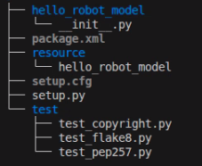

### URDF 파일 작성

`~/ros_ws/src/hello_robot_model` 경로 아래에 `urdf` 폴더를 생성한 뒤, 해당 폴더에 `simple_2r_arm.urdf`라는 이름의 URDF 파일을 생성합니다. 파일까지 생성하면 아래와 같이 구성됩니다.

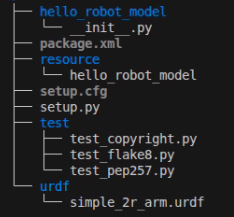


이후, 아래의 내용을 입력합니다.


```xml
<?xml version="1.0"?>
<robot name="simple_2r_arm">

  <material name="gray">
    <color rgba="0.7 0.7 0.7 1.0"/>
  </material>

  <material name="blue">
    <color rgba="0.2 0.4 0.8 1.0"/>
  </material>

  <material name="orange">
    <color rgba="0.9 0.5 0.1 1.0"/>
  </material>

  <material name="green">
    <color rgba="0.2 0.7 0.3 1.0"/>
  </material>

  <link name="world"/>

  <link name="base_link">
    <visual>
      <origin xyz="0 0 0.03" rpy="0 0 0"/>
      <geometry>
        <cylinder radius="0.08" length="0.06"/>
      </geometry>
      <material name="gray"/>
    </visual>
  </link>

  <joint name="world_to_base" type="fixed">
    <parent link="world"/>
    <child link="base_link"/>
    <origin xyz="0 0 0" rpy="0 0 0"/>
  </joint>

  <link name="link1">
    <visual>
      <origin xyz="0.20 0 0" rpy="0 0 0"/>
      <geometry>
        <box size="0.40 0.04 0.04"/>
      </geometry>
      <material name="blue"/>
    </visual>
  </link>

  <joint name="joint1" type="revolute">
    <parent link="base_link"/>
    <child link="link1"/>
    <origin xyz="0 0 0.06" rpy="0 0 0"/>
    <axis xyz="0 0 1"/>
    <limit lower="-1.57" upper="1.57" effort="1.0" velocity="1.0"/>
  </joint>

  <link name="link2">
    <visual>
      <origin xyz="0.15 0 0" rpy="0 0 0"/>
      <geometry>
        <box size="0.30 0.04 0.04"/>
      </geometry>
      <material name="orange"/>
    </visual>
  </link>

  <joint name="joint2" type="revolute">
    <parent link="link1"/>
    <child link="link2"/>
    <origin xyz="0.40 0 0" rpy="0 0 0"/>
    <axis xyz="0 0 1"/>
    <limit lower="-1.57" upper="1.57" effort="1.0" velocity="1.0"/>
  </joint>

  <link name="tool_link">
    <visual>
      <geometry>
        <sphere radius="0.05"/>
      </geometry>
      <material name="green"/>
    </visual>
  </link>

  <joint name="tool_joint" type="fixed">
    <parent link="link2"/>
    <child link="tool_link"/>
    <origin xyz="0.30 0 0" rpy="0 0 0"/>
  </joint>

</robot>
```

여기서 `<visual>` 안의 `<origin>`은 링크 좌표계 기준으로 시각 형상을 어디에 그릴지 정하는 값입니다. 예를 들어 `link1`의 좌표계는 조인트 위치에 있고, 길이 0.40m의 박스 형상만 x 방향으로 0.20m 이동되어 표시됩니다.

### package.xml 파일 수정

아래 코드를 참고하여 패키지 내 `package.xml` 파일을 수정합니다.

```xml
...
  <depend>robot_state_publisher</depend>
  <depend>joint_state_publisher_gui</depend>
  <depend>rviz2</depend>
...
```

### launch 파일 생성

`hello_robot_model` 패키지 경로 아래에 `launch` 폴더를 생성한 뒤, 해당 폴더에 `bringup.launch.py`라는 이름의 파이썬 파일을 생성합니다. 이후, 아래의 내용을 입력합니다.

```python
# launch/bringup.launch.py

from launch import LaunchDescription
from launch_ros.actions import Node
from ament_index_python.packages import get_package_share_directory
import os

def generate_launch_description():
    pkg_dir = get_package_share_directory('hello_robot_model')
    urdf_path = os.path.join(pkg_dir, 'urdf', 'simple_2r_arm.urdf')

    with open(urdf_path, 'r', encoding='utf-8') as f:
        robot_description = f.read()

    return LaunchDescription([
        Node(
            package='robot_state_publisher',
            executable='robot_state_publisher',
            parameters=[{'robot_description': robot_description}]
        ),
        Node(
            package='joint_state_publisher_gui',
            executable='joint_state_publisher_gui'
        ),
        Node(
            package='rviz2',
            executable='rviz2'
        )
    ])
```

이 launch 파일에서 실행되는 노드는 다음과 같습니다.

- `robot_state_publisher`
- `joint_state_publisher_gui` : 각 조인트의 값을 GUI를 통해 조절할 수 있게 하는 노드입니다.
- `rviz2` : 시각화 도구입니다. 자세한 내용은 뒤에서 다시 설명합니다.

### setup.py 수정

아래 코드를 참고하여 패키지 내 `setup.py` 파일을 수정합니다.

```python
...
    data_files=[
        ('share/ament_index/resource_index/packages',
            ['resource/' + package_name]),
        ('share/' + package_name, ['package.xml']),
        ('share/' + package_name + '/urdf', ['urdf/simple_2r_arm.urdf']),
        ('share/' + package_name + '/launch', ['launch/bringup.launch.py'])
    ],
...
```

### 빌드 및 실행

터미널에서 아래 명령어를 입력하여 패키지를 빌드한 뒤 실행합니다.

```sh
cd ~/ros_ws
colcon build --symlink-install --packages-select hello_robot_model
source ./install/setup.bash
ros2 launch hello_robot_model bringup.launch.py
```

### RViz2 시각화

RViz2는 ROS2용 3D 시각화 도구입니다. 물리 시뮬레이션을 계산하지 않고 로봇 모델링과 주변 환경, 센서 데이터 등을 시각화하기 위해 사용됩니다. RViz2의 많은 Display는 ROS2 토픽, TF, 파라미터 등을 읽어 화면에 반영합니다.

**뷰 조작방법**
|동작|마우스 조작|
|--|---------|
|회전|좌클릭 드래그|
|이동|중클릭 드래그 혹은 `shift`+좌클릭|
|줌|휠 스크롤|
|원점으로 리셋|숫자 `0`키|

**자주 사용하는 Display 타입**

|타입|토픽 예시|용도|
|:---:|:--------:|----|
|RobotModel|/robot_description + TF|로봇 3D 모델 표시|
|TF|-|좌표계 시각화|
|Image|/arm/front_cam, /arm/top_cam|카메라 이미지|
|MarkerArray|/visualization_marker_array|경로·목표점 표시|
|LaserScan|/scan|라이다 데이터|
|PointCloud2|/depth/points|깊이 카메라 포인트 클라우드|

RViz2에 대한 자세한 내용은 아래 링크를 참고하시기 바랍니다.

- https://docs.ros.org/en/humble/Tutorials/Intermediate/RViz/RViz-User-Guide/RViz-User-Guide.html

위 과정을 통해 프로그램을 실행하면 다음 사진과 같이 RViz 기본 화면이 실행됩니다.

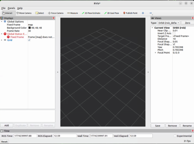

<br><br>

왼쪽 아래에 'Add' 버튼을 눌러 Display를 추가하는 창을 엽니다.

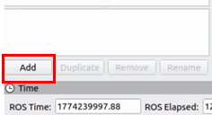

<br><br>

표시되는 창에서 로봇 모델을 표시할 Display 창을 선택합니다. `rviz_default_plugins` > `RobotModel`을 선택합니다.

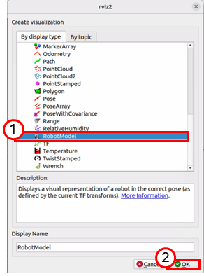

<br><br>

'OK' 버튼을 클릭하면 RViz2 좌측 'Displays' 패널에 'RobotModel' 항목이 추가된 것을 확인합니다. 이 항목을 확장하여 'Description Topic' 항목을 클릭해 아래 사진과 같이 `/robot_description` 토픽으로 설정합니다. 이 토픽은 RViz가 로봇 모델을 읽기 위해 사용합니다.

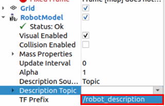

<br>

토픽을 적용하면 아래와 같이 표시되는 것을 확인합니다.

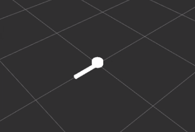

<br><br>

위 작업을 통해 로봇 모델 파일을 불러와 화면에 표시하는 데 성공했습니다. 하지만 Display 패널에는 에러가 출력되고, 표시되는 로봇도 흰색으로만 표시됩니다.

이를 해결하기 위해 Display 패널 상단의 `Global Options` 항목을 설정해야 합니다. Global Options는 RViz2 전체 화면에 공통으로 적용되는 기준 설정입니다.

**Global Options**
|항목|설명|
|----|---|
|Fixed Frame|모든 시각화 요소의 기준이 되는 TF 프레임<br>이 프레임을 기준으로 각 요소의 위치가 계산됨|
|Background Color|3D 뷰의 배경색을 변경<br>기본값은 회색인 (48, 48, 48)|
|Frame Rate|화면 갱신 속도를 설정<br>기본값은 30Hz|

에러가 출력되는 이유는 Fixed Frame이 현재 발행되는 TF 프레임과 일치하지 않기 때문입니다. RViz2는 Fixed Frame으로 지정된 프레임을 기준으로 모든 링크의 위치를 계산하는데, 기준 프레임이 TF에 존재하지 않으면 위치를 계산할 수 없어 에러가 발생합니다.

Displays 패널의 Global Options에서 Fixed Frame을 `base_link`로 설정합니다.

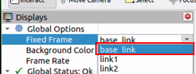

<br>

`base_link`를 Fixed Frame으로 설정하면 아래 사진과 같이 에러가 사라지고 로봇 모델이 정상적으로 표시됩니다.

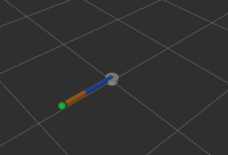

### 조인트 변경 확인

프로그램 실행 시 아래와 같이 조인트 값을 GUI를 통해 변경할 수 있는 프로그램이 실행됩니다.

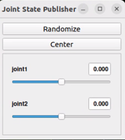

<br>

이 GUI의 각 조인트에 해당되는 슬라이더를 조절해 조인트 값을 바꾸고, 해당 값이 RViz2에 정상적으로 반영되는지 확인합니다.

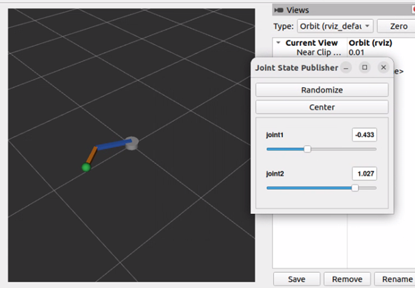


### URDF 예시

다음은 URDF 예시입니다.

```xml
<?xml version="1.0"?>
<robot name="simple_planar_arm">

  <link name="base_link">
    <visual>
      <origin xyz="0 0 0.03" rpy="0 0 0"/>
      <geometry>
        <cylinder radius="0.08" length="0.06"/>
      </geometry>
    </visual>
  </link>

  <link name="upper_arm_link">
    <visual>
      <origin xyz="0.20 0 0" rpy="0 0 0"/>
      <geometry>
        <box size="0.40 0.04 0.04"/>
      </geometry>
    </visual>
  </link>

  <joint name="shoulder_joint" type="revolute">
    <parent link="base_link"/>
    <child link="upper_arm_link"/>
    <origin xyz="0 0 0.06" rpy="0 0 0"/>
    <axis xyz="0 0 1"/>
    <limit lower="-1.57" upper="1.57" effort="1.0" velocity="1.0"/>
  </joint>

</robot>
```

위 URDF 파일은 하나의 조인트와 두 개의 링크로 이루어져 있습니다.

먼저 링크를 살펴보겠습니다. `base_link`는 Base와 같은 역할을 하며 일반적으로 기준 좌표계로 둡니다. 또한, `<link>` 태그 안에 `<visual>` 태그를 통해 실제로 보이는 부분을 명시했습니다. `<visual>` 안의 `<origin>`은 링크 좌표계 기준으로 시각 형상을 어디에 그릴지 지정하고, `<geometry>` 태그를 통해 링크를 이루는 물체의 크기와 종류를 명시합니다.

다음은 조인트를 살펴보겠습니다. 우선 조인트의 종류는 `<joint>` 태그 속성으로 `type="revolute"` 구문을 통해 회전 조인트임을 확인합니다. 태그 안을 살펴보면 `<parent link="..."/>`, `<child link="..."/>`가 명시됩니다. 이들은 앞서 설명했던 대로 링크와 조인트의 연결 관계를 명확하게 보여줍니다. 트리는 `base_link` → `shoulder_joint` → `upper_arm_link`로 이어집니다. 또한 `<joint>` 안의 `<origin>`은 parent link 기준으로 joint frame이 어디에 놓이는지 지정하고, `<axis>` 태그는 revolute joint의 회전축 또는 prismatic joint의 이동축을 지정합니다. `<limit>` 태그로는 조인트 자유도의 범위를 지정해 주었습니다.

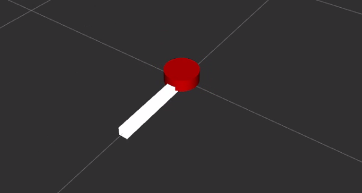

**실습 : 조인트 축 바꿔보기**

joint의 축을 바꿔보며 RViz에서 회전 방향을 비교해 보겠습니다.

```xml
<!-- z축 회전-->
<axis xyz="0 0 1"/>

<!-- y축 회전으로 변경해보기 -->
<axis xyz="0 1 0"/>

<!-- x축 회전으로 변경해보기 -->
<axis xyz="1 0 0"/>
```

> [!Note]
> 1. axis가 '0 0 1'일 때 link1은 어느 방향으로 회전하나요?
> 2. axis를 '0 1 0'으로 바꾸면 RViz에서 움직임이 어떻게 달라지나요?
> 3. PhysicAI Arm의 shoulder_pan은 어떤 축 회전에 가까운가요?

**실습 : link 길이 변경 실습**

`upper_arm_link`의 길이와 visual origin을 바꿔 RViz에서 형상이 어떻게 달라지는지 확인해 보겠습니다.

```xml
<?xml version="1.0"?>
<robot name="simple_planar_arm">

  <link name="base_link">
    <visual>
      <origin xyz="0 0 0.03" rpy="0 0 0"/>
      <geometry>
        <cylinder radius="0.08" length="0.06"/>
      </geometry>
    </visual>
  </link>

  <link name="upper_arm_link">
    <visual>
      <origin xyz="0.25 0 0" rpy="0 0 0"/>
      <geometry>
        <box size="0.50 0.04 0.04"/>
      </geometry>
    </visual>
  </link>

  <joint name="shoulder_joint" type="revolute">
    <parent link="base_link"/>
    <child link="upper_arm_link"/>
    <origin xyz="0 0 0.06" rpy="0 0 0"/>
    <axis xyz="0 0 1"/>
    <limit lower="-1.57" upper="1.57" effort="1.0" velocity="1.0"/>
  </joint>

</robot>
```

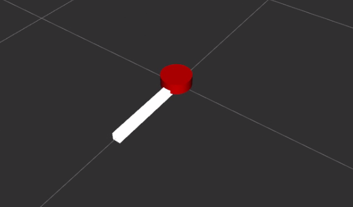


## PhysicAI Arm 모델링 정보

PhysicAI Arm 장비에서 각 링크의 위치와 좌표계 관계를 계산하기 위해서는 동일하게 로봇 모델링 파일이 필요합니다. PhysicAI Arm의 각 링크 및 조인트의 정보는 아래와 같습니다.

**Link**

| Name | visual length 기준 (mm) |
| ---- | ----------- |
| base_link | 46.84 |
| shoulder_link | 79.38 |
| upper_arm_link | 116.09 |
| lower_arm_link | 134.37 |
| wrist_link | 58.17 |
| gripper_link | 33.49 |


**Joint**

대부분의 joint는 Revolute Joint이며, Gripper Joint는 별도로 정의합니다.

| Name | Range ($\theta$) | motion |
| ---- | ----------- | ----- |
| shoulder_pan | -1.92 ~ 1.92 | yaw(z축 회전) |
| shoulder_lift | -1.75 ~ 1.75 | pitch |
| elbow_flex | -1.69 ~ 1.69 | pitch |
| wrist_flex | -1.66 ~ 1.66 | pitch |
| wrist_roll | -2.74 ~ 2.74 | roll |
| gripper | -0.17 ~ 1.75 | - |

위 정보들을 바탕으로 URDF를 작성하여 로봇 모델링 파일을 만들고 TF를 발행합니다. 원활한 실습을 위해 모델링 진행 및 TF 발행, 그리고 다음 챕터에서 소개할 제어 토픽까지 모두 포함된 PhysicAI Arm 제어 패키지를 제공합니다.


## 연습 과제 : PhysicAI Arm 로봇 모델을 RViz2에 출력하기

요구되는 다음 조건에 맞춰 PhysicAI Arm을 RViz2에 출력하고, 각 조인트의 움직임이 시각화되도록 launch 파일을 수정하여 패키지를 실행하시기 바랍니다.

**과제 조건**

- 본 챕터의 목차 *PhysicAI Arm 모델링 정보*를 참고하여 제공된 `physicai_arm` 패키지를 준비한 후 복사하고, 임의의 이름으로 변경하여 작업을 진행하시오.
- 패키지 내 `launch/bringup.launch.py` 경로에 있는 launch 파일을 수정하여 아래 노드들이 추가적으로 실행되도록 변경하시오.
  - `rviz2`
  - `joint_state_publisher_gui`
- `joint_state_publisher_gui`의 기본 출력 토픽은 `/joint_states`입니다. `remapping` 옵션을 사용하여 `/joint_states` 토픽이 `/joint_targets`로 매핑되도록 설정하십시오.
- `physicai_arm` 패키지 실행 후, 해당 패키지에서 `/robot_description` 토픽으로 제공되는 로봇 모델 정보를 RViz2에 출력하시오.
- `joint_state_publisher_gui`를 통해 조인트가 실시간으로 변하는지 확인하시오.

출력이 완료되면 아래와 같이 표시됩니다.

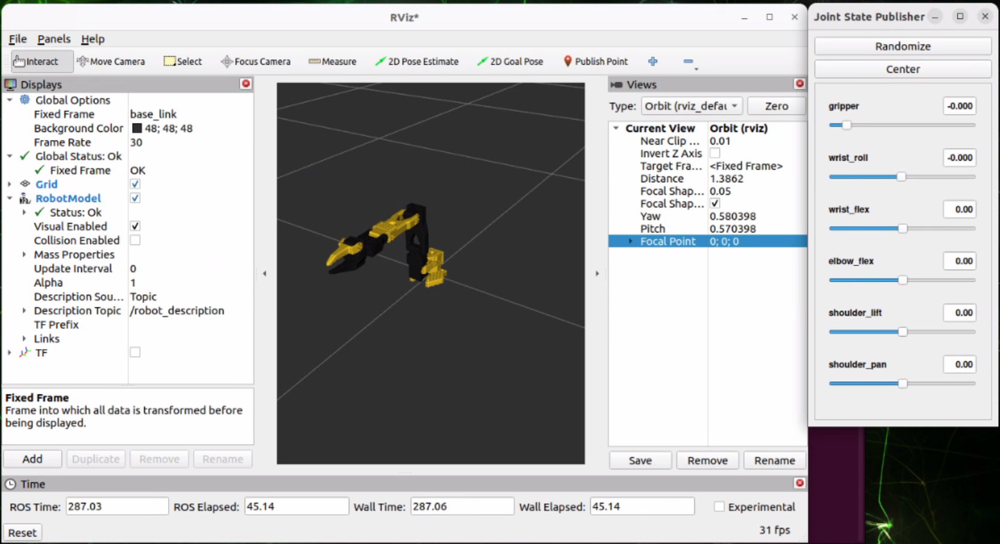

<br>

> [!Warning]
> 값을 변경할 땐 슬라이더 바를 천천히 조절해 가며 제어해 주십시오. (초당 권장 변경 값 : 0.1) 너무 빠른 속도로 로봇을 제어하게 될 경우 장비가 파손될 위험이 있습니다.

> [!Note]
> RViz2의 Display 기능 중 'TF'라는 기능이 있습니다. 이는 각 조인트에 부착된 좌표계를 시각화합니다. TF Display를 추가한 뒤 조인트 각도를 조절하면서 각 조인트에 부착된 좌표계가 어떻게 변화되는지 눈으로도 확인해 보세요.

**실습 : 디버깅**

URDF의 항목을 하나씩 수정해 보며 어떤 변화가 나타나는지 기록하면서 실습해 보겠습니다. 다음 항목을 하나씩 바꾸고 RViz 결과를 기록하시기 바랍니다.
1. 'joint2'의 parent를 'base_link'로 바꾸기
2. 'joint2'의 origin을 '0.10 0 0'으로 바꾸기
3. 'tool_joint'의 type을 'revolute'로 바꾸기
4. 'link2'의 visual origin을 '0 0 0'으로 바꾸기
5. 'axis xyz'를 '0 0 0'으로 바꾸고, 유효하지 않은 축 설정에서 어떤 오류가 나는지 확인하기

## RViz 카메라 이미지 시각화

RViz를 활용하여 카메라 이미지를 토픽으로 받아 시각화하겠습니다.

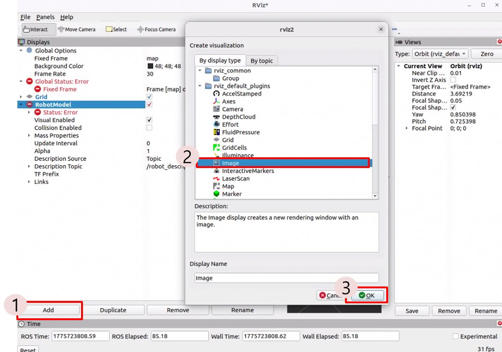

Display 메뉴창에서 Image를 찾아 누른 뒤, 토픽에서 `/arm/front_cam`과 `/arm/top_cam` 중 원하는 카메라 위치를 찾아 선택합니다.

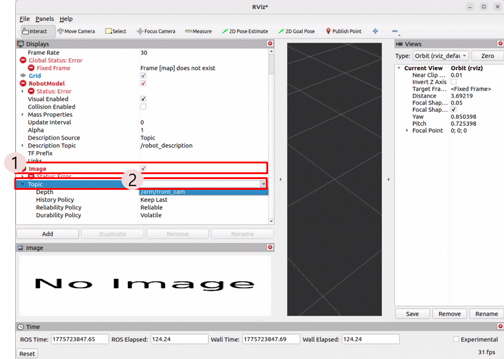

토픽 선택이 완료되면, 다음과 같이 카메라 이미지가 표시되는 것을 확인합니다.

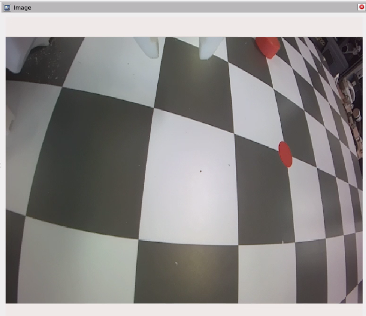

RViz는 이미지를 확인하는 데 적합하지만, 이미지를 처리하고 활용하려면 OpenCV를 활용하는 것이 적합합니다. 이미지 처리, 객체 검출, 제어 로직 연동은 OpenCV 같은 영상 처리 라이브러리를 사용하는 것이 적합합니다.

> [!Tip]
> File > Save Config As로 RViz 설정을 .rviz 파일로 저장할 수 있습니다.

----

## 복습 퀴즈

1. URDF에서 \<link>와 \<joint>의 역할 차이는 무엇인가?

<br>

2. 아래 조인트에서 parent link와 child link는 각각 무엇인가?

```
<joint name="joint1" type="revolute">
  <parent link="base_link"/>
  <child link="link1"/>
</joint>
```

<br>

3. joint1의 `<axis xyz="0 0 1"/>`은 어떤 축을 기준으로 회전한다는 뜻인가?

<br>

4. RViz2에서 Fixed Frame을 잘못 설정하면 어떤 문제가 발생하는가?

<br>

5. robot_state_publisher는 어떤 정보를 입력받고 어떤 정보를 출력하는가?

<br>

6. `/tf`와 `/tf_static`의 차이는 무엇인가?

<br>

7. joint_state_publisher_gui는 어떤 토픽에 값을 발행하는가?

<br>

8. URDF에서 link의 시각적 위치를 바꾸는 태그는 무엇인가?

```
<visual>
  <origin xyz="0.20 0 0" rpy="0 0 0"/>
</visual>
```

<br>

9. setup.py의 data_files에 URDF와 launch 파일을 추가해야 하는 이유는 무엇인가?

