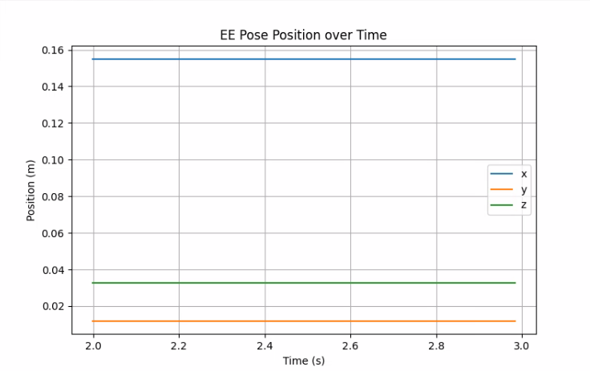
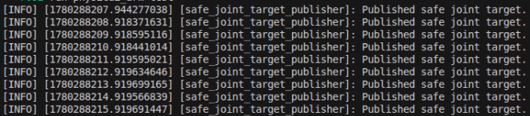

# Robot Control

이전 챕터에서는 컴퓨터가 로봇을 이해할 수 있도록 로봇 모델을 표현하는 방법을 배웠습니다. 이 챕터에서는 ROS2와 기초 로봇공학 지식을 바탕으로 토픽을 발행해 로봇을 실제로 제어하는 방법을 살펴봅니다. 

제어 패키지 다운로드 및 실행은 [1장의 1.1. Overview](/Chapter01.%20Overview/1-1.%20Overview.md#제어-패키지)파트를 참고해 주시기 바랍니다. 모든 실습은 bringup 런치 파일을 실행한 뒤 진행합니다.

## 토픽 구조

제공되는 제어 패키지의 토픽은 다음과 같습니다.

| 토픽 | 메시지 | Pub/Sub<br>(제어패키지기준) | 설명 |
| ----- | ---- | --- | ---- | 
| /joint_states | sensor_msgs/JointState | Pub | 각 조인트의 관절 값 발행 |
| /joint_targets | sensor_msgs/JointState | Sub | 각 조인트의 목표 관절 값 구독 |
| /robot_description | std_msgs/String | Pub | 로봇의 구조를 담은 URDF 문자열 |
| /safety/torque_enable | std_msgs/Bool | Sub | 토크 활성화/비활성화 명령 구독 |
| /tf | tf2_msgs/TFMessage | Pub | TF 값 발행 |
| /tf_static | tf2_msgs/TFMessage | Pub | 정적 TF 값 발행 |

## 안전 인터락

모든 산업용 로봇들은 발생할 수 있는 안전사고에 대비하여 안전 관련 기능이 탑재되어 있습니다. 대표적으로 수행 중인 동작을 즉시 정지하는 긴급 정지 기능이 있습니다.

본 장비에도 모터 토크 출력을 일시적으로 비활성화하는 안전 관련 토픽이 있습니다. 제어 패키지를 실행하면 로봇은 가장 기본 자세로 이동하고 각 모터에 토크가 활성화되어 손을 이용해 임의로 로봇 자세를 변경할 수 없습니다. 로봇 제어 측면에서는 이런 토크 활성화가 필수적이지만, 실습 등의 요인으로 경우에 따라서는 이 토크를 비활성화하여 로봇의 자세를 임의로 조작해야 할 때도 존재합니다.

제어 패키지는 `/safety/torque_enable` 토픽을 구독하여 안전 인터락 기능을 활성화하거나 비활성화합니다. 이 토픽은 `std_msgs/Bool` 메시지를 사용해 통신하는데, 이 메시지는 ROS2 표준 메시지 중 하나이며 `True/False`와 같은 불리언 값을 담아 통신합니다.

먼저 모터의 토크를 비활성화해 보겠습니다. 새 터미널을 연 다음 아래 명령어를 입력합니다. 아래 명령어를 실행하면 손으로 로봇의 자세를 임의로 조정할 수 있는 것을 확인할 수 있습니다. 로봇을 손으로 조작하며 각 모터의 관절 값을 변경해 보세요.

```sh
source ~/ros2_base/install/setup.bash
ros2 topic pub --once /safety/torque_enable std_msgs/msg/Bool "{data: false}"
```

ROS2 토픽을 발행하거나 구독하는 방법은 앞서 해 보았듯이 패키지를 생성한 뒤 실행할 수도 있지만, 터미널과 같은 CLI에서 패키지 생성 없이 바로 토픽을 발행하거나 구독할 수 있습니다.

본 교재에서는 실습을 위한 최소 수준의 ROS2 CLI를 사용합니다. 자세한 정보는 아래 링크를 확인하시기 바랍니다.

- https://docs.ros.org/en/humble/Tutorials/Beginner-CLI-Tools.html

다시 토크 값을 활성화하려면 터미널에 아래 명령어를 입력합니다.

```sh
ros2 topic pub --once /safety/torque_enable std_msgs/Bool "{data: true}"
```

## 현재 관절 값 읽기

> [!Note]
> 이 실습은 로봇을 손으로 임의 조작할 것이므로, 토크를 비활성화시킨 뒤 실습을 진행합니다.

ROS2 CLI를 통해 토픽을 구독하여 각 조인트의 관절 값을 확인해 봅니다. 


해당 토픽에서 받는 메시지는 `sensor_msgs/JointState`입니다. 이 메시지는 로봇의 각 관절 상태를 효과적으로 표현할 수 있는 ROS2 표준 센서 메시지입니다. 로봇이 현재 어떤 자세를 하고 있는지를 표현하는 핵심 데이터 구조이기에 여러 노드 및 현장에서 널리 쓰이는 메시지 타입입니다.

메시지 구조는 다음과 같습니다.

```
std_msgs/Header header

string[] name
float64[] position
float64[] velocity
float64[] effort
```

아래 내용은 메시지를 자세히 분석한 내용입니다.

### Header

```
std_msgs/Header header
```

해당 필드는 타임스탬프와 프레임 정보를 포함하며 로봇 상태가 언제 측정되었는지 나타냅니다. frame_id는 필요할 경우 데이터가 연결되는 기준 프레임을 나타내지만, JointState에서는 비어 있을 수 있습니다. 이 메시지 역시 ROS2 표준 메시지이며, 해당 메시지의 상세한 내용은 다음과 같습니다.

| 필드 | 설명 |
| --- | --- |
| stamp | 데이터가 생성된 시간 |
| frame_id | 기준 좌표계 |

### name

```
string[] name
```

해당 필드는 각 관절의 이름을 담은 문자열 배열입니다. 해당 배열은 URDF 또는 로봇 모델에서 정의된 joint 이름과 반드시 동일해야 합니다.

여기서 중요한 점은 바로 순서입니다. 아래 소개할 다른 필드의 배열(position, velocity 등)과 순서가 반드시 동일해야 합니다.

### position

```
float64[] position
```

해당 필드는 각 관절의 위치(Position) 값을 나타냅니다. FK 계산에서 가장 핵심적으로 사용되는 값입니다. Revolute 조이트는 보통 rad, Prismatic 조인트는 m 단위로 표현합니다.

### velocity

```
float64[] velocity
```

해당 필드는 각 관절의 속도를 나타냅니다. Revolute 조인트의 경우 속도를 rad/s 단위로 표현합니다. 

### effort

```
float64[] effort
```

해당 필드는 각 관절에 작용하는 힘이나 토크를 나타냅니다. Revolute 조인트의 경우 N·m 단위를 사용합니다.


### 실제 데이터 확인해 보기

터미널에 아래 명령어를 입력합니다.

```sh
ros2 topic echo /joint_states
```

아래는 토픽을 구독했을 때 출력 예입니다.

```
header:
  stamp:
    sec: 28026
    nanosec: 109639488
  frame_id: ''
name:
- shoulder_pan
- shoulder_lift
- elbow_flex
- wrist_flex
- wrist_roll
- gripper
position:
- -0.07976700097005335
- -1.7978254834019713
- 1.5723303075827821
- -0.04295146206079795
- 0.007669903939428206
- -0.0046019423636569235
velocity: []
effort: []
```

이 메시지를 보고 우리는 다음과 같이 해석할 수 있습니다.

- shoulder_pan의 관절 값은 -0.079767
- shoulder_lift의 관절 값은 -1.797825

또한 메시지를 더 살펴보면 velocity와 effort 배열의 값이 생략된 것을 확인할 수 있습니다. 현재 본 장비/패키지에서는 velocity와 effort 값을 별도로 제공하지 않기 때문에 빈 배열로 발행합니다. 또한 정밀 토크 연산을 할 필요 없기 때문에 불필요한 데이터는 생략한 것으로 볼 수 있습니다. 이처럼 각 메시지의 모든 필드에 데이터를 다 채워 넣을 필요가 없으며, 필요한 필드만 골라 사용할 수 있습니다.

현재 로봇의 토크를 비활성화해 두었기 때문에 로봇의 관절 값을 임의로 조정할 수 있습니다. 손으로 로봇의 자세를 변경해 가며 각 관절에 해당하는 관절 값이 제대로 변하는지 확인해 보시기 바랍니다.

### 실습 1 : 현재 관절 값 저장하기

앞서 배운 `ros2 topic echo` 명령어가 아닌 Python을 이용하여 관절 값을 저장해 보겠습니다. JointState 토픽 값을 구독하여 시간이 포함된 joint_state_log_*.csv 파일로 저장하는 예제입니다.

```python
import rclpy
from rclpy.node import Node
from sensor_msgs.msg import JointState
import csv
import os
from datetime import datetime

class JointStateRecorder(Node):
    def __init__(self):
        super().__init__("joint_state_recorder")
        now = datetime.now().strftime("%Y%m%d_%H%M%S")
        self.file_path = os.path.expanduser(f"~/joint_state_log_{now}.csv")
        self.file = open(self.file_path, "w", newline="", encoding="utf-8", buffering=1)
        self.writer = csv.writer(self.file)
        self.header_written = False
        self.sub = self.create_subscription(
            JointState,
            "/joint_states",
            self.callback,
            10
        )
        self.get_logger().info(f"Saving joint states to {self.file_path}")

    def callback(self, msg):
        if not self.header_written:
            header = ["time"] + list(msg.name)
            self.writer.writerow(header)
            self.header_written = True
        time_sec = msg.header.stamp.sec + msg.header.stamp.nanosec * 1e-9
        row = [time_sec] + list(msg.position)
        self.writer.writerow(row)
        self.get_logger().info(
            ", ".join([f"{n}: {p:.3f}" for n, p in zip(msg.name, msg.position)])
        )

    def destroy_node(self):
        self.file.flush()
        os.fsync(self.file.fileno())
        self.file.close()
        self.get_logger().info(f"Saved to {self.file_path}")
        return super().destroy_node()

def main(args=None):
    rclpy.init(args=args)
    node = JointStateRecorder()
    try:
        rclpy.spin(node)
    except KeyboardInterrupt:
        pass
    finally:
        node.destroy_node()
        rclpy.shutdown()

if __name__ == "__main__":
    main()
```

```
time,shoulder_pan,shoulder_lift,elbow_flex,wrist_flex,wrist_roll,gripper
1780287951.4729958,-0.11044661672776616,-1.787087617886772,1.4296700943094176,1.368310862793992,0.11044661672776616,-0.0030679615757712823
1780287951.493293,-0.11044661672776616,-1.787087617886772,1.4296700943094176,1.368310862793992,0.11044661672776616,-0.0030679615757712823
1780287951.5138323,-0.11044661672776616,-1.787087617886772,1.4296700943094176,1.368310862793992,0.11044661672776616,-0.0030679615757712823
1780287951.5328646,-0.11044661672776616,-1.787087617886772,1.4296700943094176,1.368310862793992,0.11044661672776616,-0.0030679615757712823
1780287951.5602129,-0.11044661672776616,-1.787087617886772,1.4296700943094176,1.368310862793992,0.11044661672776616,-0.0030679615757712823
1780287951.575388,-0.11044661672776616,-1.787087617886772,1.4296700943094176,1.368310862793992,0.11044661672776616,-0.0030679615757712823
```

## EE 자세 추론 및 지정

가장 기본적으로 필요한 관절 값을 어떻게 읽는지 이해했으니, 이제 EE의 자세를 추론하거나 지정하는 방법을 알아봅시다. 

EE를 제어하는 데 사용하는 메시지는 `geometry_msgs/PoseStamped`입니다. 이 메시지는 특정 시점과 좌표계에서의 위치(Position)와 방향(Orientation)을 표현하는 메시지입니다. 단순한 좌표가 아닌 '언제, 어떤 좌표계 기준에서, 어디에 있고 어떤 방향을 보고 있는가'를 동시에 표현하는 것입니다.

PoseStamped 메시지 구조는 아래와 같습니다.

```
std_msgs/Header header
geometry_msgs/Pose pose
```

### header

앞서 설명한 `std_msgs/Header`와 필드 구성은 동일합니다. 다만 `frame_id`의 중요성이 매우 큽니다. 위치 및 방위는 좌표계에 따라 그 값이 전부 달라집니다. 어떤 `frame_id`, 즉 어떤 좌표계를 기준으로 잡았는지 반드시 확인해야 합니다.

### pose

Pose는 두 부분으로 나누어집니다.

```
geometry_msgs/Point position
geometry_msgs/Quaternion orientation
```

**Position (위치)**

```
geometry_msgs/Point position
```

```
float64 x
float64 y
float64 z
```

- 단위 : 미터(m)
- 기준 : `header.frame_id`

이 필드는 기준 좌표계에서의 3D 위치를 표현합니다.

**Orientation (방위)**

```
geometry_msgs/Quaternion orientation
```

```
float64 x
float64 y
float64 z
float64 w
```

해당 필드 및 메시지는 기준 좌표계에서의 3D 방위를 표현합니다. 여기서 방위를 표현할 때 **Quaternion(쿼터니언)** 을 사용해서 표현합니다.

쿼터니언이란 방위를 표현하는 또 하나의 방식입니다. 좌표계의 회전을 담은 회전 행렬과 같은 역할을 합니다. 쿼터니언은 회전 행렬과 마찬가지로 3차원 회전을 표현하는 방식 중 하나입니다.

회전이 없는 기본 자세는 보통 다음과 같이 표현합니다.

```
orientation:
  x: 0.0
  y: 0.0
  z: 0.0
  w: 1.0
```

### 순기구학 연산을 통한 EE 자세 추론

> [!Note]
> 이 예제는 손 등으로 로봇을 임의로 조작할 것이므로 토크를 비활성화시킨 뒤 실습합니다.

앞 챕터에서 배운 순기구학/역기구학의 원리가 담긴 노드를 실행해 EE 자세를 추론하고 지정해보겠습니다. 연산과 수행에 필요한 패키지는 전부 미리 구현되어 있으며 본 교재에서는 메시지를 구독 및 발행하여 값을 해석하고 지정하는 데 초점을 둡니다.

EE 자세를 추론하는 흐름은 다음과 같습니다.

1. 드라이버 또는 상태 발행 노드가 각 관절 값을 `/joint_states`로 발행
2. FK 노드가 `/joint_state`를 구독하고 순기구학(FK)을 계산
3. 연산된 값을 `PoseStamped`로 변환하여 `/ee_pose` 토픽에 메시지 발행


터미널에 아래 명령어를 입력해 순기구학 연산 노드를 실행하여 현재 EE의 위치를 추정합니다.

```sh
source ~/physicai_arm_ws/install/setup.bash
ros2 run physicai_arm fk_calc
```

해당 노드를 실행하면 자동으로 연산과 변환을 수행합니다. 발행되는 `PoseStamped` 메시지는 새 터미널을 열어 아래 명령어를 입력해 확인해 볼 수 있습니다.

```sh
source ~/physicai_arm_ws/install/setup.bash
ros2 topic echo /ee_pose
```

아래는 토픽을 구독했을 때 출력 예시입니다.

```
header:
  stamp:
    sec: 1775205990
    nanosec: 29821297
  frame_id: base_link
pose:
  position:
    x: 0.17734785193739291
    y: 0.11006601991523621
    z: 0.04189928461211839
  orientation:
    x: 0.012889602852207969
    y: 0.0
    z: 0.0
    w: 1.0
```

이 메시지를 보고 다음과 같이 해석할 수 있습니다.

- 현재 기준 좌표계는 `base_link`로 두고 있음
- 위 좌표계를 기준으로 한 EE의 위치는 (0.177, 0.11, 0.041)임. 이는 x축으로 0.177m, y축으로 0.11m, z축으로 0.041m 위치에 있다는 의미
- 위 좌표계를 기준으로 한 EE의 방향은 쿼터니언 (x, y, z, w) = (0.013, 0, 0, 1.0)로 표현됨

현재 로봇의 토크를 비활성화해 두었기 때문에 로봇의 관절 값을 임의로 조정할 수 있습니다. 손으로 로봇의 자세를 변경해 가며 EE의 자세가 올바르게 변하는지 확인하시기 바랍니다.

### 역기구학 연산을 통한 EE 자세 지정

> [!Important]
> 이 예제는 온보드에서 토픽 발행 등을 활용해 로봇을 제어합니다. 토크를 활성화시킨 뒤 실습합니다.

EE 자세를 지정하는 방법은 다음과 같습니다.

1. 지정하고 싶은 EE 자세를 `PoseStamped` 메시지로 담아 `/target_pose` 토픽에 메시지 발행
2. `PoseStamped` 메시지를 읽은 뒤 파싱하여 역기구학(IK) 연산
3. 연산된 값을 `JointState`로 변환하여 `/joint_targets` 토픽에 메시지 발행

터미널에 아래 명령어를 입력해 역기구학 연산 노드를 실행합니다.

```sh
source ~/physicai_arm_ws/install/setup.bash
ros2 run physicai_arm ik_calc
```

새 터미널에서 아래 명령어로 `/target_pose`에 원하는 EE 자세를 담은 PoseStamped 메시지를 발행하면, 입력값에 따라 로봇 자세가 변경됩니다.

```sh
source ~/physicai_arm_ws/install/setup.bash
ros2 topic pub --once /target_pose geometry_msgs/msg/PoseStamped "{
  header: {
   frame_id: 'base_link'
  },
  pose: {
    position: {x: 0.19, y: 0, z: 0.09},
    orientation: {x: -0.156, y: 0.957, z: -0.04, w: 0.243}
  }
}"
```

> [!Warning]
> position의 단위는 m입니다. 임의로 너무 큰 값을 주지 마십시오. 장비가 파손될 수 있습니다.


### Leader-Follower 제어

Follower Arm은 Leader Arm으로 제어할 수 있으며, teleoperation 노드를 실행해야 합니다. `bringup.launch.py` 런치 파일을 실행한 상태에서 teleoperation 노드를 추가로 실행하면 Leader Arm의 움직임을 Follower Arm으로 전달할 수 있습니다.

Leader-Follower 제어 방법은 [1-1. Overview](/Chapter01.%20Overview/1-1.%20Overview.md#Follower-Arm)를 참고해 주시기 바랍니다.
### 실습 2 : EE 위치 기록기

앞서 배운 `ros2 topic echo` 명령어가 아닌 Python을 이용하여 /ee_pose를 기록해 보겠습니다. /ee_pose 토픽 값을 구독하여 Matplotlib를 활용해 EE 자세의 경로를 그래프로 시각화하겠습니다. 다음 예제는 /ee_pose를 10초 동안 저장한 뒤, 시각화하는 실습입니다.

```python
import xml.etree.ElementTree as ET

import numpy as np
import rclpy
from geometry_msgs.msg import PoseStamped
from rclpy.node import Node
from rclpy.qos import QoSDurabilityPolicy, QoSProfile, QoSReliabilityPolicy
from sensor_msgs.msg import JointState
from std_msgs.msg import Float64MultiArray, String
from scipy.spatial.transform import Rotation


def rx(a):
    c, s = np.cos(a), np.sin(a)
    return np.array([[1.0, 0.0, 0.0], [0.0, c, -s], [0.0, s, c]])


def ry(a):
    c, s = np.cos(a), np.sin(a)
    return np.array([[c, 0.0, s], [0.0, 1.0, 0.0], [-s, 0.0, c]])


def rz(a):
    c, s = np.cos(a), np.sin(a)
    return np.array([[c, -s, 0.0], [s, c, 0.0], [0.0, 0.0, 1.0]])


def rpy(v):
    return rz(v[2]) @ ry(v[1]) @ rx(v[0])


def rot(axis, q):
    x, y, z = np.array(axis, dtype=float) / np.linalg.norm(axis)
    c, s, C = np.cos(q), np.sin(q), 1.0 - np.cos(q)
    return np.array([
        [c + x * x * C, x * y * C - z * s, x * z * C + y * s],
        [y * x * C + z * s, c + y * y * C, y * z * C - x * s],
        [z * x * C - y * s, z * y * C + x * s, c + z * z * C],
    ])


def tf(xyz, R):
    T = np.eye(4)
    T[:3, :3] = R
    T[:3, 3] = np.array(xyz, dtype=float)
    return T


class PhysicAIArmFKNode(Node):
    def __init__(self):
        super().__init__('physicai_arm_fk_node')
        self.state = {}
        self.chain = []
        self.names = []
        q = QoSProfile(depth=1)
        q.durability = QoSDurabilityPolicy.TRANSIENT_LOCAL
        q.reliability = QoSReliabilityPolicy.RELIABLE
        self.create_subscription(String, '/robot_description', self.urdf_cb, q)
        self.create_subscription(JointState, '/joint_states', self.js_cb, 50)
        self.pub = self.create_publisher(PoseStamped, '/ee_pose', 50)

    def urdf_cb(self, msg):
        root = ET.fromstring(msg.data)
        child_to_joint = {}
        for j in root.findall('joint'):
            o = j.find('origin')
            a = j.find('axis')
            xyz = [0.0, 0.0, 0.0] if o is None else [float(v) for v in o.attrib.get('xyz', '0 0 0').split()]
            rr = [0.0, 0.0, 0.0] if o is None else [float(v) for v in o.attrib.get('rpy', '0 0 0').split()]
            axis = [1.0, 0.0, 0.0] if a is None else [float(v) for v in a.attrib.get('xyz', '1 0 0').split()]
            child = j.find('child').attrib['link']
            child_to_joint[child] = {
                'name': j.attrib['name'],
                'type': j.attrib['type'],
                'parent': j.find('parent').attrib['link'],
                'child': child,
                'xyz': xyz,
                'rpy': rr,
                'axis': axis,
            }
        chain = []
        child = 'gripper_frame_link'
        while child != 'base_link':
            if child not in child_to_joint:
                self.get_logger().warning('gripper_frame_link chain not found in robot_description')
                return
            chain.insert(0, child_to_joint[child])
            child = child_to_joint[child]['parent']
        self.chain = chain
        self.names = [j['name'] for j in chain if j['type'] in ('revolute', 'continuous', 'prismatic')]
        self.get_logger().info('robot_description loaded')

    def fk(self):
        T = np.eye(4)
        for j in self.chain:
            T = T @ tf(j['xyz'], rpy(j['rpy']))
            if j['type'] in ('revolute', 'continuous'):
                T = T @ tf([0.0, 0.0, 0.0], rot(j['axis'], self.state[j['name']]))
            elif j['type'] == 'prismatic':
                T = T @ tf(np.array(j['axis']) * self.state[j['name']], np.eye(3))
        return T

    def js_cb(self, msg):
        for n, p in zip(msg.name, msg.position):
            self.state[n] = p
        if not self.chain or not all(n in self.state for n in self.names):
            return
        T = self.fk()
        p = PoseStamped()
        p.header.stamp = self.get_clock().now().to_msg()
        p.header.frame_id = 'base_link'
        p.pose.position.x = float(T[0, 3])
        p.pose.position.y = float(T[1, 3])
        p.pose.position.z = float(T[2, 3])
        q = Rotation.from_matrix(T[:3,:3]).as_quat()
        p.pose.orientation.x = q[0]
        p.pose.orientation.y = q[1]
        p.pose.orientation.z = q[2]
        p.pose.orientation.w = q[3]
        self.pub.publish(p)


def main(args=None):
    rclpy.init(args=args)
    node = PhysicAIArmFKNode()
    rclpy.spin(node)
    node.destroy_node()
    rclpy.shutdown()


if __name__ == '__main__':
    main()
```

```sh
# Terminal 1

source ~/physicai_arm_ws/install/setup.bash
ros2 launch physicai_arm bringup.launch.py
```

```sh
# Terminal 2

source ~/physicai_arm_ws/install/setup.bash
ros2 run physicai_arm fk_calc
```

```sh
# Terminal 3

python3 ee_pose_logger.py
```



**실습 : 안전 제한을 둔 Joint Target 발행기**

역기구학 연산을 통해 EE 자세 지정을 할 때 너무 큰 관절 값을 막는 예제입니다. 안전 제한을 통해 실제 로봇에 적용했을 때 위험한 상황을 피할 수 있습니다.

```py
import rclpy
from rclpy.node import Node
from sensor_msgs.msg import JointState

JOINT_LIMITS = {
    "shoulder_pan": (-1.92, 1.92),
    "shoulder_lift": (-1.75, 1.75),
    "elbow_flex": (-1.69, 1.69),
    "wrist_flex": (-2.74, 2.74),
    "wrist_roll": (-3.14, 3.14),
    "gripper": (-0.17, 1.75),
}

class SafeJointTargetPublisher(Node):
    def __init__(self):
        super().__init__("safe_joint_target_publisher")
        self.pub = self.create_publisher(JointState, "/joint_targets", 10)
        self.timer = self.create_timer(1.0, self.publish_target)

    def clamp(self, name, value):
        lower, upper = JOINT_LIMITS[name]
        return max(lower, min(upper, value))

    def publish_target(self):
        names = list(JOINT_LIMITS.keys())
        target = {
            "shoulder_pan": 0.0,
            "shoulder_lift": -0.8,
            "elbow_flex": 1.0,
            "wrist_flex": -0.3,
            "wrist_roll": 0.0,
            "gripper": 0.2,
        }
        msg = JointState()
        msg.header.stamp = self.get_clock().now().to_msg()
        msg.name = names
        msg.position = [self.clamp(name, target[name]) for name in names]
        self.pub.publish(msg)
        self.get_logger().info("Published safe joint target.")

def main(args=None):
    rclpy.init(args=args)
    node = SafeJointTargetPublisher()
    rclpy.spin(node)
    node.destroy_node()
    rclpy.shutdown()

if __name__ == "__main__":
    main()
```



## 이미지 토픽 시각화

카메라에서 발행되는 이미지를 확인하기 위해 RViz를 이용해 시각화합니다. 카메라 노드에서 발행하는 이미지 토픽을 RViz에서 실시간으로 확인합니다.

새 터미널을 열고 ROS2 환경을 설정한 후, RViz를 실행합니다.

```sh
# Terminal 1
ros2 launch physicai_arm bringup.launch.py
```

```sh
# Terminal 2
ros2 run rviz2 rviz2
```

RViz가 실행되면 좌측 하단의 Add 버튼을 눌러 디스플레이를 추가합니다. 창이 뜨면 Image를 선택한 뒤 OK를 누르면 됩니다.

----

## 복습 퀴즈

1. `/joint_states`와  `/joint_targets`의 차이는 무엇인가?

<br>

2. 로봇의 토크를 비활성화하려면 어떤 토픽에 어떤 메시지를 발행해야 하는가?

<br>

3. 다음 명령어의 의미를 설명하시오.

```sh
ros2 topic pub --once /safety/torque_enable std_msgs/Bool "{data: false}"
```

<br>

4. sensor_msgs/JointState 메시지에서 name 배열과 position 배열의 순서가 반드시 같아야 하는 이유는 무엇인가?

<br>

5. 아래 메시지를 보고 elbow_flex의 관절 값을 쓰시오.

```sh
name:
- shoulder_pan
- shoulder_lift
- elbow_flex
position:
- 0.1
- -0.5
- 1.2
```

<br>

6. JointState에서 Revolute Joint의 position 단위는 무엇인가?

<br>

7. `/ee_pose` 토픽은 어떤 메시지 타입을 사용하며 무엇을 표현하는가?

<br>

8. PoseStamped에서 header.frame_id가 중요한 이유는 무엇인가?

<br>

9. 기본 회전이 없는 Quaternion 값은 무엇인가?

<br>

10. FK와 IK의 입력/출력을 각각 쓰시오.

<br>

11. `/target_pose`를 발행하면 로봇이 움직이기까지 내부적으로 어떤 흐름을 거치는가?

<br>

12. OpenCV로 ROS2 image 토픽을 처리할 때 cv_bridge가 필요한 이유는 무엇인가?
