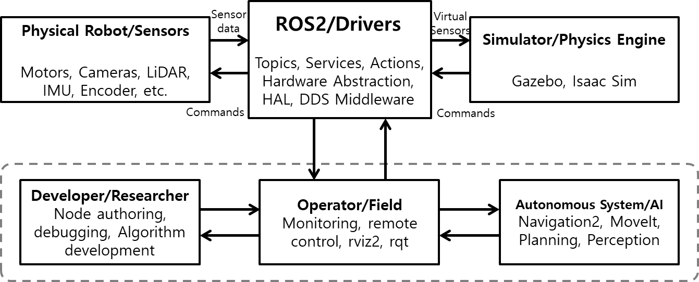
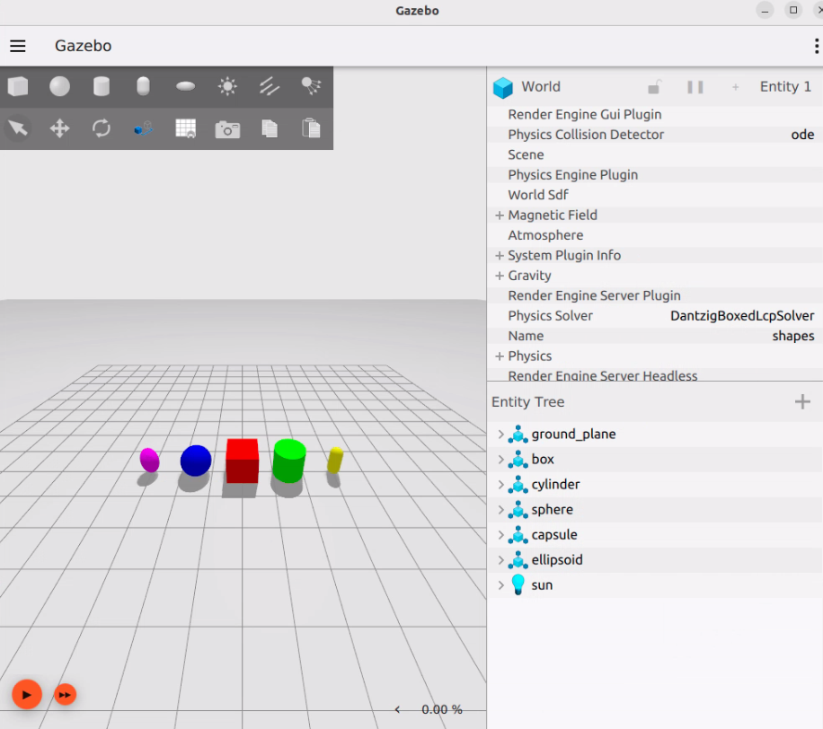
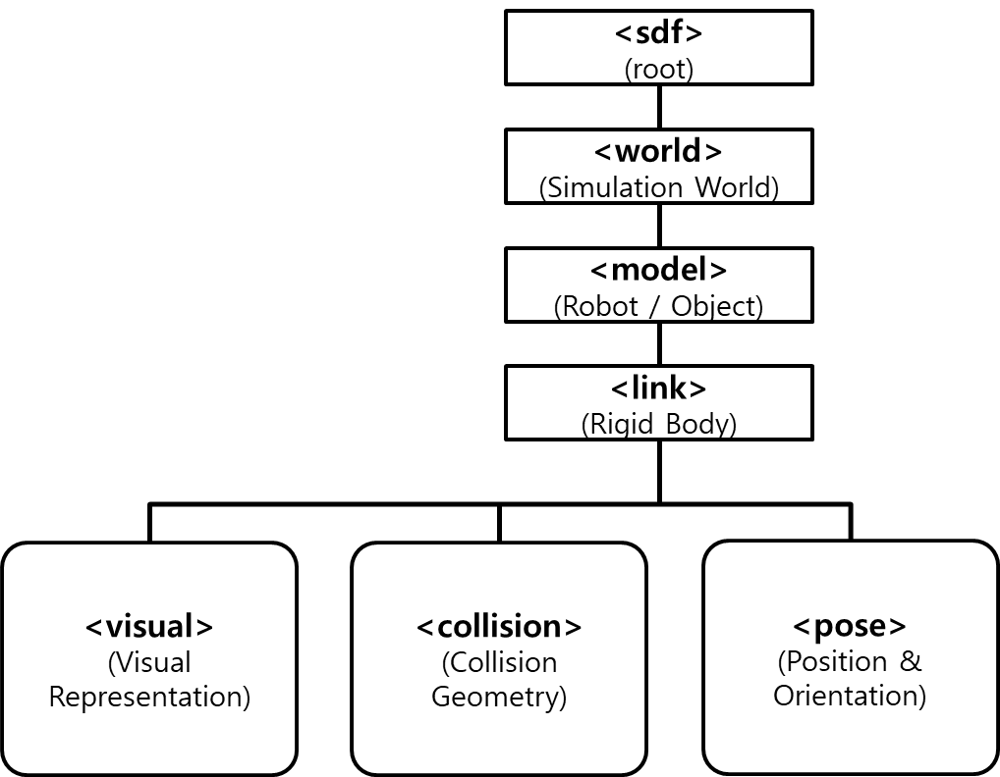
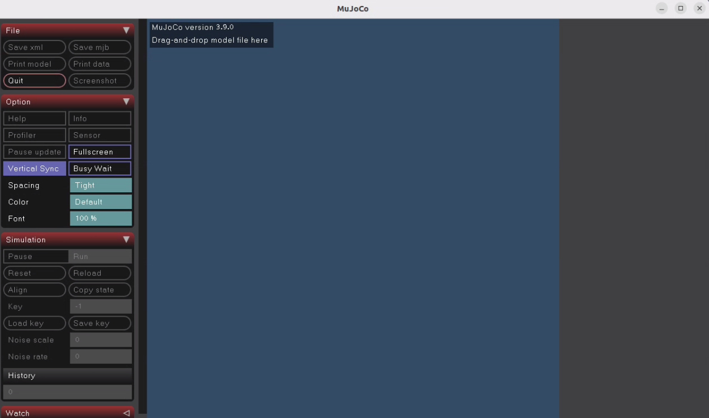
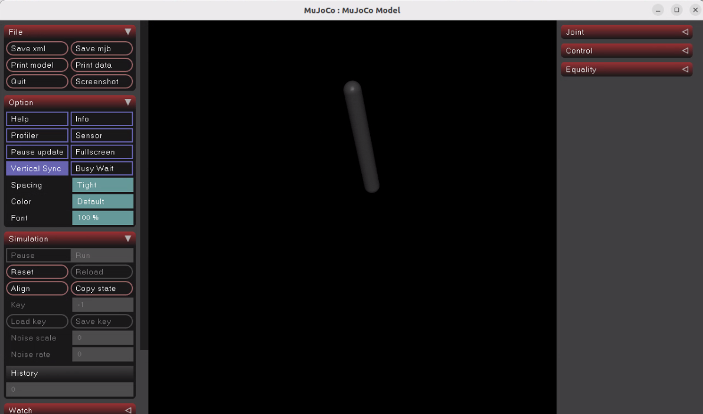
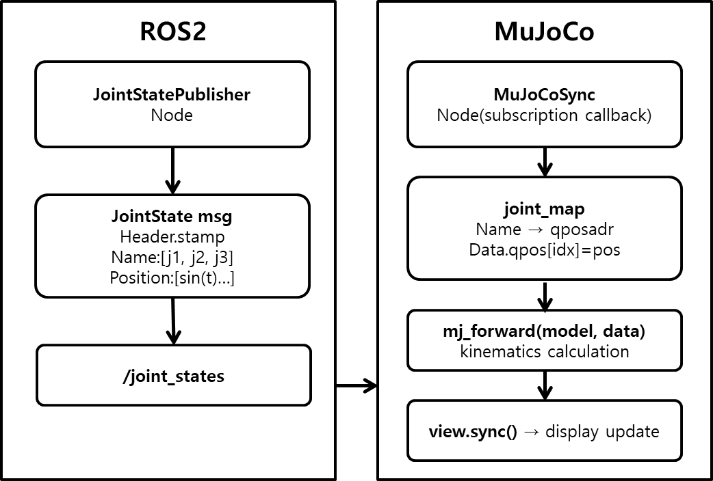
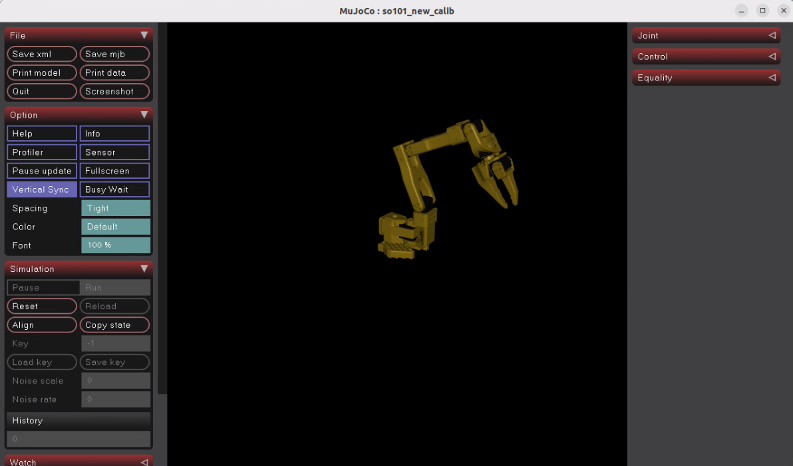
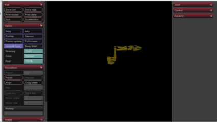
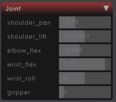
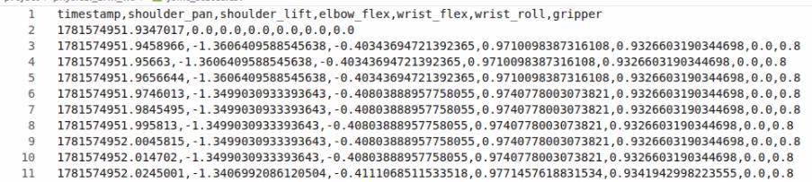

# Basic Simulation

## Gazebo란?


Gazebo는 로봇공학에서 3D 환경 속 로봇, 센서, 물체 등을 **실제와 유사한 물리 법칙**을 적용해 시뮬레이션하는 오픈소스 도구입니다. ROS2와의 연동성이 높으며, 로봇 팔·자율주행·제어 알고리즘 등을 안전하게 테스트하고 검증하는 데 사용됩니다.

Gazebo의 특징은 다음과 같습니다.

- **고성능 물리 엔진 기반 시뮬레이션** : 3D 모델의 움직임, 충돌, 중력 등을 계산합니다.
- **센서 시뮬레이션** : 카메라, LiDAR 등의 센서 데이터와 노이즈를 시뮬레이션할 수 있습니다.
- **ROS2 연동성** : ROS2 환경에서의 로봇 행동을 시뮬레이션할 수 있습니다.
- **플러그인 및 커스터마이징** : 플러그인 구조를 제공하며, 사용자가 로봇·센서·환경 제어 플러그인을 직접 개발할 수 있습니다.

본 교재에서는 Gazebo Fortress 버전을 사용합니다.

Gazebo에 대한 좀 더 자세한 내용은 아래 링크를 참고해 주시기 바랍니다.

- https://gazebosim.org/docs/fortress/getstarted/



## Gazebo 실행

Gazebo는 `ign` 명령어를 통해 실행할 수 있습니다. 터미널을 연 뒤, 다음 명령어로 Gazebo를 실행합니다. 예제 SDF 파일이 있는 경로에서 실행하거나, 파일 경롤를 함께 지정합니다.

```sh
source ~/ros2_base/install/setup.bash
ign gazebo shapes.sdf
```



## SDF 기초

SDF(Simulation Description Format)는 로봇 시뮬레이터에서 **사용할 환경(world), 물체(object), 로봇(robot)을 기술하는 XML 형식** 파일입니다. Gazebo에서는 SDF로 전체 world를 정의할 수도 있고, 개별 model만 정의할 수도 있습니다. 또한 조명과 센서, 물리 설정까지 SDF로 표현합니다. SDF의 루트 태그는 `<sdf>`이며, 그 아래에 `<world>`, `<model>`, `<actor>`, `<light>` 같은 요소가 있습니다.

대표적으로 많이 쓰이는 태그는 다음과 같습니다.

1. `<world>`   
    \<world>는 시뮬레이션 전체를 감싸는 태그입니다. world 안에는 모델, 장면 설정, 물리 엔진 설정, 플러그인 등이 들어갑니다. Gazebo에서는 하나의 맵 또는 시뮬레이션 환경에 해당합니다.

2. `<model>`   
    \<model>은 로봇 한 대, 박스 하나, 테이블 하나처럼 하나의 물리 객체를 정의하는 태그입니다. 하나 이상의 \<link>와 필요하면 \<joint>를 포함할 수 있습니다.

3. `<link> & <joint>`   
    \<link>는 모델을 구성하는 강체이며, \<joint>는 두 링크를 연결하는 태그입니다. 'Robot Modeling'에서 소개된 URDF의 link, joint 태그와 유사한 개념입니다.

4. `<pose>`   
    \<pose>는 위치와 자세를 나타내는 태그입니다. SDF의 pose 표현 방식은 다음과 같습니다.

    ```
    <pose>X Y Z roll pitch yaw</pose>
    ```

    여기서 앞의 X Y Z는 위치, 뒤의 R P Y는 roll, pitch, yaw입니다. 또한 pose는 기본적으로 부모 XML 요소의 좌표계를 기준으로 해석되며, 필요한 경우 relative_to 속성으로 기준 프레임을 명시할 수 있습니다.

5. `<visual>`   
    \<visual>은 화면에 보이는 모양을 정의합니다. 내부에 \<geometry>를 두고, 필요하면 \<material>을 추가해 색상도 지정합니다.

6. `<collision>`   
    \<collision>은 충돌 판정용 형상을 정의합니다. \<visual>과 모양이 같을 수도 있지만, 계산량을 줄이기 위해 더 단순한 형상을 쓰는 경우도 많습니다.

7. `<geometry>`   
    \<geometry>는 visual 또는 collision에서 사용할 기하 형상을 정의하는 태그입니다. 공식 문서 기준으로 \<box>, \<cylinder>, \<sphere>, \<plane>, \<mesh> 등을 사용합니다.

SDF에 관한 자세한 내용은 아래 링크에서 확인할 수 있습니다.

- https://gazebosim.org/docs/fortress/sdf_worlds/



Gazebo에서의 디지털 트윈은 아래 명령어를 통해 실행할 수 있습니다. bringup 런치파일을 실행해야 정상적으로 디지털 트윈이 가능합니다.

```sh
ros2 launch physicai_arm sim_bridge.launch.py world_sdf:=/home/soda/physicai_arm_ws/src/physicai_arm/world/ex_sim.sdf
```


## MuJoCo란?


MuJoCo(Multi-Joint dynamics with Contact)는 로봇과 같은 다양한 기계 시스템의 움직임을 물리적으로 시뮬레이션하는 소프트웨어입니다. 가상의 환경에서 **관절, 접촉, 마찰 등을 포함한 동역학**을 빠르고 안정적으로 계산합니다. 현재 MuJoCo는 로봇 제어, 강화 학습, 모방 학습, 물리 기반 인공지능 연구 분야에서 널리 활용되고 있습니다.

MuJoCo의 **특징**은 다음과 같습니다.

- **물리 시뮬레이션** : 실제 물리 법칙을 기반으로 물체의 움직임을 계산합니다.
- **관절 시뮬레이션** : 로봇의 각 관절 구조와 동역학을 계산하여 자연스럽게 움직이도록 합니다.
- **충돌 및 접촉 계산** : 물체와의 접촉(접촉력, 접촉 위치, 마찰력)을 계산하여 결과를 제공합니다.

**성능**은 다음과 같습니다.

- **빠른 시뮬레이션 속도** : CPU 기반으로 동작하여 GPU 없이도 높은 성능을 발휘합니다. 빠른 시뮬레이션 속도 덕분에 강화학습용 반복 실험이나 병렬 환경 구성에 적합합니다.
- **효율적인 연산** : 접촉 및 관절 dynamics를 수치적으로 안정적이고 빠르게 계산하도록 설계되었습니다. 실시간 제어 및 대규모 학습에 적합합니다.

다음은 **지원 포맷**입니다.
- **MJCF(MuJoCo XML Format)** : MuJoCo 전용 XML 포맷으로, 로봇의 관절, 센서, 액추에이터 등을 상세하게 정의할 수 있습니다.
- **URDF(Unified Robot Description Format)** : ROS에서 자주 사용되는 로봇 기술 포맷으로 MuJoCo에서도 변환하여 사용할 수 있습니다.
- **Python API** : 'mujoco' 패키지를 통해 Python 코드로 시뮬레이션을 제어하고 데이터를 수집할 수 있습니다.

**활용 사례**
- **강화 학습 환경** : Ant, HalfCheetah, Humanoid 등 다양한 MuJoCo 계열 로봇 제어 벤치마크 환경에서 활용됩니다.
- **모방 학습** : 사람이나 다른 로봇의 동작 데이터를 기반으로 로봇이 동작을 학습하는 연구에 활용됩니다.
- **복잡한 관절 시스템 연구** : 로봇 손, 이족보행 로봇 등 자유도가 높은 시스템의 동작 제어 연구에 널리 사용됩니다.
- **물리 기반 AI 연구** : DeepMind, OpenAI 등 주요 AI 연구기관에서 로봇 제어 알고리즘 개발 및 검증에 활용됩니다.


MuJoCo에 대한 좀 더 자세한 내용은 아래 링크를 참고해 주시기 바랍니다.

- https://mujoco.readthedocs.io/en/stable/overview.html



## Install

MuJoCo를 설치하겠습니다.

```sh
pip install mujoco
```

## ROS2와의 연동성

MuJoCo는 로봇의 움직임을 물리적으로 계산하는 시뮬레이터입니다. 로봇의 관절 구조, 질량, 관성, 충돌 정보 등을 기반으로 실제 환경과 유사한 움직임을 계산할 수 있습니다. MuJoCo는 ROS2처럼 노드 통신, 장치 드라이버, 시스템 통합 기능을 제공하는 미들웨어는 아닙니다.

반면 ROS2는 로봇 소프트웨어를 구성하기 위한 미들웨어입니다. ROS2는 센서 데이터 수집, 로봇 제어, 인공지능 알고리즘 실행, 노드 간 통신 등을 담당합니다. 따라서 실제 로봇 시스템에서는 ROS2가 전체 시스템의 통신을 담당하고, MuJoCo는 물리 시뮬레이션을 담당하는 구조로 함께 사용되는 경우가 많습니다.

```
ROS2
 ├── 센서 노드
 ├── 제어 노드
 ├── AI 노드
 └── 시뮬레이터 인터페이스
            │
            ▼
         MuJoCo
```

ROS2와 MuJoCo가 함께 동작할 때 가장 중요한 것은 데이터의 흐름입니다. 로봇 제어 프로그램은 ROS2 노드로 구현되며, 제어 명령은 **토픽을 통해 전달**됩니다. MuJoCo와 연결된 ROS2 노드가 명령을 받아 MuJoCo 시뮬레이션에 반영합니다.

예를 들어 로봇 팔의 첫 번째 관절을 30도 회전시키고자 할 경우 다음과 같은 과정이 이루어집니다.

1. ROS2 제어 노드가 목표 관절각을 생성한다.
2. 목표 관절각이 토픽을 통해 MuJoCo 노드로 전달된다.
3. MuJoCo는 관절의 움직임을 물리적으로 계산한다.
4. 계산된 관절 위치와 속도를 ROS2 토픽으로 발행한다.
5. 다른 노드들은 해당 정보를 활용하여 제어, 시각화 또는 저장을 수행한다.

이 과정이 시뮬레이션이 실행되는 동안 반복적으로 수행됩니다.

## API

| API                | 용도        |
| ------------------ | --------- |
| `MjModel`          | 컴파일된 모델 구조     |
| `MjData`           | 시뮬레이션 상태와 결과 저장     |
| `mj_step()`        | 물리 계산     |
| `mj_forward()`     | 시간 적분 없이 위치/속도에서 물리량 계산     |
| `mj_resetData()`   | 초기화       |
| `launch_passive()` | Viewer 실행 |
| `viewer.sync()`    | 화면 갱신     |
| `mj_name2id()`     | 이름 검색     |
| `data.qpos`        | 관절 위치     |
| `data.ctrl`        | 액추에이터 제어  |


## 시뮬레이터 비교

|시뮬레이터|특징|장점|단점|
|--------|---|---|---|
|MuJoCo|물리 엔진 중심의 로봇 시뮬레이터|물리 계산이 빠르고 접촉/관절 동역학 계산에 강하여 코드로 제어하기 쉬움|복잡한 환경 구성은 직접 구현해야함|
|Gazebo|ROS와 함께 많이 사용되는 범용 로봇 시뮬레이터|ROS2와 연동성이 좋고 실제 로봇 개발 흐름과 비슷하게 테스트 가능|충돌/접촉 계산이 튀는 경우가 있음|
|Isaac Sim|NVIDIA Omniverse 기반의 고성능 로봇 시뮬레이터|디지털 트윈에 강하고 GPU 가속을 활용할 수 있음|고사양 GPU가 필요하며 설치 용량과 실행 환경이 무거움|


### 실습 : MuJoCo 중력

실습을 진행하기 위해선 환경 구성이 필요합니다. 실행한 가상환경에서 ros2 환경을 불러오도록 하겠습니다.

```sh
cd ~/physicai_arm_ws
source ~/ros2_base/install/setup.bash
source install/setup.bash
```

MuJoCo에서 사용하는 코드를 작성할 폴더를 원하는 위치에 만들어줍니다. MuJoCo 파일을 실행하는 터미널은 해당 폴더 위치로 이동하여 실습을 진행합니다. 본 교재에서는 `~/physicai_arm_ws/MuJoCo` 위치에서 실습을 진행하겠습니다.

기본적인 MuJoCo 예제는 XML 파일 하나와 Python 파일 하나로 구성됩니다.

```xml
<!-- pendulum.xml-->

<mujoco>
  <option gravity="0 0 -9.81"/>

  <worldbody>
    <body name="pendulum" pos="0 0 1">
      <joint name="hinge" type="hinge" axis="0 1 0"/>
      <geom type="capsule" fromto="0 0 0 0.5 0 -0.5" size="0.05" mass="1"/>
    </body>
  </worldbody>
</mujoco>
```

```py
# test.py

import time
import mujoco
import mujoco.viewer

model = mujoco.MjModel.from_xml_path("pendulum.xml")
data = mujoco.MjData(model)

with mujoco.viewer.launch_passive(model, data) as viewer:
    while viewer.is_running():
        mujoco.mj_step(model, data)
        viewer.sync()
        time.sleep(model.opt.timestep)
```

작성한 파일을 저장한 후, python3를 이용해 파일을 실행해보겠습니다. 중력에 의해 막대가 흔들리는 것을 확인할 수 있습니다.

```sh
cd ~/physicai_arm_ws/MuJoCo
python3 test.py
```



### 실습 : PhysicAI Arm 디지털 트윈

PhysicAI Arm을 MuJoCo로 불러와 화면에 표시하겠습니다. 파일은 `physicai_arm.xml`을 이용합니다.

먼저 코드를 작성하여 MuJoCo를 띄우도록 하겠습니다.




```py
# physicai_arm.py

import mujoco
import mujoco.viewer
import rclpy
from rclpy.node import Node


class MujocoViewerNode(Node):
    def __init__(self):
        super().__init__("mujoco_viewer_node")

        self.model = mujoco.MjModel.from_xml_path(
            "/home/soda/physicai_arm_ws/src/physicai_arm/urdf/physicai_arm.xml"
        )
        self.data = mujoco.MjData(self.model)

        mujoco.mj_forward(self.model, self.data)

        self.viewer = mujoco.viewer.launch_passive(self.model, self.data)

        self.timer = self.create_timer(0.01, self.update_viewer)

        self.get_logger().info("MuJoCo XML viewer started. Robot is static.")

    def update_viewer(self):
        mujoco.mj_forward(self.model, self.data)

        if self.viewer.is_running():
            self.viewer.sync()
        else:
            rclpy.shutdown()


def main():
    rclpy.init()

    node = MujocoViewerNode()

    try:
        rclpy.spin(node)
    except KeyboardInterrupt:
        pass
    finally:
        if hasattr(node, "viewer"):
            node.viewer.close()

        node.destroy_node()

        if rclpy.ok():
            rclpy.shutdown()


if __name__ == "__main__":
    main()
```

```sh
python3 physicai_arm.py
```





### 실습 : IKPy를 이용하여 순기구학&역기구학 계산

IKPy는 로봇팔의 순기구학과 역기구학을 계산해 주는 파이썬 라이브러리입니다. 로봇을 움직일 때는 보통 두 가지 방법이 있습니다. 관절각을 직접 지정하거나 EE(End Effector) 위치를 지정하는 방법입니다. EE 위치를 지정하면 관절값들을 계산해야 하는데, 이를 계산하는 것이 역기구학입니다. 순기구학은 관절각이 정해졌을 때 EE의 위치가 어디인지 계산하는 것입니다. 

우선 IKPy를 설치해줍니다. 마찬가지로 가상환경에서 계속 진행합니다.

```sh
pip install ikpy
```

목표 EE 위치를 입력하면 IKPy가 역기구학을 이용해 관절각을 계산하고 계산된 관절값을 MuJoCo actuator 제어값으로 입력하는 시뮬레이션을 진행하겠습니다. 직접 EE의 위치를 정한 다음 MuJoCo에서 로봇팔의 움직임을 확인해 보겠습니다.

```py
# ikpy.py

import time
import mujoco
import mujoco.viewer
from ikpy.chain import Chain

robot = Chain.from_urdf_file("/home/soda/physicai_arm_ws/src/physicai_arm/urdf/physicai_arm.urdf")

model = mujoco.MjModel.from_xml_path("/home/soda/physicai_arm_ws/src/physicai_arm/urdf/physicai_arm.xml")
data = mujoco.MjData(model)

target_pos = [0.25, 0.10, 0.20]

angles = robot.inverse_kinematics(target_pos)

print("IK result:", angles)

with mujoco.viewer.launch_passive(model, data) as viewer:
    while viewer.is_running():

        for i in range(model.nu):
            data.ctrl[i] = angles[i + 1]

        mujoco.mj_step(model, data)

        viewer.sync()

        time.sleep(model.opt.timestep)
```

```sh
python3 ikpy.py
```



## 실습 : 시뮬레이터 Leader-Follower 제어

이번 실습에서는 로봇 모델링 파일을 가져온 후 로봇을 제어해 보도록 하겠습니다. 기존의 teleoperation 흐름에서 발행되는 토픽을 구독하여 시뮬레이터 속 로봇을 움직이겠습니다.

→ 시뮬레이터만 제어하는 경우 : `bringup.launch.py `파일은 실행하지 않고 `teleoperation` 노드만 실행합니다.

→ 실제 로봇과 동기화하는 경우 : 실제 로봇과 함께 동기화하려면 `bringup.launch.py` 파일도 실행합니다.

```py
# sim_follow.py

import os
import xml.etree.ElementTree as ET

import mujoco
import mujoco.viewer
import rclpy
from rclpy.node import Node
from sensor_msgs.msg import JointState


class MujocoFollowNode(Node):
    def __init__(self):
        super().__init__("mujoco_follow_node")

        robot_path = "/home/soda/physicai_arm_ws/src/physicai_arm/urdf/physicai_arm.xml"
        scene_path = "/home/soda/physicai_arm_ws/src/physicai_arm/urdf/scene.xml"

        xml_string = self.build_combined_xml(robot_path, scene_path)

        self.model = mujoco.MjModel.from_xml_string(xml_string)
        self.data = mujoco.MjData(self.model)

        self.joint_names = [
            "shoulder_pan",
            "shoulder_lift",
            "elbow_flex",
            "wrist_flex",
            "wrist_roll",
            "gripper",
        ]

        self.latest_positions = None

        self.create_subscription(
            JointState,
            "/joint_targets",
            self.joint_target_callback,
            10,
        )

        self.joint_state_pub = self.create_publisher(
            JointState,
            "/sim/joint_states",
            10,
        )

        self.viewer = mujoco.viewer.launch_passive(self.model, self.data)
        self.timer = self.create_timer(0.01, self.update_mujoco)

    def build_combined_xml(self, robot_path, scene_path):
        robot_dir = os.path.dirname(os.path.abspath(robot_path))

        robot_root = ET.parse(robot_path).getroot()
        scene_root = ET.parse(scene_path).getroot()

        compiler = robot_root.find("compiler")
        if compiler is None:
            compiler = ET.Element("compiler")
            robot_root.insert(0, compiler)

        for attr in ("meshdir", "texturedir"):
            value = compiler.get(attr, ".")
            compiler.set(attr, os.path.normpath(os.path.join(robot_dir, value)))

        combined = ET.Element("mujoco", attrib={"model": "physicai_arm_with_scene"})

        for child in robot_root:
            combined.append(child)

        for child in scene_root:
            if child.tag == "include":
                continue
            combined.append(child)

        return ET.tostring(combined, encoding="unicode")

    def joint_target_callback(self, msg):
        pos_map = dict(zip(msg.name, msg.position))
        self.latest_positions = []
        for name in self.joint_names:
            if name in pos_map:
                self.latest_positions.append(pos_map[name])
            else:
                self.get_logger().warn(f"error")
                return

    def update_mujoco(self):
        if self.latest_positions is not None:
            for name, pos in zip(self.joint_names, self.latest_positions):
                joint_id = mujoco.mj_name2id(
                    self.model,
                    mujoco.mjtObj.mjOBJ_JOINT,
                    name,
                )
                if joint_id < 0:
                    self.get_logger().error(f"error")
                    continue
                qpos_addr = self.model.jnt_qposadr[joint_id]
                self.data.qpos[qpos_addr] = pos
            mujoco.mj_forward(self.model, self.data)
        self.publish_joint_states()
        if self.viewer.is_running():
            self.viewer.sync()

    def publish_joint_states(self):
        msg = JointState()
        msg.header.stamp = self.get_clock().now().to_msg()
        msg.name = self.joint_names
        positions = []
        velocities = []
        for name in self.joint_names:
            joint_id = mujoco.mj_name2id(
                self.model,
                mujoco.mjtObj.mjOBJ_JOINT,
                name,
            )
            if joint_id < 0:
                self.get_logger().error(f"Error")
                positions.append(0.0)
                velocities.append(0.0)
                continue
            qpos_addr = self.model.jnt_qposadr[joint_id]
            qvel_addr = self.model.jnt_dofadr[joint_id]
            positions.append(float(self.data.qpos[qpos_addr]))
            velocities.append(float(self.data.qvel[qvel_addr]))
        msg.position = positions
        msg.velocity = velocities
        msg.effort = []
        self.joint_state_pub.publish(msg)


def main():
    rclpy.init()
    node = MujocoFollowNode()
    rclpy.spin(node)
    node.viewer.close()
    node.destroy_node()
    rclpy.shutdown()


if __name__ == "__main__":
    main()
```

작성한 파일을 실행한 후, teleoperation 노드를 실행하면 Leader Arm 입력에 따라 시뮬레이터 속 로봇이 제어되는 것을 확인할 수 있습니다. `/joint_targets` 토픽을 구독하여 시뮬레이터를 제어하고, `/sim/joint_states`로 현재 상태를 확인할 수 있습니다.

bringup 런치 파일과 teleoperation 노드를 같이 실행시키면 PhysicAI Arm을 제어하며 실제 로봇과 시뮬레이션 속 로봇이 동기화된 것을 확인할 수 있습니다.

해당 실습까지만 직접 실행하고 다음 실습부터는 ros2 run을 이용해 진행합니다. 해당 실습 파일은 다음 실습을 진행하는 동안에도 실행해 두어야 정상적으로 동작합니다.

```sh
ros2 launch physicai_arm bringup.launch.py
```

```sh
ros2 run physicai_arm teleoperation
```


> [!Tip]
> 우측 'Joint' 버튼을 누르면 실시간 관절값을 확인할 수 있습니다.



----

## 실습 : 시뮬레이터 데이터 저장

다음으로는 시뮬레이터에서 제어되는 로봇의 데이터를 저장해 보도록 하겠습니다. 이는 추후 'Pick the Red token' 등 Imitation Learning에 나오는 `logger_node`와 유사하게 구성됩니다. 사용되는 토픽이 같으므로 수월하게 진행할 수 있습니다.

이번 노드에서는 `logger_node`와는 달리 `/sim/joint_states` 토픽만을 timestamp와 함께 저장하겠습니다. 또한 이미지나 기타 다른 데이터는 수집하지 않고, episode 형식으로 구성되지 않았습니다.

이번 실습을 진행하기 위해서는 위 시뮬레이터 제어 예제가 실행 중인 상태여야 합니다. 이번 실습부터는 터미널을 하나 더 열고, physicai_arm 패키지로 돌아가서 노드를 이용해 실행하겠습니다. 먼저 패키지로 들어간 뒤 ros환경 설정을 위해 소싱을 진행합니다. 가상환경은 사용하지 않습니다.


```sh
cd ~/physicai_arm_ws
source install/setup.bash
```

```py
# save_node.py

import csv
import os

import rclpy
from rclpy.node import Node
from sensor_msgs.msg import JointState


class JointStatesLogger(Node):
    def __init__(self):
        super().__init__("joint_states_logger")

        self.declare_parameter(
            "output_csv",
            "joint_states.csv"
        )

        self.output_csv = str(
            self.get_parameter("output_csv").value
        )

        self.header_written = False

        self.create_subscription(
            JointState,
            "/sim/joint_states",
            self.joint_state_callback,
            10,
        )

        self.get_logger().info(
            f"Logging to: {self.output_csv}"
        )

    def joint_state_callback(self, msg):

        timestamp = (
            msg.header.stamp.sec
            + msg.header.stamp.nanosec * 1e-9
        )

        row = [timestamp]
        row.extend(msg.position)

        file_exists = os.path.exists(self.output_csv)

        with open(
            self.output_csv,
            "a",
            newline=""
        ) as f:

            writer = csv.writer(f)

            if not file_exists:

                header = ["timestamp"]

                for name in msg.name:
                    header.append(name)

                writer.writerow(header)

            writer.writerow(row)


def main(args=None):
    rclpy.init(args=args)

    node = JointStatesLogger()

    try:
        rclpy.spin(node)
    finally:
        node.destroy_node()
        rclpy.shutdown()


if __name__ == "__main__":
    main()
```

노드를 작성한 뒤, setup 파일에 해당 노드를 등록하고 빌드를 실행합니다.

```sh
colcon build --symlink-install --packages-select physicai_arm
ros2 run physicai_arm save_node
```

노드를 실행한 뒤, Leader Arm을 통해 로봇을 움직이고 `Ctrl+C`를 입력하여 종료합니다. 기록이 종료되면 'joint_states.csv' 파일이 생긴 것을 확인할 수 있습니다. 해당 파일은 아래와 같이 joint값이 기록되어 있습니다.



## 실제 로봇과 시뮬레이터 로봇 비교

동일한 목표 관절각을 입력하였을 때 실제 로봇과 MuJoCo 시뮬레이터가 얼마나 정확하게 목표 위치를 추종하는지 비교하겠습니다. 실제 로봇은 모터 제어 오차, 기구적 오차, 통신 지연 등의 영향을 받는 반면, MuJoCo는 설정된 모델과 제어 입력에 따라 이상화된 환경에서 작동하므로, 실제 로봇에서 발생하는 모터 오차, 백래시, 통신 지연 등의 영향을 분리해 비교할 수 있습니다.

본 실습을 통해 실제 환경과 시뮬레이션 환경의 차이를 이해하고 시뮬레이터를 이용한 알고리즘 검증의 장점을 확인하겠습니다.

Leader Arm에서 생성된 목표 관절값은 실제 로봇과 MuJoCo 시뮬레이터에 전달되고, 실제 로봇의 `/joint_states`와 시뮬레이터의 `/sim/joint_states`를 비교합니다.

실제 로봇과 시뮬레이션 로봇의 차이를 그래프로 그리는 노드를 작성하겠습니다.

<details>
<summary>그래프 노드 코드</summary>

```py
# robot_graph_node.py

import sys
import threading
from collections import deque

import numpy as np

import rclpy
from rclpy.node import Node
from sensor_msgs.msg import JointState

from PySide6.QtCore import QTimer, Qt
from PySide6.QtWidgets import (
    QApplication,
    QWidget,
    QVBoxLayout,
    QHBoxLayout,
    QLabel,
    QRadioButton,
    QButtonGroup,
)

import pyqtgraph as pg


class CompareJointStatesPlotter(Node):
    def __init__(self):
        super().__init__("compare_joint_states_qt_plotter")

        self.declare_parameter("real_topic", "/joint_states")
        self.declare_parameter("sim_topic", "/sim/joint_states")
        self.declare_parameter("window_sec", 10.0)
        self.declare_parameter("max_points", 1000)

        self.joint_names = [
            "shoulder_pan",
            "shoulder_lift",
            "elbow_flex",
            "wrist_flex",
            "wrist_roll",
            "gripper",
        ]

        max_points = int(self.get_parameter("max_points").value)

        self.start_time = None
        self.lock = threading.Lock()
        self.dirty = False

        self.times = {
            "real": deque(maxlen=max_points),
            "sim": deque(maxlen=max_points),
        }

        self.data = {
            "real": {name: deque(maxlen=max_points) for name in self.joint_names},
            "sim": {name: deque(maxlen=max_points) for name in self.joint_names},
        }

        self.create_subscription(
            JointState,
            str(self.get_parameter("real_topic").value),
            lambda msg: self.cb(msg, "real"),
            10,
        )

        self.create_subscription(
            JointState,
            str(self.get_parameter("sim_topic").value),
            lambda msg: self.cb(msg, "sim"),
            10,
        )

        self.get_logger().info("PySide6 + pyqtgraph compare plotter started")

    def get_stamp(self, msg):
        stamp = msg.header.stamp.sec + msg.header.stamp.nanosec * 1e-9

        if stamp == 0.0:
            stamp = self.get_clock().now().nanoseconds * 1e-9

        return stamp

    def cb(self, msg, source):
        stamp = self.get_stamp(msg)

        with self.lock:
            if self.start_time is None:
                self.start_time = stamp

            t = stamp - self.start_time
            pos_map = dict(zip(msg.name, msg.position))

            self.times[source].append(t)

            for name in self.joint_names:
                self.data[source][name].append(float(pos_map.get(name, 0.0)))

            self.dirty = True


class JointPlotWindow(QWidget):
    def __init__(self, node: CompareJointStatesPlotter):
        super().__init__()

        self.node = node
        self.window_sec = float(node.get_parameter("window_sec").value)
        self.current_joint = self.node.joint_names[0]
        self.frame_count = 0

        self.setWindowTitle("Compare Joint States Plotter")
        self.resize(1400, 900)

        pg.setConfigOptions(
            antialias=False,
            useOpenGL=False,
            foreground="k",
            background="w",
        )

        main_layout = QVBoxLayout(self)

        title = QLabel("Real / Sim Joint States")
        title.setAlignment(Qt.AlignCenter)
        title.setStyleSheet("font-size: 18px; font-weight: bold;")
        main_layout.addWidget(title)

        selector_layout = QHBoxLayout()
        self.button_group = QButtonGroup(self)

        for idx, joint_name in enumerate(self.node.joint_names):
            radio = QRadioButton(joint_name)
            if idx == 0:
                radio.setChecked(True)
            self.button_group.addButton(radio, idx)
            selector_layout.addWidget(radio)

        self.button_group.idClicked.connect(self.on_joint_selected)
        main_layout.addLayout(selector_layout)

        self.plot = pg.PlotWidget()
        self.plot.setTitle(self.current_joint)
        self.plot.setLabel("bottom", "Time", units="s")
        self.plot.setLabel("left", "Position", units="rad")
        self.plot.showGrid(x=True, y=True, alpha=0.3)
        self.plot.addLegend(offset=(10, 10))
        self.plot.setClipToView(True)
        self.plot.setDownsampling(auto=True, mode="peak")

        self.real_curve = self.plot.plot(
            [],
            [],
            pen=pg.mkPen(color="k", width=2),
            name="real",
        )

        self.sim_curve = self.plot.plot(
            [],
            [],
            pen=pg.mkPen(color="k", style=Qt.DashLine, width=2),
            name="sim",
        )

        main_layout.addWidget(self.plot)

        self.timer = QTimer(self)
        self.timer.setTimerType(Qt.PreciseTimer)

        self.update_hz = 50.0
        self.update_interval_ms = int(1000.0 / self.update_hz)

        self.timer.timeout.connect(self.update_plots)
        self.timer.start(self.update_interval_ms)

    def on_joint_selected(self, idx):
        self.current_joint = self.node.joint_names[idx]
        self.plot.setTitle(self.current_joint)
        self.frame_count = 0

    def update_plots(self):
        with self.node.lock:
            if not self.node.dirty:
                return

            self.node.dirty = False

            real_t = np.asarray(self.node.times["real"], dtype=np.float64)
            sim_t = np.asarray(self.node.times["sim"], dtype=np.float64)

            real_y = np.asarray(
                self.node.data["real"][self.current_joint], dtype=np.float64
            )
            sim_y = np.asarray(
                self.node.data["sim"][self.current_joint], dtype=np.float64
            )

        self.real_curve.setData(real_t, real_y)
        self.sim_curve.setData(sim_t, sim_y)

        if real_t.size > 0 or sim_t.size > 0:
            if real_t.size > 0 and sim_t.size > 0:
                t_max = max(real_t[-1], sim_t[-1])
            elif real_t.size > 0:
                t_max = real_t[-1]
            else:
                t_max = sim_t[-1]

            t_min = max(0.0, t_max - self.window_sec)

            self.plot.setXRange(t_min, t_max + 0.1, padding=0)

        self.frame_count += 1
        if self.frame_count % 10 == 0:
            y_values = []

            if real_y.size > 0:
                y_values.append(real_y)
            if sim_y.size > 0:
                y_values.append(sim_y)

            if y_values:
                y_all = np.concatenate(y_values)

                y_min = float(np.min(y_all))
                y_max = float(np.max(y_all))

                if abs(y_max - y_min) < 1e-6:
                    y_min -= 0.1
                    y_max += 0.1

                margin = 0.1

                self.plot.setYRange(y_min - margin, y_max + margin, padding=0)

    def closeEvent(self, event):
        self.timer.stop()
        event.accept()


def ros_spin(node):
    try:
        rclpy.spin(node)
    except Exception as e:
        node.get_logger().error(f"ROS spin error: {e}")


def main(args=None):
    rclpy.init(args=args)

    node = CompareJointStatesPlotter()

    spin_thread = threading.Thread(
        target=ros_spin,
        args=(node,),
        daemon=True,
    )
    spin_thread.start()

    app = QApplication(sys.argv)
    window = JointPlotWindow(node)
    window.show()

    try:
        exit_code = app.exec()
    finally:
        node.destroy_node()
        rclpy.shutdown()

    sys.exit(exit_code)


if __name__ == "__main__":
    main()
```

</details>

<br>

노드를 작성한 후, `setup.py`에 등록한 뒤 colcon build를 해줍니다. 해당되는 런치 파일과 노드(`bringup.launch.py`, `teleoperation`, `<MuJoCo실행파일>`, `robot_graph_node.py`)들을 실행하면 화면에 각각 관절값이 그려지는 것을 확인할 수 있습니다. 원하는 관절을 선택하면 해당 관절값을 확인할 수 있습니다.

```sh
colcon build --symlink-install --packages-select physicai_arm
ros2 run physicai_arm robot_graph_node
```

시뮬레이션 속 로봇의 관절값은 점선, 실제 로봇의 관절값은 실선으로 표현됩니다.


## MJCF 변환

**방법 1 : 내장 변환**

URDF를 MuJoCo에서 쓰려면 보통 URDF를 **viewer로 열기 → MJCF/XML로 저장 → actuator/asset 경로 정리** 순서로 합니다. 변환 후 XML을 손보는 단계가 중요합니다.

대부분 URDF를 MJCF로 저장해도 actuator는 생성되지 않으므로 직접 추가해야 합니다.

```xml
<actuator>
  <position name="shoulder_pan_act" joint="shoulder_pan" kp="30"/>
  <position name="shoulder_lift_act" joint="shoulder_lift" kp="30"/>
  <position name="elbow_flex_act" joint="elbow_flex" kp="30"/>
  <position name="wrist_flex_act" joint="wrist_flex" kp="20"/>
  <position name="wrist_roll_act" joint="wrist_roll" kp="20"/>
  <position name="gripper_act" joint="gripper" kp="20"/>
</actuator>
```

**방법 2 : urdf2mjcf 패키지 이용**

`urdf2mjcf`는 Benjamin Bolte가 만든 외부패키지로, actuator, joint limit, mesh convex hull 처리를 자동으로 해줘서 실제 로봇 URDF에 적합합니다. 사용 전 지원 Python 버전과 최신 사용법을 공식 저장소에서 확인하는 것이 좋습니다.

**방법 3 : ROS2 연동 변환**

ROS2 환경에서는 `/robot_description` 토픽에서 직접 URDF를 받아 변환하는 스크립트를 제공합니다. mesh를 `assets/` 폴더로 정리하고 convex hull 분해까지 자동으로 수행합니다. ROS2 통합이라면 이 방식이 가장 통합적입니다.

**PhysicAI Arm에서 주의할 점**

|항목|처리방법|
|--|------|
|`package://`경로|`xacro`로 resolve 후 변환, 또는 절대경로 치환|
|mesh (.stl/.dae) | 변환 전 같은 디렉토리에 위치시키기|
|Feetech 서보 actuator|MJCF에서 `<actuator>`태그 수동 추가 필요|
|인접 link 충돌|`contype`/`conaffinity` 또는 `<contact><exclude>` 설정|
|관성 텐서|URDF에 명시된 값이 없으면 MuJoCo가 mesh에서 자동 계산|

----
## 복습 퀴즈

1. MuJoCo와 Gazebo를 비교했을 때, MuJoCo가 더 강점을 가지는 부분은 무엇인가?

<br>

2. ROS2와 MuJoCo를 함께 사용할 때 ROS2와 MuJoCo는 각각 어떤 역할을 담당하는가?

<br>

3. ROS2 제어 노드가 로봇 팔의 관절을 움직이기 위해 MuJoCo와 데이터를 주고받는 흐름을 순서대로 설명하시오.

<br>

4. `joint_names` 목록과 MuJoCo XML 안의 joint 이름이 서로 맞지 않으면 어떤 문제가 발생할 수 있는가?

<br>

5. PhysicAI Arm 디지털 트윈 코드에서 `/joint_states` 토픽을 구독하는 이유는 무엇인가?

<br>

6. MuJoCo로 실제 로봇의 디지털 트윈을 만들 때 단순히 3D 모델을 띄우는 것 외에 반드시 맞춰야 할 정보는 무엇인가?
