# Isaac Sim

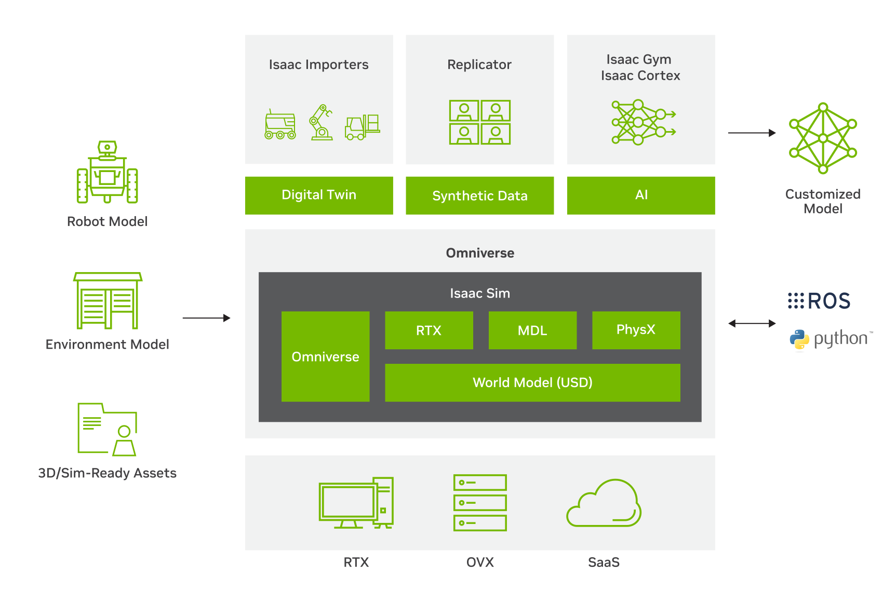

출처: https://developer.nvidia.com/ko-kr/blog/design-your-robot-on-hardware-in-the-loop-with-nvidia-jetson/

Isaac Sim은 **NVIDIA가 제공하는 로봇 시뮬레이션 플랫폼**입니다. Isaac Sim은 NVIDIA Omniverse 플랫폼의 로봇 시뮬레이션용 참조 애플리케이션이며, 로봇의 모델링, 물리 시뮬레이션, 센서 시뮬레이션, 데이터 생성, ROS2 연동, 자동화까지 하나의 환경 안에서 다룰 수 있도록 구성되어 있습니다. 따라서 Isaac Sim은 단순 3D 시각화 도구를 넘어 로봇 모델과 환경을 가상 공간에서 구상하고 시험하며 실제 시스템과 연결하는 통합 개발 환경입니다.

이 구조를 이해하려면 NVIDIA Omniverse가 어떤 구조로 이루어져 있는지 알아야 합니다. Omniverse는 NVIDIA의 3D 애플리케이션 및 서비스 개발 플랫폼이며, 그 위에서 공통 기능을 제공하는 SDK가 Omniverse Kit입니다. Isaac Sim은 omniverse Kit 기반의 로봇 시뮬레이션 애플리케이션이며, 물리 계산에는 PhysX 기반 기능을 활용합니다. Omniverse가 기반 플랫폼, Kit은 실행과 확장 구조, Physics/PhysX가 물리 엔진, Isaac Sim은 로봇 응용 도구로 정리할 수 있으며 기반 계층은 범용 기능을 제공하고, Isaac Sim 계층에서는 로봇 시뮬레이션에 필요한 기능이 구체화됩니다.

Isaac Sim의 핵심 기반은 바로 PhysX입니다. PhysX는 강체 운동, 충돌, 관절, 접촉 같은 로봇 시뮬레이션의 핵심 물리 계산을 담당하며, Isaac Sim은 이를 GPU 가속 기능을 활용할 수 있어 비교적 높은 충실도의 물리 시뮬레이션 환경을 제공합니다. 또한 Isaac Sim은 카메라 및 LiDAR 등 여러 센서의 시뮬레이션을 지원하므로 단순히 로봇 관절만 움직여 보는 수준을 넘어서 인지와 제어를 함께 시험하는 환경을 만들 수 있습니다.

Omniverse 생태계에서 또 하나의 중요한 개념은 바로 **OpenUSD(USD)** 입니다. Isaac Sim의 장면은 USD Stage 위에 구성되며, 그 안의 객체들은 Prim 단위로 관리됩니다. Prim은 USD Stage 안에서 객체를 표현하는 기본 단위입니다. 다시 말해 로봇, 센서, 바닥, 물체 같은 요소들은 USD 장면 안의 구성 요소로 다뤄집니다. 물리 속성이 필요할 경우 USD 물리 스키마와 PhysX 스키마가 별도로 추가됩니다. 이 구조 덕분에 장면을 계층적으로 구성하고, 자산을 재사용하고, 시뮬레이션 설정을 코드와 데이터 형태로 비교적 일관되게 다룰 수 있습니다.

Isaac Sim 및 NVIDIA Omniverse에 관한 더 자세한 내용은 아래 링크를 참고하시기 바랍니다.

- https://www.nvidia.com/ko-kr/omniverse/
- https://developer.nvidia.com/isaac?size=n_6_n&sort-field=featured&sort-direction=desc
- https://developer.nvidia.com/isaac/sim?size=n_6_n&sort-field=featured&sort-direction=desc
- https://docs.isaacsim.omniverse.nvidia.com/5.1.0/introduction/quickstart_isaacsim.html

## 개발 환경

본 실습은 Genworks 환경에서 테스트되었으며, Isaac Sim 5.1 버전을 사용했습니다. 설치 방법은 아래와 같습니다.

저장소를 복제합니다.

```sh
git clone https://github.com/isaac-sim/IsaacSim.git isaacsim
cd isaacsim
git lfs install
git lfs pull
```

복제가 완료되면 Isaac Sim을 빌드합니다.

Linux :
```sh
./build.sh
```

Windows :
```sh
build.bat
```

빌드가 끝나면 Isaac Sim을 실행합니다.
Linux (x86_64) :
```sh
cd _build/linux-x86_64/release
./isaac-sim.sh
```

Linux (aarch64) :
```sh
cd _build/linux-aarch64/release
./isaac-sim.sh
```

Windows :
```sh
cd _build/windows-x86_64/release
isaac-sim.bat
```

자세한 설치 방법은 아래 내용을 참고하시기 바랍니다.

- https://github.com/isaac-sim/IsaacSim

## 핵심 개념

**World** 시뮬레이션 최상위 컨테이너
World는 Isaac Sim Python API에서 Scene과 시뮬레이션 step을 관리하는 상위 객체입니다. `stage_units_in_metesrs=1.0`은 1 stage unit을 1m로 해석한다는 의미입니다. 센티미터 단위 stage라면 0.01을 사용합니다.

```py
world = World(stage_units_in_meters=1.0)
```

**Scene** 오브젝트 관리자
world.scene은 씬 내 로봇, 물체, 센서와 같은 모든 오브젝트를 추가하거나 조회하는 인터페이스입니다. 
|함수/클래스|역할|주요 파라미터|
|---------|--|---------|
|world.scene.add(obj)|씬에 오브젝트 추가 및 핸들 반환|Robot, Cuboid, Sensor 등|
|world.scene.add_default_ground_plane()|기본 지면 평면 추가||
|world.scene.get_object(name)|이름으로 오브젝트 조회|name 파라미터로 식별|
|world.reset()|씬 초기화 및 물리 엔진 준비|add 완료 후 반드시 호출|
|world.step(render=True)|1 물리 스텝 진행 + 렌더링|render=False면 더 빠름|

**DynamicCuboid** 동적 강체
물리 속성이 적용된 큐브 형태의 동적 강체 객체를 생성하는 Isaac Sim 클래스입니다.
|함수/클래스|역할|주요 파라미터|
|--------|----|---------|
|prim_path|USD 씬 그래프 경로 (고유해야 함)|'/World/이름' 형식 권장|
|name|Python 코드에서 참조할 이름|scene.get_object() 키|
|position|초기 위치 [x, y, z] 미터|z=0이면 지면과 겹침|
|color|RGB 색상[0\~1, 0\~1, 0~1]|0~255 아님 주의|

**외력 적용**
apply_force()는 지정한 위치에 힘을 적용합니다. 한 번만 호출하면 짧은 시간 동안 작용하고, 지속적인 힘이 필요하면 매 step마다 호출해야 합니다. 힘의 방향은 world 좌표계 기준입니다. 토크(회전력)를 가하려면 apply_torque()를 사용하거나 힘의 적용 위치를 무게 중심에서 벗어나게 설정합니다.

## 실습 : Basic Usage

이 장에서는 간단한 큐브를 생성한 뒤 물리 현상을 적용하는 예제를 만들어 보겠습니다. Isaac Sim을 실행하면 아무것도 배치되지 않은 새 월드가 자동으로 생성됩니다. 전체적인 생성 방향은 다음과 같습니다.

```
객체 생성 → 위치 조정 → 물리 속성 적용
```

먼저 물리적 충돌이 가능한 바닥을 생성합니다. 상단 좌측 메뉴바에서 Create > Physics > Ground Plane을 클릭합니다.

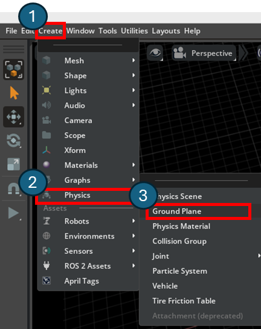

<br><br>

다음으로 간단한 큐브를 생성합니다. 상단 좌측 메뉴바에서 Create > Mesh > Cube를 클릭해 생성합니다.

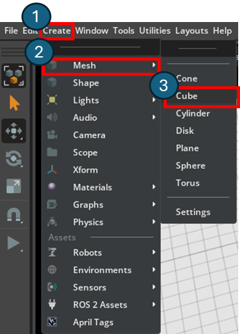

<br><br>

Isaac Sim 화면에는 Stage 패널과 Property 패널이 있습니다. 위 과정에서 생성한 큐브의 z축 위치를 조정하기 위해 Stage 영역에서 'Cube'를 클릭한 뒤, Property 영역에서 Transform > Translate > z값을 '5.0'으로 조정합니다.

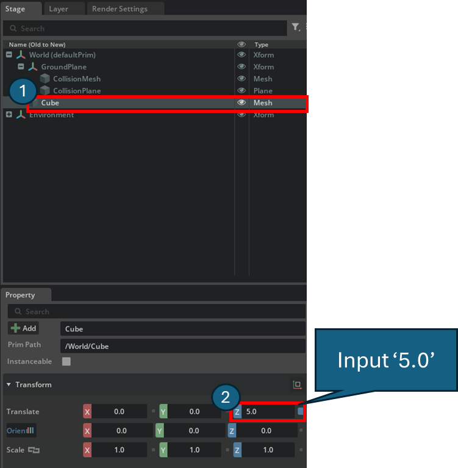

<br>

적용 후, 큐브의 위치가 아래 사진과 같이 바닥에서 일정 높이만큼 떠 있는 것을 확인할 수 있습니다.

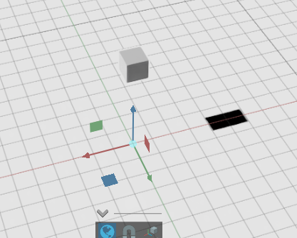

<br><br>

다음으로 큐브가 물리 작용을 받도록 설정해 보겠습니다. Stage 영역에서 'Cube'가 선택된 상태인지 먼저 확인한 뒤, 'Cube'를 우클릭하고 Add > Physics > Rigid Body with Colliders Preset을 클릭합니다. 이 과정은 Cube에 강체(Rigid Body)와 충돌체(Colliders) 속성을 함께 추가하는 단계입니다. 이 설정을 추가하면 큐브가 물리 시뮬레이션 대상이 되어, 시뮬레이션 실행 시 중력과 충돌의 영향을 받습니다.

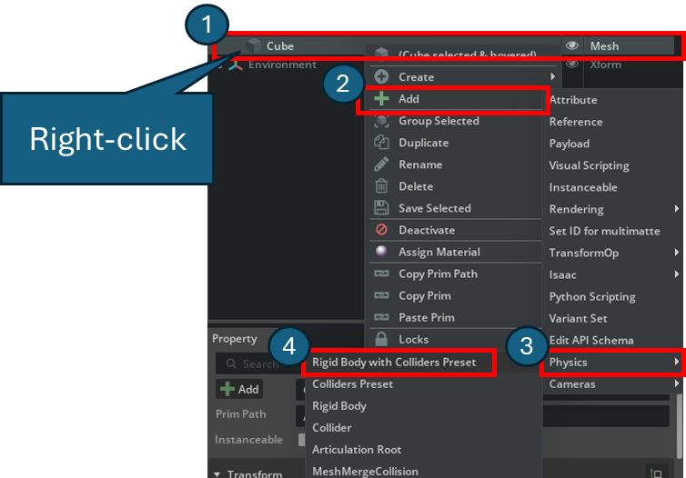

<br><br>

이제 시뮬레이션을 시작할 준비가 완료되었습니다. 준비가 완료되면 좌측 'Play' 버튼을 클릭하거나 `Space` 키를 눌러 시뮬레이션을 시작합니다. 정상적으로 설정되었다면 위에 배치한 큐브가 중력에 의해 바닥으로 떨어집니다.

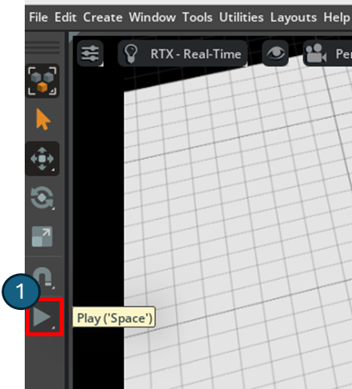

<br><br>

시뮬레이션 실행 시, 위에 떠 있던 큐브가 바닥으로 떨어지는 것을 확인할 수 있습니다.

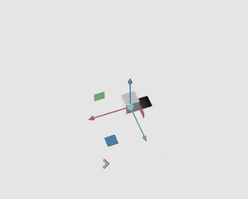


> [!Note]
> 색상이 다른 구와 캡슐을 각 3개씩 다른 높이에 배치하고 충돌 후 최종 정지 위치를 터미널에 출력해 보세요.

<br><br>

## 실습 : 경사면 마찰력 비교

앞선 실습에서는 큐브가 중력에 의해 아래로 떨어지는 현상을 확인했습니다. 이번에는 바닥을 기울어진 경사면으로 바꾸고, 물체가 충돌한 뒤 어떻게 움직이는지 관찰해 보겠습니다. 이 실습을 통해 Transform, Colliders, Rigid Body, Physics Material이 시뮬레이션 결과에 어떤 영향을 주는지 확인합니다.

실습 흐름은 다음과 같습니다.

1. Ground Plane 생성
    - Create > Physics > Ground Plane

2. 경사면 생성
    - Create > Mesh > Cube
    - 이름을 `Ramp`로 변경
    - Transform 값 예시:
        - Translate: x=0, y=0, z=1
        - Rotate: x=0, y=20, z=0
        - Scale: x=5, y=1, z=0.2
    - 얇고 긴 판이 20도 정도 기울어진 형태

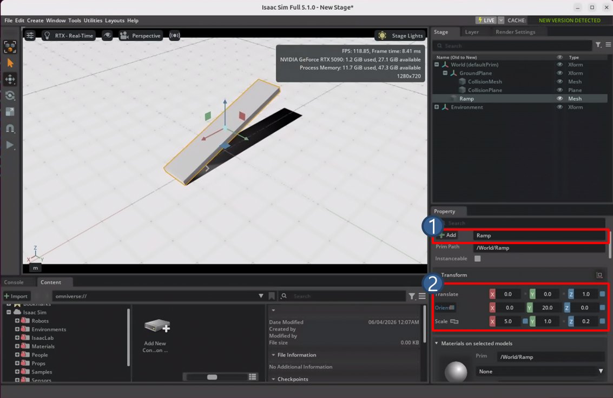

3. Ramp에 Colliders 적용
    - Ramp 우클릭
    - Add > Physics > Colliders Preset
    - Rigid Body를 적용하지 않고 Colliders만 적용하면 Ramp는 움직이지 않는 정적 충돌체로 동작
    - Ramp는 충돌 가능한 고정 물체 역할

4. 큐브 2개 생성
    - Create > Mesh > Cube를 두 번 실행
    - 이름을 각각 `Low_Friction_Cube`, `High_Friction_Cube`로 변경
    - 경사면 위쪽에 나란히 배치
    - 예시
        - Low Friction Cube: x=-1, y=-0.3, z=2.3
        - High Friction Cube: x=-1, y=0.3, z=2.3
    - Scale은 둘 다 x=0.3, y=0.3, z=0.3 정도로 통일

5. 큐브에 Rigid Body 적용
    - 두 큐브 각각 우클릭
    - Add > Physics > Rigid Body with Colliders Preset
    - 이제 두 큐브는 중력과 충돌의 영향을 받음

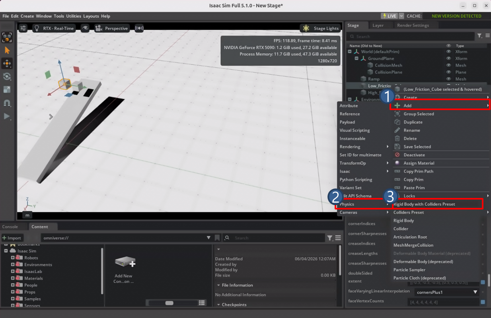

6. Physics Material 생성
    - Create > Physics > Physics Material에서 재질을 만들거나, 객체의 Physics Material 항목에서 새 재질을 생성/연결
    - 재질 2개 생성
        - Low_Friction_Material
        - High_Friction_Material

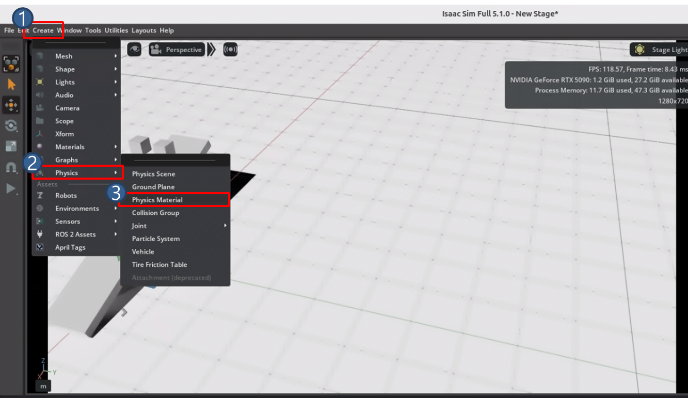
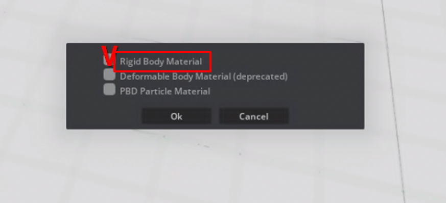

7. 마찰력 값 설정
    - Low_Friction_Material
        - Static Friction: 0.05
        - Dynamic Friction: 0.05
        - Restitution: 0.0
    - High_Friction_Material
        - Static Friction: 1.0
        - Dynamic Friction: 0.8
        - Restitution: 0.0

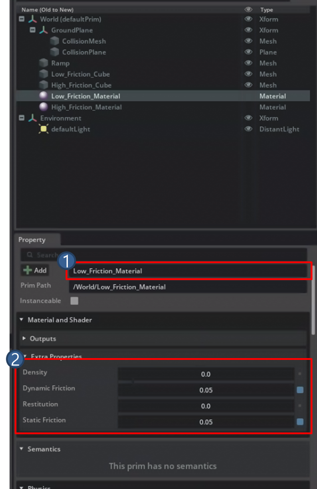
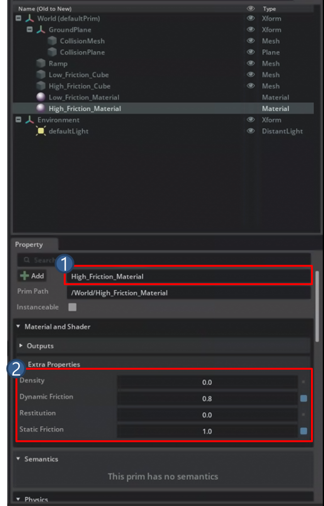

8. 재질 적용
    - Low_Friction_Cube에는 Low_Friction_Material
    - High_Friction_Cube에는 High_Friction_Material

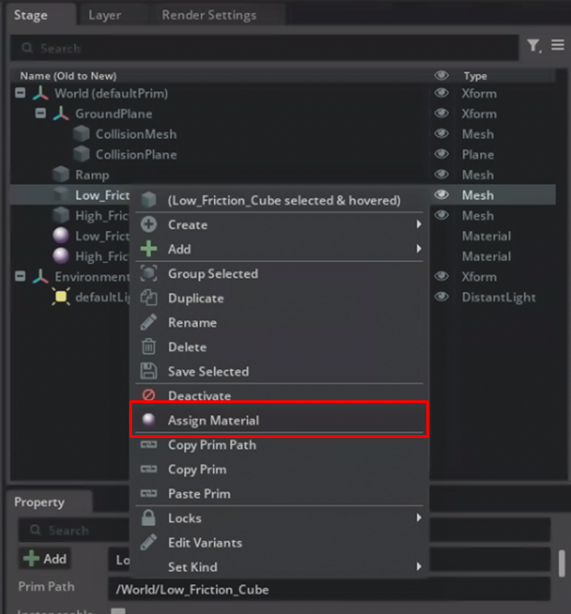
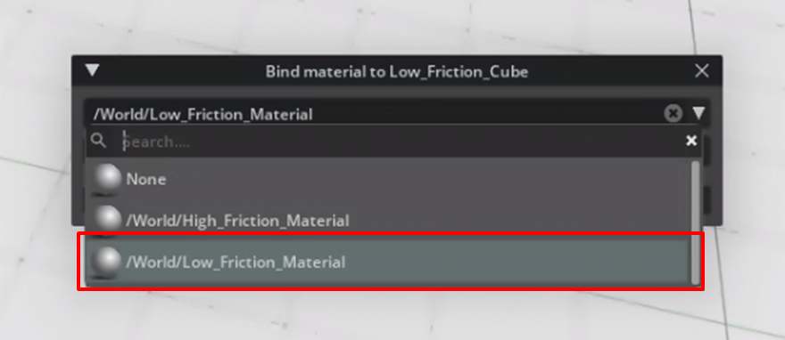

9. 시뮬레이션 실행
    - Play 또는 `Space`
    - 낮은 마찰력 큐브는 경사면을 따라 쉽게 내려가고, 높은 마찰력 큐브는 낮은 마찰력 큐브보다 비교적 늦게 움직이거나 더 짧게 이동하는 경향을 관찰합니다.

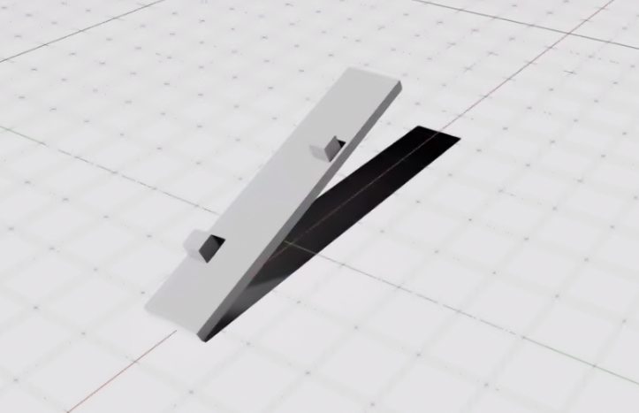

> [!Note]
> - 두 큐브 중 어느 쪽이 먼저 움직이나요?
> - 어느 큐브가 더 멀리 이동하나요?
> - Static Friction 값을 높이면 움직이기 시작하는 시점이 어떻게 달라지나요?
> - Dynamic Friction 값을 높이면 미끄러지는 중 움직임이 어떻게 달라지나요?
> - Ramp의 기울기를 10도, 30도로 바꾸면 결과가 어떻게 바뀌나요?

<br>

## 진자 시뮬레이션

고정된 축에 매달린 물체가 중력에 의해 진자 운동하는 장면을 만듭니다.

1. Ground Plane 생성
    - Create > Physics > Ground Plane

2. Physics Scene 생성
    - Create > Physics > Physics Scene

3. 축 역할 고정체 생성
    - Create > Mesh > Cube
    - 이름을 `Anchor`로 변경
    - Transform 값 예시:
        - Translate : x=0, y=0, z=10
    - Add > Physics > Rigid Body with Colliders Preset
    - Kinematic을 체크하면 물리 힘에 의해 움직이지 않고 사용자가 지정한 Transform 또는 애니메이션에 의해 움직이는 강체가 됨

4. 추 역할 움직이는 물체 생성
    - Create > Mesh > Sphere
    - 이름을 `Bob`으로 변경
    - Property 변경
        - Translate : x=0, y=0, z=3
        - Add > Physics > Rigid Body with Colliders Preset (Kinematic 체크 안함)
    
5. Revolute Joint 연결
    - `Anchor` 클릭 > `Ctrl` 클릭한 채로 `Bob` 클릭 (Anchor와 Bob 둘 다 선택)
    - 우클릭 > Create > Physics > Joints > Revolute Joint

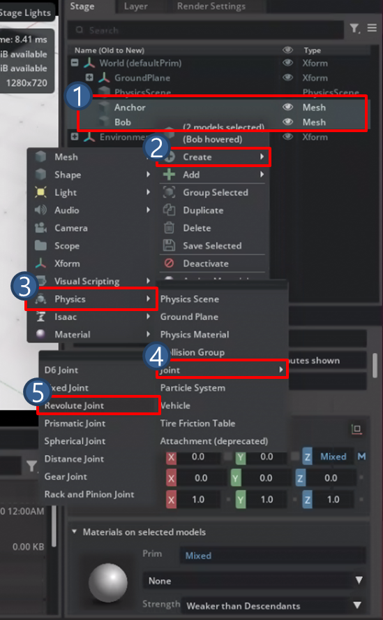

6. Joint 설정 및 축 방향 지정
    - Stage > RevoluteJoint
    - Property 확인
        - body0 : `/World/Anchor`
        - body1 : `/World/Bob`
        - Local Position 0 : x=0, y=0, z=-3.5
        - Local Position 1 : x=0, y=0, z=3.5
    - Axis를 x로 변경

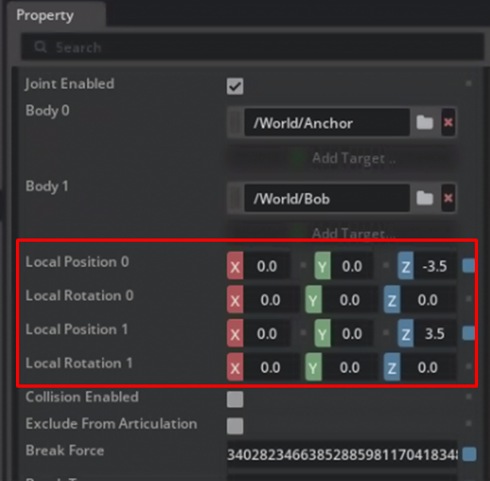

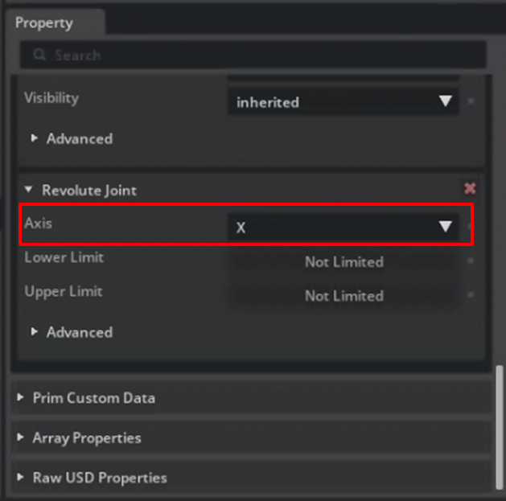

7. 시뮬레이션 실행
    - Bob을 한쪽으로 이동시킨 뒤 시뮬레이션을 실행하거나, Joint의 초기 위치를 어긋나게 설정해 진자 운동을 확인합니다.

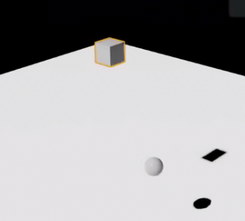


> [!Note]
> - Kinematic Rigid Body와 일반 Rigid Body의 차이는 무엇인가요?
> - body0와 body1의 순서가 바뀌면 결과가 달라지나요? 이유는 무엇인가요?

<br><br>

## 실습 : 고속 물체 충돌 관통 방지 시뮬레이션

물체가 한 physics step 사이에 얇은 충돌체를 지나쳐 버리는 현상을 재현하고, 이를 CCD로 해결합니다.


1. Ground Plane 생성
    - Create > Physics > Ground Plane

2. Physics Scene 생성
    - Create > Physics > Physics Scene

3. 얇은 판 생성
    - Create > Mesh > Cube
    - Property 설정
        - 위치 : x=0, y=0, z=5
        - 이름 : `Platform`
        - Add > Physics > Colliders Preset

4. 고속 낙하 구체 생성
    - Create > Mesh > Sphere
    - Property 설정
        - 위치 : x=0, y=0, z=80
        - 이름 : `FastBall`
        - Add > Physics > Rigid Body with Colliders Preset

5. CCD 적용 전 실행
    - 재생 버튼을 누른 뒤, `FastBall`이 `Platform`을 통과하여 땅으로 떨어지는 것을 확인

6. CCD 활성화
    - 이 실습에서는 Physics Scene에서 CCD를 허용하고, FastBall의 Rigid Body에서도 CCD를 활성화
    - Physics Scene의 Property 설정
        - Enable CCD 체크
    - FastBall의 Property
        - Property > Rigid Body > Enable CCD

7. 시뮬레이션 실행
    - 재생 버튼을 누른 뒤 확인

> [!Note]
> - CCD를 Physics Scene에만 켜고 Rigid Body에는 안 켜면 왜 작동하지 않나요?
> - `FastBall`의 시작 높이를 z=10, 30, 80으로 바꿔가며 CCD 없이도 충돌이 잡히는 최저 위치를 찾아보고 임계값이 무엇에 의해 결정되는지 알아보세요.
> - 구체 대신 얇은 Cube를 고속 낙하 시키면 결과가 다른가요?

> [!Important]
> 배운 것들을 이용하여 경사, 얇은 판, 진자를 통합한 시뮬레이션을 만들어 보세요. 경사면 위에 Sphere가 굴러 내려오고 끝에서 얇은 플랫폼(두께 0.03)에 착지하도록 합니다. 플랫폼 끝에는 진자가 매달려 있고 Sphere가 진자를 건드려 흔들도록 합니다.

----

## 복습 퀴즈

1. Isaac Sim과 NVIDIA Omniverse의 관계를 설명하시오.

<br>

2. OpenUSD 또는 USD는 Isaac Sim에서 어떤 역할을 하는가?

<br>

3. Stage 영역과 Property 영역의 차이는 무엇인가?

<br>

4. PhysX가 담당하는 시뮬레이션 요소를 3가지 이상 쓰시오.

<br>

5. Isaac Sim이 ROS2 연동, 센서 시뮬레이션, 데이터 생성에 활용될 수 있는 이유를 설명하시오.

<br>

6. 시뮬레이션에서 물체가 '보이는 것'과 '충돌하는 것'을 구분해야 하는 이유는 무엇인가?

<br>

7. Cube에 Rigid Body with Colliders Preset을 추가하면 어떤 물리 속성이 생기는가?

<br>

8. 경사면 마찰력 비교 실습에서 Ramp에는 Colliders만 적용하고 Rigid Body는 적용하지 않는 이유는 무엇인가?

<br>

9. Static Friction과 Dynamic Friction은 각각 물체의 움직임에 어떤 영향을 주는가?

<br>

10. Physics Material을 Low_Friction_Cube와 High_Friction_Cube에 다르게 적용하면 시뮬레이션 결과가 어떻게 달라지는가?

<br>

11. 진자 시뮬레이션에서 Anchor는 Kinematic Rigid Body로 설정하고 Bob은 일반 Rigid Body로 설정하는 이유는 무엇인가?

<br>

12. Revolute Joint는 어떤 움직임을 허용하는 관절이며, Axis 설정이 중요한 이유는 무엇인가?

<br>

13. 고속 낙하 물체가 얇은 판을 통과하는 현상이 발생하는 이유는 무엇이며, CCD는 이를 어떻게 방지하는가?

<br>

14. CCD를 Physics Scene과 Rigid Body 양쪽 모두에서 활성화해야 하는 이유를 설명하시오.


