# Digital Twin

디지털 트윈(Digital Twin)은 현실의 물리 시스템에 대응하는 가상 모델을 만들고, 현실 시스템의 상태를 지속적으로 반영·분석하는 기술입니다. 현실 대상과 연결되어 상태를 반영하고 미래 동작을 예측할 수 있는 **가상 대응체**라고도 합니다.

디지털 트윈이 중요한 이유는 현실 시스템을 직접 반복 시험하지 않고도, 가상 환경에서 설계 검토, 상태 분석, 제어 검증, 최적화, 유지보수 계획을 세울 수 있기 때문입니다. 디지털 트윈은 상태 표시뿐 아니라 더 나은 설계와 운용 조건을 찾는 데 도움을 주며, 로봇 분야에서는 설계, 시험, 커미셔닝, 운영 중 작업 조건 변경, 배치 변경, 이상 상황 대응 문제를 다루는 데 유용합니다. 따라서 로봇공학에서의 디지털 트윈은 “로봇을 화면에 띄워 보는 기술”이 아니라, 실제 로봇 시스템을 가상 환경에서 검증하고 운용 전략을 다듬기 위한 공학적 도구입니다.

## 핵심 특징

디지털 트윈의 첫 번째 특징은 **동기화(synchronization)** 입니다. 디지털 트윈은 물리 대상과 일정한 주기로 정보를 주고받으며, 상태·조건·형상 변화 등을 반영해야 현실 변화에 적절한 주기로 대응할 수 있습니다. 따라서 현실 시스템과의 연결이 없는 정적인 CAD 모델이나 단순 시뮬레이션 파일만으로는 완전한 의미의 디지털 트윈이라 보기 어렵습니다.

두 번째 특징은 **목적 지향성(fit-for-purpose)** 입니다. 모든 디지털 트윈이 동일한 수준의 정밀도를 가질 필요는 없습니다. 목적에 따라 필요한 정보의 종류, 모델의 충실도(fidelity), 동기화 주기가 달라질 수 있기 때문입니다. 예를 들어 교육용 디지털 트윈은 관절 운동과 충돌만 정확하면 충분할 수 있지만, 예지 보전용 디지털 트윈은 토크, 진동, 온도, 마모 같은 상태 정보까지 다뤄야 합니다.

세 번째 특징은 **예측과 분석** 기능입니다. 특히 예측은 디지털 트윈의 핵심 요소입니다. 제조용 디지털 트윈은 시뮬레이션, 데이터 분석, 최적화를 통해 상태 진단과 미래 동작 예측을 수행합니다. 디지털 트윈은 현실을 복사해 두는 데 그치지 않고, “지금 어떤 상태인가”와 “앞으로 어떻게 될 것인가”를 함께 다루는 체계입니다.

## 로봇 시스템 관점에서 본 Digital Twin

현실에는 실제 로봇, 그리퍼, 작업 대상, 센서, 작업 공간이 존재한다고 가정하겠습니다. 또한 이에 대응하여 가상 공간에는 로봇 모델, 물체 모델, 환경 모델, 물리 엔진, 센서 모델이 존재합니다. 그리고 양쪽은 ROS 2, 드라이버, 센서 데이터, 제어 명령, 로그 데이터를 통해 연결됩니다. 마지막으로 사용자는 시뮬레이터나 대시보드를 통해 상태를 확인하고, 제어 전략을 시험하거나 결과를 분석합니다. 이제 이 전체를 하나의 시스템 관점에서 바라보겠습니다.

로봇용 디지털 트윈을 만들 때 포함해야 할 정보는 생각보다 많습니다. 단순한 3D 형상만으로는 부족하고, 최소한 기하 구조, 운동학, 동역학, 제어 입력, 센서 출력, 작업 환경, 물체 상호작용을 포함해야 합니다. NIST와 같은 표준·연구 기관의 로봇 시스템 디지털 트윈 연구에서도 로봇 시스템의 여러 차원을 정확히 표현해야 신뢰할 수 있는 가상 복사본이 된다고 강조하고 있습니다.

## 실습 : Isaac Sim ROS Bridge 적용

이 실습에서는 실제 PhysicAI Arm의 JointState를 Isaac Sim에 반영해, 디지털 트윈의 기본 요소인 상태 동기화를 구현하겠습니다. 실제 PhysicAI Arm의 관절 값에 따라 시뮬레이션상에 배치된 PhysicAI Arm 모델의 관절 상태도 함께 변경됩니다.

### 선행 작업

실습을 진행하기에 앞서, 미리 준비된 USD 파일을 다운로드합니다. 아래 링크에서 다운로드할 수 있습니다.

- https://github.com/hanback-lab/PhysicAI-Arm-Busan/blob/main/etc/physicai-arm.usd

File > Open 을 통해 다운로드한 경로를 찾습니다.

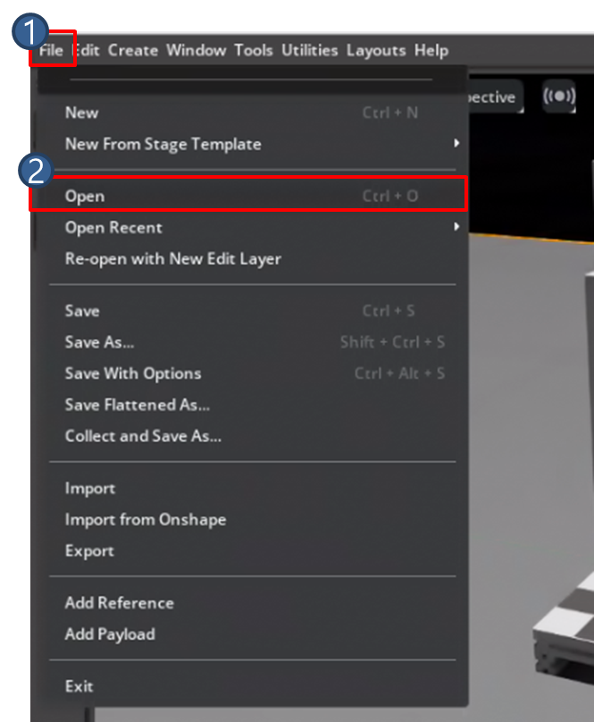

다운로드한 경로에서 파일을 찾아 열어줍니다.

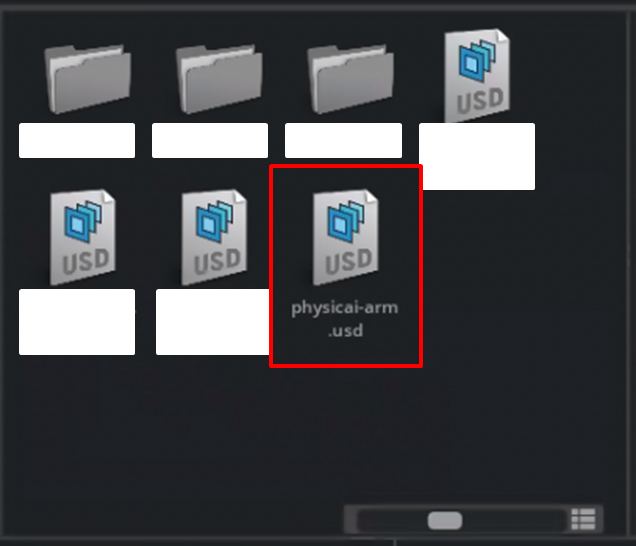

시뮬레이션 환경을 불러오면 아래 사진과 같이 환경이 출력됩니다.

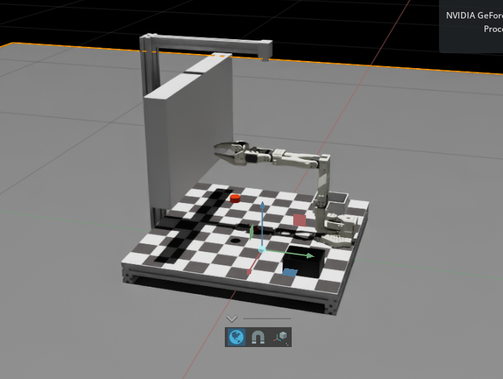

또한, 장비와 Isaac Sim을 실행하는 Workstation(예: genworks)이 같은 네트워크에 연결되어 있어야 합니다. 그리고 현재 PhysicAI Arm 실제 장비의 온보드 컴퓨터 정책은 ROS2 통신이 내부에서만 동작하도록 설정되어 있습니다. 장비 전용 설정 파일인 `/etc/product`에서 `ROS_LOCALHOST_ONLY` 값을 `0`으로 변경하시기 바랍니다.

### URDF 파일 불러오기

Isaac Sim에서는 URDF 또한 불러올 수 있습니다. URDF 파일은 Isaac Sim의 URDF Importer를 사용해 USD 형태의 로봇 모델로 가져올 수 있습니다.

URDF를 가져오려면 Extensions에서 URDF Importer 또는 Asset Importer 관련 확장이 활성화되어 있어야 합니다. 만약 활성화되어 있지 않은 경우 아래의 과정을 따라주시기 바랍니다.

Window > Extension 을 눌러 Extension 창을 띄우겠습니다.

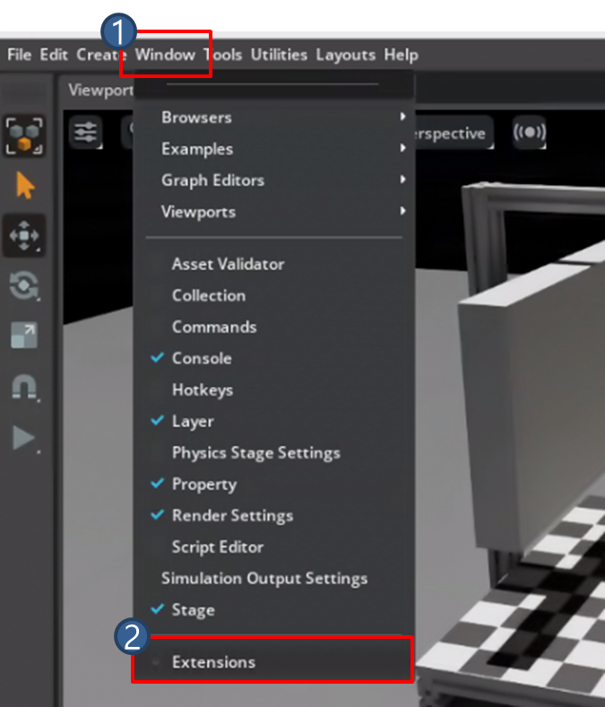

위 검색창에 `import`를 검색한 뒤, URDF Importer 또는 Asset Importer 관련 확장을 활성화시킵니다.

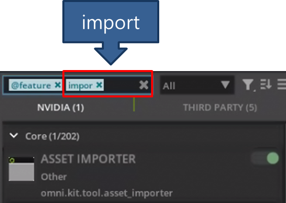

Extension을 활성화시켰다면, URDF 파일을 가져오겠습니다. File > Import 를 통해 파일 선택 창을 열어줍니다.

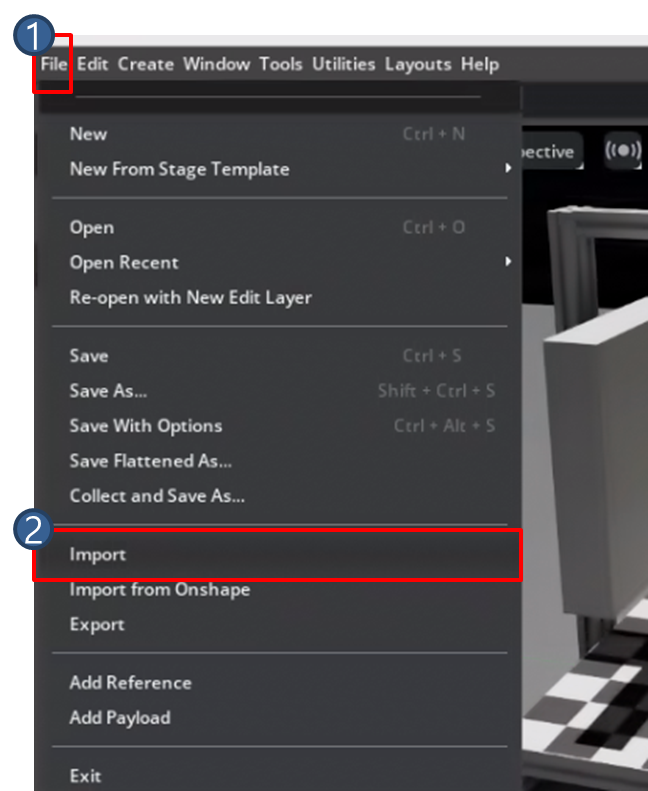

파일들 중 해당하는 파일을 누르고 `Import` 버튼을 클릭합니다.

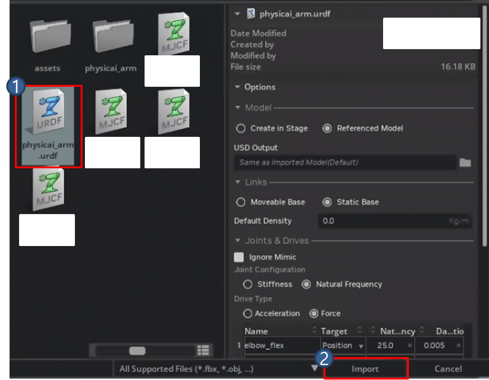

`Yes`를 누르면 파일을 가져옵니다.

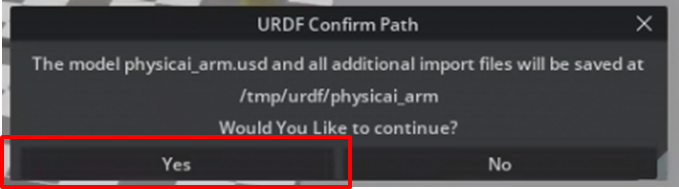

### Action Graph 소개

Isaac Sim에 배치된 PhysicAI Arm의 관절 값을 조작하려면 어떻게 해야 할까요? Isaac Sim에는 시뮬레이션 로직, 이벤트 처리, ROS 2 연동, 객체 속성 제어를 노드 기반으로 구성하는 `Action Graph`라는 기능이 있습니다. 이 기능은 시뮬레이션 내부의 로직을 코드 없이 구성할 수 있도록 해 주는 노드 기반 실행 시스템입니다. 데이터 및 제어 로직을 그래프 형태로 연결해서 동작시키는 비주얼 프로그래밍 도구입니다.

Action Graph는 크게 다음과 같은 요소로 구성됩니다.

- **Node** : 하나의 기능 단위
    - Event
    - ROS2
    - Robot
    - Math
    - Utility
- **Edge(Connection)** : 노드 간 연결 선, 데이터 및 실행 흐름 전달
- **Bundle** : 여러 관련 데이터를 하나로 묶어 전달하는 복합 데이터 타입
- **Execution** Flow : 그래프 전체의 실행 순서
- **Data Port** : 데이터 전달 (색상별 타입 구분)

Action Graph는 기본적으로 **이벤트 기반 실행 모델**을 따릅니다. 먼저 시뮬레이션 시작이나 매 프레임 Tick과 같은 이벤트가 발생하면, 해당 이벤트 노드가 실행되고 연결된 노드들이 순차적으로 동작합니다.

OmniGraph 내부 평가 방식에는 다음과 같은 방식이 있습니다.

|방식|설명|사용 예|
|---|----|-----|
|Push Graph|이벤트 발생 시 실행|키 입력, 충돌 감지|
|Pull Graph|데이터 요청 시 실행|센서 값 읽기|
|Lazy Graph|입력 변경시만 실행|정적 계산|

포트 색상으로 데이터 타입을 구분합니다.

- **흰색** : Execution(실행 흐름)
- **파란색** : Float / Double
- **초록색** : Int
- **노란색** : String
- **보라색** : Bundle(복합 데이터)
- **회색** : Boolean

Action Graph에 대한 더 자세한 소개는 아래 링크를 참고해 주시기 바랍니다.

- https://docs.omniverse.nvidia.com/extensions/latest/ext_omnigraph.html

### 이벤트 노드

액션 그래프는 이벤트 기반이므로 각 노드 체인은 이벤트 소스 노드로 시작해야 합니다. 각 이벤트 소스 노드는 액션 그래프의 진입점으로 생각할 수 있습니다. 이벤트 소스 노드는 보통 이름이 On으로 시작합니다. 이러한 노드는 입력 실행 속성을 가지지 않으며 항상 하나 이상의 출력 실행 속성을 가집니다.

|종류|설명|
|--|--|
|종료 시|USD Stage가 종료되기 직전에 출력 실행을 수행|
|게임패드 입력 시|게임패드 이벤트가 발생할 때 실행|
|임펄스 이벤트|상태가 설정될 때 출력 실행을 한 번 트리거|
|키보드 입력 시|키보드 이벤트가 발생할 때 실행|
|로드 시|그래프가 생성되거나 로드된 후 첫 번째 업데이트 시 출력을 트리거|
|메시지 버스 이벤트|지정된 이벤트가 앱 메시지 버스에서 수신될 때 실행|
|마우스 이벤트|마우스 이벤트가 발생할 때 실행|
|스테이지 이벤트|지정된 스테이지 이벤트가 발생할 때 실행|
|틱|재생 중 매 프레임 또는 지정된 주기마다 실행 펄스를 출력|
|객체 변경 시|감시 대상인 USD 객체가 변경될 때 출력 실행 펄스를 실행|

### 실습 : 이벤트 노드 활용

Stage에 새 `Torus`를 생성합니다. Create > Mesh > Torus

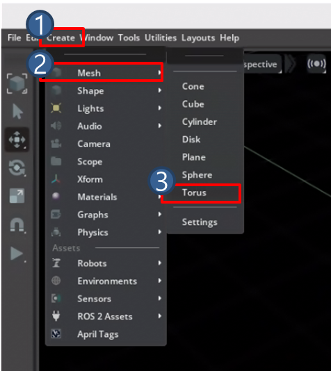

 

새 Action 그래프도 Create > Graphs > Action Graph를 클릭해 생성합니다.

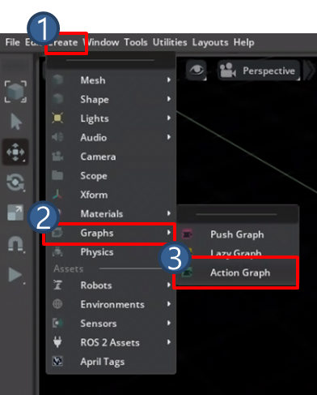

 

우측 Stage에서 `Torus`를 Action Graph로 드래그합니다.

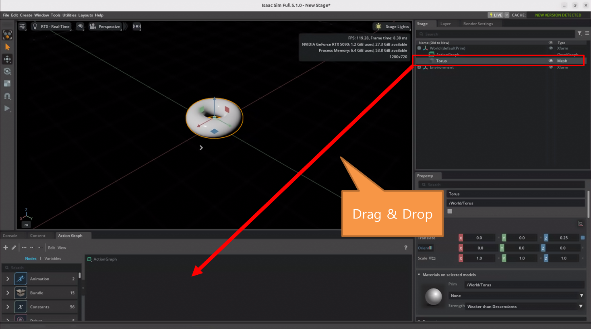

 

만약 아래와 같은 드롭 동작 선택 메뉴가 나타나면 Action Graph에 노드로 추가하는 옵션을 선택한 뒤, 확인을 클릭합니다.

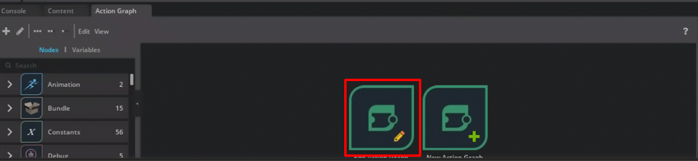

 

드래그한 뒤, 위치 속성을 쓰기 위해 `Write Attribute`를 클릭합니다.

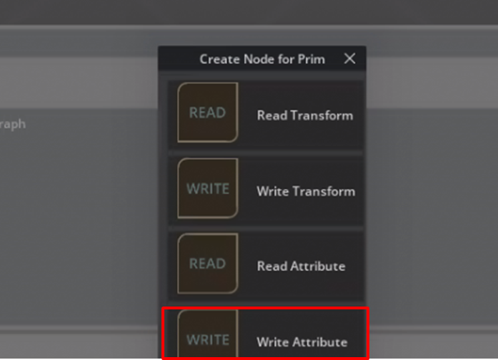

 

`Write Attribute`가 하나 생성되었으면, `Ctrl+D`를 눌러 복사해서 두 개로 만듭니다.

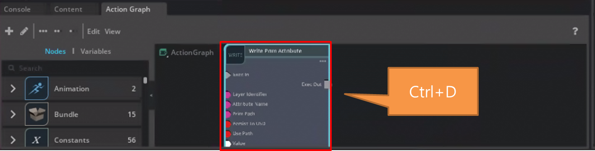

 

두 개를 생성한 뒤, 좌측 `Nodes`에서 Event 목록을 찾아 클릭한 뒤 아래로 내립니다.

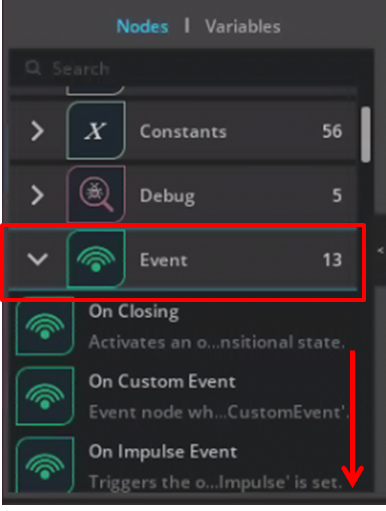

 

'On Stage Event'를 찾아 두 번 드래그 해줍니다.

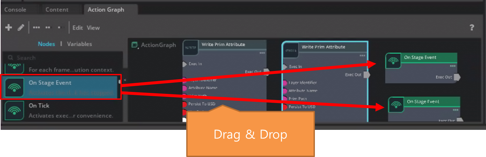

 

두 개의 노드를 각각 연결해줍니다.

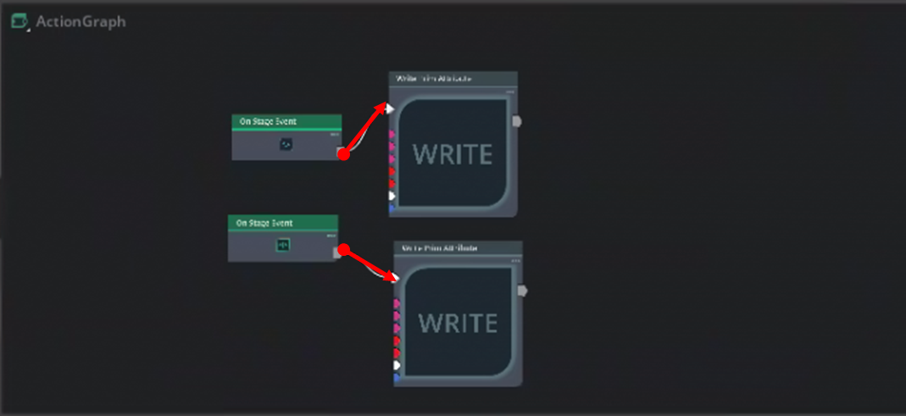

 

위쪽 노드에는 Play 버튼을 눌렀을 때 `Torus`가 위로 뜨는 형태를 구현하겠습니다. `xformOp:translate`에 x=0, y=0, z=2.0으로 설정하고 이벤트는 `Simulation Start Play`로 설정합니다.

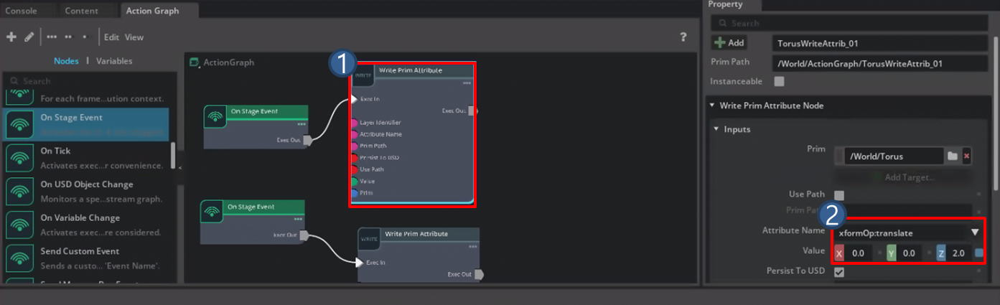
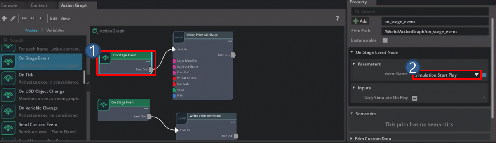

 

아래쪽 노드는 Stop 버튼을 눌렀을 때 `Torus`가 아래로 다시 내려오는 형태를 구현하겠습니다.
`xformOp:translate`에 x=0, y=0, z=0으로 설정하고 이벤트는 `Simulation Stop Play`로 설정합니다.

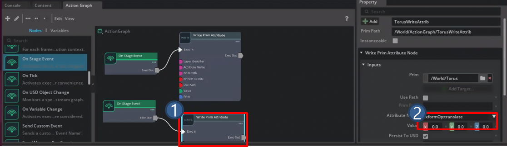
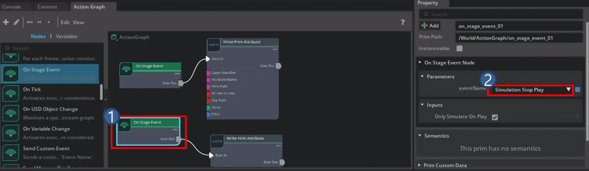

 

그 후 재생 버튼과 정지 버튼을 번갈아 누르면 `Torus`가 위아래로 움직이는 것을 확인할 수 있습니다.

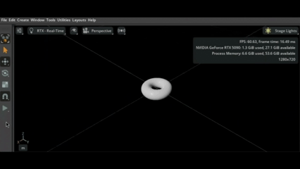

### 실습 : 키보드 입력 시 이동

`Write Attribute`를 두 개로 복사하는 부분까지는 위와 동일합니다.
이후, 좌측 Node에서 'input'을 검색하여 `On Keyboard Input`을 드래그하여 놓아줍니다.

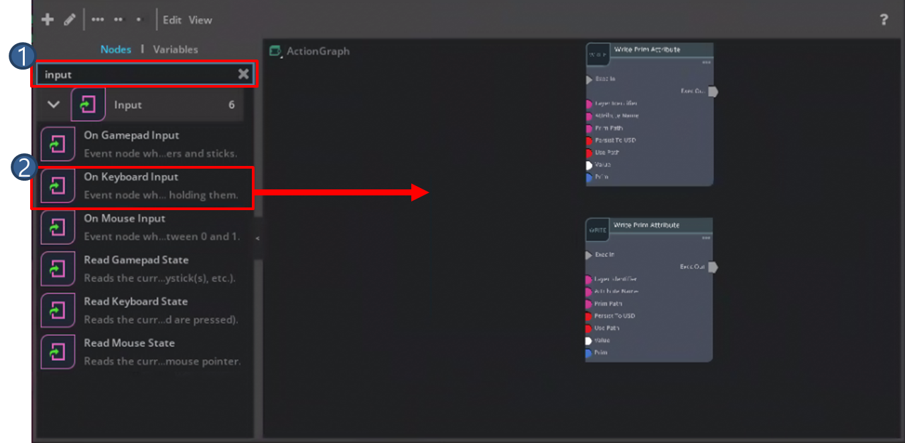

 

`Write Attribute`에 각각 위치를 수정해줍니다.

`On Keyboard Input`을 클릭한 후, `J`를 눌렀을 때 활성화되도록 합니다. Pressed 출력은 z=2.0 `Write Attribute`에, Released 출력은 z=0 `Write Attribute`에 연결합니다.

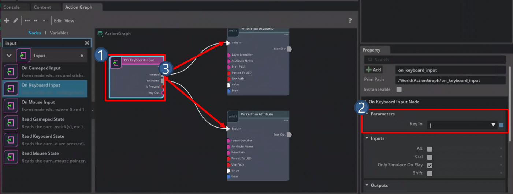

재생 버튼을 누른 뒤, `J`키를 누르고 있으면 `Torus`가 위로 올라가는 것을 볼 수 있습니다.

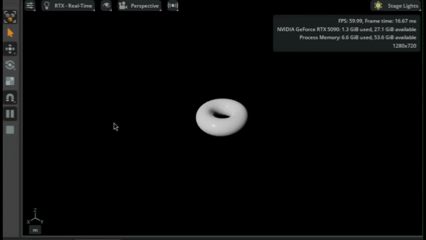

### 흐름 제어 노드

많은 액션 그래프는 특정 상태에 따라 다른 작업을 수행해야 합니다. Python에서는 if문으로 분기하고 for/while문으로 반복을 구현합니다. 액션 그래프에서는 이러한 분기 기능을 제공하는 흐름 제어 노드가 있습니다. 흐름 제어 노드는 평가 흐름을 분기하는 데 사용되는 하나 이상의 실행 속성 출력을 가지고 있습니다.

|이름|설명|입력|출력|
|--|--|--|--|
|branch|부울 조건에 따라 분기를 따라 실행 펄스를 출력|조건, 실행|참, 거짓|
|Flip Flop|A부터 시작하여 출력을 번갈아 활성화|실행|A 실행, B 실행, 현재 A 여부(isA)|
|For each Loop|입력 배열의 각 요소에 대해 루프 본문을 한 번씩 실행|입력 배열, 실행|루프 본문, 요소, 배열 인덱스, 완료|
|Gate|게이트 상태에 따라 실행 흐름 제어|입력, 토글, 초기 닫힘 상태|출력|
|Multigate|N개의 출력 각각을 순환|실행|출력0|
|Delay|일정 시간 동안 일시 중단한 후 다시 실행|실행, 기간|완료|

### 실습 : Flip Flop Node

위 예제에서 `Write Attribute`에 각각 위치를 수정해주는 부분까지 똑같이 진행합니다.
좌측에서 'flip'을 검색하여 `Flip Flop` 노드를 두 노드 사이에 드래그합니다.

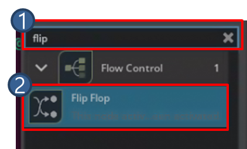

 

노드끼리 선을 이어줍니다.

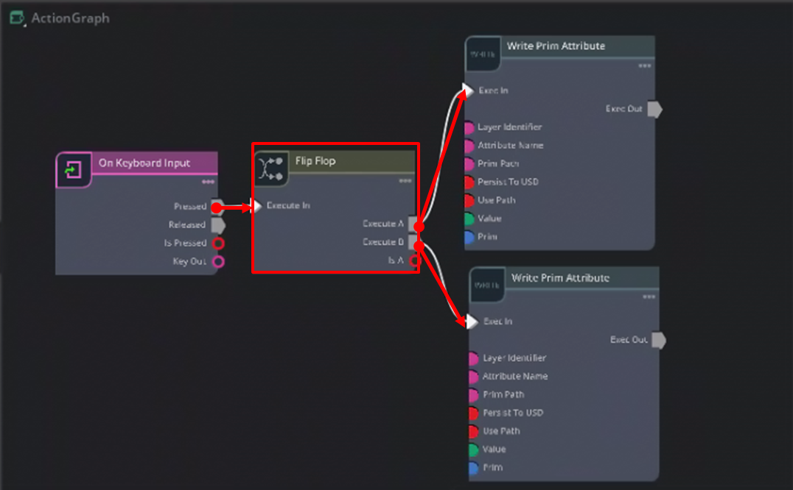

재생 버튼을 누르면 `J`를 누를 때마다 `Torus`가 움직이는 것을 확인할 수 있습니다.

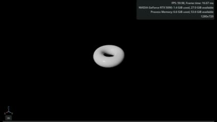

### Variant 노드

Variant 노드는 하나의 Prim에 대해 미리 정의된 여러 구성 중 하나를 선택할 수 있게 하는 USD 기능입니다. 사용자가 실시간으로 값을 설정할 수 있도록 합니다.

- Blend Variants
- Has VariantSet
- Get VariantSet Names
- Get Variant Names
- Get Variant Selection
- Set Variant Selection
- Clear Variant Selection

### 이동/변환 노드

이동/변환 노드는 Prim을 부드럽게 이동, 회전, 스케일 변환하는 액션 그래프 노드입니다.
- Move To Target
- Move To Transform
- Rotate To Orientation
- Rotate To Target
- Scale To Scale
- Translate To Location
- Translate To Target

### Node 배치 및 Edge 연결

새 Action Graph는 좌측 상단 메뉴바에서 Create > Graphs > Action Graph를 클릭해 생성합니다.

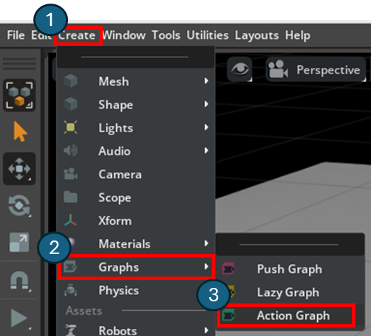

 

Action Graph를 생성하면 Isaac Sim 하단에 Action Graph를 편집할 수 있는 공간이 생성됩니다. 기존 Action Graph를 수정하려면 Stage에서 생성된 'ActionGraph' prim을 선택한 뒤 우클릭하고 'Edit graph'를 클릭합니다.

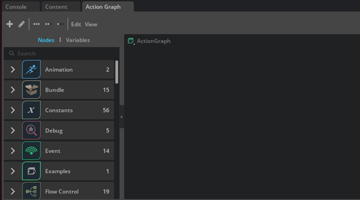

 

먼저 시뮬레이션이 재생되는 동안 매 tick마다 그래프가 실행되도록 'On Playback Tick' 이벤트 노드를 배치합니다. 노드를 배치하는 방법은 그래프 편집기 좌측에 노드 이름을 검색하거나, 대분류에서 Event > On Playback Tick을 드래그하여 편집기 안으로 끌어다 놓습니다.

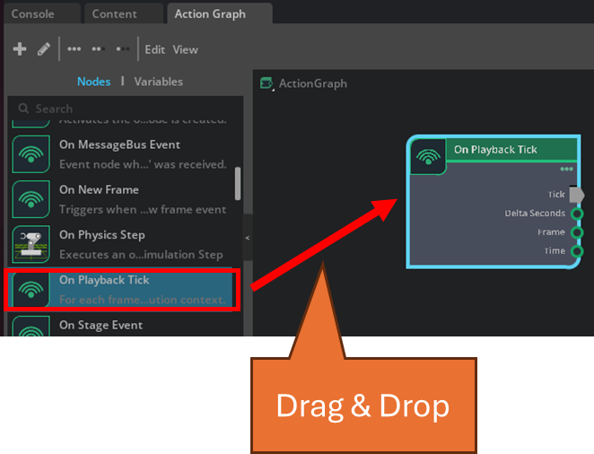

 

그 후, PhysicAI Arm 실제 장비에서 발행되는 관절 값 정보를 담은 `sensor_msgs/JointState`를 구독하기 위해 'ROS2 Subscribe Joint State' 노드를 배치합니다. 노드를 배치하기 전에 Isaac Sim에서 ROS2 Bridge 관련 Extension이 활성화되어 있는지 먼저 확인합니다. 활성화되어 있어야 'ROS2 Subscribe Joint State' 노드를 검색할 수 있습니다. ROS2 또는 Isaac ROS2 관련 대분류 아래에 노드가 있습니다.

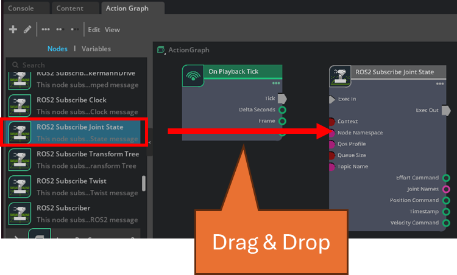

 

그 후, 해당 관절 값을 받아서 시뮬레이션 상의 PhysicAI Arm 매니퓰레이터를 실제로 제어할 'Articulation Controller'를 배치합니다. 'Isaac Sim' 대분류 아래에 있습니다.

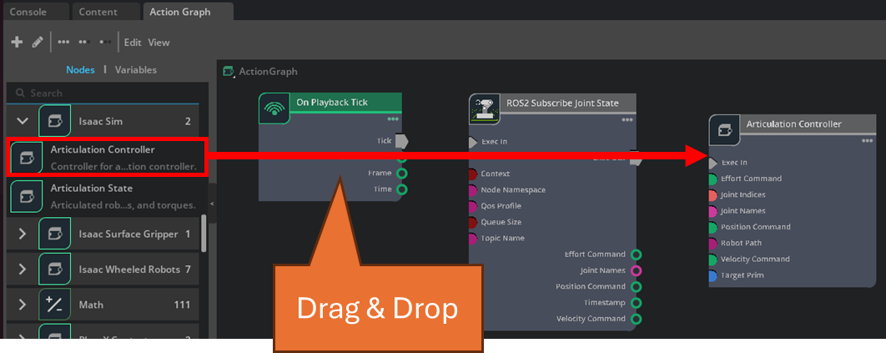

 

필요한 모든 노드를 배치했다면 아래 사진과 같이 Edge를 연결합니다. 연결된 그래프의 Execution Flow는 'On Playback Tick' → 'ROS2 Subscribe Joint State' → 'Articulation Controller'와 같습니다.

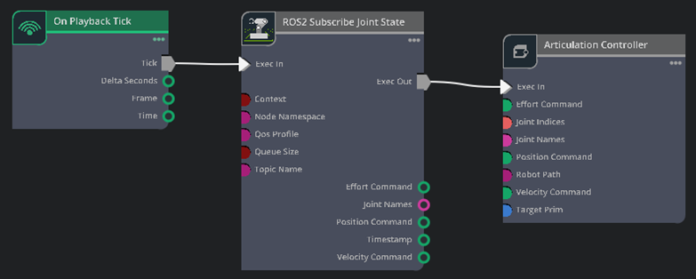

 

노드 배치 및 Flow 연결이 완료되었으니, 각 노드들에 필요한 설정을 진행합니다. 먼저 ROS2 노드에서 관절 값을 받을 토픽 이름을 설정합니다. 그래프 편집기 상에서 'ROS2 Subscribe Joint State'를 클릭하면 각 노드의 속성 값을 편집할 수 있는 'Property' 창이 우측에 생성됩니다. 그 후 Inputs > topicName 항목에 구독할 토픽 이름을 입력합니다. 현재 이 장비는 `/joint_states` 토픽에 각 조인트의 관절 값을 발행하므로 'topicName'에는 값을 `/joint_states`라고 입력합니다.

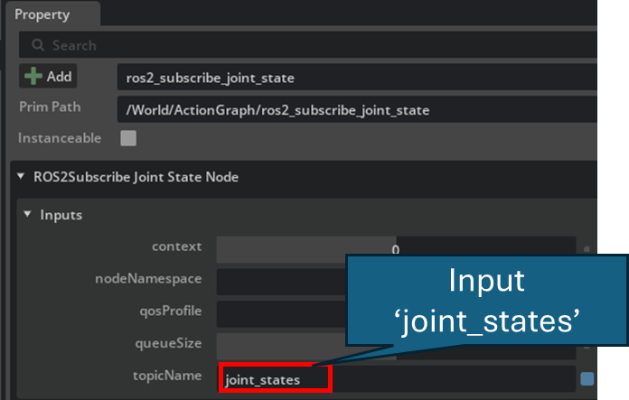

 

이후, 구독한 각 조인트의 이름 및 관절 값 데이터를 'Articulation Controller'에 넘겨주기 위해 아래 사진과 같이 Edge를 연결합니다.

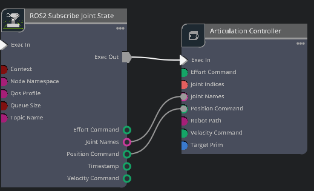

 

이후, 'Articulation Controller' 노드를 클릭한 뒤 Property 창에서 Inputs > targetPrim 버튼을 클릭합니다. 이 과정은 이 노드가 시뮬레이션 안의 어떤 로봇 articulation을 제어할지 설정하는 단계입니다. 'targetPrim'에는 시뮬레이션에서 제어할 articulation root를 지정해야 합니다. 표시되는 창에서 '/PhysicAI_Arm/physicai_arm'을 선택합니다.

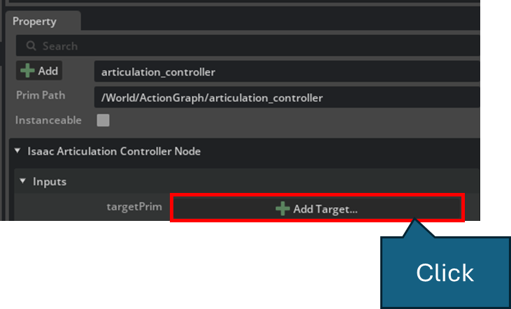

 

표시되는 창에서 `PhysicAI_Arm` > `physicai_arm`을 클릭합니다.

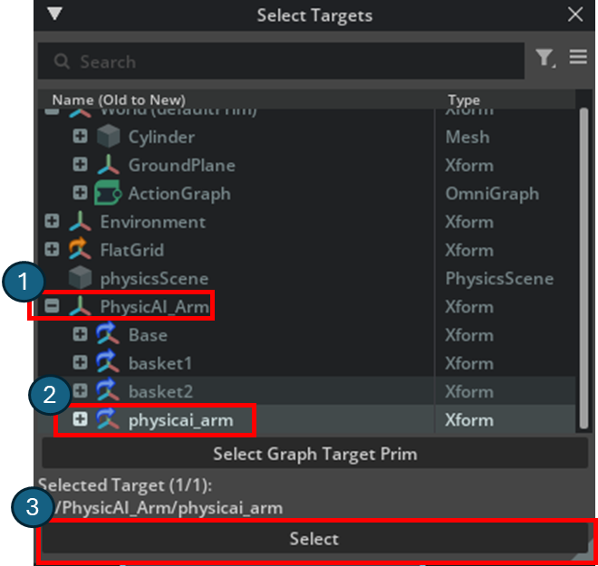

### 실행

Isaac Sim 좌측 Play 버튼을 눌러 시뮬레이션을 실행합니다. 실제 장비의 JointState를 받아 시뮬레이션 로봇이 같은 관절 위치를 따라 움직입니다.

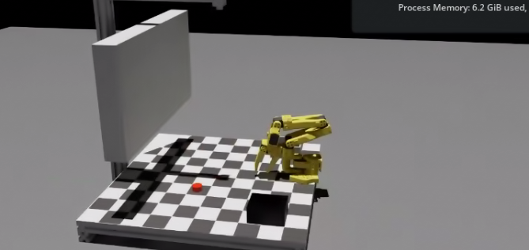

**이번 실습 노드 구성**
On Playback Tick → ROS2 Subscribe Joint State → Articulation Controller

|노드|대분류|역할|
|---|----|---|
|On Playback Tick|Event|매 프레임마다 그래프 실행 트리거|
|ROS2 Subscribe Joint State|Isaac ROS2|`/joint_states` 토픽 구독, 관절 값 수신|
|Articulation Controller|Isaac Sim|수신한 관절 값으로 시뮬레이션 로봇 제어|

> [!Tip]
> 만약 정상적으로 동작하지 않을 경우 본 장의 [선행 작업](#선행-작업)에서 안내한 네트워크 연결 상태와 '/etc/product' 파일의 'ROS_LOCALHOST_ONLY' 설정을 다시 확인하십시오.

> [!Note]
> Isaac Sim에서 실제 로봇으로 JointState 값을 보내 로봇을 움직여 보세요.
> 흐름은 Isaac Sim → `/joint_targets`(`sensor_msgs/JointState`) publish → feetech_follower_driver → 실제 로봇입니다.
> 추가해야 할 노드는 `ROS2 Publish Joint State`입니다.

- `Articulation Controller`의 `execOut` → `ROS2 Publish Joint State`의 `execIn`
- publish할 jointNames와 positionCommand 또는 현재 articulation 상태를 `ROS2 Publish Joint State` 입력에 연결
- Stage에서 로봇 Prim → `ROS2 Publish Joint State`의 targetPrim 설정
- `ROS2 Publish Joint State` 노드의 토픽 Name을 `/joint_targets`로 설정

---

## 복습 퀴즈

1. 디지털 트윈의 핵심 특징 3가지를 쓰시오.

 

2. 디지털 트윈에서 동기화가 중요한 이유는 무엇인가?

 

3. 디지털 트윈과 단순 시뮬레이션의 차이는 무엇인가?

 

4. 디지털 트윈이 정상적으로 동작하지 않을 때 먼저 확인해야 할 두 가지 설정은 무엇인가? 그 이유는 무엇인가?

 

5. 'ROS2 Subscribe Joint State' 노드와 'Articulation Controller' 노드의 역할을 각각 설명하시오.

 

6. 'targetPrim'을 잘못 선택하면 어떤 문제가 발생할 수 있는가?

 

7. Execution Flow 연결과 데이터 포트 연결의 차이는 무엇인가?

 

8. Isaac Sim에서 실제 로봇으로 관절 목표값을 보내려면 어떤 publish 토픽과 노드가 필요한가?

 

9. Isaac Sim에서 Action Graph를 사용하는 이유는 무엇인가?

