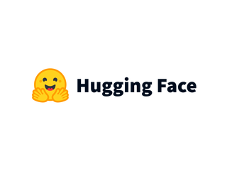
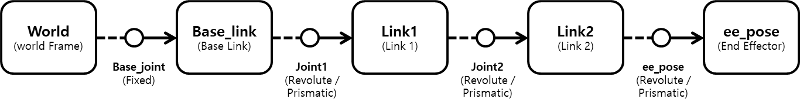
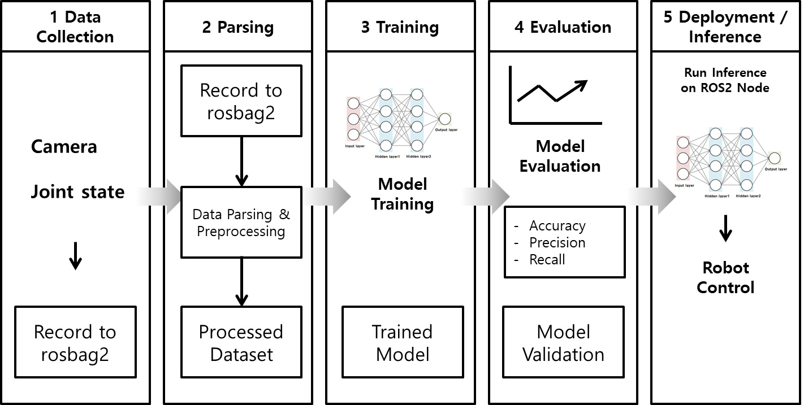
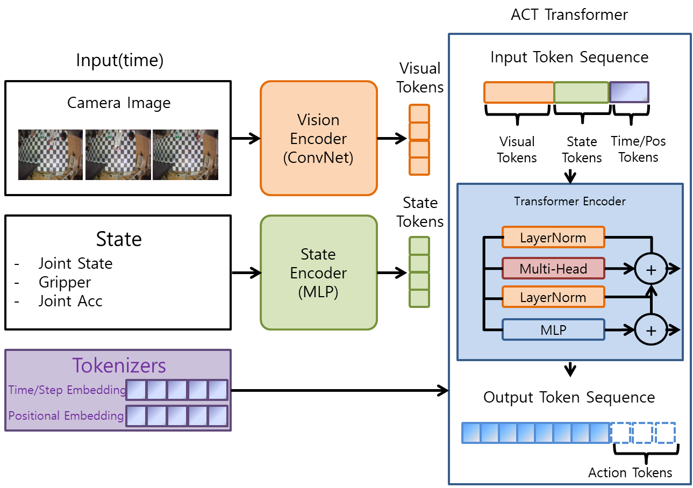
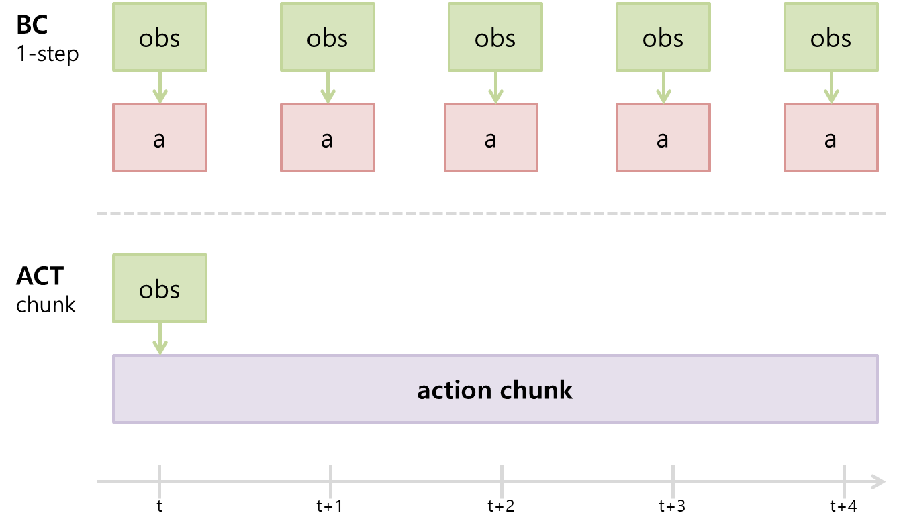

# LeRobot

이번 장에서는 로봇 학습 프레임워크인 LeRobot의 개념과 주요 구성 요소를 알아보겠습니다.

## LeRobot이란?

LeRobot은 PyTorch 기반으로 실제 로봇공학에 필요한 모델, 데이터셋, 도구를 제공하는 프레임워크입니다. 모방 학습과 강화 학습에 중점을 두고 실제 로봇으로 전이된 사례가 있는 최신 접근 방식을 포함합니다. 이미 사전 학습된 모델 세트, 사람이 직접 수집한 demonstration 데이터셋과 시뮬레이션 환경을 제공합니다. 누구나 쉽게 시작할 수 있도록 지원합니다.

LeRobot에 대한 자세한 내용은 아래 링크를 참고해 주시기 바랍니다.

- https://huggingface.co/docs/lerobot/index
- https://github.com/huggingface/lerobot


## Hugging Face



Hugging Face는 오픈소스 인공지능 생태계를 중심으로 모델, 데이터셋, 데모 애플리케이션을 공유하고 협업할 수 있도록 만든 플랫폼입니다. 사용자는 이곳에서 모델을 탐색하고, 실험하고, 공유하며 재사용할 수 있습니다. Hugging Face는 단순히 모델 파일만 올려 두는 저장소가 아니라 인공지능 자산을 찾고, 문서화하고, 재사용하며 협업하는 중심 공간입니다.

이러한 구조는 로보틱스 환경에서 의미가 큽니다. 로봇 인공지능은 보통 모델만 있다고 바로 쓸 수 있는 것이 아니라 어떤 입력을 기대하는지, 어떤 데이터로 학습되었는지, 어떤 환경과 로봇 하드웨어를 전제로 하는지 함께 확인해야 합니다. Hugging Face는 이런 정보를 model card(모델 설명서), dataset card(데이터셋 설명서), repository metadata(저장소 메타데이터) 형태로 함께 제공하여 단순히 '겉보기에 좋아 보이는 모델'을 선택하는 것이 아니라 자신의 로봇 실습 환경과 맞는 자산을 문서와 함께 검토하고 선택할 수 있다는 장점이 있습니다.

Hugging Face의 자세한 설명은 아래 링크에서 확인하시기 바랍니다. 이를 활용한 실습은 다음 장에서 진행합니다.

- https://huggingface.co/
- https://huggingface.co/docs


## Imitation Learning(IL)

Imitation Learning(IL, 모방학습)은 특정 상황에서 전문가의 **행동 데이터를 모방하도록 학습**하는 기법을 말합니다. 이번 장에서는 그중 가장 기본적인 **행동 복제(Behavioral Cloning)** 를 중심으로 다룹니다.

Imitation Learning은 Behavioral Cloning과 같은 대표적인 모방 학습 방식은 직접적인 보상 설계 없이 전문가 데이터를 이용해 학습할 수 있습니다. 그러나 훈련 데이터에 없는 상황에서는 대처 능력이 떨어질 수 있고, 전문가의 데이터가 고품질이어야 좋은 성능을 낼 수 있습니다.

대표적인 방법은 다음과 같습니다.
1. **행동 복제(Behavioral Cloning)**: 전문가의 상태-행동 쌍을 직접 학습합니다.
2. **역강화 학습(Inverse Reinforcement Learning)**: 전문가 행동으로부터 보상 함수를 추정합니다.
3. **상호작용 기반 모방 학습(Interactive Imitation Learning)**: 학습 중 환경 또는 전문가와 상호작용하며 데이터를 보완합니다.






### 데이터 형식

LeRobotDataset은 LeRobot에서 로봇 학습 데이터를 일관된 구조로 저장하고 불러오기 위한 데이터셋 형식이자 Python 클래스입니다. 관측 값, 행동 값, 시간축 정보, 카메라 영상 같은 다중 모달 데이터를 함께 다룰 수 있으며, Hugging Face Hub나 로컬 폴더에서 같은 방식으로 읽을 수 있습니다. 또한 Hugging Face Hub와 함꼐 사용하면 색인, 검색, 시각화에 필요한 메타데이터를 활용할 수 있습니다.

## Policy

Policy(정책)는 로봇, 강화 학습, 모방 학습에서 현재 상태를 보고 어떤 행동을 할지 결정하는 함수입니다. **입력(state 또는 observation) → 행동(action)** 을 만들어 내는 것이라고 볼 수 있습니다. 수식은 아래와 같습니다.

```math
 a_t = \pi(s_t) 
```

state 또는 observation은 policy에 입력되는 현재 로봇과 환경의 정보입니다. 예를 들어 카메라 이미지, 관절 각도, 그리퍼(gripper) 상태, 속도, 위치 등이 state가 될 수 있습니다. action은 policy가 출력하는 행동입니다. 예를 들어 `joint target`, `velocity`, `torque`, `gripper control` 등이 action이 될 수 있습니다. 전체적인 흐름은 보통 **센서 → state 생성 → policy 입력 → action 출력 → 로봇 움직임**의 구조를 지닙니다. 

LeRobot에서 말하는 policy는 주로 데이터를 학습해 행동을 예측하는 머신러닝 기반 정책을 뜻합니다. 예를 들어 ACT, SmolVLA, π₀(Pi0) 같은 policy가 여기에 해당합니다. Policy는 구현 방식에 따라 Rule-based policy, Classical control policy, Neural Network policy 등으로 나눌 수 있습니다. ACT는 이 중 Neural Network policy 계열의 대표적인 예시입니다.

그렇다면 모델과 policy의 차이는 무엇일까요? 모델은 입력을 출력으로 변환하는 학습된 함수나 네트워크를 넓게 가리키며, policy는 그중 상태/관측을 출력하는 모델을 뜻합니다. 모든 policy는 모델이지만, 모든 모델이 policy인 것은 아닙니다.

### ACT

많은 policy 중 여기서는 ACT를 중심으로 살펴보겠습니다. ACT는 **Action Chunking with Transformer**의 약자입니다. 로봇의 모방 학습을 위한 Transformer 기반 정책 모델입니다. 특히 Hugging Face의 LeRobot에서 자주 사용되는 정책 중 하나입니다.



그렇다면 ACT는 왜 만들어졌을까요? 기존의 전형적인 Behavioral Cloning(BC)은 보통 현재 상태에서 다음 행동 하나를 예측하는 방식이 많습니다. 예를 들어 현재 이미지나 관절 상태를 이용해 다음 timestep의 action vector를 예측하는 방식입니다. 그런데 로봇은 작은 오차가 계속 누적될 수 있습니다. 작은 오차가 반복되면 다음 상태 분포가 학습 데이터를 벗어나고, 그 결과 오차가 점점 커질 수 있습니다. 결국 물체를 놓치게 됩니다. 특히 집기, 삽입, 양팔 협업, 정밀 조작(manipulation)에서는 이 문제가 매우 심각합니다. 이러한 문제를 해결하기 위해 **Action Chunking** 방식을 이용합니다. 행동을 하나씩 예측하지 않고, 앞으로의 행동 여러 개를 한 번에 예측하는 것입니다. 현재 상태를 입력받아 앞으로의 여러 행동으로 이루어진 action chunk를 예측합니다.



기존 BC는 주로 한 스텝의 action을 예측하는 반면, ACT는 여러 스탭의 action chunk를 예측합니다. ACT는 현재 이미지를 통해 앞으로 여러 개의 step 행동을 예측하는 방식으로, 여러 스텝의 action trajectory를 하나의 chunk 단위로 한 번에 생성한다고 볼 수 있습니다. Chunk는 행동을 trajectory 단위로 다룹니다. 예를 들어 물체 쪽으로 이동 → 집기 → 목표 위치로 이동처럼 **연속된 행동 패턴을 함께 예측**하는 식입니다. 이를 통해 움직임이 부드럽고 목표 지향적이며 행동 시퀀스의 일관성이 높아집니다.

### 한계

ACT에도 한계가 있습니다.

1. 일반화가 약함

훈련 데이터와 너무 다른 환경, 예를 들어 조명 변화, 카메라 위치 변화, 새로운 배경에 약할 수 있습니다.

2. 언어 이해 능력은 거의 없음

기본 ACT는 주로 시각 관측에서 행동을 예측하는 구조이므로, 언어 명령을 행동에 연결하는 능력은 제한적입니다.

3. 장기 계획 약함
문 열기, 물건 찾기, 도구사용 처럼 복잡한 멀티 스텝 작업에는 한계가 있습니다. 이러한 한계를 보완하기 위해 최근에는 언어 이해와 더 넓은 일반화를 함께 다루는 VLA 계열 모델(OpenVLA, SmolVLA, RT-2 등)도 활발히 연구되고 있습니다.

| 항목      | ACT   | Diffusion Policy |
| :-------: | :-----: | :----------------: |
| 속도      | 상대적으로 빠름    | 상대적으로 느림               |
| 구현 난이도  | 상대적으로 단순    | 어려움              |
| 데이터 요구량 | 적음    | 많음               |
| 안정성     | 작업에 따라 다름    | 높음               |
| 다양성 표현  | 보통    | 매우 좋음            |
| 입문용     | 매우 좋음 | 중급 이상            |

----

## 복습 퀴즈

1. LeRobot은 어떤 목적을 가진 로봇 학습 프레임워크인가?

<br>

2. LeRobot이 제공하는 주요 요소 3가지를 쓰시오.

<br>

3. Imitation Learning은 무엇인가?

<br>

4. Behavioral Cloning은 어떤 방식으로 policy를 학습하는가?

<br>

5. Imitation Learning이 강화 학습보다 학습 초기 단계에서 효율적인 이유는 무엇인가?

<br>

6. Imitation Learning의 한계는 무엇인가?

<br>

7. 로봇 제어에서 state가 될 수 있는 정보 3가지를 쓰시오.

<br>

8. action이 될 수 있는 출력 예시 3가지를 쓰시오.

<br>

9. 모델과 policy의 차이는 무엇인가?

<br>

10. Rule-based policy, Classical control policy, Neural Network policy의 차이를 간단히 설명하시오.

<br>

11. ACT는 무엇의 약자이고, 기존 Behavioral Cloning의 어떤 문제를 해결하기 위해 등장했는가?

<br>

12. ACT가 한 번에 여러 step의 행동을 예측하면 어떤 장점이 있는가?

<br>

13. ACT의 한계 3가지를 쓰시오.

<br>

14. ACT와 Diffusion Policy를 속도, 구현 난이도, 데이터 요구량 관점에서 비교하시오.


