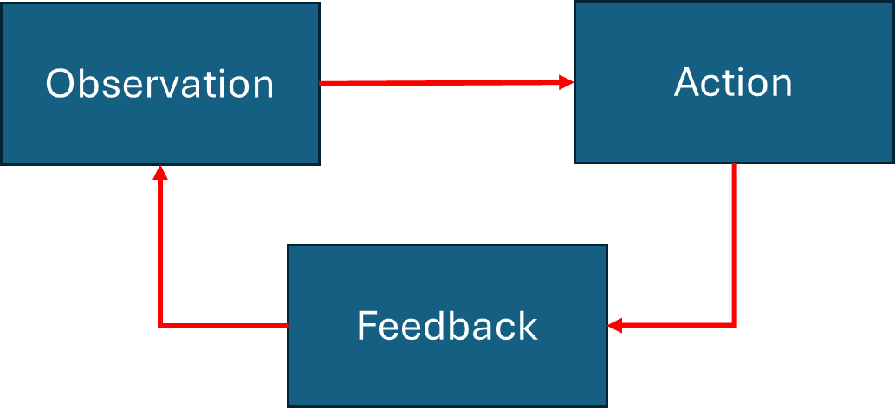
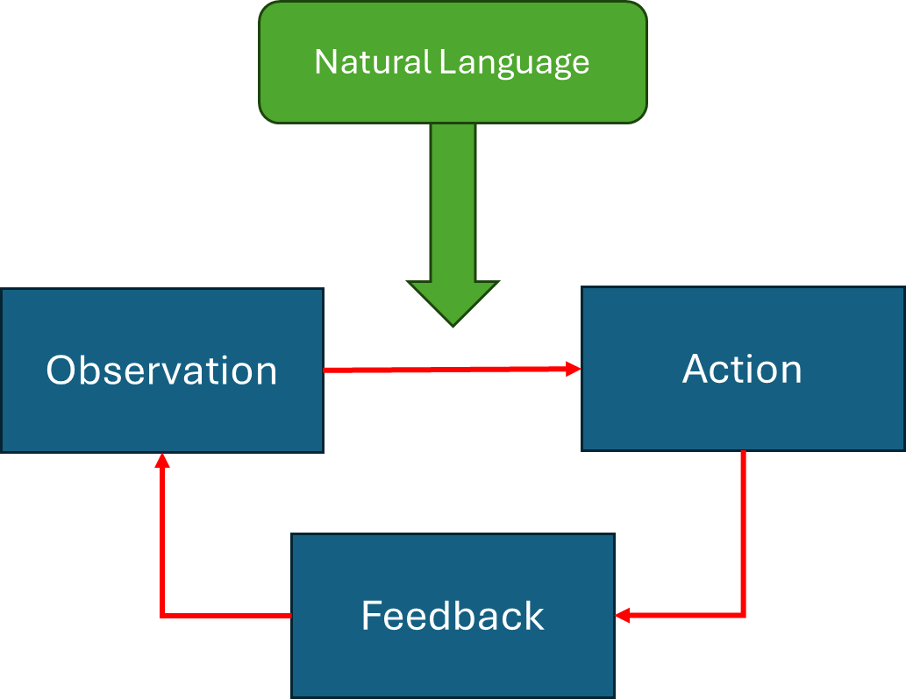
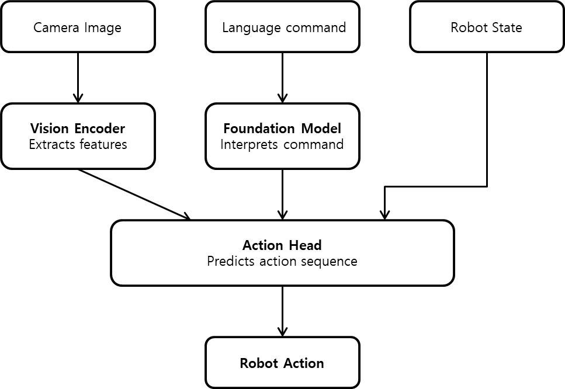

# VLA 개요

## 기존 인공지능 제어기의 흐름과 VLA의 등장

학습 기반 로봇 제어기를 단순화하면 **관찰(Observation) → 행동(Action) → 피드백(Feedback)** 의 반복 구조로 볼 수 있습니다.

로봇은 카메라 영상, 센서 값, 관절 상태와 같은 정보를 통해 현재 상황을 관찰합니다. 제어기는 이 정보를 바탕으로 지금 필요한 행동을 계산한 뒤, 로봇이 실제로 움직인 결과를 다시 센서로 확인하고 그 결과를 다음 판단에 반영합니다. 이 구조는 직관적이며, 입력·출력·피드백을 구분해 분석하기 쉽습니다.

로봇의 입력과 출력, 피드백을 단계별로 명확하게 구분할 수 있어 로봇의 동작을 분석하기 쉽다는 장점이 있습니다. 이 구조는 작업이 명확하고 환경 변화가 크지 않은 경우에 충분히 안정적인 성능을 낼 수 있습니다. 

하지만 이 흐름의 문제점은 미리 정해진 목표 밖의 작업으로 **확장하기 어렵다**는 점입니다. 언어 조건이 없는 기존 task-specific policy는 대개 "현재 보이는 상태에서 어떤 행동을 해야 하는가"를 학습하지만, 작업 목표 자체는 미리 고정되어 있는 경우가 많습니다. 그래서 같은 장면을 보더라도 작업의 의미를 자연스럽게 변형시키기 어려워 유연성과 확장성이 많이 떨어집니다.

앞서 살펴본 기본 ACT 예시는 주로 카메라 이미지와 관절 상태를 입력으로 받는 **vision-to-action** 구조에 가깝습니다. "지금 무엇이 보이는가"에는 반응할 수 있지만 "지금 무엇을 해야 하는가"라는 작업 목표를 언어로 받아들이는 능력은 거의 없습니다. 언어 명령을 입력으로 받지 않는 구조라면 같은 장면에서 서로 다른 언어 목표를 구분하기 어렵습니다.

이 시점에서 등장한 것이 **VLA(Vision-Language-Action)** 입니다. VLA는 시각 정보와 로봇 상태뿐 아니라 자연어로 주어진 작업 목표까지 함께 반영하여 행동을 예측하는 로봇 정책입니다. 로봇은 카메라 영상과 상태 정보를 관찰하면서 추가로 자연어 명령까지 받아들여 최종 행동을 결정합니다. 덕분에 단순히 '무엇이 보이는가'에 반응하는 수준을 넘어 '무엇을 해야 하는가'라는 언어 정보를 새로운 조건으로 활용하고, 그에 맞춰 행동을 바꾸는 방식으로 확장됩니다.

최근 일부 VLA와 로봇 정책에서는 한 시점의 action 하나만 출력하기보다, 미래의 여러 step을 묶은 'action chunk'를 함께 예측하는 방식도 사용됩니다. 이는 정책이 단일 action vector만 출력하는 것이 아니라, 짧은 시간 구간의 행동 시퀀스를 출력한다는 뜻입니다. 따라서 모델에 따라 action 하나를 출력하는지, 여러 step을 묶은 action chunk를 출력하는지 구분할 수 있습니다.

정리하자면 VLA는 관측된 장면과 로봇 상태, 그리고 언어로 주어진 목표를 함께 입력받아 행동을 생성하는 로봇 정책(policy)의 한 종류입니다.

### VLA의 구조

VLA는 크게 세 가지 핵심 컴포넌트로 구성됩니다.

**비전 인코더**
카메라 이미지를 모델이 처리할 수 있는 벡터 표현으로 변환하는 역할을 합니다. 많은 VLA는 ViT(Vision Transformer) 계열의 비전 인코더를 사용합니다. 이미지를 작은 패치로 나눈 뒤 패치를 토큰으로 변환하여 언어 모델이 처리할 수 있는 표현으로 변환하거나 언어 토큰과 함께 처리할 수 있도록 투영합니다.

**LLM 백본**
언어 명령을 이해하고 시각 정보와 언어 정보를 통합하여 다음에 취할 행동을 추론하는 역할입니다. 인터넷 규모의 데이터로 학습된 언어 모델인 LLM은 언어와 시각 데이터에서 학습한 일반 지식을 활용할 수 있습니다. VLA는 이 표현 능력을 로봇 제어 문제에 연결합니다.

**액션 헤드**
LLM 백본 출력을 실제 로봇이 실행할 수 있는 행동 값(관절 목표값, end-effector 이동량, 그리퍼 명령 등)으로 변환하는 역할을 합니다. 행동을 표현하는 방식에 따라 두 가지로 나뉩니다.
- **토큰화**: 행동 값을 이산 토큰으로 변환하여 행동을 생성합니다. LLM의 토큰 생성 구조를 활용하기 쉽습니다.
- **Diffusion/Flow Matching 계열**: 연속 action을 점진적으로 생성하거나 복원하는 방식입니다. 하나의 명령에 대해 다양한 행동 양식을 표현할 수 있어 복잡한 조작 작업에 유리합니다.

### VLA 종류

|모델|비전 인코더|백본|Action Head|특징|
|---|---------|--|-----------|---|
|RT-2|ViT|PaLI-X / PaLM-E 계열|토큰화|웹 데이터 전이|
|OpenVLA|DINOv2 + SigLIP|LLaMA 2|토큰화|오픈소스|
|π₀(pi-zero)|ViT|PaliGemma|Flow Matching 기반 Action Expert|물리 로봇 범용|
|RoboVLMs|ViT|다양한 LLM|토큰화|아키텍처 비교 연구|

### VLA와 ACT

| 항목     | ACT          | VLA                   |
| ------ | ------------ | --------------------- |
| 입력     | 이미지 + 상태     | 이미지 + 상태 + 언어         |
| 출력     | 주로 Action Chunk | Action / Action Chunk |
| 작업 변경  | 어려움          | 언어로 가능                |
| 범용성    | 작업별 학습에 가까움           | 언어 조건을 활용해 작업 확장에 유리                    |
| 학습 데이터 | 작업별 수집    | 다양한 Task 통합           |

### Foundation Model

Foundation Model은 대규모 데이터로 사전 학습되어 여러 downstream task에 전이·적응할 수 있는 범용 모델입니다. 예를 들어 GPT, Gemini, LLaMA 등이 대표적입니다. 최근 VLA는 이러한 Foundation Model을 활용하여 로봇 제어 성능을 높이고 있습니다.

기존에는 작업마다 별도의 모델을 학습해야 했습니다. 그러나 Foundation Model 방식은 사전 학습된 모델을 기반으로 로봇 데이터에 맞게 fine-tuning하거나 action head를 추가해 다양한 작업에 적응합니다. 최근 VLA는 대부분 Foundation Model을 기반으로 만들어집니다. 구조는 아래와 같습니다.

여기서 Foundation Model은 언어 이해, 시각 정보 이해, 작업 목표 추론을 담당합니다. 즉, 고수준 인식과 언어 기반 목표 해석을 담당합니다.

**장점**
- 다양한 작업 수행 가능
- 새로운 환경에 대한 일반화 능력 향상
- 처음부터 학습하는 것보다 적은 데이터로 fine-tuning할 수 있는 경우가 있음
- 언어 명령 활용 가능

**단점**
- 학습 비용이 매우 큼
- 모델 크기가 큼
- 추론 속도가 느릴 수 있음
- 언어 명령이나 장면을 잘못 해석해 부적절한 행동을 생성할 수 있음
- 로봇에서는 안전성 검증 필요

정리하면, 최근 VLA는 Foundation Model을 기반으로 시각 정보와 언어 명령을 이해하고 로봇 행동을 생성하는 방향으로 발전하고 있습니다.

### VLA 한계

- 대규모 데이터 필요
- 학습 비용이 매우 큼
- 추론 속도가 느릴 수 있음
- 실제 로봇 데이터 수집이 어려움
- 안전성 검증 필요

실제 적용에서는 안전성과 신뢰성을 위해 전통 제어, 규칙 기반 제약, 안전 모니터링과 함께 사용하는 방향이 중요합니다.

### 참고 자료 : OpenVLA

OpenVLA는 대표적인 오픈소스 VLA 모델 중 하나입니다. RT-2-X(55B) 같은 더 큰 비공개 모델과 비교해 더 높은 로봇 작업 성공률을 보였습니다. OpenVLA 발표 당시 주요 VLA 상당수는 비공개였고 fine-tuning 방법이 불분명하며 실제 로봇에 적용하기 어려웠습니다. 성능 좋은 모델이 있어도 연구자가 사용하기 어려운 상태였습니다. 이를 해결하기 위해 완전한 오픈소스 VLA를 만들고, 실제 로봇 데이터를 바탕으로 쉽게 fine-tuning할 수 있도록 OpenVLA를 공개했습니다.

OpenVLA는 사전 학습된 VLM 표현 위에 로봇 action token을 생성하는 action head를 결합한 구조입니다. 또한 학습에는 약 97만 개의 실제 로봇 demonstration이 사용되었습니다. 이러한 방대한 데이터는 성능의 핵심입니다. 연속 action을 이산 토큰으로 변환해 언어 토큰처럼 생성합니다. 이를 통해 Transformer를 그대로 활용할 수 있고, 학습 안정성과 확장성도 높일 수 있습니다.

논문에서는 OpenVLA가 RT-2-X(55B) 같은 더 큰 비공개 모델과 비교해 약 7배 적은 파라미터 수이면서도 더 높은 작업 성공률을 보였다고 보고합니다. 논문에서는 새로운 환경, 새로운 물체, 여러 객체가 있는 평가에서 강한 일반화 성능을 보였다고 보고합니다.

OpenVLA에 대한 자세한 내용은 아래 링크를 참고해 주시기 바랍니다.

- https://arxiv.org/abs/2406.09246

---

## 복습 퀴즈

1. 기존 인공지능 제어기의 기본 흐름인 Observation → Action → Feedback은 각각 무엇을 의미하는가?

 

2. VLA는 무엇의 약자인가?

 

3. 기존 인공지능 제어기가 작업 확장성 측면에서 가지는 한계는 무엇인가?

 

4. VLA가 입력으로 사용하는 정보 3가지를 쓰시오.

 

5. 같은 카메라 장면을 보더라도 언어 명령이 달라지면 로봇 행동이 달라질 수 있는 이유를 설명하시오.

 

6. action 하나를 출력하는 방식과 action chunk를 출력하는 방식의 차이는 무엇인가?

 

7. action chunk를 예측하는 방식이 로봇 제어에서 유리할 수 있는 이유는 무엇인가?

 

8. OpenVLA가 해결하려 한 기존 VLA의 한계는 무엇인가?

 

9. OpenVLA의 구조에서 Action Head는 어떤 역할을 하는가?

 

10. OpenVLA가 action을 "토큰"처럼 다룬다는 것은 어떤 의미인가?

 

11. 로보틱스 모델을 사용할 때 model card나 dataset card를 확인해야 하는 이유는 무엇인가? 이전 장의 Hugging Face 설명을 참고하시오.

 

12. OpenVLA가 오픈소스로 공개되었다는 점이 실습에서 갖는 장점은 무엇인가?

