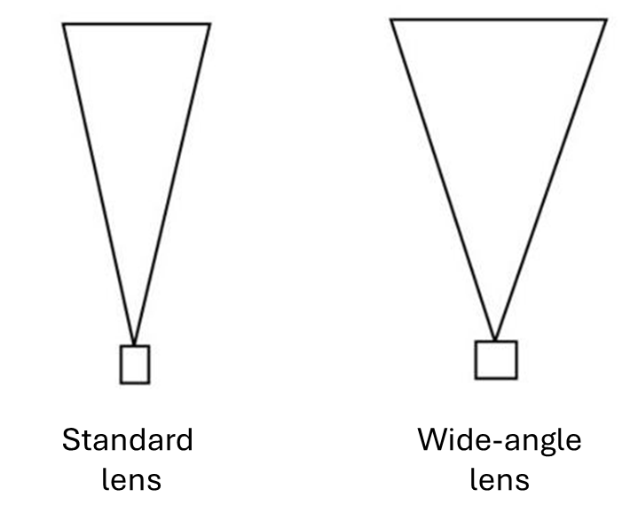
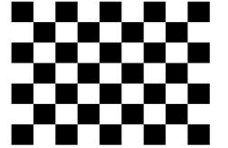
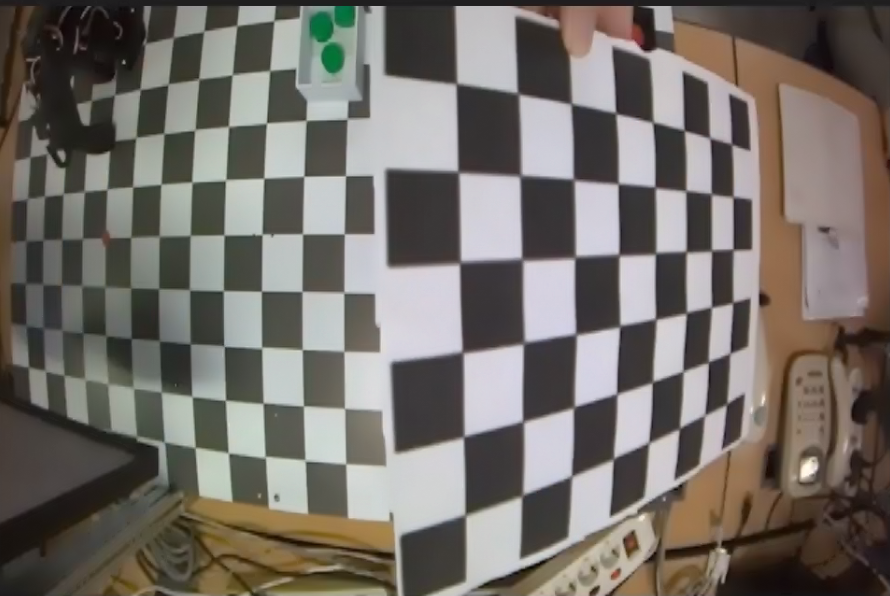
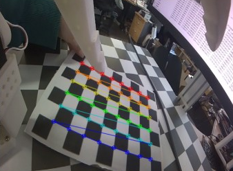
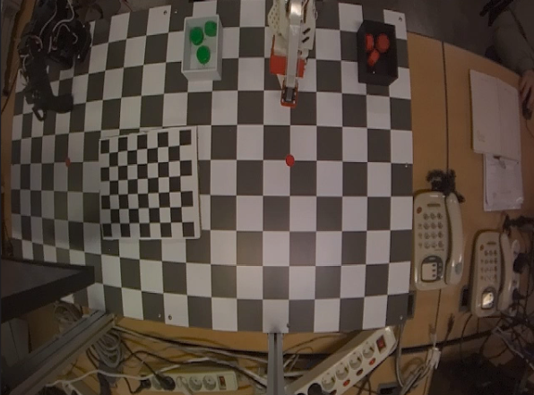
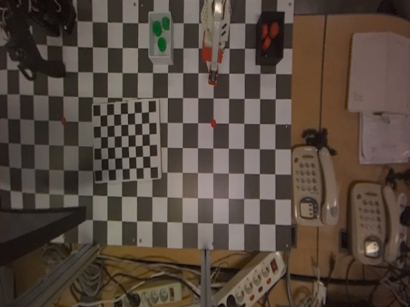

# Camera Calibration

카메라 캘리브레이션(Camera Calibration)은 **3차원 공간의 점이 카메라 이미지의 2차원 좌표로 투영되는 기하 관계를 모델링**하는 과정입니다. 이렇게 얻은 결과는 수학적 변환 모델로 나타나며 카메라 렌즈 왜곡, 초점 거리, 영상 중심점 등을 포괄합니다.

이 모델은 3D 세계 좌표를 2D 이미지 좌표로 투영하거나, 깊이 정보가 있을 때 2D 이미지 좌표를 3D 좌표로 역투영하는 데 사용됩니다. 다만 2D 이미지 좌표만으로 3D 세계 좌표를 유일하게 복원하려면 깊이 정보나 외부 파라미터 같은 추가 정보가 필요합니다. 카메라 캘리브레이션은 카메라 영상의 왜곡을 보정하고 이미지 좌표와 실제 공간 좌표 사이의 관계를 추정하는 과정입니다.

## 렌즈 왜곡

카메라 캘리브레이션을 수행하는 가장 대표적인 이유는 **렌즈 왜곡** 때문입니다. 실제 카메라는 완벽한 핀홀 카메라가 아닙니다. 이로 인해 직선이 휘어 보이고 이미지 좌표가 실제 투영 위치와 달라져 거리나 각도 계산이 틀어질 수 있습니다. 따라서 카메라 렌즈 특성과 왜곡, 위치 관계를 수학적으로 추정해야 합니다.

PhysicAI Arm 장비의 Follower arm 위에 장착된 카메라를 살펴보겠습니다. 이 카메라는 수평 화각이 98도, 수직 화각이 75도인 광각 렌즈입니다. 광각 렌즈의 경우 아래 사진처럼 표준 렌즈보다 더 넓은 범위를 촬영할 수 있습니다. 다만 화각이 넓은 광각 렌즈에서는 영상 주변부에서 직선이 바깥쪽으로 휘어 보이는 **배럴 왜곡(Barrel Distortion)** 현상이 발생하기 쉽습니다. 중심부보다 주변부에서 왜곡이 더 크게 나타나며, 이를 보정해 주지 않으면 이미지에서 측정한 위치와 실제 공간 위치 사이에 오차가 생겨 데이터셋 수집 과정에서 품질 좋은 데이터를 수집하기가 어려워집니다.



## 캘리브레이션

이제 PhysicAI Arm Camera를 사용해 실제 캘리브레이션 작업을 진행해 보겠습니다. 카메라 캘리브레이션은 Python과 OpenCV를 활용하여 진행합니다. 해당 패키지에 관한 자세한 정보는 아래 사이트를 참고해 주시기 바랍니다. 본 교재의 PhysicAI Arm 실습 환경에는 이미 설치되어 있으므로 따로 준비할 필요는 없습니다.

- https://www.python.org/
- https://opencv.org/

### 얻을 수 있는 것

카메라 캘리브레이션을 통해 대표적으로 다음 두 가지를 얻을 수 있습니다.

1. Intrinsic Parameters(내부 파라미터)
카메라 내부 파라미터는 3D 점을 이미지 평면으로 투영할 때 사용하는 초점 거리와 영상 중심점 등을 나타냅니다.

```math
K =
\begin{bmatrix}
f_x & 0 & c_x \\
0 & f_y & c_y \\
0 & 0 & 1
\end{bmatrix}
```

- $f_x, f_y$: x축/y축 방향의 픽셀 단위 초점 거리
- $c_x, c_y$: 주점(principal point), 보통 영상 중심 근처에 위치

2. Distortion Coefficients(왜곡 계수)
렌즈 왜곡 정보를 나타내는 값입니다.
- Radial distortion: 배럴 왜곡, 핀쿠션 왜곡
- Tangential distortion: 렌즈와 이미지 센서가 정렬되지 않아 발생하는 왜곡

OpenCV에서는 보통

```math
(k_1, k_2, p_1, p_2, k_3)
```

의 형태로 사용합니다.

### 체커보드

OpenCV에서는 캘리브레이션에 주로 체커보드를 사용합니다. 평면 체커보드를 이용한 대표적인 캘리브레이션 방법은 1998년에 발표된 [Zhang의 논문](https://www.microsoft.com/en-us/research/wp-content/uploads/2016/02/tr98-71.pdf)으로 널리 알려졌습니다. 패턴이 뚜렷해 쉽게 감지할 수 있고, 각 사각형 코너들은 서로 다른 방향으로 급격한 기울기를 가지므로 위치 파악에 이상적입니다. 이로 인해 현재까지도 많이 사용되고 있습니다.

캘리브레이션 작업을 위해 아래 9x7 형태의 체커보드 이미지를 다운로드한 뒤 출력합니다. 캘리브레이션 작업에는 9x7칸(checker squares) 체커보드를 사용합니다. 9x7칸 체커보드는 내부 코너가 8x6개입니다. OpenCV의 `cv.findChessboardCorners()`에는 사각형 수가 아니라 내부 코너 수를 넣어야 하므로, 이 경우 'CHECKERBOARD=(8, 6)'으로 설정합니다.

[이미지 다운로드](https://raw.githubusercontent.com/hanback-lab/PhysicAI-Arm/main/Chapter07.%20AI%20Overview/pds/checkerboard9x7.png)



### 전체 흐름

**1. 체커보드를 여러 각도에서 촬영**

카메라 캘리브레이션 작업을 진행하기 전, 체커보드 이미지를 준비해야 합니다. 카메라에서 최소 30cm 이상 떨어진 위치에서 체커보드 이미지를 촬영합니다.

현재 사용 중인 PhysicAI Arm의 카메라는 End Device(온보드 컴퓨터)와 CSI 케이블로 연결되어 있습니다. 카메라 영상을 불러오기 위해서는 GStreamer 패키지를 활용하여 호출해야 합니다. End Device에 설치된 OpenCV는 GStreamer 기능을 지원합니다.

- https://gstreamer.freedesktop.org/

체커보드를 다양한 위치와 각도로 옮겨 가며 최소 10장 이상의 사진을 찍습니다. 표시되는 GUI에서 's' 키를 누르면 이미지가 저장됩니다. `cv2.imwrite` 명령어는 이미지를 캡처한 후 디스크에 저장합니다. 사진을 저장할 경로는 임의로 변경해도 무관합니다. 이 예제에서는 촬영한 체커보드 이미지를 `calibration_img/` 폴더에 저장한다고 가정합니다. 다른 경로를 사용할 경우 코드의 `glob.glob(...)` 경로도 함께 수정해야 합니다.

이미지 촬영 코드는 다음과 같습니다.

```python
import os

import cv2

gst = (
    "nvarguscamerasrc sensor-id=0 ! "
    "video/x-raw(memory:NVMM), width=1280, height=720, framerate=60/1, format=NV12 ! "
    "nvvidconv flip-method=0 ! "
    "video/x-raw, width=640, height=480, format=BGRx ! "
    "videoconvert ! "
    "video/x-raw, format=BGR ! "
    "appsink max-buffers=1 drop=true sync=false"
)

cam = cv2.VideoCapture(gst, cv2.CAP_GSTREAMER)

if not cam.isOpened():
    raise RuntimeError("Camera open failed")

count = 0
os.makedirs("calibration_img", exist_ok=True)

try:
    while True:
        ret, img = cam.read()
        if not ret:
            continue

        cv2.imshow("img", img)
        if ord('s') == cv2.waitKey(1):
            cv2.imwrite(f"calibration_img/cali_{count}.jpg", img)
            count += 1
except KeyboardInterrupt:
    pass
finally:
    cv2.destroyAllWindows()
```



**2. 코너 검출**

캘리브레이션 진행을 위해 체커보드의 코너를 찾습니다. `cv2.findChessboardCorners()` 명령어를 이용하여 코너를 찾을 수 있습니다. 촬영된 사진들을 불러와 아래 두 종류의 좌표를 찾습니다.

- objpoints: 각 이미지에서 동일한 패턴 점의 3D 좌표
- imgpoints: 각 이미지에서 검출된 2D 코너 좌표

objpoints는 체커보드 좌표계에서 정의한 3D 기준점입니다. imgpoints는 `cv2.findChessboardCorners()` 함수에서 추출된 코너들을 `cv2.cornerSubPix`를 통해 보정한 뒤 저장합니다.



**3. 카메라 행렬 및 왜곡 계수 추출**

`cv2.calibrateCamera` 및 `cv2.getOptimalNewCameraMatrix` 함수를 사용하여 카메라 행렬, 왜곡 계수, 각 이미지의 외부 파라미터를 추정합니다. `cv2.calibrateCamera()`는 원래 카메라 행렬(`mtx`)과 왜곡 계수(`dist`)를 추정합니다. 이후 `cv2.getOptimalNewCameraMatrix()`는 이 값을 바탕으로 왜곡 보정 시 사용할 새 카메라 행렬(`newcameramtx`)을 계산합니다.

`rvecs` 및 `tvecs`는 각 촬영 이미지에 대한 외부 파라미터로, 각각 회전 벡터(rotation vector)와 이동 벡터(translation vector)를 의미합니다. `newcameramtx`는 `alpha` 매개변수로 시야 유지 범위와 검정 여백을 조절해 계산한 새 카메라 행렬입니다.

**4. 이미지 비교**

이제 캘리브레이션을 적용한 이미지와 적용하지 않은 이미지를 비교해 가며 차이를 확인해 보겠습니다. `cv2.undistort` 함수를 통해 카메라 행렬(mtx)과 왜곡 계수(dist), 새 카메라 행렬(newcameramtx)을 기반으로 원본 이미지를 보정합니다. 아래 사진처럼 캘리브레이션을 적용하면 원본 이미지보다 왜곡이 크게 줄어든 것을 확인할 수 있습니다.

<table>
 
</table>

과정이 모두 끝나면 캘리브레이션 결과가 저장된 파일을 이용하여 추후 로봇 학습에서 이미지 왜곡을 보정하는 데 사용할 수 있습니다. 캘리브레이션 결과가 저장된 JSON 파일의 위치는 다음 장에서 나올 예제에 활용하기 위해 기억해 두시기 바랍니다.

### 전체 코드

아래 전체 코드는 ROS 2 토픽 `/top_cam`으로 들어오는 카메라 영상을 사용합니다. 이 전체 코드는 20장을 기준으로 캘리브레이션을 수행합니다.

```python
import cv2
import numpy as np
import json
import os
import sys

import rclpy
from rclpy.node import Node
from sensor_msgs.msg import Image
from cv_bridge import CvBridge

CHECKERBOARD = (8, 6)
CAPTURE_COUNT = 20
criteria = (cv2.TERM_CRITERIA_EPS + cv2.TERM_CRITERIA_MAX_ITER, 30, 0.001)

objp = np.zeros((CHECKERBOARD[0] * CHECKERBOARD[1], 3), np.float32)
objp[:, :2] = np.mgrid[0:CHECKERBOARD[0], 0:CHECKERBOARD[1]].T.reshape(-1, 2)

OUTPUT_PATH = "/home/soda/physicai_arm_ws/src/physicai_arm/physicai_arm/calibration.json"  # 사용자 환경에 맞게 수정


class TopCamCalibrationNode(Node):
    def __init__(self):
        super().__init__('top_cam_calibration_node')
        self.bridge = CvBridge()
        self.objpoints = []
        self.imgpoints = []
        self.gray = None
        self.latest_frame = None
        self.calibrated = False

        self.sub = self.create_subscription(
            Image, '/top_cam', self.image_cb, 1
        )
        print("[INFO] SPACE: capture, q: quit")

    def image_cb(self, msg):
        self.latest_frame = self.bridge.imgmsg_to_cv2(msg, desired_encoding='bgr8')

    def run(self):
        while rclpy.ok():
            rclpy.spin_once(self, timeout_sec=0.01)

            if self.latest_frame is None:
                continue

            frame = self.latest_frame.copy()
            gray = cv2.cvtColor(frame, cv2.COLOR_BGR2GRAY)
            ret, corners = cv2.findChessboardCorners(gray, CHECKERBOARD, None)

            display = frame.copy()
            if ret:
                cv2.drawChessboardCorners(display, CHECKERBOARD, corners, ret)
                cv2.putText(display, "Checkerboard detected! SPACE to capture",
                            (10, 30), cv2.FONT_HERSHEY_SIMPLEX, 0.7, (0, 255, 0), 2)
            else:
                cv2.putText(display, "No checkerboard",
                            (10, 30), cv2.FONT_HERSHEY_SIMPLEX, 0.7, (0, 0, 255), 2)

            cv2.putText(display, f"Captured: {len(self.objpoints)}/{CAPTURE_COUNT}",
                        (10, 60), cv2.FONT_HERSHEY_SIMPLEX, 0.7, (255, 255, 0), 2)
            cv2.imshow('Calibration', display)

            key = cv2.waitKey(1) & 0xFF

            if key == ord(' ') and ret:
                corners2 = cv2.cornerSubPix(gray, corners, (11, 11), (-1, -1), criteria)
                self.objpoints.append(objp)
                self.imgpoints.append(corners2)
                self.gray = gray
                print(f"[OK] {len(self.objpoints)}/{CAPTURE_COUNT} 캡처")

                if len(self.objpoints) >= CAPTURE_COUNT:
                    self.calibrate()
                    break

            elif key == ord('q'):
                if len(self.objpoints) >= 5:
                    print(f"[INFO] {len(self.objpoints)}")
                    self.calibrate()
                else:
                    print("[ERROR] Need at least 5 valid checkerboard captures")
                break

        cv2.destroyAllWindows()

    def calibrate(self):
        ret, mtx, dist, rvecs, tvecs = cv2.calibrateCamera(
            self.objpoints, self.imgpoints, self.gray.shape[::-1], None, None
        )

        h, w = self.gray.shape[:2]
        newcameramtx, roi = cv2.getOptimalNewCameraMatrix(mtx, dist, (w, h), 0, (w, h))

        print("Camera Matrix:\n", mtx)
        print("Distortion Coefficients:\n", dist)
        print("New Camera Matrix:\n", newcameramtx)

        rclpy.spin_once(self, timeout_sec=0.1)
        if self.latest_frame is not None:
            frame = self.latest_frame.copy()
            cv2.imwrite("before_cali.jpg", frame)
            dst = cv2.undistort(frame, mtx, dist, None, newcameramtx)
            cv2.imwrite("after_cali.jpg", dst)
            print("[OK] before_cali.jpg / after_cali.jpg save")

        calibration_data = {
            "camera_matrix": mtx.tolist(),
            "dist_coeff": dist.tolist(),
            "new_camera_matrix": newcameramtx.tolist(),
        }

        os.makedirs(os.path.dirname(OUTPUT_PATH), exist_ok=True)
        with open(OUTPUT_PATH, "w") as f:
            json.dump(calibration_data, f, indent=4)

        print(f"[OK] calibration.json save: {OUTPUT_PATH}")


def main(args=None):
    rclpy.init(args=args)
    node = TopCamCalibrationNode()
    try:
        node.run()
    finally:
        node.destroy_node()
        rclpy.shutdown()


if __name__ == '__main__':
    main()
```

----

## 복습 퀴즈

1. 카메라 캘리브레이션은 무엇을 모델링하는 과정인가?

<br>

2. 2D 이미지 좌표만으로 3D 세계 좌표를 유일하게 복원하기 어려운 이유는 무엇인가?

<br>

3. 광각 렌즈에서 배럴 왜곡이 발생하면 이미지가 어떻게 보이는가?

<br>

4. 렌즈 왜곡을 보정하지 않으면 로봇 학습 데이터 품질에 어떤 문제가 생길 수 있는가?

<br>

5. Intrinsic Parameters는 무엇을 나타내는가?

<br>

6. Distortion Coefficients는 무엇을 나타내는가?

<br>

7. Radial distortion과 Tangential distortion의 차이를 설명하시오.

<br>

8. 카메라 캘리브레이션에 체커보드를 많이 사용하는 이유는 무엇인가?

<br>

9. 9x7칸 체커보드를 `CHECKERBOARD=(8,6)`으로 설정하는 이유는 무엇인가?

<br>

10. objpoints와 imgpoints의 차이는 무엇인가?

<br>

11. 아래 함수가 무엇을 의미하는지 작성하시오.<br>
a. cv2.findChessboardCorners()<br>
b. cv2.cornerSubPix()<br>
c. cv2.calibrateCamera()<br>
d. cv2.getOptimalNewCameraMatrix()<br>
e. cv2.undistort()

<br>

12. 캘리브레이션 결과를 JSON 파일로 저장해 두면 다음 실습에서 어떻게 활용할 수 있는가?

<br>

13. 캘리브레이션 이미지가 한 방향, 한 거리에서만 촬영되면 어떤 문제가 생길 수 있는가?

