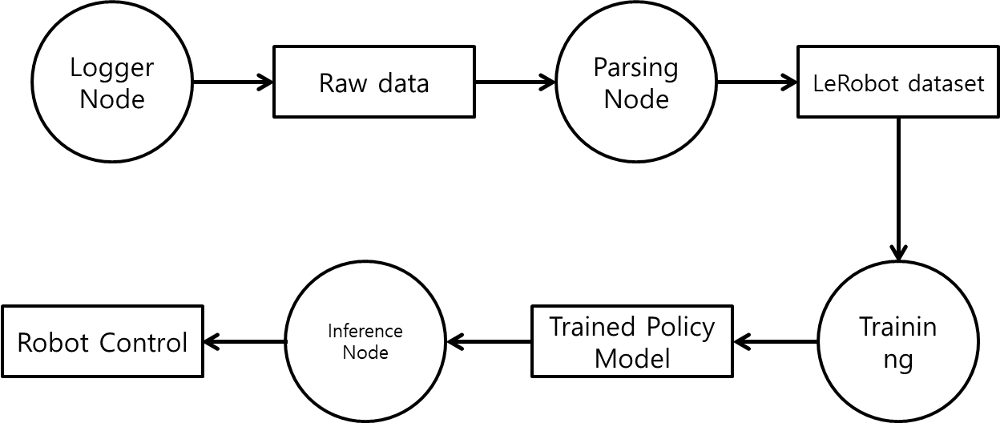
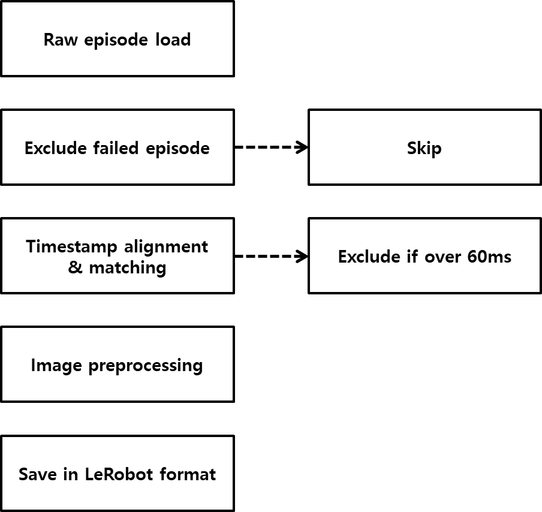
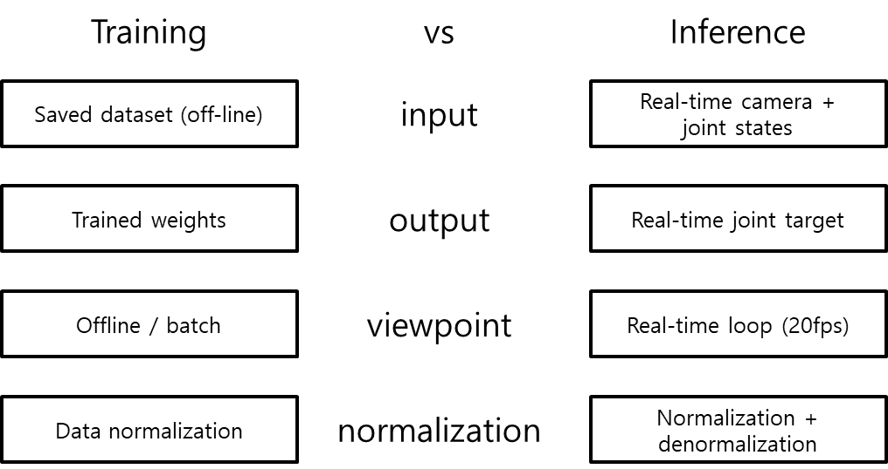

# Preparation

이번 장에서는 ROS2에서 데이터를 수집하고, 이를 LeRobot 학습 데이터셋으로 변환한 뒤, 학습된 policy를 실제 로봇에서 실행하기 위한 준비 과정을 진행합니다. 학습은 직접 만든 데이터셋을 이용해 LeRobot으로 진행합니다. 노드를 작성할 때 노드 이름과 파일 이름을 맞춰 두면 혼동을 줄일 수 있습니다.

실습에는 총 3개의 노드가 필요합니다.

- `logger_node.py`: 에피소드별 원시 데이터 저장
- `parsing_node.py`: 원시 데이터를 LeRobot 데이터셋으로 변환
- `inference_node.py`: 학습된 policy를 이용한 실시간 추론 및 제어

학습은 별도 ROS2 노드가 아니라 LeRobot의 `lerobot-train` 명령으로 진행합니다. 모든 실습은 workspace(`/home/soda/physicai_arm_ws`)에서 진행합니다. 다른 경로에서 진행할 경우, 코드마다 경로를 변경해야 합니다.



## logger_node

해당 노드를 실행하면 학습에 필요한 데이터를 저장하기 위해 에피소드별로 **학습 데이터를 수집**합니다. 노드를 실행하면 첫 에피소드 기록이 자동으로 시작됩니다. 기록을 마친 뒤 성공이면 's', 실패면 'f'를 입력합니다. 다음 에피소드는 'start'로 시작하고, 'q'를 입력하면 종료합니다.

이 실습에서는 각 센서 데이터에 timestamp를 함께 저장하고, `parsing_node`에서 시간이 가장 가까운 샘플끼리 정렬해 하나의 학습 샘플을 만듭니다. 단순 인덱스 기준 정렬만으로는 이미지와 관절 값이 어긋날 수 있습니다.

`/ee_pose` topic도 입력 데이터에 들어가므로 데이터 수집 시, ik_calc 노드도 실행시켜야 합니다.

<details>
<summary>logger_node 코드</summary>

```python
import os
import json
import csv
import threading
from datetime import datetime

import rclpy
from rclpy.node import Node
from sensor_msgs.msg import Image, JointState
from geometry_msgs.msg import PoseStamped
from cv_bridge import CvBridge
import cv2

EPISODE_TIMEOUT_SEC = 30.0


class LoggerNode(Node):
    def __init__(self):
        super().__init__("logger_node")

        self.declare_parameter("save_dir", "dataset_raw")
        self.declare_parameter("episode_id", 0)
        self.declare_parameter("task_name", "pick_red_token")
        self.declare_parameter("save_image_every_n", 1)

        self.save_dir           = self.get_parameter("save_dir").value
        self.task_name          = self.get_parameter("task_name").value
        self.save_image_every_n = int(self.get_parameter("save_image_every_n").value)
        param_episode_id        = int(self.get_parameter("episode_id").value)

        self.episode_id = self.get_next_episode_id() if param_episode_id <= 0 else param_episode_id

        self.bridge               = CvBridge()
        self.frame_count          = 0
        self.start_time           = datetime.now().strftime("%Y-%m-%d %H:%M:%S")
        self.running              = True
        self.recording            = True
        self.episode_finished     = False
        self.episode_start_time   = None

        self.latest_front  = None
        self.latest_top    = None
        self.latest_joint  = None
        self.latest_action = None
        self.latest_ee     = None

        self.latest_front_time  = None
        self.latest_top_time    = None
        self.latest_joint_time  = None
        self.latest_action_time = None

        self.setup_episode_directory()
        self.init_csv_files()

        self.create_subscription(Image,      "/front_cam",      self.front_cb,  10)
        self.create_subscription(Image,      "/top_cam",        self.top_cb,    10)
        self.create_subscription(JointState, "/follower/joint_states",   self.joint_cb,  10)
        self.create_subscription(JointState, "/follower/joint_targets",  self.action_cb, 10)
        self.create_subscription(PoseStamped,"/ee_pose",        self.ee_cb,     10)

        self.create_timer(0.05, self.timer_cb)

        self.keyboard_thread = threading.Thread(target=self.keyboard_listener, daemon=True)
        self.keyboard_thread.start()

        self.get_logger().info("Logger Node started.")
        self.get_logger().info(f"Saving to: {self.episode_path}")
        self.get_logger().info("s=success  f=fail  start=next episode  q=quit")

    def front_cb(self, msg):
        self.latest_front      = msg
        self.latest_front_time = self.now()

    def top_cb(self, msg):
        self.latest_top      = msg
        self.latest_top_time = self.now()

    def joint_cb(self, msg):
        self.latest_joint      = msg
        self.latest_joint_time = self.now()

    def action_cb(self, msg):
        self.latest_action      = msg
        self.latest_action_time = self.now()

    def ee_cb(self, msg):
        self.latest_ee = msg

    def timer_cb(self):
        if not self.recording:
            return

        now = self.now()
        STALE = 0.15

        if any(t is None or (now - t) > STALE for t in [
            self.latest_front_time,
            self.latest_top_time,
            self.latest_joint_time,
            self.latest_action_time,
        ]):
            return

        if self.episode_start_time is None:
            self.episode_start_time = now

        elapsed = now - self.episode_start_time
        if elapsed >= EPISODE_TIMEOUT_SEC:
            self.get_logger().warn(
                f"Episode {self.episode_name} timed out after {EPISODE_TIMEOUT_SEC}s "
                f"({self.frame_count} frames). Auto-finishing as fail."
            )
            self.finish_episode(success=False, fail_reason="timeout")
            return

        if self.frame_count % self.save_image_every_n != 0:
            self.frame_count += 1
            return

        timestamp = now

        self._write_image(self.latest_front, self.front_img_path, timestamp)
        self._write_image(self.latest_top,   self.top_img_path,   timestamp)
        self._write_state_row(self.latest_joint, timestamp)
        self._write_action_row(self.latest_action, timestamp)

        self.frame_count += 1

    def now(self):
        t = self.get_clock().now().to_msg()
        return t.sec + t.nanosec * 1e-9

    def _write_image(self, msg, folder_path, timestamp):
        try:
            image     = self.bridge.imgmsg_to_cv2(msg, desired_encoding="bgr8")
            filename  = f"{self.frame_count:06d}_{timestamp:.6f}.png"
            save_path = os.path.join(folder_path, filename)
            if not cv2.imwrite(save_path, image):
                self.get_logger().error(f"Failed to write: {save_path}")
        except Exception as e:
            self.get_logger().error(f"Image write error: {e}")

    def _write_state_row(self, msg, timestamp):
        positions = list(msg.position)
        while len(positions) < 6:
            positions.append(0.0)

        if self.latest_ee is not None:
            p  = self.latest_ee.pose
            ee = [p.position.x, p.position.y, p.position.z,
                  p.orientation.x, p.orientation.y, p.orientation.z, p.orientation.w]
        else:
            ee = [0.0, 0.0, 0.0, 0.0, 0.0, 0.0, 1.0]

        with open(self.states_csv_path, "a", newline="") as f:
            csv.writer(f).writerow([timestamp, *positions[:6], *ee])

    def _write_action_row(self, msg, timestamp):
        positions = list(msg.position)
        while len(positions) < 6:
            positions.append(0.0)

        with open(self.actions_csv_path, "a", newline="") as f:
            csv.writer(f).writerow([timestamp, *positions[:6]])

    def get_next_episode_id(self):
        if not os.path.exists(self.save_dir):
            return 1
        ids = []
        for name in os.listdir(self.save_dir):
            if name.startswith("episode_"):
                try:
                    ids.append(int(name.replace("episode_", "")))
                except ValueError:
                    pass
        return max(ids) + 1 if ids else 1

    def setup_episode_directory(self):
        self.episode_name   = f"episode_{self.episode_id:06d}"
        self.episode_path   = os.path.join(self.save_dir, self.episode_name)
        self.front_img_path = os.path.join(self.episode_path, "images", "front")
        self.top_img_path   = os.path.join(self.episode_path, "images", "top")
        os.makedirs(self.front_img_path, exist_ok=True)
        os.makedirs(self.top_img_path, exist_ok=True)
        self.states_csv_path  = os.path.join(self.episode_path, "states.csv")
        self.actions_csv_path = os.path.join(self.episode_path, "actions.csv")
        self.metadata_path    = os.path.join(self.episode_path, "metadata.json")

    def init_csv_files(self):
        with open(self.states_csv_path, "w", newline="") as f:
            csv.writer(f).writerow([
                "timestamp",
                "joint_0","joint_1","joint_2","joint_3","joint_4","joint_5",
                "ee_x","ee_y","ee_z","ee_qx","ee_qy","ee_qz","ee_qw",
            ])
        with open(self.actions_csv_path, "w", newline="") as f:
            csv.writer(f).writerow([
                "timestamp",
                "target_joint_0","target_joint_1","target_joint_2",
                "target_joint_3","target_joint_4","target_joint_5",
            ])

    def keyboard_listener(self):
        while self.running:
            try:
                cmd = input().strip()
            except EOFError:
                break
            if cmd == "start":
                if self.episode_finished:
                    self.start_next_episode()
                else:
                    self.get_logger().info("Still recording. Press s or f first.")
            elif cmd == "s":
                if self.recording:
                    self.finish_episode(success=True)
            elif cmd == "f":
                if self.recording:
                    self.finish_episode(success=False, fail_reason="manual_fail")
            elif cmd == "q":
                self.running = False
                if self.recording:
                    self.save_metadata(success=None, fail_reason="quit")
                rclpy.shutdown()
                break

    def finish_episode(self, success=None, fail_reason=None):
        self.save_metadata(success=success, fail_reason=fail_reason)
        self.recording        = False
        self.episode_finished = True
        self.get_logger().info(
            f"Episode {self.episode_name} finished ({self.frame_count} frames). Press start or q."
        )

    def start_next_episode(self):
        self.episode_id  += 1
        self.frame_count  = 0
        self.latest_front = self.latest_top = self.latest_joint = None
        self.latest_action = self.latest_ee = None
        self.latest_front_time = self.latest_top_time = None
        self.latest_joint_time = self.latest_action_time = None
        self.episode_start_time = None
        self.start_time   = datetime.now().strftime("%Y-%m-%d %H:%M:%S")
        self.setup_episode_directory()
        self.init_csv_files()
        self.recording        = True
        self.episode_finished = False
        self.get_logger().info(f"Started {self.episode_name}")

    def save_metadata(self, success=None, fail_reason=None):
        metadata = {
            "episode_id":   self.episode_id,
            "episode_name": self.episode_name,
            "task_name":    self.task_name,
            "start_time":   self.start_time,
            "end_time":     datetime.now().strftime("%Y-%m-%d %H:%M:%S"),
            "success":      success,
            "fail_reason":  fail_reason,
            "frame_count":  self.frame_count,
        }
        with open(self.metadata_path, "w") as f:
            json.dump(metadata, f, indent=4)

    def destroy_node(self):
        self.running = False
        self.save_metadata(success=None, fail_reason=None)
        return super().destroy_node()


def main(args=None):
    rclpy.init(args=args)
    node = LoggerNode()
    try:
        rclpy.spin(node)
    except KeyboardInterrupt:
        pass
    if rclpy.ok():
        node.destroy_node()
        rclpy.shutdown()

if __name__ == "__main__":
    main()
```

**코드 설명**

해당 코드는 ROS2에서 실행되는 로그 수집 노드입니다. 로봇이 작업을 수행하는 동안 카메라 이미지, 로봇의 현재 관절 상태, 목표 관절값을 받아서 하나의 에피소드 단위로 저장합니다. 

에피소드는 하나당 30초까지만 기록이 가능합니다. 시간 제한을 두어 노드 종료를 못하는 상황에서 자동으로 종료되어 용량이 초과되는 상황을 방지합니다. `LoggerNode`의 클래스는 Node를 상속받아 ROS2 노드처럼 실행됩니다. 

에피소드는 0000001부터 시작하며 다음에 다시 시작할 때에는 마지막으로 끝났던 에피소드 다음 번호로 저장합니다. `frame_count`를 통해 현재 저장한 프레임 수를 의미하고 `episode_finisher`는 에피소드가 끝났는지 확인합니다.

이후 `setup_episoode_directory()` 함수가 호출되어 에피소드 저장 폴더를 만듭니다. 각 에피소드는 `episode_0000001`과 같은 이름으로 저장되고 `images/front`, `images/top`과 같은 폴더에 카메라 이미지를 저장합니다. 또한 관절 상태와 목표 관절값을 저장하는 csv파일을 생성하고 에피소드 정보를 저장하는 json파일 경로도 준비합니다.

`init_csv_files()` 함수를 통해 csv 파일 첫 줄을 미리 작성합니다. 첫 줄에 각 열의 이름을 적어두어 나중에 데이터를 확인할 때 어떤 값인지 쉽게 확인하기 위한 작업입니다.

로그로 저장될 데이터들의 topic을 구독합니다. `/front_cam`, `/top_cam`, `/follower/joint_states`, `/follower/joint_targets` 등의 정보를 받습니다. 각 topic에 데이터가 들어오면 콜백 함수가 실행됩니다. 콜백 함수는 데이터를 바로 파일에 저장하지 않고 가장 최근 데이터를 임시로 보관하는 역할입니다.

`timer_cb()` 함수에서 실제로 데이터들을 파일에 저장하는 작업이 이루어집니다. 모든 데이터가 정상적으로 준비되었으면 현재 시간을 기준으로 데이터들을 저장하고, ROS2의 이미지 topic은 일반적인 이미지 형태가 아니므로 `_write_images()`를 통해 png파일로 저장합니다.

`keyboard_listener()` 함수는 사용자의 키보드 입력을 처리합니다. 

- `s` : 현재 에피소드 성공 저장
- `f` : 현재 에피소드 실패 저장
- `q` : 프로그램 종료
- `start` : 다음 에피소드 기록 시작

에피소드가 끝나면 `finish_episode()` 함수가 호출되어 에피소드 정보를 저장하고 기록을 중지합니다. 마지막으로 `main()` 함수를 통해 노드를 실제로 실행합니다.

</details>

## parsing_node

`parsing_node`는 `logger_node`가 저장한 에피소드별 원시 데이터를 읽어 LeRobot이 학습에 사용할 수 있는 **LeRobot 데이터 형식으로 변환**합니다. 이 과정에서 실패한 에피소드는 제외하고, 타임스탬프를 기준으로 이미지, state, action을 매칭합니다. 또한 앞 장의 calibration 결과를 사용해 이미지 왜곡을 보정하고, 학습 입력 크기에 맞게 resize/crop합니다.




<details>
<summary>parsing_node 코드</summary>

```python
import csv
import json
import shutil
from pathlib import Path

import cv2
import numpy as np
import torch

from lerobot.datasets.lerobot_dataset import LeRobotDataset


CALIB_PATH = Path("/home/soda/physicai_arm_ws/src/physicai_arm/physicai_arm/calibration.json")

RAW_ROOT = Path("./dataset_raw")
OUT_REPO_ID = "local/red_token_dataset"

FPS = 20
IMAGE_SIZE = (128, 128)
TOP_CROP_SIZE = (128, 384)

MAX_TIME_DIFF = 0.06

TASK_DEFAULT = "pick_red_token"


with open(CALIB_PATH, "r") as f:
    calib = json.load(f)

CAMERA_MATRIX = np.array(calib["camera_matrix"], dtype=np.float32)
DIST_COEFFS = np.array(calib["dist_coeff"], dtype=np.float32)


def image_time_from_path(path):
    try:
        return float(path.stem.split("_")[-1])
    except Exception:
        return None


def build_timed_images(image_paths):
    timed = []
    for path in image_paths:
        t = image_time_from_path(path)
        if t is None or t <= 0.0:
            continue
        timed.append((t, path))
    timed.sort(key=lambda x: x[0])
    return timed


def read_csv_dict(path):
    with open(path, "r", newline="") as f:
        return list(csv.DictReader(f))


def safe_float(row, key, default=0.0):
    try:
        value = row.get(key, default)
        if value is None or value == "":
            return default
        return float(value)
    except Exception:
        return default


def get_row_time(row, fallback_index=None):
    for key in ["timestamp", "time", "t", "stamp"]:
        if key in row:
            return safe_float(row, key)
    if "sec" in row and "nanosec" in row:
        return safe_float(row, "sec") + safe_float(row, "nanosec") * 1e-9
    if "secs" in row and "nsecs" in row:
        return safe_float(row, "secs") + safe_float(row, "nsecs") * 1e-9
    if fallback_index is not None:
        return fallback_index / FPS
    return None


def row_to_state(row):
    keys = [
        "joint_0", "joint_1", "joint_2",
        "joint_3", "joint_4", "joint_5",
    ]
    return np.array([safe_float(row, k) for k in keys], dtype=np.float32)


def row_to_action_target(row):
    keys = [
        "target_joint_0", "target_joint_1", "target_joint_2",
        "target_joint_3", "target_joint_4", "target_joint_5",
    ]
    return np.array([safe_float(row, k) for k in keys], dtype=np.float32)


def load_top_image(path):
    img = cv2.imread(str(path))

    if img is None:
        img = np.zeros((TOP_CROP_SIZE[1], TOP_CROP_SIZE[0], 3), dtype=np.uint8)
    else:
        try:
            img = cv2.undistort(img, CAMERA_MATRIX, DIST_COEFFS)
        except Exception:
            pass

        h, w = img.shape[:2]
        x_start = w // 3
        img = img[:, x_start:]
        img = cv2.resize(img, TOP_CROP_SIZE)

    img = cv2.cvtColor(img, cv2.COLOR_BGR2RGB)
    return img


def load_front_image(path):
    img = cv2.imread(str(path))

    if img is None:
        img = np.zeros((IMAGE_SIZE[1], IMAGE_SIZE[0], 3), dtype=np.uint8)
    else:
        try:
            img = cv2.undistort(img, CAMERA_MATRIX, DIST_COEFFS)
        except Exception:
            pass
        img = cv2.resize(img, IMAGE_SIZE)

    img = cv2.cvtColor(img, cv2.COLOR_BGR2RGB)
    return img


def get_task_name(episode_path):
    metadata_path = episode_path / "metadata.json"
    if not metadata_path.exists():
        return TASK_DEFAULT
    try:
        with open(metadata_path, "r") as f:
            metadata = json.load(f)
        task_name = metadata.get("task_name", TASK_DEFAULT)
        if task_name == "pick_red_token":
            return TASK_DEFAULT
        return task_name
    except Exception:
        return TASK_DEFAULT


def get_success(episode_path):
    metadata_path = episode_path / "metadata.json"
    if not metadata_path.exists():
        return True
    try:
        with open(metadata_path, "r") as f:
            metadata = json.load(f)
        success = metadata.get("success", True)
        return success is not False
    except Exception:
        return True


def remove_old_output():
    cache_path = Path.home() / ".cache/huggingface/lerobot" / OUT_REPO_ID
    if cache_path.exists():
        shutil.rmtree(cache_path)
        print(f"Removed old output: {cache_path}")


def build_timed_rows(rows):
    timed = []
    for i, row in enumerate(rows):
        t = get_row_time(row, fallback_index=i)
        if t is None:
            continue
        timed.append((t, row))
    timed.sort(key=lambda x: x[0])
    return timed


def nearest_by_time(timed_data, target_time, start_index=0):
    if not timed_data:
        return None, start_index, None

    idx = start_index

    while idx + 1 < len(timed_data):
        now_diff = abs(timed_data[idx][0] - target_time)
        next_diff = abs(timed_data[idx + 1][0] - target_time)

        if next_diff <= now_diff:
            idx += 1
        else:
            break

    matched_time, matched_value = timed_data[idx]
    diff = abs(matched_time - target_time)

    return matched_value, idx, diff


def main():
    remove_old_output()

    features = {
        "observation.images.top": {
            "dtype": "image",
            "shape": (TOP_CROP_SIZE[1], TOP_CROP_SIZE[0], 3),
            "names": ["height", "width", "channel"],
        },
        "observation.images.front": {
            "dtype": "image",
            "shape": (IMAGE_SIZE[1], IMAGE_SIZE[0], 3),
            "names": ["height", "width", "channel"],
        },
        "observation.state": {
            "dtype": "float32",
            "shape": (6,),
            "names": ["state"],
        },
        "action": {
            "dtype": "float32",
            "shape": (6,),
            "names": ["action"],
        },
    }

    dataset = LeRobotDataset.create(
        repo_id=OUT_REPO_ID,
        fps=FPS,
        features=features,
    )

    episode_paths = sorted(RAW_ROOT.glob("episode_*"))

    print(f"Found {len(episode_paths)} raw episodes")
    print(f"top image size: {TOP_CROP_SIZE[0]}x{TOP_CROP_SIZE[1]} (w x h)")
    print(f"front image size: {IMAGE_SIZE[0]}x{IMAGE_SIZE[1]} (w x h)")

    valid_episode_count = 0
    total_frame_count = 0

    for episode_path in episode_paths:
        if not episode_path.is_dir():
            continue

        if not get_success(episode_path):
            print(f"Skip failed episode: {episode_path}")
            continue

        states_csv = episode_path / "states.csv"
        actions_csv = episode_path / "actions.csv"
        top_dir = episode_path / "images" / "top"
        front_dir = episode_path / "images" / "front"

        if not states_csv.exists():
            print(f"Skip: missing states.csv - {episode_path}")
            continue
        if not actions_csv.exists():
            print(f"Skip: missing actions.csv - {episode_path}")
            continue
        if not top_dir.exists():
            print(f"Skip: missing top image dir - {episode_path}")
            continue
        if not front_dir.exists():
            print(f"Skip: missing front image dir - {episode_path}")
            continue

        states = read_csv_dict(states_csv)
        actions = read_csv_dict(actions_csv)
        top_images = sorted(top_dir.glob("*.png"))
        front_images = sorted(front_dir.glob("*.png"))

        timed_top_images = build_timed_images(top_images)
        timed_front_images = build_timed_images(front_images)
        timed_states = build_timed_rows(states)
        timed_actions = build_timed_rows(actions)

        if not timed_states or not timed_actions or not timed_top_images or not timed_front_images:
            print(f"Skip empty episode: {episode_path}")
            continue

        task = get_task_name(episode_path)

        print(
            f"Processing {episode_path.name}: "
            f"states={len(timed_states)}, actions={len(timed_actions)}, "
            f"top={len(top_images)}, front={len(front_images)}"
        )

        state_idx = 0
        action_idx = 0
        top_idx = 0
        front_idx = 0
        added_count = 0

        for frame_time, state_row in timed_states:
            top_path,   top_idx,   top_diff   = nearest_by_time(timed_top_images,   frame_time, top_idx)
            front_path, front_idx, front_diff = nearest_by_time(timed_front_images, frame_time, front_idx)
            action_row, action_idx, act_diff  = nearest_by_time(timed_actions,      frame_time, action_idx)

            if any(d is None or d > MAX_TIME_DIFF for d in [top_diff, front_diff, act_diff]):
                continue

            if state_row is None or action_row is None:
                continue

            current_joint = row_to_state(state_row)
            target_joint  = row_to_action_target(action_row)

            top_img   = load_top_image(top_path)
            front_img = load_front_image(front_path)

            dataset.add_frame({
                "observation.images.top":   top_img,
                "observation.images.front": front_img,
                "observation.state":  torch.tensor(current_joint, dtype=torch.float32),
                "action":             torch.tensor(target_joint,  dtype=torch.float32),
                "task": task,
            })

            total_frame_count += 1
            added_count       += 1

        if added_count == 0:
            print(f"Skip save: no valid frames - {episode_path}")
            continue

        dataset.save_episode()
        valid_episode_count += 1

        print(f"  Saved: {episode_path.name}, frames={added_count}")

    print("\nConversion done!")
    print(f"Valid episodes: {valid_episode_count}")
    print(f"Total frames:   {total_frame_count}")
    print(f"Saved repo_id:  {OUT_REPO_ID}")


if __name__ == "__main__":
    main()
```

**코드 설명**

해당 코드는 `logger_node`를 통해 저장한 원본 데이터를 LeRobot에서 학습할 수 있도록 데이터 형식을 변환하는 코드입니다. 

카메라 이미지 파일을 가져올 때는 `calibration.json` 파일에서 카메라 행렬과 왜곡 계수를 불러와서 보정합니다. `image_time_from_path()` 함수를 통해 파일 이름에 적힌 프레임 번호와 시간을 불러와서, `build_timed_images()` 함수를 통해 이미지와 관절 데이터를 함께 맞춥니다.

`read_csv_dict()` 함수는 csv 파일을 읽어 각 행을 딕션너리 형태로 반환합니다. `safe_float()` 함수는 csv에서 읽은 값을 실수형 숫자로 변환하고 잘못된 값이 입력됐을 경우 0.0을 입력합니다. 일부 값이 비어도 변환이 멈추지 않도록 하는 안전장치입니다.

`get_row_time()` 함수는 csv에서 시간 정보를 가져오고 시간 정보가 없다면 프레임 순서를 기준으로 대략적인 시간을 계산합니다. `row_to_action_target()` 함수는 목표 관절값을 6개의 숫자 배열로 변환합니다.

`nearest_by_time()` 함수는 특정 시간과 가까운 데이터를 찾습니다. `main()`에서는 실제 변환 과정이 이루어집니다. 여기에는 상단 카메라 이미지, 전면 카메라 이미지, 현재 관절 상태, 목표 관절값이 포함됩니다.

이후 `LeRobotDataset.creat()`를 이용헤 새로운 LeRobot 데이터셋을 생성합니다. 실패한 에피소드나 필요한 정보가 없는 경우 변환을 하지 않고 건너뜁니다.

</details>

## inference_node

`inference_node`는 학습된 policy를 실제 로봇의 **센서 입력과 joint target 출력에 연결**하는 노드입니다. 현재 카메라 이미지와 joint 상태를 입력받아 다음 action을 예측하고, 이를 로봇 제어 명령으로 publish합니다. 학습만 해서는 로봇이 움직이지 않습니다. 학습 결과인 policy를 실제 센서 입력에 연결해서 실시간으로 추론하고 제어하는 런타임 노드가 필요합니다. 

training과 비슷해 보일 수 있지만, training은 데이터로 모델을 학습하고 dataset의 입력을 받아 학습된 weight를 만들어 냅니다. 이와 달리, inference는 실시간으로 추론하고 실시간 센서 데이터를 입력받아 실시간 제어 명령을 출력합니다. 이때 `/ee_pose` topic도 포함되므로 ik_calc 노드도 실행시켜야 합니다.



LeRobot은 학습할 때 **정규화와 역정규화**를 이용합니다. 로봇 학습 데이터는 관측값과 행동값의 스케일이 극단적으로 다릅니다. 이 값들을 그대로 신경망에 넣으면 gradient 불균형, 학습 불안정이 생깁니다. 정규화는 이를 일정한 범위로 맞춰주는 작업입니다. 학습에서 정규화+역정규화를 한 뒤, 추론에서는 하지 않는다면 정규화된 공간이 아니므로 **입력 분포가 불일치**하여 성능이 저하됩니다. 따라서 추론 노드에 정규화와 역정규화 과정을 추가합니다. 정규화를 위해 최초 실행 때 첫 episode의 데이터 전체를 읽고 통계값을 파일로 저장합니다. 이후 추론에서는 저장된 파일을 읽고 정규화+역정규화를 진행합니다.

추론에 사용될 observation의 형태와 action의 의미는 학습 때 사용한 형태와 의미를 일치시켜야 합니다. 이를 다르게 입력하면 로봇이 움직이지 않거나 엉뚱한 방향으로 움직이는 등 제대로 된 추론을 할 수 없게 됩니다.


<details>
<summary>inference_node 코드</summary>

```python
import json
import cv2
import numpy as np
import torch
import threading

import rclpy
from rclpy.node import Node
from rclpy.qos import qos_profile_sensor_data
from sensor_msgs.msg import Image, JointState
from cv_bridge import CvBridge
from pathlib import Path

from lerobot.policies.act.modeling_act import ACTPolicy


CALIB_PATH = "/home/soda/physicai_arm_ws/src/physicai_arm/physicai_arm/calibration.json"
STATS_CACHE_PATH = "/home/soda/physicai_arm_ws/src/physicai_arm/physicai_arm/dataset_stats.json"

ARM_JOINTS = ["shoulder_pan", "shoulder_lift", "elbow_flex", "wrist_flex", "wrist_roll", "gripper"]

IMAGE_MEAN = np.array([0.485, 0.456, 0.406], dtype=np.float32)
IMAGE_STD  = np.array([0.229, 0.224, 0.225], dtype=np.float32)

TOP_H,   TOP_W   = 384, 128
FRONT_H, FRONT_W = 128, 128

def _to_1d_array(x):
    arr = np.array(x, dtype=np.float32)
    return arr.reshape(-1)


from lerobot.datasets.lerobot_dataset import LeRobotDataset


def compute_dataset_stats(dataset_repo_id):
    ds = LeRobotDataset(dataset_repo_id)

    states = []
    actions = []
    first_episode = None

    for i in range(len(ds)):
        frame = ds[i]
        episode_idx = frame["episode_index"]
        if hasattr(episode_idx, "item"):
            episode_idx = episode_idx.item()

        if first_episode is None:
            first_episode = int(episode_idx)
            print(f"using episode {first_episode}", flush=True)

        if int(episode_idx) != first_episode:
            break

        if i % 50 == 0:
            print(f"loading frame {i}", flush=True)

        states.append(frame["observation.state"])
        actions.append(frame["action"])

    print(f"loaded {len(states)} frames", flush=True)

    states = torch.stack(states).float()
    actions = torch.stack(actions).float()

    return {
        "state_mean": states.mean(dim=0).numpy(),
        "state_std": states.std(dim=0).numpy(),
        "action_mean": actions.mean(dim=0).numpy(),
        "action_std": actions.std(dim=0).numpy(),
        "action_min": actions.min(dim=0).values.numpy(),
        "action_max": actions.max(dim=0).values.numpy(),
    }


def load_or_compute_stats(dataset_repo_id, cache_path):
    cache = Path(cache_path)

    if cache.exists():
        print(f"Loading stats from cache: {cache_path}", flush=True)
        with open(cache) as f:
            raw = json.load(f)
        return {k: np.array(v, dtype=np.float32) for k, v in raw.items()}

    print("Cache not found. Computing stats from dataset...", flush=True)
    stats = compute_dataset_stats(dataset_repo_id)

    with open(cache, "w") as f:
        json.dump({k: v.tolist() for k, v in stats.items()}, f)

    print(f"Stats saved to: {cache_path}", flush=True)
    return stats


class InferenceNode(Node):
    def __init__(self):
        super().__init__("inference_node")

        self.declare_parameter("policy_path", "/home/soda/physicai_arm_ws/outputs/train/pick_red_token/checkpoints/last/pretrained_model")
        self.declare_parameter("device", "cuda")
        self.declare_parameter("fps", 30.0)
        self.declare_parameter("max_age_s", 0.2)

        self.policy_path = Path(self.get_parameter("policy_path").value)
        self.device = self.get_parameter("device").value
        self.fps = float(self.get_parameter("fps").value)
        self.max_age_s = float(self.get_parameter("max_age_s").value)

        stats = load_or_compute_stats("local/red_token_dataset", STATS_CACHE_PATH)

        self.state_mean = stats["state_mean"][:6]
        self.state_std = stats["state_std"][:6]
        self.action_mean = stats["action_mean"][:6]
        self.action_std = stats["action_std"][:6]
        self.joint_min = stats["action_min"][:6]
        self.joint_max = stats["action_max"][:6]

        self.get_logger().info(f"Loaded state mean={np.round(self.state_mean, 4)}")
        self.get_logger().info(f"Loaded action mean={np.round(self.action_mean, 4)}")

        if self.device == "cuda" and not torch.cuda.is_available():
            self.device = "cpu"

        with open(CALIB_PATH) as f:
            calib = json.load(f)

        self.camera_matrix = np.array(calib["camera_matrix"], dtype=np.float32)
        self.dist_coeffs = np.array(calib["dist_coeff"], dtype=np.float32)

        self.bridge = CvBridge()
        self.top_image = None
        self.front_image = None
        self.current_joint = None
        self._rx_top = None
        self._rx_front = None
        self._rx_joints = None

        self._joint_idx = None
        self._joint_idx_ready = False

        self._busy = False
        self._lock = threading.Lock()

        self.get_logger().info(f"Loading policy from: {self.policy_path}")

        self.policy = ACTPolicy.from_pretrained(
            pretrained_name_or_path=self.policy_path,
            local_files_only=False,
        )
        self.policy.to(self.device)
        self.policy.eval()

        if hasattr(self.policy, "reset"):
            self.policy.reset()

        self.create_subscription(Image, "/top_cam", self._on_top_image, qos_profile_sensor_data)
        self.create_subscription(Image, "/front_cam", self._on_front_image, qos_profile_sensor_data)
        self.create_subscription(JointState, "/follower/joint_states", self._on_joints, qos_profile_sensor_data)

        self.target_pub = self.create_publisher(JointState, "/follower/joint_targets", 10)

        self.create_timer(1.0 / self.fps, self.control_loop)

        self.get_logger().info(f"InferenceNode started. fps={self.fps} device={self.device}")

    def _preprocess_image(self, img_bgr, out_h, out_w, crop_right=False):
        img_bgr = cv2.undistort(img_bgr, self.camera_matrix, self.dist_coeffs)

        if crop_right:
            h, w = img_bgr.shape[:2]
            img_bgr = img_bgr[:, w // 3:]

        img_bgr = cv2.resize(img_bgr, (out_w, out_h))
        img_rgb = cv2.cvtColor(img_bgr, cv2.COLOR_BGR2RGB)

        img = img_rgb.astype(np.float32) / 255.0
        img = (img - IMAGE_MEAN) / IMAGE_STD

        return img

    def _on_top_image(self, msg):
        try:
            img = self.bridge.imgmsg_to_cv2(msg, desired_encoding="bgr8")
            self.top_image = self._preprocess_image(img, TOP_H, TOP_W, crop_right=True)
            self._rx_top = self.get_clock().now()
        except Exception as e:
            self.get_logger().error(f"top image error: {e}")

    def _on_front_image(self, msg):
        try:
            img = self.bridge.imgmsg_to_cv2(msg, desired_encoding="bgr8")
            self.front_image = self._preprocess_image(img, FRONT_H, FRONT_W, crop_right=False)
            self._rx_front = self.get_clock().now()
        except Exception as e:
            self.get_logger().error(f"front image error: {e}")

    def _on_joints(self, msg):
        if not self._joint_idx_ready:
            if not self._init_joint_idx(msg):
                return
        pos = msg.position
        joint_raw = np.array([pos[i] for i in self._joint_idx], dtype=np.float32)
        self.current_joint = (joint_raw - self.state_mean) / (self.state_std + 1e-8)
        self._rx_joints = self.get_clock().now()

    def _init_joint_idx(self, msg) -> bool:
        name_to_idx = {name: i for i, name in enumerate(msg.name)}
        missing = [j for j in ARM_JOINTS if j not in name_to_idx]
        if missing:
            self.get_logger().error(f"Missing joints: {missing}. Available: {list(msg.name)}")
            return False
        self._joint_idx = [name_to_idx[j] for j in ARM_JOINTS]
        self._joint_idx_ready = True
        self.get_logger().info(f"Joint mapping: {ARM_JOINTS} → {self._joint_idx}")
        return True

    def _data_ready(self) -> bool:
        return (
            self.top_image is not None
            and self.front_image is not None
            and self.current_joint is not None
        )

    def _data_fresh(self) -> bool:
        now = self.get_clock().now()
        def age(t): return (now - t).nanoseconds * 1e-9
        return (
            age(self._rx_top) <= self.max_age_s
            and age(self._rx_front) <= self.max_age_s
            and age(self._rx_joints) <= self.max_age_s
        )

    def _make_batch(self):
        top = torch.tensor(self.top_image, dtype=torch.float32).permute(2, 0, 1).unsqueeze(0).to(self.device)
        front = torch.tensor(self.front_image, dtype=torch.float32).permute(2, 0, 1).unsqueeze(0).to(self.device)
        state = torch.tensor(self.current_joint, dtype=torch.float32).unsqueeze(0).to(self.device)
        return {
            "observation.images.top": top,
            "observation.images.front": front,
            "observation.state": state,
        }

    def _run_inference(self, batch):
        try:
            with torch.no_grad():
                action_normalized = self.policy.select_action(batch)

            action_normalized = action_normalized.detach().cpu().numpy()

            if action_normalized.ndim == 2:
                action_normalized = action_normalized[0]

            action = (
                action_normalized
                * (self.action_std + 1e-8)
                + self.action_mean
            )

            action = np.clip(
                action.astype(np.float32)[:6],
                self.joint_min,
                self.joint_max,
            )

            msg = JointState()
            msg.header.stamp = self.get_clock().now().to_msg()
            msg.name = ARM_JOINTS
            msg.position = [float(x) for x in action]

            self.target_pub.publish(msg)

            self.get_logger().info(
                f"target={np.round(action, 3)}"
            )

        except Exception:
            import traceback
            self.get_logger().error(traceback.format_exc())

        finally:
            with self._lock:
                self._busy = False

    def control_loop(self):
        if not self._data_ready():
            self.get_logger().warn("Waiting for sensor data...", throttle_duration_sec=2.0)
            return

        if not self._data_fresh():
            self.get_logger().warn("Stale sensor data.", throttle_duration_sec=1.0)
            return

        with self._lock:
            if self._busy:
                return
            self._busy = True

        batch = self._make_batch()
        t = threading.Thread(target=self._run_inference, args=(batch,), daemon=True)
        t.start()

    


def main(args=None):
    rclpy.init(args=args)
    node = InferenceNode()

    try:
        rclpy.spin(node)
    except KeyboardInterrupt:
        pass

    node.destroy_node()
    if rclpy.ok():
        rclpy.shutdown()


if __name__ == "__main__":
    main()
```

**코드 설명**

해당 코드는 ROS2에서 실행되는 추론노드입니다. 학습된 ACT 모델을 불러온 뒤, 입력값을 바탕으로 다음 목표 관절값을 예측하여 발행합니다.

`IMAGE_MEAN`, `IMAGE_STD`를 이용해 정규화에 이용합니다. 카메라 이미지를 그대로 모델에 넣지 않고 픽셀값을 0~1 범위로 바꾼 뒤 정규화합니다. `compute_dataset_stats()` 함수로 데이터셋에서 관절값의 평균, 표준편차, 최솟값, 최댓값을 계산하여 정규화할 때 사용합니다.

`ACTPolicy.from_pretrained()`를 통해 학습된 ACT 모델을 불러옵니다. `eval()`모드를 이용하여 학습하지 않고 추론만 수행하겠다는 의미를 나타냅니다. 

`_preprocess_image()` 함수를 이용해 카메라 이미지를 모델에 맞게 전처리하고, `_init_joint_idx()` 함수를 통해 관절 이름을 매칭합니다. 

`_data_ready()/_data_fresh()` 함수로 추론에 필요한 데이터가 준비 되었는지, 오래된 데이터인지 확인합니다. 마지막으로 `run_inference()` 함수로 실제 모델을 실행합니다. 모델이 예측한 목표 관절은 `JointState` 메시지로 만들어져 `/follower/joint_targets` topic으로 발행됩니다.

</details>

<br>

> [!Warning]
> 각 노드 파일을 패키지에 추가한 뒤, `setup.py`의 `entry_points`에 등록하고 다시 빌드를 해야 한다는 점을 잊지 마십시오.

```python
...
            "logger_node = physicai_arm.logger_node:main",
            "parsing_node = physicai_arm.parsing_node:main",
            "inference_node = physicai_arm.inference_node:main",
...
```

<br>

```sh
colcon build --symlink-install --packages-select physicai_arm
```


## replay_node

수집한 데이터의 관절각이 알맞게 들어갔는지 replay 노드를 통해 확인할 수 있습니다. replay 노드는 수집했던 데이터를 다시 재생하는 노드입니다. 

```py
import rclpy
from rclpy.node import Node
from sensor_msgs.msg import JointState
import pandas as pd
import time
import sys


JOINT_NAMES = [
    "shoulder_pan",
    "shoulder_lift",
    "elbow_flex",
    "wrist_flex",
    "wrist_roll",
    "gripper",
]


class EpisodeReplayNode(Node):
    def __init__(self, csv_path):
        super().__init__("replay_node")

        self.pub = self.create_publisher(
            JointState,
            "/follower/joint_targets",
            10
        )

        self.df = pd.read_csv(csv_path)
        self.get_logger().info(f"Loaded {len(self.df)} frames from {csv_path}")

    def replay(self):
        for i in range(len(self.df)):
            row = self.df.iloc[i]

            msg = JointState()
            msg.header.stamp = self.get_clock().now().to_msg()
            msg.name = JOINT_NAMES
            msg.position = [
                float(row["target_joint_0"]),
                float(row["target_joint_1"]),
                float(row["target_joint_2"]),
                float(row["target_joint_3"]),
                float(row["target_joint_4"]),
                float(row["target_joint_5"]),
            ]

            self.pub.publish(msg)

            if i < len(self.df) - 1:
                dt = float(self.df.iloc[i + 1]["timestamp"] - row["timestamp"])
                time.sleep(max(0.001, dt))

        self.get_logger().info("Replay finished")


def main():
    rclpy.init()

    if len(sys.argv) < 2:
        print("Usage: python3 replay_episode.py <actions.csv>")
        return

    node = EpisodeReplayNode(sys.argv[1])

    time.sleep(1.0)
    node.replay()

    node.destroy_node()
    rclpy.shutdown()


if __name__ == "__main__":
    main()
```

```sh
ros2 run physicai_arm replay_node \
src/physicai_arm/physicai_arm/dataset_raw/episode_000001/actions.csv
```

**코드 설명**

해당 코드는 저장된 파일을 읽어 로봇의 움직임을 다시 재생하며 확인하는 노드입니다. 로봇을 직접 조종해서 기록했던 목표 관절값을 토대로 topic으로 발행하여 로봇이 그대로 따라하도록 합니다.

실행 명령어를 통해 원하는 에피소드의 관절값을 재생할 수 있습니다. `rclpy.init()` 함수로 ROS2를 초기화하고 csv파일이 입력되었는지 확인합니다. 파일 경로가 없으면 사용 방법을 출력하고, 정상적으로 입력되었다면 `EpisodeReplayNode` 객체를 생성하여 관절값을 차례로 발행합니다.


실행할 때는 데이터를 저장한 경로를 적어주면 됩니다. episode 1번으로 기본 설정되어 있으므로, 다른 번호가 보고 싶다면 끝에 숫자만 변경하면 됩니다. 데이터를 수집한 후, replay를 통해 데이터의 품질을 검증할 수 있습니다.

`setup.py`에 해당 노드를 추가하고 build를 해야 한다는 것을 잊지 마시기 바랍니다.
