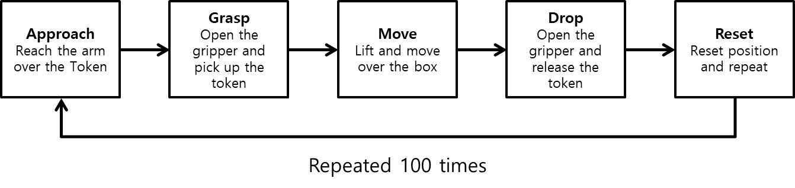
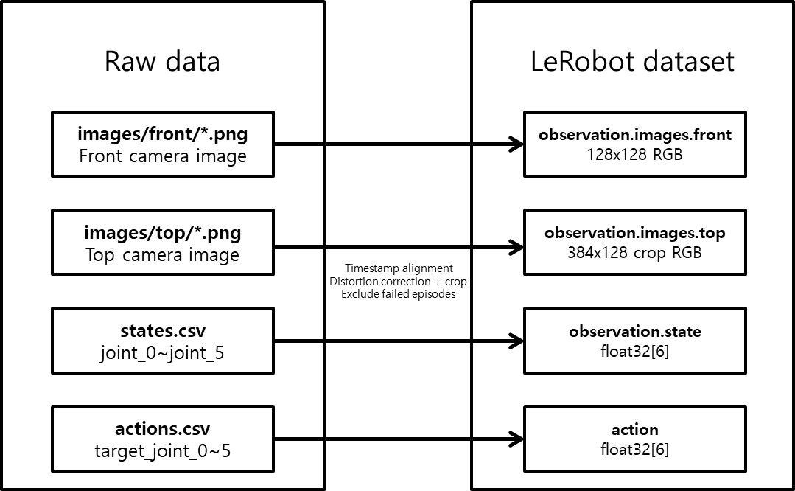
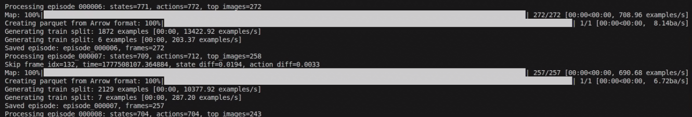
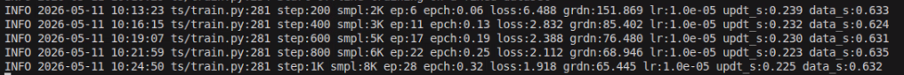

# Dataset & Training

## Data Collection

코드를 모두 작성했다면 학습에 필요한 데이터를 수집합니다. 데이터 수집에는 세 개의 터미널이 필요합니다. 첫 번째 터미널에서는 로봇 bringup 런치 파일을 실행하고, 두 번째 터미널에서는 teleoperation 노드를 실행합니다. 세 번째 터미널에서는 앞서 작성한 `logger_node`를 실행해 에피소드 데이터를 저장합니다.

이번 예제에서 수집해야 할 행동은 다음과 같습니다.

1. 토큰 위로 팔을 이동한다.
2. 그리퍼를 열고 토큰을 집는다.
3. 토큰을 들어 올린 뒤 박스 위로 이동한다.
4. 그리퍼를 열어 토큰을 박스 안에 떨어뜨린다.
5. 로봇 위치와 토큰 위치를 초기화한 뒤 반복한다.



```sh
# Terminal 1

ros2 launch physicai_arm bringup.launch.py
```
```sh
# Terminal 2

ros2 run physicai_arm teleoperation
```
```sh
# Terminal 3

ros2 run physicai_arm logger_node
```

### 데이터 수집

`logger_node`를 실행하면 첫 에피소드는 `start`를 입력하지 않아도 자동으로 시작됩니다. 노드를 시작하기 전 토큰 위치를 설정합니다. Leader(검은 팔)를 이용해 Follower(하얀 팔)를 조종하여 토큰을 집고 상자에 넣습니다.

한 번에 여러 행동을 빠르게 수행하기보다는, 조금씩 끊어서 천천히 조작하는 것을 권장합니다. 성공한 에피소드는 `s`, 실패한 에피소드는 `f`를 입력합니다. 다음 에피소드를 시작하려면 `start`를 입력합니다. 이 과정을 약 100회 정도 반복합니다. 데이터 수집이 끝났다면 `q`를 입력하여 노드를 종료합니다. 나머지 런치 파일과 노드도 `Ctrl+C`로 종료합니다.

## Parsing

수집한 원시 데이터는 LeRobot이 바로 읽을 수 없습니다. 따라서 `parsing_node`를 실행하여 이미지, state, action을 timestamp 기준으로 정렬하고 LeRobot 데이터셋 형식으로 변환합니다.

파싱 전 원시 데이터 구조는 다음과 같습니다.

```
episode_000001/
  images/front/000123_1700000.123.png
  images/top/000123_1700000.125.png
  states.csv
  actions.csv
```

`parsing_node`는 다음 작업을 수행합니다.
- 이미지와 state/action을 타임스탬프 기준으로 정렬합니다.
- top 이미지의 가운데 1/3 영역만 남기도록 crop합니다.
- LeRobot이 읽을 수 있는 데이터셋 형식으로 저장합니다.




```sh
ros2 run physicai_arm parsing_node
```

파싱이 진행되면 터미널에 다음과 같은 화면이 표시됩니다. 전체 데이터의 파싱이 완료될 때까지 기다립니다.



## Training

데이터가 준비되면 LeRobot을 활용하여 ACT policy를 학습합니다. 파라미터는 아래와 같이 설정되어 있습니다. 학습 상황에 따라 배치 사이즈, 스텝 수, 저장 주기 등은 조정해도 됩니다. 데이터를 Hugging Face에 업로드하면 Google Colab 등 다른 환경에서도 training이 가능합니다.


- 배치 사이즈(batch_size): 8
- 스텝 수(steps): 100000
- 입력 데이터 위치(dataset.repo_id): local/red_token_dataset
- 출력 데이터 위치(output_dir): outputs/train/pick_red_token
- 중간 저장(save_freq): 10000
- 로딩 프로세스 수(num_workers): 4
- 데이터 업로드 여부(policy.push_to_hub): true

```sh
lerobot-train \
  --policy.type=act \
  --dataset.repo_id=local/red_token_dataset \
  --batch_size=8 \
  --steps=100000 \
  --output_dir=outputs/train/pick_red_token \
  --job_name=pick_red_token \
  --policy.device=cuda \
  --wandb.enable=false \
  --policy.push_to_hub=true \
  --num_workers=4 \
  --save_freq=10000
```

학습 시간은 GPU 성능, 데이터 크기, `num_workers` 설정에 따라 달라집니다. Google Colab을 기준으로 약 6시간 정도 소요될 수 있습니다. 학습이 정상적으로 진행되면 step, loss, learning rate, data loading time 등이 터미널에 표시됩니다.

학습을 조기 중단할 때는 checkpoint가 저장되었는지 확인해야 합니다. 저장되지 않은 경우 마지막 checkpoint 이후의 학습 진행 상태와 모델 파라미터 변화는 복구할 수 없습니다.

저장된 checkpoint부터 학습을 다시 시작하려면 아래 명령어를 입력합니다.

```sh
lerobot-train \
  --config_path=outputs/train/pick_red_token/checkpoints/last/pretrained_model/train_config.json \
  --resume=true
```



|항목|이름|의미|
|---|----|----|
|step|step|가중치 업데이트 횟수|
|smpl|samples|지금까지 본 총 프레임 수|
|ep|episodes|지금까지 사용한 총 에피소드 수|
|epch|epoch|전체 데이터를 몇 번 봤는지|
|loss|loss|예측 오차|
|grdn|gradient norm|가중치 업데이트 크기|
|lr|learning rate|학습률|
|updt_s|update seconds|가중치 업데이트 소요 시간|
|data_s|data seconds|데이터 로딩 소요 시간|
