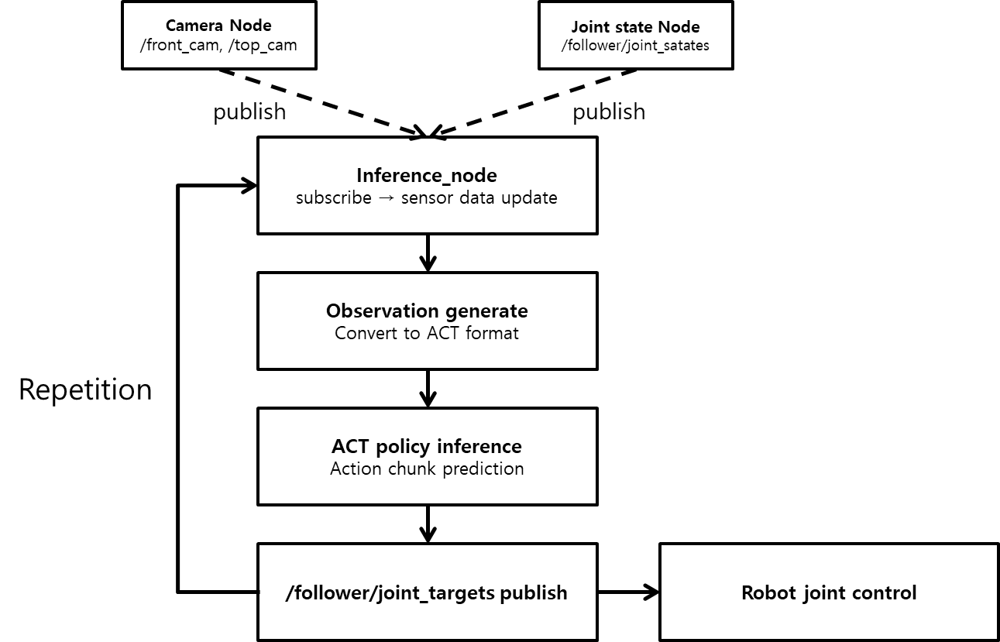

# Robot Inference

## 실제 로봇 제어

학습된 checkpoint/model이 준비되었다면 학습된 모델을 이용해 로봇을 제어합니다. 로봇이 실행 중 과하게 움직이거나 멈춰야 할 때에는 `inference_node`를 실행 중인 터미널에서 `Ctrl+C`를 눌러 노드 실행을 중단할 수 있습니다.

로봇을 실행하려면 첫 번째 터미널에서 bringup 런치 파일을 실행하고, 두 번째 터미널에서 추론 노드를 실행합니다. 로봇이 먼저 시작될 수 있도록 순서대로 각 터미널에 아래 명령어를 입력합니다.

```sh
# Terminal 1

ros2 launch physicai_arm bringup.launch.py
```

```sh
# Terminal 2

ros2 run physicai_arm inference_node
```

### 제어 흐름

1. 카메라 센서가 ROS2 토픽을 publish
  - ROS2에서는 각 센서가 데이터를 토픽으로 계속 publish합니다.
  - 카메라 노드는 image를, 관절 상태 노드는 joint states를 publish합니다.
2. `inference_node`가 토픽을 subscribe
  - 노드가 실시간으로 publish된 데이터를 받습니다.
  - 최근 센서 데이터를 갱신해 추론에 사용합니다.
3. observation 생성
  - 현재 상태를 ACT 입력 형식으로 변환합니다. 
4. ACT policy를 이용해 action 출력
  - 현재 이미지와 로봇 상태를 종합하여 ACT policy가 다음 joint action 또는 action chunk를 예측합니다.
5. joint target을 publish
  - 출력된 값을 joint target으로 publish하여 로봇에 전달합니다.
6. 로봇 움직임 
  - 로봇 제어 노드가 publish된 joint target을 받아 각 관절을 제어합니다.


