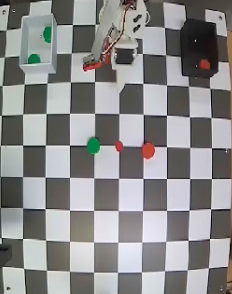
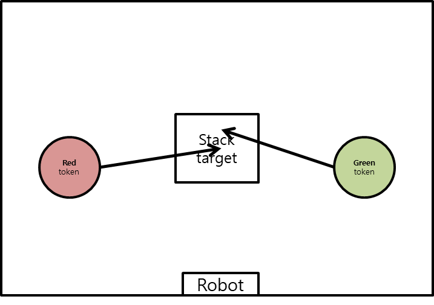
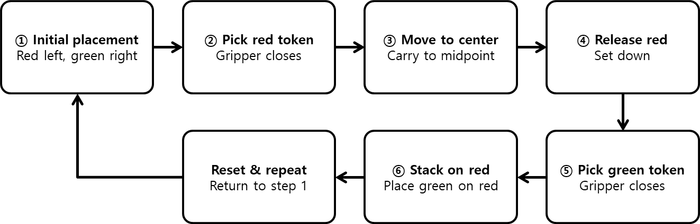

# Training & Control

## Data Collection

코드를 모두 작성했다면 학습에 필요한 데이터를 수집합니다. 데이터 수집에는 세 개의 터미널이 필요합니다. 첫 번째 터미널에서는 로봇 bringup 런치 파일을 실행하고, 두 번째 터미널에서는 teleoperation 노드를 실행합니다. 세 번째 터미널에서는 앞서 작성한 `logger_node`를 실행해 에피소드 데이터를 저장합니다.

이번 예제에서 수집해야 할 행동은 다음과 같습니다.

 

1. 로봇 기준에서 좌측에 빨간 토큰, 우측에 초록 토큰을 배치한다.
2. 좌측 빨간 토큰 위로 팔을 이동한다.
3. 그리퍼를 열고 빨간 토큰을 집는다.
4. 빨간 토큰을 가운데 위치에 내려놓는다.
5. 우측 초록 토큰 위로 팔을 이동한다.
6. 그리퍼를 열고 초록 토큰을 집는다.
7. 초록 토큰을 빨간 토큰 위로 이동한 뒤 쌓는다.
8. 로봇 위치와 토큰 위치를 초기화한 뒤 반복한다.



```sh
# Terminal 1

ros2 launch physicai_arm bringup.launch.py
```

```sh
# Terminal 2

ros2 run physicai_arm teleoperation
```

```sh
# Terminal 3

ros2 run physicai_arm stacking_logger_node
```

### 데이터 수집

`logger_node`를 실행하면 첫 에피소드는 `start`를 입력하지 않아도 자동으로 시작됩니다. 노드를 시작하기 전 빨간 토큰과 초록 토큰의 위치를 설정합니다. Leader(검은 팔)를 이용해 Follower(하얀 팔)를 조종하여 빨간 토큰을 먼저 가운데에 놓고, 초록 토큰을 그 위에 쌓습니다.

토큰 쌓기는 집기 동작보다 실패 요인이 많습니다. 토큰 위치, 그리퍼 높이, 내려놓는 속도가 조금만 달라도 쌓기에 실패할 수 있으므로 각 동작을 천천히 수행합니다. 성공한 에피소드는 `s`, 실패한 에피소드는 `f`를 입력합니다. 다음 에피소드를 시작하려면 `start`를 입력합니다. 성공 에피소드를 기준으로 200개 이상 수집하기를 권장합니다. 데이터 수집이 끝났다면 `q`를 입력하여 노드를 종료합니다. 나머지 런치 파일과 노드도 `Ctrl+C`로 종료합니다.

## Parsing

수집한 원시 데이터는 LeRobot이 바로 읽을 수 없습니다. 따라서 `parsing_node`를 실행하여 이미지, state, action을 timestamp 기준으로 정렬하고 LeRobot 데이터셋 형식으로 변환합니다.

파싱 전 원시 데이터 구조는 다음과 같습니다.

```text
episode_000001/
  images/front/000123_1700000.123.png
  images/top/000123_1700000.125.png
  states.csv
  actions.csv
  metadata.json
```

`parsing_node`는 다음 작업을 수행합니다.

- 실패한 에피소드를 제외합니다.
- 이미지와 state/action을 timestamp 기준으로 정렬합니다.
- top 이미지의 오른쪽 작업 영역을 중심으로 crop합니다.
- front 이미지를 학습 입력 크기에 맞게 resize합니다.
- `local/stack_tokens_dataset` 데이터셋으로 저장합니다.


```sh
ros2 run physicai_arm stacking_parsing_node
```

파싱이 완료되면 터미널에서 유효 에피소드 수, 전체 프레임 수, 저장된 repo id를 확인할 수 있습니다. 유효 프레임 수가 지나치게 적으면 데이터 수집 중 센서 topic이 누락되었거나 timestamp 차이가 너무 컸을 가능성이 있습니다.

## Training

데이터가 준비되면 LeRobot을 활용하여 ACT policy를 학습합니다. 이번 예제의 입력 데이터 위치와 출력 위치는 `stack_tokens` 기준으로 설정합니다.

- 배치 사이즈(batch_size): 8
- 스텝 수(steps): 200000
- 입력 데이터 위치(dataset.repo_id): local/stack_tokens_dataset
- 출력 데이터 위치(output_dir): outputs/train/stack_tokens
- 작업 이름(job_name): stack
- 중간 저장(save_freq): 10000
- 로딩 프로세스 수(num_workers): 8
- 데이터 업로드 여부(policy.push_to_hub): false

```sh
lerobot-train \
  --policy.type=act \
  --dataset.repo_id=local/stack_tokens_dataset \
  --batch_size=8 \
  --steps=200000 \
  --output_dir=outputs/train/stack_tokens \
  --job_name=stack \
  --policy.device=cuda \
  --policy.push_to_hub=false \
  --wandb.enable=false \
  --num_workers=8 \
  --save_freq=10000
```

학습 시간은 GPU 성능, 데이터 크기, `num_workers` 설정에 따라 달라집니다. 학습이 정상적으로 진행되면 step, loss, learning rate, data loading time 등이 터미널에 표시됩니다.

학습을 조기 중단할 때는 checkpoint가 저장되었는지 확인해야 합니다. 저장되지 않은 경우 마지막 checkpoint 이후의 학습 진행 상태와 모델 파라미터 변화는 복구할 수 없습니다.

저장된 checkpoint부터 학습을 다시 시작하려면 아래 명령어를 입력합니다.

```sh
lerobot-train \
  --config_path=outputs/train/stack_tokens/checkpoints/last/pretrained_model/train_config.json \
  --resume=true
```

|항목|이름|의미|
|---|----|----|
|step|step|가중치 업데이트 횟수|
|smpl|samples|지금까지 본 총 프레임 수|
|ep|episodes|지금까지 사용한 총 에피소드 수|
|epch|epoch|전체 데이터를 몇 번 봤는지|
|loss|loss|예측 오차|
|grdn|gradient norm|가중치 업데이트 크기|
|lr|learning rate|학습률|
|updt_s|update seconds|가중치 업데이트 소요 시간|
|data_s|data seconds|데이터 로딩 소요 시간|

## Robot Control

학습된 checkpoint/model이 준비되었다면 학습된 모델을 이용하여 로봇을 제어합니다. 로봇이 실행 중 과하게 움직이거나 멈춰야 할 때에는 `inference_node`를 실행 중인 터미널에서 `Ctrl+C`를 눌러 노드 실행을 중단할 수 있습니다.

로봇을 실행하려면 첫 번째 터미널에서 bringup 런치 파일을 실행하고, 두 번째 터미널에서 추론 노드를 실행합니다.

```sh
# Terminal 1

ros2 launch physicai_arm bringup.launch.py
```

```sh
# Terminal 2

ros2 run physicai_arm stacking_inference_node
```

### 제어 흐름

1. 카메라 센서가 ROS2 토픽을 publish합니다.
2. `inference_node`가 `/top_cam`, `/front_cam`, `/follower/joint_states`를 subscribe합니다.
3. 현재 이미지와 joint state를 ACT 입력 형식으로 변환합니다.
4. ACT policy가 현재 장면에서 다음 action을 예측합니다.
5. 빨간 토큰을 가운데에 놓고, 초록 토큰을 빨간 토큰 위에 쌓는 행동이 예측됩니다.
6. 예측된 joint target을 `/follower/joint_targets`로 publish합니다.
7. 로봇 제어 노드가 publish된 joint target을 받아 각 관절을 제어합니다.

### 실행 전 확인 사항

- 빨간 토큰과 초록 토큰이 카메라 시야 안에 있어야 합니다.
- 토큰의 초기 위치는 학습 데이터 수집 때와 비슷해야 합니다.
- 추론 입력의 이미지 크기, crop 방식, joint 순서는 학습할 때와 같아야 합니다.
- `policy_path`는 `outputs/train/stack_tokens/checkpoints/last/pretrained_model`을 가리켜야 합니다.
- 성공 데이터가 부족하면 토큰을 정확히 쌓지 못하고 옆에 떨어뜨리는 현상이 생길 수 있습니다.
